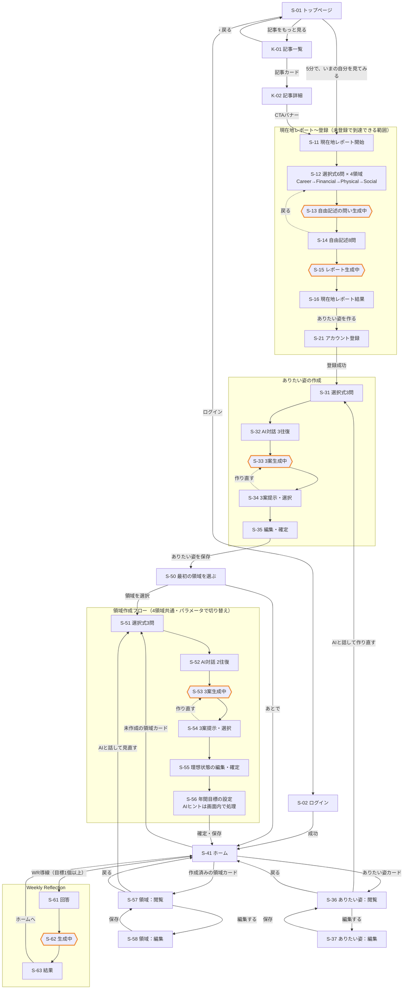

# Flourish Studio MVP 画面一覧・画面遷移

> Version 0.5
> 最終更新：2026-08-07
> `03_ユーザーフロー/user-flow.md` を画面単位に分解したもの。遷移の正はこの文書に一本化する

---

## 1. 画面一覧（全31画面）

| ID | 画面名 | 認証状態 | AI | 保存 |
|---|---|---|---|---|
| S-01 | トップページ | 未登録 | − | − |
| S-02 | ログイン | 未登録 | − | − |
| K-01 | 記事一覧 | 未登録 | − | − |
| K-02 | 記事詳細 | 未登録 | − | − |
| S-11 | 現在地レポート開始 | 未登録 | − | ゲストセッション発行 |
| S-12 | 選択式質問（領域ごと6問） | 未登録 | − | − |
| S-13 | 自由記述の問い生成中 | 未登録 | ● | − |
| S-14 | 自由記述（全8問） | 未登録 | − | − |
| S-15 | レポート生成中 | 未登録 | ● | 成功時に結果を保存 |
| S-16 | 現在地レポート結果 | 未登録 | − | − |
| S-21 | アカウント登録 | 未登録 → 登録済 | − | アカウント作成・紐付け |
| S-31 | ありたい姿：選択式質問 | 登録済 | − | − |
| S-32 | ありたい姿：AI対話 | 登録済 | ● | − |
| S-33 | ありたい姿：3案生成中 | 登録済 | ● | − |
| S-34 | ありたい姿：3案提示・選択 | 登録済 | − | − |
| S-35 | ありたい姿：編集・確定 | 登録済 | − | 確定時に保存 |
| S-36 | ありたい姿：閲覧 | 登録済 | − | − |
| S-37 | ありたい姿：編集 | 登録済 | − | 保存時に新バージョン |
| S-41 | ホーム | 登録済 | − | − |
| S-50 | 最初の領域を選ぶ | 登録済 | − | − |
| S-51 | 領域：選択式質問 | 登録済 | − | − |
| S-52 | 領域：AI対話 | 登録済 | ● | − |
| S-53 | 領域：3案生成中 | 登録済 | ● | − |
| S-54 | 領域：3案提示・選択 | 登録済 | − | − |
| S-55 | 領域：理想状態の編集・確定 | 登録済 | − | − |
| S-56 | 領域：年間目標の設定 | 登録済 | ○ | 確定時に保存 |
| S-57 | 領域：閲覧 | 登録済 | − | − |
| S-58 | 領域：編集 | 登録済 | − | 保存時に更新 |
| S-61 | Weekly Reflection：回答 | 登録済 | − | − |
| S-62 | Weekly Reflection：生成中 | 登録済 | ● | − |
| S-63 | Weekly Reflection：結果 | 登録済 | − | 表示時に保存 |

S-51〜S-58は4領域で共通とし、領域をパラメータで切り替える。
S-56の「○」は、AIヒントボタンを押したときのみ発生する任意のAI呼び出し。

---

## 2. 画面遷移図

六角形（S-13 / S-15 / S-33 / S-53 / S-62）は**生成中画面**。いずれも失敗時は別画面へ遷移せず、同じ画面上にエラーと再試行ボタンを表示する。
点線は戻りの導線。

---

## 3. 各画面の詳細

### S-01 トップページ

| 項目 | 内容 |
|---|---|
| 性格 | **アプリ画面ではなくウェブサイト。** 7セクションの縦長スクロール |
| ヘッダー | サービス名（左）＋ログイン（右） |
| セクション | ヒーロー／こんな状態、ありませんか／Flourishとは／4つの領域／できること／はじめかた／大切にしていること／読みもの |
| CTA | 「5分で、いまの自分を見てみる」を下部に固定。**機能名を初見の人に見せない** |
| 遷移先 | CTA → S-11 ／ ログイン → S-02 ／ 「記事をもっと見る」→ K-01 |
| 例外 | ログイン済みでアクセスした場合は S-41 へ自動遷移 |

### S-02 ログイン

| 項目 | 内容 |
|---|---|
| 主要素 | ログインフォーム、「トップに戻る」 |
| 遷移先 | 成功 → S-41 ／ 失敗 → 同画面にエラー表示 |

### K-01 記事一覧

公開サイト側の画面。ログイン不要。

| 項目 | 内容 |
|---|---|
| 主要素 | 見出し／カテゴリチップ（横スクロール）／記事カード一覧／「もっと読む」 |
| カテゴリ | すべて ／ Career ／ Financial ／ Physical ／ Social ／ **Flourishとは** |
| サムネイル | カテゴリのアイコンを面に載せた形。記事ごとの画像を用意しない |
| ヘッダー | 「‹ 戻る」＋「記事」＋ログイン（ログイン済みなら「ホーム」） |
| 遷移先 | 記事カード → K-02 ／ 戻る → S-01 |

### K-02 記事詳細

| 項目 | 内容 |
|---|---|
| 主要素 | カテゴリ・日付・読了時間／タイトル／本文／**共通のCTAバナー** |
| CTAバナー | **記事ごとに文言を変えない。** Primary Soft の面に囲み、本文と地続きに見せない |
| 関連記事 | 置かない。読み終えた人をサービスへ向ける |
| 認証 | ログイン不要で全文を表示する |
| ログイン済み | **CTAバナーを表示しない。** ヘッダー右を「ログイン」→「ホーム」に差し替える |
| 遷移先 | CTAバナー → S-11 ／ 戻る → K-01 |

### S-11 現在地レポート開始

| 項目 | 内容 |
|---|---|
| 主要素 | 所要時間（5分）、**考える負荷があることの前置き**、評価ではないことの説明、「はじめる」 |
| 処理 | 画面到達時にゲストセッションIDを発行 |
| 遷移先 | S-12 |

### S-12 選択式質問（領域ごと6問）

**4領域共通の1画面とし、領域をパラメータで切り替える。** 同じ画面を4回通る。

| 項目 | 内容 |
|---|---|
| パラメータ | 対象領域（Career → Financial → Physical → Social の順） |
| 構成 | 充足感5項目（各5段階）＋ コミット度1問（5段階）＝ 6問 |
| 入力 | **全6問が必須。** 未回答があるあいだ「次へ」は無効 |
| 保存 | しない（クライアント保持） |
| 遷移先 | 「次へ」→ 次の領域の S-12 ／ Socialまで終えたら S-13 |
| 中断 | 「× 中断」は確認ダイアログを挟む（`06_ワイヤーフレーム/wireframe-spec.md` 1.2） |

### S-13 自由記述の問い生成中

| 項目 | 内容 |
|---|---|
| AI | 選択式の回答をもとに、各領域の自由記述の問い文を動的生成 |
| 生成数 | 領域につき2問、計8問 |
| 成功時 | S-14 へ |
| 失敗時 | **同画面にエラーと「もう一度生成する」ボタンを表示**（自動リトライなし） |
| 戻り先 | 「回答に戻る」→ S-12 |

### S-14 自由記述（8問）

| 項目 | 内容 |
|---|---|
| 構成 | AIが生成した8問を1画面にスクロール表示 |
| 問いの性質 | 満たされている項目についての問いと、満たされていない項目についての問いが対になる |
| 入力 | すべて任意。全問空欄でも次へ進める |
| 保存 | しない（クライアント保持） |
| 遷移先 | 「レポートを作る」→ S-15 ／ 「戻る」→ S-12 |

S-14から戻る場合、S-13（生成中）を経由せずS-12へ直接戻す。問い文はクライアントに保持しておき、再生成しない。

### S-15 レポート生成中

| 項目 | 内容 |
|---|---|
| AI | 4領域分の現在地フィードバックと、言語化度の判定 |
| 成功時 | 結果をゲストセッションに保存し、S-16 へ |
| 失敗時 | 同画面にエラーと「もう一度生成する」ボタンを表示 |
| 戻り先 | 「回答に戻る」→ S-14（回答はクライアントに保持されている） |

### S-16 現在地レポート結果

| 項目 | 内容 |
|---|---|
| 主要素 | 上から順に、あだ名（「今のあなたを一言で表すなら」）／4領域それぞれの満たされている点・満たされていない点・これからできそうなこと／言語化度・コミット度／締め |
| 構成の意図 | 軽い入口から入り、下に降りるほど真面目になる |
| 認証 | 未登録のまま全文を表示する |
| 遷移先 | 「ありたい姿を作る」→ S-21 |

### S-21 アカウント登録

| 項目 | 内容 |
|---|---|
| 主要素 | 登録フォーム、「ここから先は保存されます」等の説明 |
| 成功時 | ゲストセッションをアカウントへ紐付け、**完了画面を挟まず** S-31 へ |
| 失敗時 | 同画面にエラー表示（メール重複など） |
| 戻り先 | S-16 |

### S-31 ありたい姿：選択式質問

| 項目 | 内容 |
|---|---|
| 主要素 | 価値観・関心・理想の暮らし方に関する選択式の質問（3問） |
| 保存 | しない |
| 遷移先 | S-32 |

### S-32 ありたい姿：AI対話

| 項目 | 内容 |
|---|---|
| 主要素 | チャット形式のUI、約3往復 |
| 応答待ち | **画面内のローディング**とする（1返信ごとの画面遷移はチャットとして成立しないため、生成中を独立画面にする原則の例外） |
| AI失敗時 | 直近の発言に対してインラインでエラーと再送ボタンを表示 |
| 遷移先 | 3往復完了後、「候補を作る」→ S-33 |

### S-33 ありたい姿：3案生成中

| 項目 | 内容 |
|---|---|
| AI | ありたい姿の3案を生成（自分／他者／社会の3方向で差をつける） |
| 成功時 | S-34 へ |
| 失敗時 | 同画面にエラーと「もう一度生成する」ボタンを表示 |
| 戻り先 | 「対話に戻る」→ S-32 |

### S-34 ありたい姿：3案提示・選択

| 項目 | 内容 |
|---|---|
| 主要素 | 3案を並べて表示、1案を選択 |
| 遷移先 | 選択 → S-35 ／ 「作り直す」→ S-33 |

### S-35 ありたい姿：編集・確定

| 項目 | 内容 |
|---|---|
| 主要素 | 選んだ案を自由に編集、「確定する」 |
| 成果物の提示 | 完了画面を挟まないため、**この画面が確定したありたい姿の提示を兼ねる**。確定操作後に一文を大きく見せてから次へ進める |
| 保存 | 確定時にありたい姿と背景情報を保存 |
| 遷移先 | S-50（領域を選ぶ） |
| 戻り先 | 「案を選び直す」→ S-34 |

### S-36 ありたい姿：閲覧

ホームのありたい姿カードから開く。領域の S-57 と同じ型。

| 項目 | 内容 |
|---|---|
| 主要素 | 確定済みのありたい姿／作成した日付／4領域とのつながりの要約 |
| ボタン | 「編集する」→ S-37 ／ 「AIと話して作り直す」→ S-31 |
| ヘッダー | 「‹ 戻る」＋「ありたい姿」。プログレスバーなし |
| 遷移先 | 「戻る」→ S-41 |

### S-37 ありたい姿：編集

| 項目 | 内容 |
|---|---|
| 主要素 | ありたい姿を直接書き換える入力欄（上限60文字） |
| 意図 | 軽い修正でAI対話を経由させない |
| 保存 | 「保存する」で**新しいバージョンを作る**。古い版の `is_current` を false にする |
| 遷移先 | S-36 |

**領域（S-51〜S-56）は再作成しない。** ありたい姿を変えても、既存の理想状態と目標はそのまま残る。作り直すかはユーザーが領域ごとに判断する。

### S-41 ホーム

| 表示要素 | 内容 |
|---|---|
| ヘッダー | サービス名＋**テーマ切替トグル**（自動 → ライト → ダーク を循環） |
| ありたい姿 | 確定済みの一文。**タップで S-36 へ** |
| 4領域カード | アイコン＋英語ラベル。作成済みは内容の要約、未作成は「これから育てる」表現 |
| Weekly Reflection | 目標1個以上で有効、0個で無効（「目標を1つ作ると振り返れるようになります」を添える） |
| Knowledge | 「準備中」ラベル付きで表示、**タップ不可**（遷移先画面は作らない） |
| Support Tools | 同上 |
| 遷移先 | ありたい姿カード → S-36 ／ 未作成の領域カード → S-51 ／ 作成済みの領域カード → S-57 ／ WR導線 → S-61 |

### S-50 最初の領域を選ぶ

オンボーディングで、ありたい姿の確定直後に一度だけ表示する。

| 項目 | 内容 |
|---|---|
| 主要素 | 「どこから育てはじめますか」／4領域をアイコン付きで並べ、1つを選択 |
| 推奨表示 | しない（4領域を体験上も同列に扱うため、おすすめや優先度を出さない） |
| 遷移先 | 選択 → S-51（選んだ領域）／ 「あとで」→ S-41 |

### S-51 領域：選択式質問

| 項目 | 内容 |
|---|---|
| パラメータ | 対象領域（Career / Financial / Physical / Social） |
| 主要素 | 上部に確定済みの「ありたい姿」を常時表示／選択式3問 |
| 3問の内訳 | ①いちばん変えたい項目（現在地レポートの5項目から1つ・単一選択）／②大切にしたいこと（10項目・複数選択）／③人生の中での位置づけ（10項目・複数選択） |
| 選択肢数 | 領域ごとに計25項目。②③は領域ごとに文言が異なる |
| 保存 | しない |
| 遷移先 | S-52 |

### S-52 領域：AI対話

| 項目 | 内容 |
|---|---|
| 主要素 | チャット形式のUI、約2往復 |
| 応答待ち | 画面内のローディング（S-32と同じ扱い） |
| AI失敗時 | 直近の発言に対してインラインでエラーと再送ボタンを表示 |
| 遷移先 | 2往復完了後、「理想の状態を作る」→ S-53 |

### S-53 領域：3案生成中

| 項目 | 内容 |
|---|---|
| AI | 理想状態の3案を生成（深める／変える／広げるの3方向で差をつける） |
| 成功時 | S-54 へ |
| 失敗時 | 同画面にエラーと「もう一度生成する」ボタンを表示 |
| 戻り先 | 「対話に戻る」→ S-52 |

### S-54 領域：3案提示・選択

| 項目 | 内容 |
|---|---|
| 主要素 | 3案を並べて表示、1案を選択 |
| 並び順 | 深める → 変える → 広げる で固定。回答による並べ替えはしない |
| 遷移先 | 選択 → S-55 ／ 「作り直す」→ S-53 |

### S-55 領域：理想状態の編集・確定

| 項目 | 内容 |
|---|---|
| 主要素 | 選んだ案を自由に編集／上部に「ありたい姿」を常時表示 |
| 保存 | この時点では保存しない（S-56の確定時にまとめて保存） |
| 遷移先 | 「次へ」→ S-56 ／ 「案を選び直す」→ S-54 |

### S-56 領域：年間目標の設定

| 項目 | 内容 |
|---|---|
| 主要素 | 目標の入力欄（1〜3個）／「＋ 目標を追加」／AIヒントボタン |
| AIヒント | 「AIにヒントをもらう」を押したときのみ、理想状態に基づく候補を3つ表示。**画面内のローディングで処理し、生成中画面を挟まない** |
| 保存 | 「確定する」で理想状態と目標を領域単位でまとめて保存 |
| 遷移先 | S-41 |

### S-57 領域：閲覧

作成済みの領域をホームから開いたときに表示する。

| 項目 | 内容 |
|---|---|
| 主要素 | 確定済みの理想の状態／今年の目標一覧 |
| ボタン | 「編集する」→ S-58 ／ 「AIと話して見直す」→ S-51（フローをやり直す） |
| 遷移先 | 「戻る」→ S-41 |

### S-58 領域：編集

| 項目 | 内容 |
|---|---|
| 主要素 | 理想の状態と目標を直接書き換える入力欄 |
| 意図 | 軽い修正でAI対話を経由させないための画面 |
| 保存 | 「保存する」で更新 |
| 遷移先 | S-57 |

### S-61 Weekly Reflection：回答

| 項目 | 内容 |
|---|---|
| 前提 | 目標が1個以上あること（0個ならS-41で導線が無効） |
| 構成 | 登録済みの全目標の3段階評価と、全体で1つの自由記述欄を**同一画面**にスクロール表示 |
| 自由記述 | 任意入力 |
| 頻度制限 | なし。何度でも到達できる |
| 遷移先 | 「送信」→ S-62 |

### S-62 Weekly Reflection：生成中

| 項目 | 内容 |
|---|---|
| AI | 全体に対して1つのフィードバック（振り返り・気づき・次の一歩） |
| 成功時 | S-63 へ |
| 失敗時 | 同画面にエラーと「もう一度生成する」ボタンを表示 |
| 戻り先 | 「回答に戻る」→ S-61 |

### S-63 Weekly Reflection：結果

| 項目 | 内容 |
|---|---|
| 主要素 | 振り返り／気づき／次の一歩 の3要素 |
| 保存 | 表示時点で、3段階評価・自由記述・AI出力をまとめて保存 |
| 表記 | 「今週の振り返り」と限定表記せず、回答日時とともに記録する |
| 遷移先 | 「ホームへ」→ S-41 |

---

## 4. 画面をまたぐ共通ルール

### 4.1 生成中画面

- AI生成を伴う遷移は、**独立した生成中画面**（S-13 / S-15 / S-33 / S-53 / S-62）を挟む。
- 失敗しても別画面には遷移せず、**生成中画面の上にエラーと再試行ボタンを表示**する。
- 自動リトライは行わない。定型文でのフォールバックもしない。
- 例外は以下の3つ。いずれも画面内ローディングとする。
  - S-32 ありたい姿のAI対話（1返信ごとの画面遷移はチャットとして成立しないため）
  - S-52 領域のAI対話（同上）
  - S-56 年間目標のAIヒント（画面遷移を伴わない任意の補助操作のため）

### 4.2 完了画面

- アカウント登録後、領域確定後ともに**完了画面を挟まない**。
- 成果物の提示は S-35（ありたい姿）と S-41（ホーム）が担う。
- S-50（領域を選ぶ）は完了画面ではなく、次の作業を選ばせる画面である。

### 4.3 離脱と復帰

- MVPでは復帰導線を作らない。
- 未確定の入力はクライアント保持のため、離脱時に破棄される。
- ログイン後の着地点は常に S-41 ホーム。

### 4.5 表示テーマ

- ライト／ダークの切り替えに対応する。既定はOS設定に追従。
- 切り替えUIは **S-41 ホームのヘッダーにのみ**置く。フロー中に見た目を変える操作をさせない。
- ユーザーの選択はアカウントに保存し、端末をまたいで一致させる。
- 詳細は `07_デザイン原則/ui-ux-design-principles.md` 3章。

### 4.4 未登録で到達できる画面

S-01 / S-02 / **K-01 / K-02** / S-11 / S-12 / S-13 / S-14 / S-15 / S-16 / S-21 の11画面。
公開サイト（S-01 / K-01 / K-02）は、ログイン済みでも同じ内容を表示する。
これ以外の画面に未認証でアクセスした場合は S-01 へ戻す。

---

## 5. user-flow.md に書き戻した変更

画面分解と内容設計の過程で、フローレベルの変更が発生した。

### Version 0.1 時点（画面分解時）

| 変更点 | 変更前 | 変更後 |
|---|---|---|
| 現在地レポートの回答順 | 領域ごとに選択式と自由記述を回答 | 選択式をまとめて → 自由記述をまとめて の2段階 |

### Version 0.2 時点（内容設計時）

| 変更点 | 変更前 | 変更後 |
|---|---|---|
| 選択式の構成 | 領域ごとに3問（計12問） | 領域ごとに**充足感5項目＋コミット度1問**（計24問） |
| 自由記述の問い文 | 固定文 | **選択式の回答をもとにAIが動的生成** |
| 自由記述の数 | 領域につき1問（計4問） | 領域につき**2問**（計8問） |
| AI呼び出し箇所 | 4箇所 | **5箇所**（自由記述の問い生成が復活） |
| 画面数 | 18画面 | **19画面**（S-13 問い生成中を追加） |

### Version 0.3 時点（領域フロー化）

| 変更点 | 変更前 | 変更後 |
|---|---|---|
| 最初に作る領域 | Career固定 | **ユーザーが4領域から選ぶ**（S-50を新設） |
| 領域の理想状態 | 1画面に直接入力 | **選択式 → AI対話2往復 → 3案提示 → 編集・確定**（ありたい姿と同じ形） |
| 領域の閲覧・編集 | 作成画面と兼用 | **閲覧（S-57）と編集（S-58）を分離** |
| 年間目標 | 手入力のみ | 手入力＋**任意のAIヒントボタン** |
| AI呼び出し箇所 | 5箇所 | **7箇所**（領域のAI対話、理想状態3案生成。AIヒントは任意のため別枠） |
| 画面数 | 19画面 | **27画面** |

定義書側も更新済み（Version 0.6）。「オンボーディングはCareerから始める」（5章・8.3）と「むやみに褒めない」（14.2）を変更している。

`03_ユーザーフロー/user-flow.md` および `01_全体コンセプト/flourish-studio-product-definition-merged.md` に反映済み。

---

## 6. 未決の事項

全体の未決は定義書19章にまとめている。この文書に固有の残りは以下。

- パスワードリセットの画面（MVPに含めるか自体が未決）

### この回で決まったこと

| 項目 | 決定 |
|---|---|
| 目標の削除 | S-58 でのみ行う。各行に削除ボタン |
| 目標の並び替え | MVPでは対応しない |
| ありたい姿の編集 | **S-36 / S-37 を追加** |
| ログイン方式 | メール＋パスワード と Google |
| ゲストセッション期限 | 30日。期限切れで S-16 に来たら 404 → S-01 |
