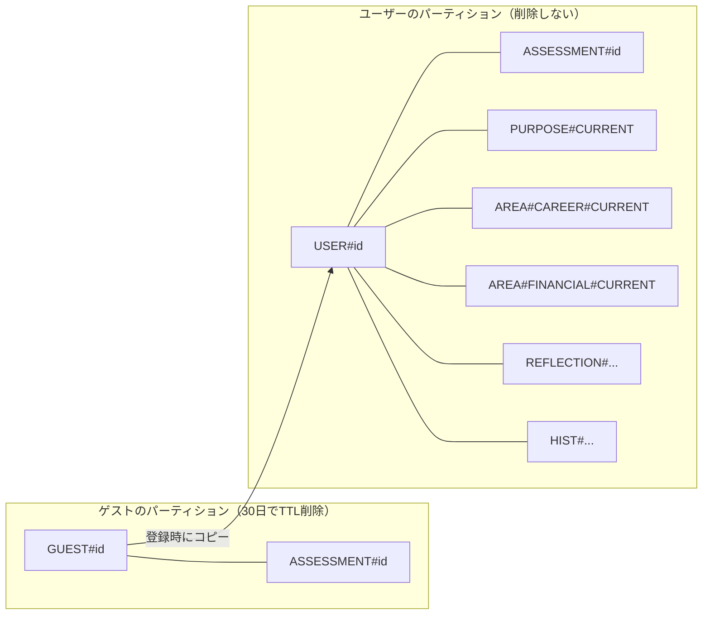

# Flourish Studio MVP 論理データモデル

> Version 0.3
> 最終更新：2026-08-08
> 対象は `02_MVP範囲定義/mvp-scope.md` の範囲。画面との対応は `04_画面設計/screen-list.md` を参照。
>
> **0.3の変更点：データストアを PostgreSQL から DynamoDB に変更した**（`11_技術構成/adr-001-database-selection.md`）。
> 表現形式が正規化されたER図から単一テーブル設計に変わっただけで、**業務ルールの決定内容は引き継いでいる。**
> 変更の意図と比較検討はADR-001を参照。

---

## 1. 設計方針

| 論点 | 決定 | 理由 |
|---|---|---|
| データストア | **DynamoDB** | アクセスパターンが全て単一ユーザー・単一集約に閉じている（ADR-001 2章） |
| テーブル構成 | **単一テーブル `flourish` ＋ 記事用の `flourish_article`** | 記事はユーザーデータと関連を持たず、ライフサイクルも異なる |
| **GSI** | **主テーブルには置かない** | 全ての読み取りが PK 指定で足りる（2.3） |
| 保存の単位 | **集約を1アイテムにまとめる** | 「確定した成果物だけを保存する」（`03_ユーザーフロー` 2章）が集約の境界を既に決めている |
| マスタの持ち方 | **コード側の定数（enum）で持つ。** DBにはコード値だけ保存する | 4領域・20項目・5段階ラベルはMVP期間中に構造が変わらない |
| 履歴 | **表示しないが、データは残す。** バージョンを積み上げる | 定義書 9.9「1年前の自分は、こう考えていた」は、過去データがなければ後から作れない |
| AI対話 | **全文を残す。** 提示した3案は確定分のみ | 領域の理想状態を作るとき、ありたい姿の背景をAIに渡せる |
| 運用データ | **DBに置かない。CloudWatch に出す** | AI呼び出しの記録は集計対象であり、DBは置き場所として適さない（7章） |

### 1.1 集約を1アイテムにまとめる

`09_API設計` 5.3 は「成功した時点ではじめて `CURRENT_STATE_ASSESSMENT` 以下が保存される。失敗時は何も残らない」と定めている。

**この規則は、1アイテムへの `PutItem` にすると自明に満たされる。** 正規化された設計では38行を1トランザクションで書く必要があったが、集約を1アイテムにまとめれば書き込みは1回になり、中途半端な状態が構造上ありえなくなる。

| 集約 | 内包するもの | 概算サイズ |
|---|---|---|
| 現在地レポート | 選択式24問 ＋ 自由記述8問 ＋ 問い文 ＋ 結果一式 | 約 33KB |
| ありたい姿 | 選択式回答 ＋ 対話全文 ＋ 確定文 | 約 8KB |
| 領域の計画 | 選択式回答 ＋ 対話全文 ＋ 理想状態 ＋ 目標1〜3 | 約 6KB |
| 週次の振り返り | 目標ごとの評価 ＋ 自由記述 ＋ AI出力 | 約 3KB |

DynamoDBの1アイテム上限は400KB。**最も大きい現在地レポートでも1桁以上の余裕がある。**

### 1.2 マスタをコードに置くことへの対処

選択肢の文言をコードに置くと、**文言を修正したとき、過去の回答が何を意味していたか辿れなくなる。**

そこで、回答を記録する側に `question_set_version` を持たせる。コード側は過去バージョンの文言定義を残し、削除しない。

```text
assessment.question_set_version = "2026-08-v1"
  → コード側の QUESTION_SETS["2026-08-v1"] を引けば、
    そのとき何と表示されていたかが復元できる
```

文言を変えるときは新しいバージョンを起こす。**過去バージョンの定義は消さない。**

---

## 2. 全体像

### 2.1 テーブル

| テーブル | 内容 | GSI |
|---|---|---|
| `flourish` | ユーザーデータのすべて | **なし** |
| `flourish_article` | 記事 | `category-index` |

### 2.2 主キーの一覧

`flourish` テーブルの `PK` / `SK` の組み合わせは以下がすべてである。

| # | 対象 | PK | SK | TTL |
|---|---|---|---|---|
| 1 | ユーザー本体 | `USER#<user_id>` | `PROFILE` | − |
| 2 | 現在地レポート | `USER#<user_id>` | `ASSESSMENT#<assessment_id>` | − |
| 3 | ありたい姿（現行） | `USER#<user_id>` | `PURPOSE#CURRENT` | − |
| 4 | 領域の計画（現行） | `USER#<user_id>` | `AREA#<area>#CURRENT` | − |
| 5 | 週次の振り返り | `USER#<user_id>` | `REFLECTION#<answered_at>#<id>` | − |
| 6 | 過去バージョン | `USER#<user_id>` | `HIST#<...>` | − |
| 7 | ゲストセッション | `GUEST#<guest_id>` | `GUEST` | **30日** |
| 8 | ゲストの現在地レポート | `GUEST#<guest_id>` | `ASSESSMENT#<assessment_id>` | **30日** |
| 9 | ログインセッション | `SESSION#<token_hash>` | `SESSION` | **30日** |
| 10 | 非同期ジョブ | `JOB#<job_id>` | `JOB` | **7日** |
| 11 | 冪等キー | `IDEM#<owner>#<key>` | `IDEM` | **24時間** |
| 12 | レート制限カウンタ | `RATE#<owner>#<window>` | `RATE` | **枠終了＋1時間** |

**`user_id` には Cognito の `sub` をそのまま使う。** 別のIDを採番して対応表を持つと、ログインのたびに1回余分な読み取りが発生する。

### 2.3 GSIを置かない理由

`09_API設計` 4章の全エンドポイントについて、必要な読み取りを列挙した結果、**すべてが PK 指定（または PK ＋ SK前方一致）で足りる。**

| 操作 | 読み取り |
|---|---|
| `GET /home` | `BatchGetItem`（PROFILE ＋ PURPOSE#CURRENT ＋ AREA#*#CURRENT の6キー） |
| `GET /assessments/{id}` | `GetItem`（所有者はCookieから分かる） |
| `GET /purposes/current` | `GetItem` |
| `GET /area-plans/{area}` | `GetItem` |
| `GET /reflections/context` | `BatchGetItem`（4領域の現行計画。目標はその中に入っている） |
| `GET /reflections/{id}` | `GetItem` |
| `GET /jobs/{id}` | `GetItem` |
| 認証 | `GetItem`（`SESSION#<token_hash>`） |

**メールアドレスからユーザーを引く必要もない。** 一意性の担保もログインもCognitoが行い（`11_技術構成` 7.2）、アプリは `sub` しか受け取らない。

### 2.4 所有の表現



**「所有者は `user_id` と `guest_session_id` の少なくとも一方」という制約が、パーティションキーそのものになった。** どちらでもない孤児が構造上ありえない。

---

## 3. 現在地レポート

### 3.1 アイテム

**選択式・自由記述・生成結果を1アイテムにまとめる。**

```jsonc
{
  "PK": "USER#a1b2...",              // 未登録時は "GUEST#..."
  "SK": "ASSESSMENT#c3d4...",
  "entity": "ASSESSMENT",
  "assessment_id": "c3d4...",
  "guest_session_id": "e5f6...",     // 来歴。登録後も消さない
  "question_set_version": "2026-08-v1",

  "scale_answers": [
    { "area": "CAREER", "question_kind": "SATISFACTION",
      "item_code": "CAREER_FULFILLMENT", "score": 4 },
    { "area": "CAREER", "question_kind": "COMMITMENT", "score": 3 }
    // 計24件
  ],

  "free_text_answers": [
    { "area": "CAREER", "slot": "SATISFIED",
      "target_item_code": "CAREER_FULFILLMENT",
      "generated_question": "Careerの中では「仕事のやりがい」が…",
      "body": "今の会社で任される範囲が広がってきた" }   // null 可
    // 計8件
  ],

  "result": {
    "nickname": "全速前進、燃料計は未確認",
    "articulation_stage": "SPROUT",
    "commitment_stage": "SEED",
    "commitment_score": 3,
    "safety_flag": false,
    "areas": [
      { "area": "CAREER",
        "satisfied_text": "…", "concern_text": "…", "advice_text": "…" }
      // 計4件
    ],
    "generated_at": "2026-08-08T04:12:00Z"
  },

  "started_at": "2026-08-08T04:00:00Z",
  "completed_at": "2026-08-08T04:12:00Z",
  "expires_at": 1757000000            // ゲストのパーティションにあるときのみ
}
```

### 3.2 制約

| 制約 | 内容 | 担保 |
|---|---|---|
| 選択式の件数 | **ちょうど24件**（4領域 × 5項目 ＋ 4領域 × コミット度1問） | アプリ |
| 選択式の重複 | `(area, question_kind, item_code)` の重複がないこと | アプリ |
| 自由記述の件数 | **ちょうど8件**（4領域 × 2問） | アプリ |
| 自由記述の本文 | `body` は **null 可**。全問空欄でも成立する | − |
| 問い文の保存 | `generated_question` は**必ず保存する**。AIが毎回変わるため、回答だけでは意味が復元できない | アプリ |
| スコア | 0〜4の整数 | アプリ |
| 領域ごとの結果 | `result.areas` はちょうど4件 | アプリ |

**「アプリ」と書いた制約は、`09_API設計` 5.2 / 5.3 の検証と同一のものである。** リレーショナルでは一意制約とCHECKで守っていたが、**そもそもAPI層でも同じ検証を行っていた**（API設計は `422 ANSWERS_INCOMPLETE` を定義している）。二重に守っていたものが一重になる。

### 3.3 生成の成否とアイテムの存在

**このアイテムが存在する ＝ 生成に成功している。** 生成前・失敗中はアイテムを作らない。

Version 0.2 にあった `status`（`IN_PROGRESS` / `COMPLETED`）は**廃止した。** API設計1.1が「入力途中を送らない」と定めているため、`IN_PROGRESS` の行は元から存在しえなかった。

`commitment_score` は選択式のコミット度4件の合計（0〜16）で、そこから `commitment_stage` を導く。**保存時に確定させ、後から再計算しない。**

### 3.4 登録時の引き継ぎ

`09_API設計` 5.5 のとおり、登録時にゲストの成果物をアカウントへ紐付ける。

```text
1. GetItem(PK = GUEST#<guest_id>, SK = ASSESSMENT#<id>)
2. TransactWriteItems
     Put    PK = USER#<sub>,  SK = PROFILE
     Put    PK = USER#<sub>,  SK = ASSESSMENT#<id>   ← 1で読んだ内容。expires_at は外す
     Put    PK = SESSION#<token_hash>, SK = SESSION
     Update PK = GUEST#<guest_id>, SK = GUEST（converted_user_id, converted_at）
```

**ゲスト側のアイテムは消さない。** TTLで30日後に自動削除される。これが「未変換の現在地レポートはゲストセッションと一緒に削除する」（10章）の実装になる。

`guest_session_id` 属性はコピー先にも残す。**変換後も来歴を保持する**という決定（Version 0.2 の6章）を引き継ぐ。

---

## 4. Flourish Map（ありたい姿・領域・目標）

### 4.1 ありたい姿

```jsonc
{
  "PK": "USER#a1b2...",
  "SK": "PURPOSE#CURRENT",
  "entity": "PURPOSE",
  "version": 2,

  "statement": "まわりの人が安心して力を出せる存在でありたい。",
  "original_statement": "自分で選んだと言えることを積み重ねて生きていきたい。",
  "selected_direction": "OTHERS",
  "selected_label": "まわりの人とともに",

  "choices": [
    { "question_code": "Q1", "option_codes": ["GROWTH", "FREEDOM", "SELFNESS"] },
    { "question_code": "Q2", "option_codes": ["DECIDE_SELF", "FOCUS"] },
    { "question_code": "Q3", "option_codes": ["OPTIONS"] }
  ],

  "conversation": [
    { "seq": 1, "role": "AI",   "body": "「成長」を選ばれていました。…" },
    { "seq": 2, "role": "USER", "body": "前の職場で…" }
    // 約6件
  ],

  "created_at": "2026-08-08T05:00:00Z"
}
```

### 4.2 領域の計画

**目標を `goals` として内包する。**

```jsonc
{
  "PK": "USER#a1b2...",
  "SK": "AREA#CAREER#CURRENT",
  "entity": "AREA_PLAN",
  "area": "CAREER",
  "version": 1,
  "purpose_version": 2,               // どのありたい姿に紐づくか

  "ideal_state": "今の仕事の中で自分の強みが言葉になっていて、…",
  "original_ideal_state": "…",
  "selected_direction": "DEEPEN",
  "selected_label": "今の場所で深める",

  "choices": [ /* Q1〜Q3 */ ],
  "conversation": [ /* 約4件 */ ],

  "goals": [
    { "goal_key": "g-7f3a...", "body": "職務経歴書を書き上げる",     "sort_order": 1 },
    { "goal_key": "g-9c1b...", "body": "月に1回、社外の人と話す", "sort_order": 2 }
  ],

  "created_at": "2026-08-08T05:30:00Z"
}
```

| 制約 | 内容 | 担保 |
|---|---|---|
| 目標の個数 | **1〜3件** | アプリ |
| 並び順の一意性 | `sort_order` が1から連番で重複しない | **リストの位置そのもの** |
| ありたい姿の前提 | **ありたい姿なしに領域は作れない** | **トランザクションの `ConditionCheck`**（4.4） |

**`sort_order` の一意制約は、リストの並びに置き換わって不要になった。** `(area_plan_id, sort_order)` の複合一意制約は、正規化によって目標が別行になっていたために必要だったものである。

### 4.3 バージョンの積み方

**編集は上書きではなく、新しいアイテムの追加とする。**

| 系列の単位 | 現行のSK | 過去版のSK |
|---|---|---|
| ユーザーごとに1系列（ありたい姿） | `PURPOSE#CURRENT` | `HIST#PURPOSE#000001` |
| ユーザー × 領域ごとに1系列 | `AREA#CAREER#CURRENT` | `HIST#AREA#CAREER#000001` |

**「`is_current = true` はユーザーごとに1件」という一意制約は、キーの形そのものが保証する。** `PURPOSE#CURRENT` というSKは定義上1つしか存在しえない。フラグを持って一意制約で守る設計より壊れにくい。

過去版を `HIST#` 接頭辞に分けているのは、`begins_with('PURPOSE')` や `begins_with('AREA')` の問い合わせに過去版が混ざらないようにするためである。

**目標は独自のバージョンを持たない。** 領域の計画に内包され、新バージョンを作るときに一緒にコピーされる。目標の追加・修正も S-58 で理想状態と同じ画面から行うため、まとめて1世代進めるのが実態に合う。

### 4.4 更新の手順

```text
【ありたい姿の更新（PUT /purposes/current）】
1. GetItem(PK = USER#id, SK = PURPOSE#CURRENT)        → 旧版（version = N）
2. TransactWriteItems
     Put PK = USER#id, SK = HIST#PURPOSE#<N を0埋め>   ← 旧版の内容をそのまま
     Put PK = USER#id, SK = PURPOSE#CURRENT            ← 新版、version = N+1
         ConditionExpression: attribute_not_exists(PK) OR version = N
```

条件式により、**同時に2回更新されたときに片方が黙って消えることを防ぐ。**

```text
【領域の確定（POST /area-plans）】
TransactWriteItems
  ConditionCheck PK = USER#id, SK = PURPOSE#CURRENT
                 ConditionExpression: attribute_exists(PK)     ← 409 PURPOSE_REQUIRED
  Put            PK = USER#id, SK = HIST#AREA#<area>#<N>       ← 旧版がある場合
  Put            PK = USER#id, SK = AREA#<area>#CURRENT
```

**外部キー制約の代わりに `ConditionCheck` を使う。** 「AREA_PLAN は必ず purpose_id を持つ」という制約は、トランザクション内で原子的に検証される。

### 4.5 `goal_key` が必要な理由

領域の計画のバージョンが上がると、目標も新しいアイテムの中にコピーされる。そのままだと、**同じ目標を週をまたいで追跡できない。**

定義書 10.5 は、

> Socialに関する目標は、8週間にわたって課題の記述が続いています。

という時系列の観察を継続価値としている。これを実現するには、コピーをまたいで同一性を保つキーが要る。`goal_key` は初回作成時に採番し、**バージョンをまたいで引き継ぐ。**

`09_API設計` 5.12 のとおり、`PUT /area-plans/{area}` で `goal_key` を送らない目標は新規として扱い、サーバが採番する。送られなかった `goal_key` は、その版で削除されたものとして扱う。

---

## 5. Weekly Reflection

### 5.1 アイテム

```jsonc
{
  "PK": "USER#a1b2...",
  "SK": "REFLECTION#2026-08-08T09:00:00Z#h7i8...",
  "entity": "REFLECTION",
  "reflection_id": "h7i8...",

  "statuses": [
    { "goal_key": "g-7f3a...", "area": "CAREER",
      "goal_body": "職務経歴書を書き上げる",     // 回答時点の文言
      "status": "ON_TRACK" },
    { "goal_key": "g-9c1b...", "area": "CAREER",
      "goal_body": "月に1回、社外の人と話す",
      "status": "STALLED" }
  ],

  "note": "今週は残業が続いて、時間が取れなかった",   // null 可

  "result": {
    "looking_back": "…",
    "insight": "…",
    "next_step": "…",
    "safety_flag": false,
    "generated_at": "2026-08-08T09:01:00Z"
  },

  "answered_at": "2026-08-08T09:00:00Z"
}
```

### 5.2 制約

| 制約 | 内容 | 担保 |
|---|---|---|
| 実施条件 | 開始時点で現行の目標が**1件以上**あること | アプリ（`GET /reflections/context` で確認） |
| 評価の網羅 | 現行の全目標に対して `statuses` が1件ずつ存在する | アプリ |
| 自由記述 | `note` は **null 可**。全体で1件のみ | − |
| 頻度 | **制限しない。** 同じ日に複数回記録してよい | − |
| 保存の単位 | AI出力の生成に成功した時点で、回答とAI出力を**まとめて確定**する | **1回の `PutItem`** |

Version 0.2 の `status`（`IN_PROGRESS` / `COMPLETED`）は、3.3 と同じ理由で廃止した。

### 5.3 `goal_id` を廃止し、文言のスナップショットに置き換えた

Version 0.2 の `REFLECTION_GOAL_STATUS` は `goal_id` と `goal_key` を両方持っていた。理由は「**そのとき何と書かれていた目標か**」と「**どの系列の目標か**」を別々に辿るためだった。

DynamoDBでは目標が独立した行を持たないため、`goal_id` に相当するものがない。**代わりに、回答時点の文言を `goal_body` として直接持つ。**

| | Version 0.2 | Version 0.3 |
|---|---|---|
| どの系列か | `goal_key` | `goal_key`（同じ） |
| そのとき何と書かれていたか | `goal_id` → `GOAL` 行を引く | **`goal_body`（直接持つ）** |

**参照が1段減っている。** `goal_id` という間接参照は、正規化のために生まれたものであり、目的そのものではなかった。

### 5.4 時系列の観察

定義書10.5 の「8週間にわたって」という観察は、**1ユーザーの振り返りを列挙して集計する。**

```text
Query(PK = USER#id, SK begins_with 'REFLECTION#', ScanIndexForward = false, Limit = N)
```

SKに `answered_at` を含めているため、**新しい順に取得できる。** 週1回のユーザーで年52件、上限を切って取れば十分に軽い。`goal_key` での絞り込みはアプリ側で行う。

**この用途のためにGSIを置かない。** 1ユーザー分を読むだけであり、インデックスに見合わない。

### 5.5 週の扱い

MVPでは「今週」を限定表記せず、`answered_at` で記録する（`04_画面設計` S-63）。**週の境界をデータ側で持たない。** 集計が必要になった段階で導出する。

---

## 6. アカウントと記事

### 6.1 ユーザー

```jsonc
{
  "PK": "USER#a1b2...",              // Cognito の sub
  "SK": "PROFILE",
  "entity": "USER",
  "theme_preference": "AUTO",        // AUTO / LIGHT / DARK
  "guest_session_id": "e5f6...",     // 来歴
  "deleted_at": null,                // 論理削除
  "created_at": "2026-08-08T04:20:00Z",
  "updated_at": "2026-08-08T04:20:00Z"
}
```

| 制約 | 内容 |
|---|---|
| メールアドレス・パスワード・Google連携 | **保持しない。Cognitoが持つ**（`11_技術構成` 7.2） |
| テーマ設定 | `theme_preference` の既定は `AUTO`（OS設定に追従） |
| 論理削除 | `deleted_at` に値が入っているものを取得対象から外す。**TTLは設定しない** |

**Version 0.2 にあった `email` / `password_hash` / `google_sub` を廃止した。** 認証情報をCognitoに一本化する決定（`11_技術構成` 7章）の結果であり、アプリ側に認証情報の複製を持たない。

### 6.2 ゲストセッション

```jsonc
{
  "PK": "GUEST#e5f6...",
  "SK": "GUEST",
  "entity": "GUEST_SESSION",
  "converted_user_id": null,
  "converted_at": null,
  "report_generation_count": 1,       // レート制限（API設計 2.4）
  "created_at": "2026-08-08T03:55:00Z",
  "expires_at": 1757000000            // TTL：30日
}
```

`report_generation_count` は `UpdateItem` の `ADD` で原子的に加算する。**「1セッション3回まで」を、読んでから書く手順なしに実装できる。**

### 6.3 ログインセッション

```jsonc
{
  "PK": "SESSION#<token_hash>",
  "SK": "SESSION",
  "entity": "SESSION",
  "user_id": "a1b2...",
  "created_at": "2026-08-08T04:20:00Z",
  "last_seen_at": "2026-08-08T09:00:00Z",
  "expires_at": 1759600000            // TTL：30日
}
```

`PK` にはトークンそのものではなく**ハッシュ**を入れる。データベースが漏れてもセッションを再現できないようにする。

**有効期限の延長は毎リクエストでは行わない。** `09_API設計` 8章は「アクセスのたびに延長」としているが、そのまま実装すると全リクエストが書き込みを伴う。**前回の延長から24時間以上経っている場合のみ延長する。** ユーザーから見た挙動は変わらない。

### 6.4 記事

`flourish_article` テーブル。

```jsonc
{
  "slug": "what-is-flourish",        // パーティションキー
  "title": "Flourishという考え方",
  "excerpt": "…",
  "body": "…",
  "category": "FLOURISH",            // CAREER / FINANCIAL / PHYSICAL / SOCIAL / FLOURISH
  "reading_minutes": 5,
  "status": "PUBLISHED",             // DRAFT / PUBLISHED
  "published_at": "2026-08-01T00:00:00Z"
}
```

| 項目 | 内容 |
|---|---|
| GSI | `category-index`（PK = `category`、SK = `published_at`） |
| 公開条件 | `status = PUBLISHED` かつ `published_at <= 現在` |
| 読み取り | **静的サイト生成時のみ**（`11_技術構成` 4.4）。実行時に読まない |
| 管理画面 | **MVPでは作らない。** 記事は直接投入する |

**ユーザーデータと別テーブルにしている。** 記事は他のどのエンティティとも関連を持たず、書き込みは運用者のみ、読み取りはビルド時のみで、ライフサイクルが完全に異なる。

将来のMap連動レコメンド（定義書12.2）では、領域や項目と紐づけた検索が要る。**その段階では検索基盤（OpenSearch等）を別途置く。** リレーショナルであっても同じ判断になる（ADR-001 5.2）。

---

## 7. 運用データ（AI呼び出しの記録）

**Version 0.2 の `AI_GENERATION` テーブルは廃止した。CloudWatch に出す。**

| 理由 | 内容 |
|---|---|
| 用途が集計である | `kind` ごとの失敗率、平均トークン数、キャッシュの効き。**DBに入れて後から集計するのは本来の置き場所ではない** |
| ユーザーに見せない | `08` の他のエンティティと性質が違う |
| 保持期間の管理 | CloudWatch Logs の保持設定（90日）で満たせる |

### 7.1 出力する内容

生成のたびに、EMF（埋め込みメトリクス形式）で構造化ログを出す。

| フィールド | 用途 |
|---|---|
| `kind` | 生成の種類（7.2） |
| `model` / `prompt_version` / `effort` | どの設定で生成したか |
| `status`（`SUCCEEDED` / `FAILED`） | 失敗率 |
| `prompt_tokens` / `completion_tokens` / `cache_read_tokens` | コスト実測とキャッシュ監視 |
| `attempt` / `retry_reason` | 手動再試行とサーバ内再生成の区別 |
| `error_code` | 失敗の分類 |
| `safety_flag` | セーフティ判定の発生率 |
| `user_id` / `guest_session_id` / `job_id` | 突き合わせ用の識別子 |

**プロンプトの入出力本文は出さない**（`11_技術構成` 9.4）。対話の本文は集約アイテムに、成果物は各アイテムに既に保存されている。

### 7.2 `kind` の一覧

**9種類。** `10_AIプロンプト設計` 4章と1対1に対応する。

| kind | 対応する画面 |
|---|---|
| `ASSESSMENT_QUESTIONS` | S-13 自由記述の問い生成 |
| `ASSESSMENT_REPORT` | S-15 レポート生成 |
| `PURPOSE_DIALOGUE` | S-32 ありたい姿のAI対話 |
| `PURPOSE_PROPOSALS` | S-33 3案生成 |
| `AREA_DIALOGUE` | S-52 領域のAI対話 |
| `AREA_PROPOSALS` | S-53 3案生成 |
| `GOAL_HINTS` | S-56 AIヒント（任意） |
| `REFLECTION_SUMMARY` | S-62 振り返りの整理 |
| `SAFETY_CHECK` | S-32 / S-52 の裏で実行 |

再試行は同じ `kind` で新しいログを出し、`attempt` を増やす。**自動リトライはしないため、`attempt` が増えるのはユーザーが押したときだけである**（サーバ内のスキーマ違反再生成は `retry_reason` で区別する）。

---

## 8. 制御用のアイテム

`09_API設計` の仕組みを支えるもの。**いずれもTTLで自動削除され、削除ジョブを書かない。**

### 8.1 非同期ジョブ

```jsonc
{
  "PK": "JOB#j1k2...",
  "SK": "JOB",
  "entity": "JOB",
  "owner": "USER#a1b2...",           // 発行元。他人のジョブを引けないようにする
  "kind": "ASSESSMENT_REPORT",
  "status": "SUCCEEDED",             // QUEUED / RUNNING / SUCCEEDED / FAILED
  "result": { "assessment_id": "c3d4..." },
  "error": null,                     // { code, retryable }
  "created_at": "2026-08-08T04:10:00Z",
  "expires_at": 1755000000           // TTL：7日
}
```

`GET /jobs/{id}` は `owner` とCookieの一致を確認する。一致しなければ `403`（API設計 5.15）。

### 8.2 冪等キー

```jsonc
{
  "PK": "IDEM#USER#a1b2...#<Idempotency-Key>",
  "SK": "IDEM",
  "job_id": "j1k2...",
  "expires_at": 1754500000           // TTL：24時間
}
```

**`PutItem` ＋ `attribute_not_exists(PK)` が、そのまま冪等性の実装になる。** 条件に失敗したら既存の `job_id` を返す。

先に読んでから書く手順を取らない。**同時リクエストで二重生成が起きるため。**

### 8.3 レート制限カウンタ

```jsonc
{
  "PK": "RATE#USER#a1b2...#2026-08-08T09",
  "SK": "RATE",
  "count": 12,
  "expires_at": 1754600000           // TTL：枠終了＋1時間
}
```

`UpdateItem` の `ADD count :1` と `ConditionExpression: attribute_not_exists(count) OR count < :limit` を組み合わせる。**上限判定と加算が1回の書き込みで完了する。**

ゲストのレポート生成回数は、専用のカウンタを作らず `GUEST` アイテムの属性で数える（6.2）。

---

## 9. 列挙型（コード側で持つ定数）

| 列挙 | 値 |
|---|---|
| `Area` | `CAREER` / `FINANCIAL` / `PHYSICAL` / `SOCIAL` |
| `AreaItem` | 領域ごとに5コード、計20（`05_質問・コンテンツ設計` 2.3） |
| `QuestionKind` | `SATISFACTION` / `COMMITMENT` |
| `FreeTextSlot` | `SATISFIED` / `CONCERN` |
| `GrowthStage` | `SEED` / `SPROUT` / `SEEDLING` / `TREE` |
| `PurposeDirection` | `SELF` / `OTHERS` / `SOCIETY` |
| `AreaPlanDirection` | `DEEPEN` / `CHANGE` / `EXPAND` |
| `ReflectionStatus` | `ON_TRACK` / `STALLED` / `REVISE` |
| `ArticleCategory` | `CAREER` / `FINANCIAL` / `PHYSICAL` / `SOCIAL` / `FLOURISH` |
| `ThemePreference` | `AUTO` / `LIGHT` / `DARK` |
| `JobStatus` | `QUEUED` / `RUNNING` / `SUCCEEDED` / `FAILED` |
| `AiKind` | 7.2 の9種 |

**スコアは 0〜4 の整数で保存し、右がポジティブ。** 画面の並び順（デザイン原則7.5）と一致させる。

---

## 10. 画面とアイテムの対応

| 画面 | 読む | 書く |
|---|---|---|
| S-11 開始 | − | `GUEST#id / GUEST` |
| S-12 選択式 | − | （クライアント保持。まだ書かない） |
| S-13 問い生成中 | − | `JOB` |
| S-14 自由記述 | − | （クライアント保持） |
| S-15 レポート生成中 | − | **`ASSESSMENT`（1回の PutItem）** ／ `JOB` |
| S-16 結果 | `ASSESSMENT` | − |
| S-21 登録 | `GUEST` / `ASSESSMENT` | `USER / PROFILE` ／ `USER / ASSESSMENT` ／ `SESSION` ／ `GUEST`更新 |
| S-31〜S-34 | − | （クライアント保持） |
| S-35 確定 | `PURPOSE#CURRENT` | **`PURPOSE#CURRENT`（＋ `HIST#`）** |
| S-36 / S-37 閲覧・編集 | `PURPOSE#CURRENT` | 同上 |
| S-41 ホーム | `PROFILE` ／ `PURPOSE#CURRENT` ／ `AREA#*#CURRENT`（BatchGet） | − |
| S-50〜S-55 | `PURPOSE#CURRENT` | （クライアント保持） |
| S-56 目標確定 | `AREA#<area>#CURRENT` | **`AREA#<area>#CURRENT`（＋ `HIST#`）** |
| S-57 閲覧 | `AREA#<area>#CURRENT` | − |
| S-58 編集 | `AREA#<area>#CURRENT` | 同上（新バージョン） |
| S-61 WR回答 | `AREA#*#CURRENT`（BatchGet） | （クライアント保持） |
| S-62 生成中 | − | `JOB` |
| S-63 WR結果 | − | **`REFLECTION`（1回の PutItem）** |
| K-01 / K-02 | `flourish_article`（**ビルド時のみ**） | − |

**`03_ユーザーフロー` 5章の保存タイミングと一致していること。** 確定した成果物だけを保存し、入力途中は書かない。

---

## 11. データ保持

| 対象 | 方針 | 実装 |
|---|---|---|
| ゲストセッション | **30日**で削除 | TTL |
| 未変換の現在地レポート | ゲストセッションと一緒に削除 | **同じTTLを持たせる**（3.4） |
| ログインセッション | 30日 | TTL |
| ジョブ | 完了から**7日** | TTL |
| 冪等キー | 24時間 | TTL |
| レート制限カウンタ | 枠終了＋1時間 | TTL |
| AI対話ログ | **退会後も保持する**（下記の論理削除に従う） | 集約アイテムに内包 |
| バージョン履歴 | 削除しない | `HIST#` |
| AI呼び出しの記録 | **90日** | CloudWatch Logs の保持設定 |

### 11.1 削除は論理削除のみ

**退会時もデータを物理削除しない。** `USER / PROFILE` の `deleted_at` に値を入れ、値が入っているものを取得対象から外す。

**ユーザーが所有するアイテムにTTLを設定しない。** TTLは物理削除であり、この方針に反する。TTLを使うのは11章の表で「TTL」と書いた6種に限り、いずれも保持期間が明示的に決まっており、内面の記録ではない。

Cognitoのユーザーも削除せず、無効化する（`11_技術構成` 7.6）。

この設計から、次の義務が生じる。

> **プライバシーポリシーで、退会後もデータを保持する旨と、その期間・目的を明示する必要がある。**

内面の記録を扱うサービスであり、「退会すれば消えます」と言えない以上、ここを曖昧にできない。物理削除の要否は、プライバシーポリシー策定時にあらためて確認する（定義書19章）。

---

## 12. 留意点

### 12.1 3案を確定分しか残さない影響

提示した3案のうち、選ばれた1案だけを保存する。**選ばれなかった2案は残らない。**

このため、以下が後から検証できない。

- 3案の軸（自分／他者／社会、深める／変える／広げる）が機能しているか
- どの方向が選ばれやすいか

定義書 14.4 は「異なる価値観や視点を持つ案を提示し、選ぶこと自体に意味を持たせる」としており、**この設計が効いているかを測る手段がない。** 検証が必要になった時点で、提示した3案を残す設計に変える。

**アイテムに `proposals` 配列を足すだけで済む。** 正規化された設計ではテーブル追加を伴ったが、集約に内包する形なら影響が小さい。

### 12.2 選択式の回答を S-15 まで保存しない

S-12・S-14 の回答はクライアント保持で、S-15 の生成成功時にまとめて保存する（`03_ユーザーフロー` 2章の方針）。**途中離脱の分析データは取れない。**

どこで離脱しているかを知りたくなった場合は、別途イベントログが要る。

### 12.3 場当たりの問い合わせができない

**DynamoDBに移した最大の代償である**（ADR-001 5.1）。「言語化度の分布は」「どの領域から始める人が多いか」といった問いに、その場で答えられない。

| 緩和策 | 内容 |
|---|---|
| **S3エクスポート ＋ Athena** | 継続的バックアップからS3へエクスポートし、SQLで分析する。月次で足りる |
| 属性を最初から持たせる | 集計したくなりそうな値（`articulation_stage` など）は集約アイテムの上位に置き、エクスポート後に扱いやすくする |

**分析を前提とした運用手順を、リリース前に一度通しておく。** 必要になってから作ると、そのとき欲しいデータが取れない。

### 12.4 制約の担保がアプリに移った

件数、スコアの範囲、網羅性といった制約は、DBではなくアプリが守る（3.2 / 4.2 / 5.2）。

**元からAPI層でも同じ検証を行っていた**（`09_API設計` 5.2・5.3・5.11 の検証表）ため、新たに実装するものはない。ただし**二重の守りが一重になった**ことは事実であり、検証を通らない書き込み経路を作らないよう、リポジトリ層を1箇所に集約する。

---

## 13. 未決の事項

すべて決着済み。主な決定は以下。全体の未決は定義書19章にある。

| 項目 | 決定 |
|---|---|
| データストア | **DynamoDB**（ADR-001） |
| ゲストセッションの保持期間 | 30日 |
| AI対話ログ | 退会後も保持 |
| 退会時の削除 | **論理削除のみ**。プライバシーポリシーでの明示が必須 |
| 記事の管理 | MVPでは直接投入。読み取りはビルド時のみ |
| 認証情報の保持 | **アプリ側に持たない。** Cognitoに一本化 |
| AI呼び出しの記録 | **DBに置かず CloudWatch へ** |
| 目標の追跡 | `goal_key` ＋ 回答時点の文言スナップショット |
