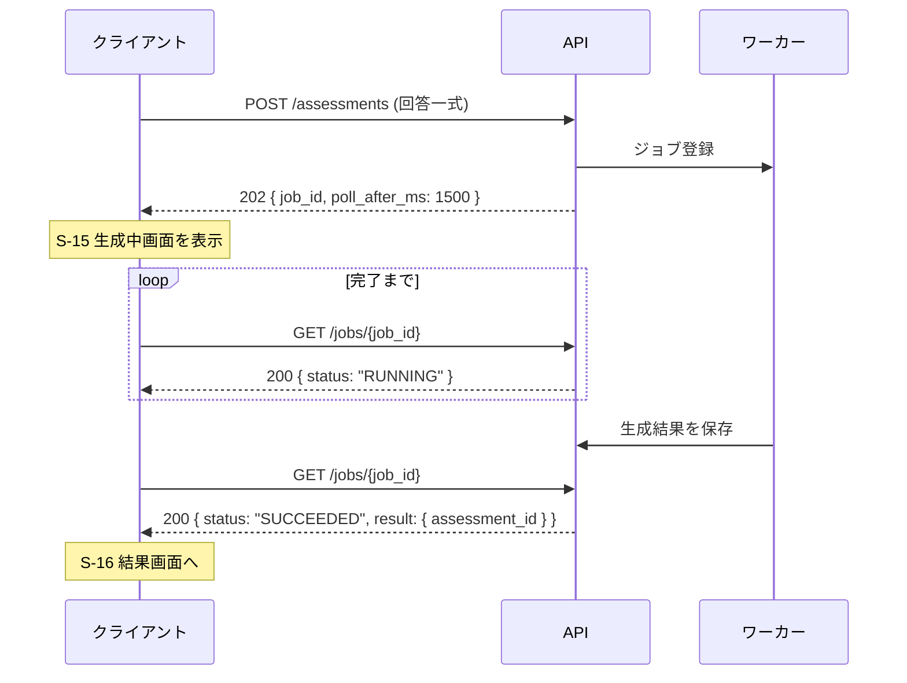
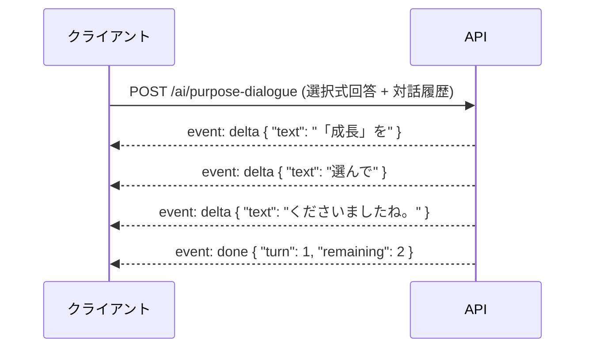

# Flourish Studio MVP API設計

> Version 0.2
> 最終更新：2026-08-08
> エンティティは `08_データモデル/logical-data-model.md`、画面は `04_画面設計/screen-list.md` を参照

---

## 1. 設計方針

| 論点 | 決定 |
|---|---|
| スタイル | **REST** |
| AI生成 | **画面遷移を伴う長い生成は非同期ジョブ、対話はストリーミング、画面内の短い生成は同期** |
| 認証 | **HttpOnly Cookie で統一。** 未登録のゲストも同じ仕組みで識別する |
| 記事 | **APIを作らない。** サーバー側で直接DBを見てHTMLを返す |
| ベースパス | `/api/v1` |

### 1.1 入力途中を送らない

`user-flow.md` 2章の「確定した成果物だけを保存する」を、APIにもそのまま適用する。

**S-12・S-14・S-31〜S-34・S-51〜S-55 の入力は、クライアントが保持する。** AI対話の履歴も同様で、リクエストのたびに必要な文脈をすべて送る。サーバーは下書きを持たない。

この結果、AI関連のエンドポイントは**ステートレス**になる。確定時のエンドポイントだけが書き込みを行う。

---

## 2. 共通仕様

### 2.1 認証

| Cookie | 発行 | 用途 |
|---|---|---|
| `fs_guest` | S-11 到達時 | 未登録ユーザーの識別 |
| `fs_session` | ログイン・登録成功時 | 登録済みユーザーの識別 |

いずれも `HttpOnly` `Secure` `SameSite=Lax`。**クライアントはIDを保持しない。**

登録時（S-21）は、`fs_guest` があれば**サーバー側でアカウントへ紐付け直す。** クライアントからゲストIDを送る必要はない。

| 認証レベル | 対象 |
|---|---|
| 不要 | 記事、トップページ |
| ゲスト可 | 現在地レポート関連 |
| 要ログイン | ありたい姿以降のすべて |

要ログインのエンドポイントに未認証でアクセスした場合は `401` を返す。クライアントは S-01 へ戻す。

### 2.2 ステータスコード

| コード | 用途 |
|---|---|
| `200` | 取得・更新の成功 |
| `201` | 作成の成功 |
| `202` | **非同期ジョブを受け付けた**（結果はまだない） |
| `204` | 削除・ログアウトの成功 |
| `400` | リクエストの形式が不正 |
| `401` | 未認証 |
| `403` | 他人のリソースへのアクセス |
| `404` | 存在しない |
| `409` | 状態が合わない（例：目標0件で振り返りを始めようとした） |
| `422` | 形式は正しいが業務ルールに反する（例：選択式が24件揃っていない） |
| `429` | レート制限 |
| `503` | AIプロバイダ側の障害 |

### 2.3 エラー応答

```json
{
  "error": {
    "code": "ANSWERS_INCOMPLETE",
    "message": "scale answers must be exactly 24 (received 23)",
    "details": [
      { "field": "scale_answers", "reason": "missing area=SOCIAL kind=COMMITMENT" }
    ]
  }
}
```

| フィールド | 用途 |
|---|---|
| `code` | **クライアントが分岐に使う。** 追加はしても意味は変えない |
| `message` | **開発者向け。英語。ユーザーには表示しない** |
| `details` | 任意。フィールド単位の理由 |

**ユーザーに見せる文言はクライアントが `code` から決める。** エラー文のトーン（デザイン原則 8.4「何が起きたかと、どうすれば直るかを書く。謝罪を書かない」）はクライアント側の責務であり、APIが文面を持たない。

### 2.4 レート制限

AI呼び出しは費用が発生するため、生成系のエンドポイントに制限をかける。

| 対象 | 制限の目安 |
|---|---|
| ゲスト（`fs_guest`） | レポート生成は**1セッション3回まで**（初回＋再試行2回） |
| 登録済み | 生成系すべてで**1時間30回まで** |

超過時は `429` と `Retry-After` を返す。

### 2.5 冪等性

生成系の `POST` は **`Idempotency-Key` ヘッダを受け付ける。** 同じキーの再送には、新しいジョブを作らず既存の `job_id` を返す。

通信断による二重生成を防ぐため。**「もう一度やってみる」ボタンは新しいキーを送る**ので、意図した再試行は通る。

---

## 3. AI生成の3つの方式

| 方式 | 使う場面 | 対象 |
|---|---|---|
| **非同期ジョブ** | 画面遷移を伴う長い生成 | S-13 / S-15 / S-33 / S-53 / S-62 |
| **ストリーミング（SSE）** | チャットの応答 | S-32 / S-52 |
| **同期** | 画面内で待つ短い生成 | S-56 のAIヒント |

**判断の基準は、独立した生成中画面を挟むかどうか。** 挟むならジョブ、挟まないなら同期かストリーミング。デザイン原則 7.4 の分類とそのまま一致する。

### 3.1 非同期ジョブ



**ジョブが失敗しても、サーバーは自動で再試行しない**（`user-flow.md` 4章）。`FAILED` を返し、ユーザーが「もう一度やってみる」を押したときに新しいジョブを作る。

| ジョブの状態 | 意味 |
|---|---|
| `QUEUED` | 受け付け済み、未着手 |
| `RUNNING` | 生成中 |
| `SUCCEEDED` | 完了。`result` に結果が入る |
| `FAILED` | 失敗。`error` に理由が入る |

ポーリング間隔はサーバーが `poll_after_ms` で指示する。クライアントは固定値を持たない。

### 3.2 ストリーミング（SSE）



| イベント | 内容 |
|---|---|
| `delta` | 生成された断片 |
| `done` | 完了。何往復目か、残り何往復かを返す |
| `error` | 失敗。クライアントは直近の発言にインラインでエラーを出す |

**対話の履歴はサーバーに残さない。** クライアントが保持し、次のリクエストで全部送る。確定時（`POST /purposes`）にまとめて保存する。

---

## 4. エンドポイント一覧

| メソッド | パス | 認証 | 画面 |
|---|---|---|---|
| `POST` | `/guest-sessions` | 不要 | S-11 |
| `POST` | `/ai/assessment-questions` | ゲスト可 | S-13 |
| `POST` | `/assessments` | ゲスト可 | S-15 |
| `GET` | `/assessments/{id}` | ゲスト可 | S-16 |
| `POST` | `/auth/register` | 不要 | S-21 |
| `POST` | `/auth/login` | 不要 | S-02 |
| `GET` | `/auth/google` | 不要 | S-21 / S-02 |
| `GET` | `/auth/google/callback` | 不要 | − |
| `POST` | `/auth/logout` | 要ログイン | − |
| `GET` | `/me` | 要ログイン | 全体 |
| `PATCH` | `/me` | 要ログイン | S-41（テーマ切替） |
| `POST` | `/ai/purpose-dialogue` | 要ログイン | S-32 |
| `POST` | `/ai/purpose-proposals` | 要ログイン | S-33 |
| `POST` | `/purposes` | 要ログイン | S-35 |
| `GET` | `/purposes/current` | 要ログイン | S-36 |
| `PUT` | `/purposes/current` | 要ログイン | S-37 |
| `GET` | `/home` | 要ログイン | S-41 |
| `POST` | `/ai/area-dialogue` | 要ログイン | S-52 |
| `POST` | `/ai/area-proposals` | 要ログイン | S-53 |
| `POST` | `/ai/goal-hints` | 要ログイン | S-56 |
| `POST` | `/area-plans` | 要ログイン | S-56 |
| `GET` | `/area-plans/{area}` | 要ログイン | S-57 |
| `PUT` | `/area-plans/{area}` | 要ログイン | S-58 |
| `GET` | `/reflections/context` | 要ログイン | S-61 |
| `POST` | `/reflections` | 要ログイン | S-62 |
| `GET` | `/reflections/{id}` | 要ログイン | S-63 |
| `GET` | `/jobs/{id}` | 発行者のみ | 生成中画面すべて |

記事（K-01 / K-02）はAPIを持たない。

---

## 5. エンドポイント詳細

### 5.1 `POST /guest-sessions`

S-11 到達時に呼ぶ。`fs_guest` Cookie を発行する。

既に有効な `fs_guest` がある場合は**新規発行せず、そのまま `200` を返す。** 画面を再読み込みしてもセッションが増えない。

### 5.2 `POST /ai/assessment-questions`

S-13。選択式24問の回答を受け取り、自由記述8問の問い文を生成する。**保存しない。**

```json
{
  "scale_answers": [
    { "area": "CAREER", "question_kind": "SATISFACTION", "item_code": "CAREER_FULFILLMENT", "score": 4 },
    { "area": "CAREER", "question_kind": "COMMITMENT", "score": 3 }
  ],
  "question_set_version": "2026-08-v1"
}
```

`202` でジョブを返す。完了時の `result`：

```json
{
  "questions": [
    {
      "area": "CAREER",
      "slot": "SATISFIED",
      "target_item_code": "CAREER_FULFILLMENT",
      "text": "Careerの中では「仕事のやりがい」が満たされているようですね。…"
    }
  ]
}
```

| 検証 | 内容 |
|---|---|
| 件数 | `scale_answers` は**ちょうど24件**。不足は `422 ANSWERS_INCOMPLETE` |
| 重複 | `(area, question_kind, item_code)` の重複は `422` |
| スコア | 0〜4 の整数以外は `400` |

### 5.3 `POST /assessments`

S-15。**選択式・自由記述・問い文をすべて受け取り、生成と保存をまとめて行う。**

```json
{
  "scale_answers": [ "...24件" ],
  "free_text_answers": [
    {
      "area": "CAREER",
      "slot": "SATISFIED",
      "target_item_code": "CAREER_FULFILLMENT",
      "generated_question": "Careerの中では…",
      "body": "今の会社で任される範囲が広がってきた"
    }
  ],
  "question_set_version": "2026-08-v1"
}
```

`202` でジョブを返す。**成功した時点ではじめて `CURRENT_STATE_ASSESSMENT` 以下が保存される。** 失敗時は何も残らない。

| 検証 | 内容 |
|---|---|
| 自由記述の件数 | **ちょうど8件。** `body` は空文字・null を許容する |
| 問い文 | `generated_question` は必須。**回答だけでは意味が復元できないため** |
| 整合 | `scale_answers` は 5.2 と同じ検証 |

### 5.4 `GET /assessments/{id}`

S-16。あだ名、領域ごとの3ブロック、言語化度・コミット度の段階を返す。

**未登録のまま全文を返す。** `fs_guest` が発行元と一致するか、`fs_session` が紐付け先と一致すれば `200`。それ以外は `403`。

### 5.5 `POST /auth/register`

S-21。`fs_guest` があれば、そのゲストセッションと現在地レポートを新しいアカウントへ紐付ける。

| 応答 | 条件 |
|---|---|
| `201` | 成功。`fs_session` を発行し、`fs_guest` は破棄する |
| `409 EMAIL_TAKEN` | メールアドレスが既に使われている |
| `422 WEAK_PASSWORD` | パスワードが要件を満たさない |

### 5.6 `POST /ai/purpose-dialogue`（SSE）

S-32。選択式3問の回答と、**それまでの対話履歴を毎回すべて送る。**

```json
{
  "choices": [ { "question_code": "Q1", "option_codes": ["GROWTH", "FREEDOM", "SELFNESS"] } ],
  "messages": [
    { "role": "AI", "body": "「成長」を選んでくださいましたね。…" },
    { "role": "USER", "body": "前の職場で…" }
  ]
}
```

`done` イベントで `remaining` を返し、**0 になったらクライアントが「候補を作る」を出す。**

### 5.7 `POST /ai/purpose-proposals`

S-33。選択式回答と対話履歴から3案を生成する。`202` でジョブ。

```json
{
  "proposals": [
    { "direction": "SELF", "label": "自分の納得を軸に", "statement": "自分で選んだと言えることを…" },
    { "direction": "OTHERS", "label": "まわりの人とともに", "statement": "…" },
    { "direction": "SOCIETY", "label": "もっと広く", "statement": "…" }
  ]
}
```

**必ず3件、`direction` は重複しない。** 生成が3件に満たない場合はジョブを `FAILED` にする。2案だけ見せない。

### 5.8 `POST /purposes`

S-35。**ここではじめて保存される。**

```json
{
  "choices": [ "..." ],
  "messages": [ "対話全文" ],
  "selected_direction": "SELF",
  "selected_label": "自分の納得を軸に",
  "original_statement": "AIが出した原文",
  "statement": "ユーザーが編集した確定文"
}
```

既存の現行版がある場合は、**`version` を1つ上げた新しい行を作り、古い行の `is_current` を `false` にする。**

`proposals` のうち選ばれなかった2案は受け取らない（`logical-data-model.md` 11.1）。

### 5.8.1 `GET /purposes/current` / `PUT /purposes/current`

S-36 / S-37。**`PUT` は上書きではなく、新しい `version` を作る。**

```json
{ "statement": "書き換えた一文" }
```

| 検証 | 内容 |
|---|---|
| 文字数 | **60文字以内**。超過は `422 STATEMENT_TOO_LONG` |
| 空文字 | 不可。`422` |
| 副作用 | **既存の `AREA_PLAN` は再作成しない。** 理想状態と目標はそのまま残る |

`PUT` で作られた版は、`original_statement` に**前の版の文言**を入れる（AI原文ではない）。手で書き換えた版であることが後から分かる。

### 5.9 `GET /home`

S-41。**複数リソースをまとめて返す画面専用のエンドポイント。**

```json
{
  "purpose": { "statement": "…", "version": 2 },
  "areas": [
    { "area": "CAREER", "status": "CREATED", "ideal_state_summary": "…", "goal_count": 2 },
    { "area": "FINANCIAL", "status": "EMPTY" }
  ],
  "reflection_available": true,
  "theme_preference": "AUTO"
}
```

RESTの原則からは外れるが、**ホームで4〜5回のリクエストを往復させないため**に置く。画面専用エンドポイントはここだけに留める。

### 5.10 `POST /ai/goal-hints`（同期）

S-56。**画面遷移を伴わないため、ジョブにしない。** 理想状態を受け取り、目標候補を3件返す。

```json
{ "hints": ["職務経歴書を書き上げる", "月に1回、社外の人と話す", "半期に1つ、新しい役割に手を挙げる"] }
```

タイムアウトは10秒。超えたら `503` を返し、クライアントは画面内にエラーを出す。**候補が出なくても、ユーザーは自分で書けるので進行は止まらない。**

### 5.11 `POST /area-plans`

S-56 の確定。**理想状態と目標をまとめて保存する。**

```json
{
  "area": "CAREER",
  "choices": [ "..." ],
  "messages": [ "対話全文" ],
  "selected_direction": "DEEPEN",
  "selected_label": "今の場所で深める",
  "original_ideal_state": "…",
  "ideal_state": "…",
  "goals": [ { "body": "職務経歴書を書き上げる", "sort_order": 1 } ]
}
```

| 検証 | 内容 |
|---|---|
| 目標の件数 | **1〜3件。** 0件は `422 GOALS_REQUIRED` |
| ありたい姿 | 現行の `PURPOSE` がなければ `409 PURPOSE_REQUIRED` |
| `goal_key` | 新規作成時にサーバーが採番する |

### 5.12 `PUT /area-plans/{area}`

S-58 の直接編集。**新しい `version` を作る。** 既存の目標は `goal_key` を引き継いでコピーする。

```json
{
  "ideal_state": "…",
  "goals": [
    { "goal_key": "既存の目標はキーを送る", "body": "…", "sort_order": 1 },
    { "body": "新しい目標はキーなし", "sort_order": 2 }
  ]
}
```

**`goal_key` を送らない目標は新規**として扱い、サーバーが採番する。送られなかった `goal_key` は、その版で削除されたものとして扱う。

### 5.13 `GET /reflections/context`

S-61。回答対象の目標一覧を返す。

```json
{
  "goals": [
    { "goal_id": "…", "goal_key": "…", "area": "CAREER", "body": "職務経歴書を書き上げる" }
  ]
}
```

目標が0件の場合は空配列を返す。**`409` にしない。** ホームで導線を無効にしているので、通常ここには来ない。

### 5.14 `POST /reflections`

S-62。`202` でジョブ。成功時に回答とAI出力をまとめて保存する。

```json
{
  "statuses": [ { "goal_id": "…", "status": "ON_TRACK" } ],
  "note": "今週は時間が取れなかった"
}
```

| 検証 | 内容 |
|---|---|
| 網羅 | 現行の全目標に対して1件ずつ必要。欠けていれば `422` |
| 目標0件 | `409 NO_GOALS` |
| `note` | 任意。null 可 |
| 頻度 | **制限しない。** 同じ日に何度でも記録できる |

### 5.15 `GET /jobs/{id}`

```json
{
  "job_id": "…",
  "kind": "ASSESSMENT_REPORT",
  "status": "SUCCEEDED",
  "poll_after_ms": 1500,
  "result": { "assessment_id": "…" },
  "error": null
}
```

失敗時：

```json
{
  "status": "FAILED",
  "error": { "code": "AI_PROVIDER_ERROR", "retryable": true }
}
```

`retryable` はクライアントが「もう一度やってみる」を出すかの判断に使う。**サーバーは自動で再試行しない。**

ジョブは発行元のセッションからのみ参照できる。他人のジョブIDを叩いた場合は `403`。

---

## 6. 画面とAPIの対応

| 画面 | 呼ぶAPI |
|---|---|
| S-01 トップ | なし（サーバーレンダリング） |
| S-02 ログイン | `POST /auth/login` |
| K-01 / K-02 記事 | なし（サーバーレンダリング） |
| S-11 開始 | `POST /guest-sessions` |
| S-12 選択式 ×4 | なし（クライアント保持） |
| S-13 問い生成中 | `POST /ai/assessment-questions` → `GET /jobs/{id}` |
| S-14 自由記述 | なし |
| S-15 レポート生成中 | `POST /assessments` → `GET /jobs/{id}` |
| S-16 結果 | `GET /assessments/{id}` |
| S-21 登録 | `POST /auth/register` |
| S-31 選択式 | なし |
| S-32 AI対話 | `POST /ai/purpose-dialogue`（SSE） |
| S-33 生成中 | `POST /ai/purpose-proposals` → `GET /jobs/{id}` |
| S-34 3案選択 | なし |
| S-35 確定 | `POST /purposes` |
| S-36 ありたい姿：閲覧 | `GET /purposes/current` |
| S-37 ありたい姿：編集 | `PUT /purposes/current` |
| S-41 ホーム | `GET /home` ／ テーマ変更は `PATCH /me` |
| S-50 領域を選ぶ | なし |
| S-51 選択式 | なし |
| S-52 AI対話 | `POST /ai/area-dialogue`（SSE） |
| S-53 生成中 | `POST /ai/area-proposals` → `GET /jobs/{id}` |
| S-54 3案選択 | なし |
| S-55 編集・確定 | なし |
| S-56 年間目標 | `POST /ai/goal-hints`（任意）／確定は `POST /area-plans` |
| S-57 閲覧 | `GET /area-plans/{area}` |
| S-58 編集 | `PUT /area-plans/{area}` |
| S-61 WR回答 | `GET /reflections/context` |
| S-62 生成中 | `POST /reflections` → `GET /jobs/{id}` |
| S-63 結果 | `GET /reflections/{id}` |

**「なし」の画面が11ある。** 入力途中を送らない方針の結果であり、意図どおり。

---

## 7. 留意点

### 7.1 対話履歴を毎回送る影響

`POST /ai/purpose-dialogue` は、往復のたびに履歴全体を送る。3往復目のリクエストは、選択式の回答と5件のメッセージを含む。

**この設計はステートレスで堅牢だが、リクエストサイズが往復ごとに増える。** MVPの往復数（3回・2回）なら問題にならないが、往復数を増やす場合は再検討が要る。

### 7.2 クライアントが状態を失うと復旧できない

S-12〜S-16 の途中でタブを閉じると、回答はすべて失われる。これは `user-flow.md` の「MVPでは復帰導線を作らない」という決定どおりで、APIもそれに合わせている。

**復帰を実装する場合、下書きを保存するエンドポイントが追加で要る。**

### 7.3 ゲストのレート制限

未登録でレポート生成を3回までに制限すると、**正当な再試行が3回で尽きる可能性がある。** 通信が不安定な環境では足りないかもしれない。

実測して調整する前提の暫定値としている。

---

## 8. 決まった仕様

この設計に関わる決定。

| 項目 | 決定 |
|---|---|
| パスワード要件 | **8文字以上**。英字と数字を各1文字以上。よく使われるパスワードは拒否 |
| セッション有効期限 | **30日**。アクセスのたびに延長 |
| ゲストセッション | **30日** |
| 期限切れで `GET /assessments/{id}` | `404` を返し、S-01 へ戻す |
| ログアウト時の `fs_guest` | 再発行しない |
| CORS | 不要。同一ドメイン構成 |
| ジョブの保持 | 完了から**7日** |
| 記事の管理API | **作らない** |
| Google OAuth | `GET /auth/google` → `GET /auth/google/callback`。ゲストの紐付けは同じ仕組み |

---

## 9. 未決の事項

- パスワードリセットのエンドポイント（画面をMVPに含めるか自体が未決）
