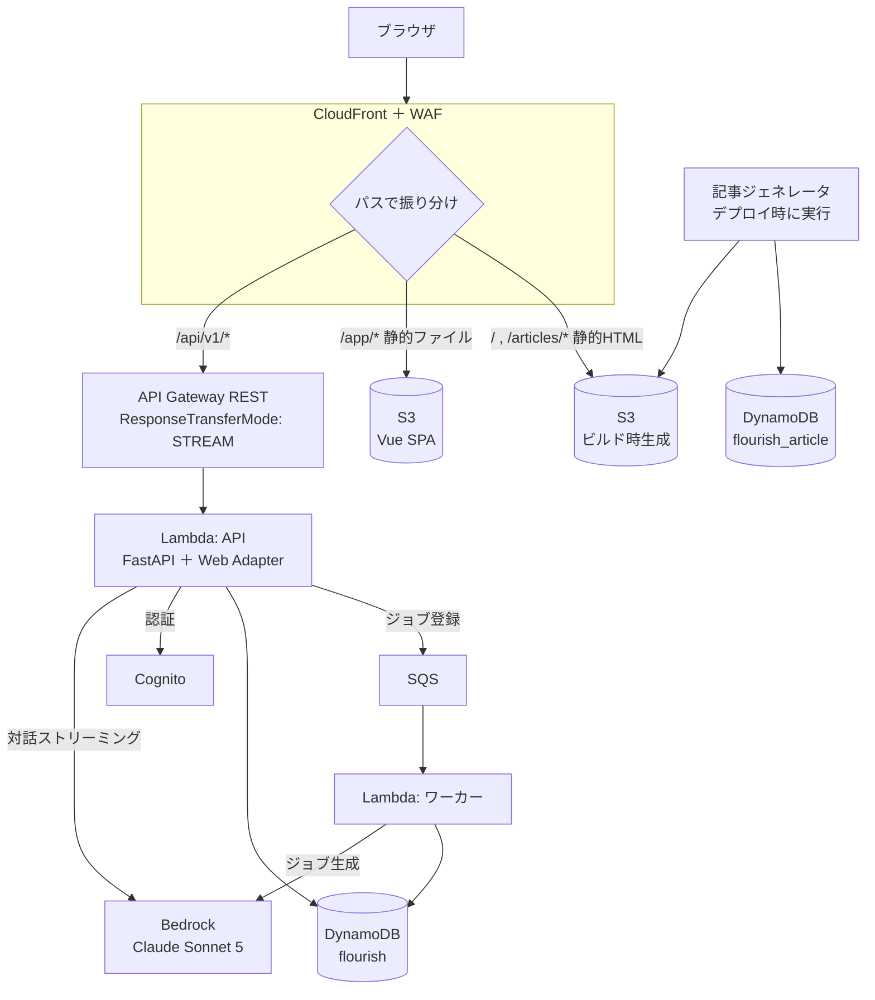
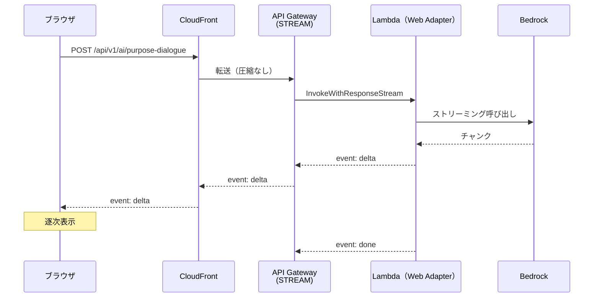
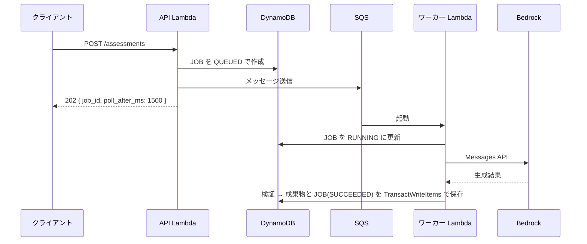
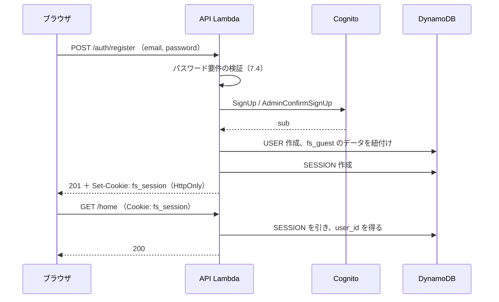

# Flourish Studio MVP 技術構成

> Version 0.3
> 最終更新：2026-08-08
> `09_API設計/api-design.md` と `10_AIプロンプト設計/ai-prompt-design.md` を、AWS上の実装構成に落とした文書。
> 画面は `04_画面設計/screen-list.md`、エンティティは `08_データモデル/logical-data-model.md` を参照。
>
> **0.3の変更点**
> - **データベースを Aurora PostgreSQL から DynamoDB に変更した**（`adr-001-database-selection.md`）。6章を全面的に書き換え
> - **VPCを廃止した。** NATインスタンス、接続数管理、DB再開待ちが同時に消えた（5.3・9.1・10.1）
> - 固定費が約$36から**約$13**になった（12章）。リスクが2件消えた（14章）
>
> **0.2の変更点**
> - API Gateway REST API がレスポンスストリーミングに対応したため、5章を全面的に書き換えた
> - AIモデルを Sonnet 5 に変更し、Bedrock での提供状況を実地に確認した（8章）。**東京リージョンにデータを留められないことが判明**

---

## 1. 前提と方針

### 1.1 与えられた前提

| 項目 | 決定 |
|---|---|
| アプリ形式 | SPA |
| フロントエンド | Vue |
| バックエンド | FastAPI（Python） |
| コンピュート | AWS Lambda |
| データベース | ~~PostgreSQL~~ → **DynamoDB**（0.3で変更。ADR-001） |
| 生成AI | Amazon Bedrock（バックエンド経由でのみ呼ぶ） |
| 認証 | Amazon Cognito |
| ホスティング | S3 + CloudFront |
| IaC | AWS CDK |
| **モデル** | **Claude Sonnet 5** |
| **コスト** | **抑える** |

### 1.2 この構成を採る判断

| 論点 | 決定 | 理由 |
|---|---|---|
| サーバレス中心 | **採用** | MVPは利用量が読めない。常時起動のコンピュートを置くと、ユーザー0人でも固定費が出る |
| アプリのリージョン | **`ap-northeast-1`（東京）** | ユーザーに最も近い。DBもここに置く |
| **AI推論のリージョン** | **東京に留められない（8.4）。要判断** | Sonnet 5 は東京での In-Region 推論に非対応。**プライバシーポリシーに直結する** |
| 公開サイトとアプリを分ける | **採用** | LPと記事は集客が目的でSEOが要る。SPAでは成立しない（4章） |
| 記事は静的生成する | 採用 | 実行時のレンダリングを不要にし、SEOとレイテンシを両立させる（4.4） |
| **VPCを置かない** | **0.3で変更** | DynamoDBはVPCを必要としない。NAT・接続数管理・DB再開待ちが同時に消える（9.1） |

### 1.3 前提と既存設計の不整合

| # | 不整合 | 状況 |
|---|---|---|
| 1 | **Cognitoの標準SPAフローはブラウザにトークンを持つ。** API設計2.1は「HttpOnly Cookieで統一。クライアントはIDを保持しない」 | **解決。** Cognitoをユーザーディレクトリとして使う（7章） |
| 2 | ~~API Gateway はレスポンスをストリーミングできない~~ | **解消。** 2025年11月19日に REST API が対応した（5.4） |
| 3 | **Structured Outputs が Bedrock で使えない可能性がある** | **未解決。** AIプロンプト設計3.3で代替案まで用意済み。実機検証が要る（8.3） |
| 4 | **Sonnet 5 の推論を日本国内に留められない** | **未解決。判断が要る**（8.4） |

---

## 2. 全体構成



**VPCがない。** すべてのコンポーネントがAWSのマネージドAPIとして呼び合う。

### 2.1 コンピュートを2つに分ける

| Lambda | 役割 | 分ける理由 |
|---|---|---|
| **API** | `/api/v1/*`。ユーザー操作への応答と、対話のストリーミング | レイテンシ要件が厳しい |
| **ワーカー** | 非同期ジョブのAI生成 | 実行時間が長い。タイムアウトと同時実行の設定がAPIと真逆 |

**Version 0.1 にあった「公開サイト Lambda」は廃止した。** 記事とLPを静的生成に変えたため、実行時にHTMLを組み立てる必要がなくなった（4.4）。

1つのLambdaに詰めない理由は変わらない。**AI生成の長時間実行がAPIの同時実行枠を食い潰すと、生成が集中したときにホーム画面が開かなくなる。**

---

## 3. フロントエンド

### 3.1 構成

| 項目 | 決定 |
|---|---|
| フレームワーク | Vue 3（Composition API） |
| ビルド | Vite |
| ルーター | Vue Router（history モード） |
| 状態管理 | Pinia |
| 型 | TypeScript |
| CSS | CSS変数によるトークン定義（デザイン原則2.2をそのまま実装） |

**UIコンポーネントライブラリを入れない。** デザイン原則が色・角丸・タップ領域・アイコンまで指定しており、既製ライブラリの上書きコストが自作を上回る。画面数もMVPで約25画面と少ない。

### 3.2 入力途中を保持する仕組み

API設計1.1の「入力途中を送らない」を、フロント側で実装する。

| 対象 | 保持場所 |
|---|---|
| S-12 選択式24問 / S-14 自由記述8問と問い文 | Pinia（メモリ） |
| S-31〜S-34 / S-51〜S-55 の回答・対話履歴 | Pinia |

**`sessionStorage` / `localStorage` に書かない。** user-flow 2章は「復帰導線を作らない」と決めており、タブを閉じたら破棄されるのが仕様どおりの挙動である。永続化すると、中途半端に復帰できる状態が生まれて仕様と食い違う。

**リロードでも消える**点は user-flow 7.2 の既知の割り切りと同じ扱いとする。

### 3.3 ダークモード

`theme_preference` はアカウントに保存する。未ログイン時（S-01〜S-16）はOS設定に追従のみとし、トグルを出さない（デザイン原則3.2）。

初回描画のちらつきを避けるため、`index.html` のインラインスクリプトで `prefers-color-scheme` を読み、`<html>` に属性を付けてからVueを起動する。

### 3.4 SPAとしての制約

| 画面 | 形式 |
|---|---|
| S-01 トップページ / K-01・K-02 記事 | **静的HTML**（4.4） |
| S-02〜S-63 | SPA |

トップページの「現在地レポートを試す」で `/app/` へフルページ遷移する。**ここだけページ遷移が挟まる**が、集客面のSEOと引き換えである。

---

## 4. 配信とルーティング

### 4.1 CloudFront のビヘイビア

| パス | オリジン | キャッシュ | Cookie転送 |
|---|---|---|---|
| `/api/v1/*` | API Gateway | **しない** | **する** |
| `/app/*` | S3（SPA） | する（ハッシュ付きは長期） | しない |
| `/` `/articles/*` | S3（静的HTML） | する（TTL 1時間） | しない |
| `/assets/*` | S3 | する（長期） | しない |

**同一ドメイン構成のため CORS は不要**（API設計8章）。Cookieの `SameSite=Lax` もそのまま成立する。

### 4.2 SPAのルーティング

`/app/*` でS3に該当ファイルがない場合、CloudFront Function で `index.html` へ書き換える。

**S3のエラードキュメント設定は使わない。** 404ステータスが返り、SPAのルーティングとステータスコードが食い違う。

### 4.3 ストリーミングとキャッシュ

`/api/v1/*` のビヘイビアでは以下を守る。

| 設定 | 値 | 理由 |
|---|---|---|
| キャッシュポリシー | `CachingDisabled` | 認証済みレスポンスをキャッシュさせない |
| オリジンリクエストポリシー | `AllViewer` | Cookie・ヘッダをすべて転送する |
| **圧縮** | **無効** | 圧縮を挟むとバッファされ、SSEの逐次配信が壊れる可能性がある |

**圧縮の無効化は要検証項目に含める**（14章）。有効のままでも動く可能性はあるが、確認せずに本番へ持ち込まない。

### 4.4 公開サイトは静的生成する（0.2で変更）

Version 0.1 では、記事とLPをLambdaで実行時にレンダリングしていた。**0.2ではビルド時に静的HTMLを生成し、S3へ置く。**

| 項目 | 内容 |
|---|---|
| 真実の源 | **`ARTICLE` テーブル**（データモデル6章の決定を維持する） |
| 生成 | デプロイ時／記事公開時にジェネレータを実行し、DBを読んでHTMLを出力 |
| 配置 | S3。CloudFrontがTTL 1時間で配信 |
| 公開反映 | ジェネレータ実行 → S3同期 → CloudFront invalidation |

**この変更で3つ得られる。**

| 得られるもの | 内容 |
|---|---|
| Lambdaが1つ減る | 実行時のHTML生成が不要になる |
| **DBが公開経路から外れる** | 公開サイトの表示がDBの状態に一切依存しなくなる |
| SEOとレイテンシ | S3からの配信になり、実行時レンダリングより速く安定する |

**引き換えは、記事公開に手作業が1手増えること。** MVPでは管理画面を作らず記事を直接投入する運用（データモデル6章）であり、投入とジェネレータ実行を同じ手順にまとめれば実質的な負担は変わらない。

`ARTICLE` テーブルを残すのは、将来のMap連動レコメンド（定義書12.2）でDB検索が要るためである。**静的生成は出力の形を変えるだけで、データの持ち方は変えない。**

### 4.5 WAF

| ルール | 目的 |
|---|---|
| AWS Managed Rules（Common） | 一般的な攻撃 |
| レート制限（IP単位、5分で1,000リクエスト） | 粗い防御 |
| `/api/v1/auth/*` に厳しめのレート制限 | 総当たり |

**AI生成のレート制限（API設計2.4）はWAFで実装しない。** ゲスト3回・登録済み30回/時間はユーザー単位の業務ルールであり、アプリケーション層で行う（6.5）。

---

## 5. バックエンド

### 5.1 実行形態

**AWS Lambda Web Adapter を使い、コンテナイメージでデプロイする。**

| 選択肢 | 判断 |
|---|---|
| Mangum（ASGI→Lambdaイベント変換） | **不採用。** レスポンスストリーミングに対応できない |
| **Lambda Web Adapter** | **採用。** uvicornをそのまま動かす。`RESPONSE_STREAM` に対応する |
| Fargate / App Runner | 不採用。MVPで常時課金を負いたくない |

```dockerfile
FROM public.ecr.aws/awsguru/aws-lambda-adapter:0.9.1 AS adapter
FROM python:3.12-slim
COPY --from=adapter /lambda-adapter /opt/extensions/lambda-adapter
ENV AWS_LWA_INVOKE_MODE=response_stream
ENV PORT=8080
COPY . /app
WORKDIR /app
RUN pip install -r requirements.txt
CMD ["uvicorn", "main:app", "--host", "0.0.0.0", "--port", "8080"]
```

**ローカル開発と本番で同じ起動方法になる**のも利点である。

### 5.2 API Gateway REST API を使う

**Version 0.1 では「API Gateway はストリーミングできない」として Lambda Function URL を採っていた。この前提は誤りだった。**

2025年11月19日、Amazon API Gateway は **REST API のレスポンスストリーミングに対応した。** これにより次が可能になっている。

| 得られるもの | 内容 |
|---|---|
| レスポンスストリーミング | メソッドに `ResponseTransferMode: STREAM` を設定する |
| **統合タイムアウトの延長** | **最大15分**（従来は29秒） |
| 10MB超のペイロード | 本設計では使わない |

Function URL + Origin Access Control ではなく API Gateway を採る理由：

| 理由 | 内容 |
|---|---|
| スロットリングが標準で備わる | ステージ単位・メソッド単位の制限を設定できる |
| WAFとの統合が素直 | Function URL より構成が単純になる |
| アクセスログ | CloudWatch へ標準で出せる |
| コスト差が小さい | $3.50 / 100万リクエスト。MVP規模では月1ドル未満 |

#### CDKでの設定

**P0-3で実機検証済み。** `ResponseTransferMode` は `Method` 直下ではなく **`Method.Integration` 配下**のプロパティ。また、統合URIも通常のLambdaプロキシ統合（`/2015-03-31/functions/{arn}/invocations`）ではなく、**`InvokeWithResponseStream` 専用の `/2021-11-15/functions/{arn}/response-streaming-invocations`** に変える必要がある。あわせて、API Gatewayが `lambda:InvokeWithResponseStream` でLambdaを呼べるよう、`lambda:InvokeFunction` とは別に権限を追加する。

```typescript
const method = resource.addMethod("POST", integration);
const cfnMethod = method.node.defaultChild as apigateway.CfnMethod;
cfnMethod.addPropertyOverride("Integration.ResponseTransferMode", "STREAM");
cfnMethod.addPropertyOverride(
  "Integration.Uri",
  `arn:aws:apigateway:${region}:lambda:path/2021-11-15/functions/${fn.functionArn}/response-streaming-invocations`,
);

fn.addPermission("ApiGatewayInvokeWithResponseStream", {
  principal: new iam.ServicePrincipal("apigateway.amazonaws.com"),
  action: "lambda:InvokeWithResponseStream",
  sourceArn: api.arnForExecuteApi(),
});
```

CDKのL2コンストラクトが未対応のため、**エスケープハッチで直接指定する。** また、**メソッドの設定変更はデプロイを作り直さないと反映されない**点に注意する。

参照: [Set up a Lambda proxy integration with payload response streaming in API Gateway](https://docs.aws.amazon.com/apigateway/latest/developerguide/response-transfer-mode-lambda.html)

### 5.3 Lambda の設定

| Lambda | メモリ | タイムアウト | 予約同時実行 | 備考 |
|---|---|---|---|---|
| API | 1,024 MB | 120秒 | **なし** | **非VPC** |
| ワーカー | 1,769 MB | 300秒 | **5** | **非VPC** |

**ワーカーだけ予約同時実行を設定する。** 理由は**Bedrockのスロットリング対策**である。ワーカーを絞り、SQSで待たせる。失敗させるよりよい。

Version 0.2 では「DBの接続数の上限」も理由に挙げてAPI側も20に絞っていたが、**DynamoDBに接続の概念がないため不要になった。** APIの同時実行を自由に増やせる。

**プロビジョニング済み同時実行は設定しない。** 非VPCになりENI割り当てが消えたため、コールドスタートは1秒程度に収まる見込みである。

### 5.4 ストリーミング

API設計3.2のSSEを、API Gateway のストリーミング対応で実装する。



**Python + FastAPI + Lambda Web Adapter での動作事例が公開されている。** Version 0.1 で最大リスクとしていた項目は、**リスクとしては大きく下がった。**

残る確認事項：

| # | 条件 | 状況 |
|---|---|---|
| 1 | Lambda Web Adapter の `response_stream` が API Gateway 統合で動く | **P0-3で検証済み。** ただしCDKの設定方法に誤りがあった（5.2参照）。修正後は正常に動作 |
| 2 | CloudFront が素通しする（4.3の圧縮設定を含む） | **P0-3で検証済み。** 圧縮ON/OFF両方でブラウザに逐次表示されることを確認 |
| 3 | Bedrock の Sonnet 5 がストリーミングに対応 | 対応を確認済み。**ただしこのAWSアカウントでのモデルアクセス（利用目的申請）は承認待ち。** P0-3の疎通検証は `claude-haiku-4-5` で代替した。Sonnet 5自体での疎通は承認後に別途確認する |

**API設計3.2を変更する必要はない。** 検証は完了した。

### 5.5 非同期ジョブ

API設計3.1のジョブ方式を、SQS + ワーカーLambdaで実装する。



| 項目 | 決定 |
|---|---|
| ジョブの状態 | **DynamoDB の `JOB#<id>` アイテム**（データモデル8.1）。TTLで7日後に自動削除 |
| キュー | SQS 標準キュー |
| 可視性タイムアウト | 330秒 |
| **SQSのリトライ** | **`maxReceiveCount = 1`。失敗したらDLQへ送り、再試行しない** |
| DLQ | 保持14日。アラーム対象 |

**SQSの自動リトライを切る。** user-flow 4章は「自動リトライせず、ユーザーが押したときに新しいジョブを作る」と決めている。SQSに再送させると、ユーザーが1回押しただけで複数回のAI課金が発生する。

ジョブと成果物を同じテーブルに置くのは、**成果物の保存とジョブの完了を同一トランザクションにするため**である。API設計5.3は「成功した時点ではじめて保存される。失敗時は何も残らない」としており、`TransactWriteItems` で1回に収める。

**成果物側は1アイテムの書き込みで済む**（データモデル1.1）。正規化されていた頃は38行の書き込みだったものが、集約を1アイテムにまとめたことで単純になった。

#### 統合タイムアウト15分を使わない理由

API Gateway の制限が15分に延びたため、**非同期ジョブをやめて1リクエストで待たせる**構成も選べるようになった。採らない。

| 理由 | 内容 |
|---|---|
| モバイル回線で切れる | 60秒以上のリクエスト保持は不安定。切れたら生成は課金済みで結果は失われる |
| 画面設計が前提にしている | S-13 / S-15 / S-33 / S-53 / S-62 の生成中画面と再試行導線が既に決まっている |
| 再接続できない | ジョブなら `job_id` で取り直せる |

### 5.6 冪等性

API設計2.5の `Idempotency-Key` を、`IDEM#<owner>#<key>` アイテムで実装する（データモデル8.2）。

```text
PutItem  PK = IDEM#<owner>#<key>
         ConditionExpression: attribute_not_exists(PK)
```

**条件付き書き込みの失敗が、そのまま冪等性の判定になる。** 失敗したら既存の `job_id` を返す。先に読んでから書くと、同時リクエストで二重生成が起きる。

TTLで24時間後に自動削除される。**削除ジョブを書かない。**

### 5.7 FastAPI の構成

```text
app/
  main.py                 起動、ミドルウェア
  api/v1/                 ルーター（API設計4章の一覧と1対1）
  core/                   設定、Cookie検証、レート制限、エラー形式
  domain/                 業務ルール（件数検証、スコア集計、段階判定）
  ai/
    client.py             Bedrockクライアント
    prompts/              プロンプト定義（バージョン付き）
    schemas/              出力JSON Schema
    validators.py         生成物の検証と再生成判断
  db/                     SQLAlchemy モデルとリポジトリ
tools/
  generate_site.py        記事・LPの静的生成（4.4）
```

**プロンプトはコード内の定数として持つ。** AIプロンプト設計3.9のバージョン管理は、質問文（データモデル1.1）と同じ方式であり、DBに置かない。

---

## 6. データベース

**設計の詳細は `08_データモデル/logical-data-model.md`（Version 0.3）にある。** 本章はインフラ側の設定に絞る。

選定の経緯と PostgreSQL との比較は `adr-001-database-selection.md` を参照。

### 6.1 構成

| 項目 | 決定 |
|---|---|
| サービス | **DynamoDB** |
| テーブル | `flourish`（ユーザーデータ）／ `flourish_article`（記事） |
| キャパシティ | **オンデマンド** |
| GSI | 主テーブルは**なし**。記事のみ `category-index` |
| バックアップ | **PITR（継続的バックアップ）を有効化** |
| 暗号化 | 保管時暗号化（AWS所有キー） |
| 削除保護 | **有効** |

**オンデマンドを選ぶ。** MVPは利用量が読めず、プロビジョンドで見積もりを外すと、過剰なら無駄になり過少ならスロットリングする。オンデマンドは使った分だけで、この規模なら月$1に収まる（12.1）。

### 6.2 VPCが不要になる

**DynamoDBはIAM認証のAPIとして呼ぶため、VPC内に置く必要がない。** その結果、Lambdaも非VPCで動かせるようになった。

| 消えたもの | 効果 |
|---|---|
| NATインスタンス | 月$4の削減。**単一障害点が消えた** |
| `NetworkStack` | CDKのスタックが1つ減った |
| VPC内LambdaのENI割り当て | コールドスタートが短くなる |
| DBの再開待ち（15秒） | 消えた |
| 接続数管理のための予約同時実行 | 不要になった（5.3） |

**コスト以上に、構成が単純になった効果が大きい。**

### 6.3 スキーマの変更

DynamoDBにはマイグレーションツールがない。**構造を変える場合は移行スクリプトを書く。**

| 変更の種類 | 対応 |
|---|---|
| 属性の追加 | **不要。** 読み取り側で欠損を許容する |
| 属性の意味の変更 | **やらない。** 新しい属性名を足す |
| キー設計の変更 | 全アイテムの移行スクリプト。**CDKのデプロイとは分離して手動実行する** |

**属性を消さない。** 論理削除のみという方針（データモデル11.1）の下では古いアイテムが残り続けるため、読み取り側は常に欠損と旧形式を許容する必要がある。この前提をリポジトリ層に集約する。

### 6.4 レート制限

API設計2.4を、DynamoDBの条件付き更新で実装する（データモデル8.3）。

| 対象 | 実装 |
|---|---|
| ゲスト：レポート生成1セッション3回 | `GUEST` アイテムの属性を `ADD` で原子的に加算 |
| 登録済み：生成系1時間30回 | `RATE#<owner>#<window>` を `ADD` ＋ `ConditionExpression` |

**上限判定と加算が1回の書き込みで完了する。** 読んでから書く手順がないため、同時リクエストで上限を超える事故が起きない。TTLで枠が自動失効するため、古いカウンタの掃除も不要になる。

ElastiCacheを入れない。この用途のためだけにデータストアを増やす理由がなくなった。

### 6.5 分析経路

**場当たりのSQLが使えないことへの手当て**（ADR-001 5.1、データモデル12.3）。

| 項目 | 決定 |
|---|---|
| 手段 | PITR から S3 へエクスポート → Athena でSQL |
| 頻度 | 月次。必要に応じて随時 |
| 費用 | エクスポート $0.114/GB。MVP規模では月$1未満 |

**リリース前に一度、この経路を通しておく。** 必要になってから作ると、そのとき欲しいデータが取れない。

---

## 7. 認証

### 7.1 問題

Cognitoの一般的なSPA構成は、ブラウザがトークンを保持し `Authorization` ヘッダで送る。API設計2.1は「クライアントはIDを保持しない」と定めている。**両立しない。**

### 7.2 決定：Cognitoをユーザーディレクトリとして使う（BFF方式）

**Cognitoのトークンをブラウザに渡さない。** バックエンドがCognitoと会話し、ブラウザにはバックエンドが発行する不透明なセッションIDのみをHttpOnly Cookieで渡す。



| 項目 | 決定 |
|---|---|
| Cognitoの役割 | ユーザーの保管、パスワードのハッシュ管理、Google連携 |
| トークンの保管 | **バックエンド。** ブラウザには渡さない |
| セッション | `SESSION` テーブル。不透明なIDをCookieに載せる |
| 有効期限 | 30日、アクセスのたびに延長（API設計8章） |
| Cognito Hosted UI | **使わない。** 画面設計（S-02 / S-21）に自前の画面がある |

### 7.3 ゲストセッション

`fs_guest` は**Cognitoと無関係**である。S-11到達時にバックエンドが `GUEST_SESSION` を作り、不透明なIDをCookieで渡す。未登録ユーザーはCognitoに存在しない。

登録時（S-21）に、`fs_guest` のIDから現在地レポートをアカウントへ紐付け直す。**クライアントからゲストIDを送る必要がない**（API設計5.5）のは、この構成でそのまま満たされる。

### 7.4 パスワード要件

| 要件 | Cognitoの機能 | 対応 |
|---|---|---|
| 8文字以上 | パスワードポリシー | Cognito側 |
| 英字と数字を各1文字以上 | パスワードポリシー | Cognito側 |
| **よく使われるパスワードを拒否** | **機能がない** | **バックエンドで実装する** |

流出パスワードリスト（上位1万件程度）をLambdaに同梱し、Cognitoに渡す前に照合する。通らない場合 `422 WEAK_PASSWORD` を返す。

### 7.5 Google連携

Cognito の Identity Provider として Google を設定し、`GET /auth/google` → Cognitoの認可エンドポイント → `GET /auth/google/callback` の流れとする。**コールバックはバックエンドが受け、トークンを交換して `SESSION` を発行する。** トークンをブラウザに返さない点はメール認証と同じ。

### 7.6 退会と論理削除

| 対象 | 扱い |
|---|---|
| `USER.deleted_at` | 値を入れる |
| **Cognitoのユーザー** | **削除せず、`AdminDisableUser` で無効化する** |

**Cognitoのユーザーを削除すると、同じメールアドレスで再登録できてしまう。** 論理削除したはずのデータと新しいアカウントの関係が曖昧になる。

---

## 8. AI（Bedrock）

### 8.1 モデル

| 用途 | モデルID |
|---|---|
| 主要な生成（8種） | `anthropic.claude-sonnet-5` |
| セーフティ判定（P-09） | `anthropic.claude-haiku-4-5` |

Claude Sonnet 5 は Bedrock で 2026年6月30日に提供開始。コンテキスト1M、最大出力128K、**思考は常時有効で無効化できない**（`effort` のみ設定可）。

### 8.2 エンドポイントとクライアント

Bedrock には2つのエンドポイントがあり、**どちらを使うかで実装が変わる。**

| エンドポイント | API形状 | 判断 |
|---|---|---|
| `bedrock-runtime` | Converse / Invoke（AWS独自形状） | 地域別・グローバルの推論プロファイルが使える |
| **`bedrock-mantle`** | **Anthropic の Messages API と同形** | **AIプロンプト設計をそのまま実装できる。ただし In-Region のみ** |

**`bedrock-mantle` を採る。** AIプロンプト設計の全リクエスト形状（`system` の配列、`cache_control`、`output_config`）がそのまま通り、第一者APIへ戻す場合もクライアント生成行だけの変更で済む。

```python
from anthropic import AnthropicBedrockMantle

client = AnthropicBedrockMantle(aws_region="us-east-1")   # 8.4を参照

response = client.messages.create(
    model="anthropic.claude-sonnet-5",
    max_tokens=12000,
    output_config={"effort": "medium"},
    system=[
        {"type": "text", "text": COMMON_BLOCK},
        {"type": "text", "text": REPORT_BLOCK, "cache_control": {"type": "ephemeral"}},
    ],
    messages=[{"role": "user", "content": user_payload}],
)
```

**IAMロールで認証でき、APIキーの管理が不要**である点も `boto3` 直叩きと同じ利点として残る。

### 8.3 Bedrockで使える機能・使えない機能

AIプロンプト設計が要求する機能を、Sonnet 5 のモデルカードと突き合わせた結果。

| 機能 | `bedrock-mantle` | 影響 |
|---|---|---|
| ストリーミング | ○ | 5.4が成立する |
| `effort` | ○ | AIプロンプト設計2.2がそのまま使える |
| プロンプトキャッシュ | ○（**最小4,096トークン**） | **AIプロンプト設計3.5を修正済み。効かない生成が出る前提で試算する** |
| トークン計数 | ○ | コスト実測に使える |
| **Structured Outputs** | **×と記載** | **AIプロンプト設計3.3の案Cへ切り替える可能性がある。要検証** |
| Guardrails | × | 使わない（セーフティは自前のP-09で行う） |
| Batches / Files API | × | 使っていない |

**Structured Outputs が本当に使えないかは、実機で確認する。** モデルカードの「非対応」がBedrock独自機能を指しているのか、Anthropic の `output_config.format` の透過も含むのかが、記載からは判別できない。

使えない場合の代替（プロンプトでJSONを指示し、サーバ側で厳格に検証する）は**AIプロンプト設計3.3に用意済み**であり、設計は破綻しない。ただし再生成率が上がる。

### 8.4 リージョンとデータの所在（判断が必要）

**Claude Sonnet 5 の東京リージョンでの提供状況を確認した結果、In-Region 推論・APAC地域推論のいずれにも対応していない。** 東京から使えるのはグローバル推論のみで、これは**世界中のどこへでもルーティングされ、データ所在の制約がない。**

| リージョン | In-Region | 地域（Geo） | グローバル |
|---|---|---|---|
| ap-northeast-1（東京） | ✕ | ✕ | ○ |
| ap-northeast-3（大阪） | ✕ | ✕ | ○ |
| us-east-1（バージニア） | **○** | ○（US） | ○ |
| eu-west-1 / eu-north-1 | ○ | ○（EU） | ○ |
| ap-southeast-4（メルボルン） | ○ | ○（AU） | ○ |

Sonnet 5 の地域推論プロファイルは **US / EU / AU の3つのみで、日本を含むAPACのプロファイルが存在しない。**

#### 選択肢

| 案 | 構成 | データの所在 | 判断 |
|---|---|---|---|
| **A** | **`bedrock-mantle` を us-east-1 で使う** | **米国内** | **推奨。** 所在が単一国に定まり、ポリシーに書ける |
| B | `bedrock-runtime` ＋ `global.anthropic.claude-sonnet-5` を東京から | **世界中（不定）** | 「どこで処理されるか特定できない」と書くことになる |
| C | **Claude Sonnet 4.6 に下げ、日本の推論プロファイルを使う** | **日本国内** | **国内処理が要件なら、これしかない** |

**推奨は案A。** 「AI処理は米国のAWSリージョンで行う」と明記でき、ユーザーへの説明が成立する。案Bは所在を特定できず、内面の記録を扱うサービスの説明として弱い。

**ただし、国内処理が必須要件であれば案Cを採る。** その場合モデルが一世代下がり、AIプロンプト設計の評価をやり直すことになる。

**この判断はプライバシーポリシー（定義書19章 #1）と一体であり、技術だけでは決められない。** 14章の未決 #1 とする。

#### 案Aを採った場合の構成

| 項目 | リージョン |
|---|---|
| アプリ（Lambda / DynamoDB / S3 / CloudFront / Cognito） | ap-northeast-1 |
| **Bedrock のみ** | **us-east-1** |

**ユーザーデータの保管はすべて東京に留まり、AI推論のときだけ本文が米国へ送られる。** 送信するのは生成に必要な入力（自由記述・対話履歴・確定済みの成果物）に限る。

### 8.5 IAM

ワーカーとAPIのロールに、**呼ぶモデルのARNだけを許可する。**

```jsonc
{
  "Effect": "Allow",
  "Action": ["bedrock:InvokeModel", "bedrock:InvokeModelWithResponseStream"],
  "Resource": [
    "arn:aws:bedrock:us-east-1::foundation-model/anthropic.claude-sonnet-5",
    "arn:aws:bedrock:us-east-1::foundation-model/anthropic.claude-haiku-4-5"
  ]
}
```

`Resource: "*"` にしない。**モデルを絞ることで、意図しないモデルが呼ばれてコストが跳ねる事故を防ぐ。**

### 8.6 生成の記録

生成のたびに、**EMF（埋め込みメトリクス形式）で CloudWatch に構造化ログを出す**（データモデル7章）。DBには置かない。

| 記録するもの | 用途 |
|---|---|
| `kind` / `model` / `prompt_version` / `effort` | どの設定で生成したか |
| `prompt_tokens` / `completion_tokens` / `cache_read_tokens` | コスト実測とキャッシュ監視 |
| `status` / `error_message` / `attempt` / `retry_reason` | 失敗率の監視 |
| `safety_flag` | セーフティ判定の発生率 |

**プロンプトの入出力本文は保存しない。** 対話の本文は `AI_MESSAGE`、成果物は各テーブルに既に保存されている。

---

## 9. ネットワークとセキュリティ

### 9.1 VPCを置かない

**0.3でVPCを廃止した。** Lambdaが接続する必要のあるものは、すべてIAM認証のマネージドAPIになっている。

| 接続先 | 経路 |
|---|---|
| DynamoDB | AWS API（IAM） |
| Bedrock（us-east-1） | AWS API（IAM） |
| SQS / Secrets Manager / CloudWatch | AWS API（IAM） |
| Cognito | AWS API |
| Google OAuth | HTTPS |

VPCを置かないことで、**NAT（月$4かつ単一障害点）、VPCエンドポイント、ENI割り当てによるコールドスタートの増加**が同時に消える。

#### VPCがなくて安全か

| 懸念 | 回答 |
|---|---|
| DBがインターネットに露出しないか | **しない。** DynamoDBに接続エンドポイントの概念がなく、IAMで認可される。Lambdaの実行ロール以外からは呼べない |
| Lambdaへの侵入経路 | インバウンドは存在しない。API Gatewayからの起動のみ |
| 通信の暗号化 | すべてTLS |

**「VPCに入れる」ことがセキュリティの本体ではない。** RDSを使う場合はネットワーク層でしか守れないためVPCが要るが、DynamoDBはIAMで守る。守り方が変わっただけで、緩んでいない。

より厳密な統制が必要になった場合は、後からVPC＋Gatewayエンドポイント（無料）へ移せる。**MVPの段階では、消えるリスク（NATの単一障害点）のほうが大きい。**

### 9.2 シークレット

| 対象 | 保管 |
|---|---|
| Cognito / Google のクライアントシークレット | Secrets Manager |
| セッションCookieの署名鍵 | Secrets Manager |
| **DB認証情報** | **不要になった。** DynamoDBはIAMロールで認可される |
| **Bedrock** | **不要。** IAMロールで完結 |

**管理するシークレットが3つから2つに減った。** DB接続文字列という、最も漏れると影響が大きい種類のものが消えている。

### 9.3 Cookie

| Cookie | 属性 |
|---|---|
| `fs_guest` / `fs_session` | `HttpOnly` `Secure` `SameSite=Lax` `Path=/` `Max-Age=2592000` |

値は不透明なランダム文字列（128ビット以上）とし、**中にユーザーIDやゲストIDを含めない。** サーバ側で引く。

### 9.4 ログに書かないもの

内面の記録を扱うため、通常より厳しく決める。

| 書かない | 理由 |
|---|---|
| 自由記述の本文 / 対話の発言内容 | ユーザーの内面そのもの |
| ありたい姿・理想状態・目標の文言 | 同上 |
| メールアドレス | 個人特定情報 |
| Cookieの値 | セッション奪取につながる |

**ログには識別子と数値のみを書く。** 障害調査で本文が必要になった場合はDBを直接見る（アクセス記録が残る経路）。

CloudWatch Logs の保持期間は**30日**とする（0.1では90日。コスト削減）。

---

## 10. IaC（CDK）

### 10.1 スタック分割

| スタック | 内容 | 変更頻度 |
|---|---|---|
| `DataStack` | DynamoDB 2テーブル、Secrets Manager | 低 |
| `AuthStack` | Cognito User Pool、Identity Provider | 低 |
| `AppStack` | Lambda（2種）、API Gateway、SQS、DLQ、IAM | **高** |
| `EdgeStack` | S3、CloudFront、WAF、証明書 | 中 |

**`NetworkStack` は0.3で廃止した**（9.1）。

**変更頻度で分ける。** `AppStack` は日常的に更新されるが、`DataStack` の更新にはテーブル再作成のリスクが伴う。

### 10.2 環境

| 環境 | 用途 |
|---|---|
| `dev` | 開発 |
| `prod` | 本番 |

**ステージング環境をMVPでは作らない。** リリース前の検証は `dev` で行う。

### 10.3 削除保護

| リソース | 設定 |
|---|---|
| DynamoDB テーブル（2種） | `deletionProtection: true`、`removalPolicy: RETAIN`、`pointInTimeRecovery: true` |
| Cognito User Pool | `removalPolicy: RETAIN` |

**論理削除のみという方針の下では、スタック削除でDBが消えることが最悪の事故になる。** DynamoDBはCDKの既定で `removalPolicy` が `DESTROY` になる場合があるため、必ず明示する。

### 10.4 注意点

| 項目 | 内容 |
|---|---|
| CloudFront関連 | WAF（CLOUDFRONTスコープ）とACM証明書は `us-east-1` に置く |
| ストリーミング設定 | `ResponseTransferMode` はエスケープハッチで指定し、**デプロイを作り直す**（5.2） |

---

## 11. 監視と運用

### 11.1 アラーム

| 指標 | しきい値 | 意味 |
|---|---|---|
| SQS DLQ のメッセージ数 | 1件以上 | AI生成が失敗している |
| ワーカーLambdaのエラー率 | 5分で10% | 同上 |
| API Lambdaの p95 レイテンシ | 3秒 | 体験の劣化 |
| **DynamoDB のスロットリング** | 1件以上 | オンデマンドでも急増時に起こりうる |
| DynamoDB のシステムエラー | 1件以上 | − |
| Bedrock のスロットリング | 1件以上 | 同時実行の設定見直し |
| **AIの日次コスト** | **予算比 150%** | **暴走的な生成の検知** |

**AIコストのアラームを最初から入れる。** 生成系のバグは、気づくのが遅れると請求で初めて分かる。

### 11.2 ダッシュボード

AIプロンプト設計6.3の監視項目を、**EMF（埋め込みメトリクス形式）で出した構造化ログ**から集計する（データモデル7章）。DBには置かない。

- `kind` ごとの失敗率・再生成率
- `safety_flag` の発生率
- **`cache_read_tokens` が0の割合**（最小4,096トークンに届いているかの実測）
- `kind` ごとの平均出力トークン（思考トークンの実測）

### 11.3 トレース

AWS X-Ray を有効にする。**AI生成は数十秒かかるため、どこで時間を使っているかが分からないとチューニングできない。**

---

## 12. コスト概算

### 12.1 固定費（月額）

| 項目 | 0.1 | 0.2 | **0.3** | 変更点 |
|---|---|---|---|---|
| データベース | $90 | $20 | **約 $1** | DynamoDB オンデマンド（6.1） |
| NAT | $40 | $4 | **$0** | **VPC廃止**（9.1） |
| RDS Proxy | $15 | $0 | $0 | |
| VPCエンドポイント | $30 | $0 | $0 | |
| API Gateway | − | $1 | 約 $1 | |
| CloudFront / S3 / Route 53 | $5 | $5 | 約 $5 | |
| Secrets Manager / CloudWatch | $10 | $6 | 約 $6 | |
| **合計** | **約 $190** | **約 $36** | **約 $13** | **0.1比で約93%の削減** |

**DynamoDBの$1には、書き込み・読み取り・ストレージ・PITRのすべてが含まれる。** 最大の読み取り要因は生成中画面のポーリング（1ジョブあたり約40回）だが、この規模では誤差である（ADR-001 4.2）。

**利用が0でも1でも、DB費用はほぼ変わらない。** 従量課金が実際に0から始まる。

#### 削減の引き換え

| 削減 | 引き換え |
|---|---|
| DynamoDB | **場当たりのSQLを失う**（6.5でS3エクスポート＋Athenaに置き換え） |
| DynamoDB | スキーマ変更に移行スクリプトが要る（6.3） |
| DynamoDB | 制約の担保がアプリに移る（データモデル12.4） |
| VPC廃止 | ネットワーク層での隔離がなくなる（9.1で評価済み） |

**0.2にあった「AZ障害」「DB再開15秒」「NATの単一障害点」は、いずれも消えた。** 引き換えの性質が、可用性のリスクから開発の手間へ移っている。

### 12.1.1 0.2から消えた制約

| 0.2の制約 | 0.3 |
|---|---|
| Aurora 単一AZ → AZ障害で停止 | **DynamoDBは複数AZに自動複製される** |
| 最小0 ACU → 初回15秒 | **消えた** |
| RDS Proxy 廃止 → 同時実行を増やせない | **消えた**（5.3） |
| NATインスタンス → 単一障害点 | **消えた**（9.1） |

**コスト削減と可用性の改善が同時に起きている。** これはDynamoDBがマネージドで冗長化されているためで、Auroraで同じ可用性を得ようとすればMulti-AZで月$45以上になる。

### 12.2 変動費（AI）

AIプロンプト設計7章の試算（**Sonnet 5・`effort` 引き下げ後**）。

| 単位 | 0.1（Opus 5） | **0.2（Sonnet 5）** |
|---|---|---|
| オンボーディング1回 | $0.41 | **約 $0.19** |
| Weekly Reflection 1回 | $0.075 | **約 $0.032** |

| 前提 | 月額 |
|---|---|
| 新規100人 × $0.19 | $19 |
| 継続100人 × 週1回 × 4週 × $0.032 | $13 |
| **AI合計** | **約 $32** |

**Bedrockの料金は第一者APIのレートで仮置きしている。** 実装着手時に引き直す（14章）。

### 12.3 合計

| 状態 | 0.1 | 0.2 | **0.3** |
|---|---|---|---|
| ユーザー0人 | $190 | $36 | **約 $13** |
| 新規100人・継続100人 | $260 | $68 | **約 $45** |
| 新規1,000人・継続1,000人 | $900 | $360 | **約 $335** |

**1,000人規模ではAIが全体の約95%を占める。** インフラ側で削れる余地はほぼ尽きており、そこから先はAIプロンプト設計7.4（軽い2種をHaikuへ、`effort` をさらに下げる）が効く領域になる。

---

## 13. 開発環境とCI/CD

### 13.1 ローカル開発

| 項目 | 方法 |
|---|---|
| DB | **DynamoDB Local**（Docker Compose） |
| バックエンド | `uvicorn` を直接起動（本番と同じ起動方法） |
| フロントエンド | `vite dev`、`/api` を localhost へプロキシ |
| Bedrock | **実際に呼ぶ**（開発用のIAMユーザー） |

**DynamoDB Local はトランザクションと条件付き書き込みに対応している**ため、4.4のバージョン更新手順もローカルで検証できる。

**AIをモックしない。** 出力の質がこのプロダクトの中身であり、モックで開発すると品質の問題が結合時まで見えない。ただしコストが出るため、**記録・再生モード**（一度呼んだ結果を保存し、同じ入力なら再生する）を用意し、環境変数で切り替える。

### 13.2 CI/CD

| 段階 | 内容 |
|---|---|
| PR | Lint、型チェック、ユニットテスト |
| main へのマージ | `dev` 環境へ自動デプロイ |
| タグ | `prod` へデプロイ（**手動承認**） |

**本番デプロイに手動承認を挟む。** キー設計を変える移行スクリプト（6.3）が手動実行である以上、デプロイとの順序を人が制御する必要がある。

### 13.3 テスト

| 種類 | 対象 |
|---|---|
| ユニット | 業務ルール（件数検証、スコア集計、段階判定、例外パターン） |
| 統合 | APIエンドポイント（**DynamoDB Local**） |
| **AI出力の評価** | AIプロンプト設計6.1の評価セット10種 |

**制約の担保がアプリに移った分（データモデル12.4）、ユニットテストの比重が上がる。** 件数・スコア範囲・網羅性の検証は、DBが守ってくれない前提でテストを書く。

**AI出力の評価は自動テストにしない。** 生成物の質は人が読んで判断する必要がある。ただし**スキーマ違反と件数不足は自動で検出できる**ため、評価セットを流して形式エラーが出ないことはCIで確認する。

---

## 14. 技術リスク

**着手前に潰すべき順に並べる。**

| # | リスク | 影響 | 対応 |
|---|---|---|---|
| 1 | **Sonnet 5 の推論を日本国内に留められない** | プライバシーポリシーの記述、モデル選定 | **8.4の案A/B/Cから選ぶ。技術だけで決められない** |
| 2 | **Bedrock で Structured Outputs が使えない** | AIプロンプト設計3.3が案Cに切り替わる。再生成率とコストが上がる | 実機で検証（8.3） |
| 3 | **Sonnet 5 で品質が保てない** | モデルを戻すとコスト前提が崩れる | 評価セットで確認（AIプロンプト設計6.1） |
| 4 | Bedrockの料金が想定を超える | 事業性の前提 | 料金表で引き直す（12.2） |
| 5 | ストリーミングがCloudFrontで壊れる | S-32 / S-52 の体験 | 圧縮設定を含めて検証（4.3 / 5.4） |
| 6 | **検証期間中にデータを分析できない** | MVPの学びが減る | **リリース前にS3エクスポート＋Athenaを一度通す**（6.5） |
| 7 | 単一テーブル設計の習熟 | 実装速度、設計の誤り | データモデル0.3に主要な操作を明記済み。リポジトリ層を1箇所に集約する |

**0.2にあったリスク#6（NATの単一障害点）と#7（Aurora再開15秒）は、VPC廃止とDynamoDB採用により消えた。**

### 14.1 検証プロトタイプの範囲

リスク2・5を潰すための最小構成。**本実装に入る前に、これだけを作る。**

```text
CloudFront → API Gateway（STREAM） → Lambda（Web Adapter）
  → Bedrock mantle / anthropic.claude-sonnet-5（us-east-1）
```

確認すること：

1. `output_config.format` によるJSON拘束が通るか（**リスク2**）（P0-4で検証）
2. ストリーミングがCloudFrontを素通しするか（圧縮の有無を両方試す）（**P0-3で検証済み**）
3. 最初のチャンクが届くまでの時間（**P0-3で検証済み**）
4. `system` 4,096トークン前後でキャッシュが効き始めるか（P0-5で検証）

**P0-3の結果（2・3）：** CloudFront → API Gateway（`STREAM`） → Lambda（Web Adapter） → Bedrock の構成で、圧縮ON/OFFの両方でブラウザに逐次表示されることを確認した。初回チャンクまでの時間は約1〜1.2秒（Lambdaがウォーム状態、`claude-haiku-4-5` 使用時）。ただし当初のCDK設定例には誤りがあり、実機で修正が必要だった（5.2参照）。`claude-sonnet-5` 自体でのストリーミングは、このAWSアカウントでのモデルアクセス（利用目的申請）が承認され次第、別途確認する。

**リスク1は技術検証ではなく判断である。** プロトタイプと並行して、プライバシーポリシーの方針とあわせて決める。

---

## 15. 他文書への影響

| 文書 | 追加・変更が必要な箇所 |
|---|---|
| `08_データモデル` | **0.3で反映済み**（DynamoDB単一テーブル設計への全面書き直し） |
| `09_API設計` | 2.1に「Cognitoはユーザーディレクトリとして使い、セッションはバックエンドが発行する」を明記（7.2）。**3.2のSSEは変更不要**（5.4）。**エンドポイントの形はDB変更の影響を受けない** |
| `10_AIプロンプト設計` | **0.2で反映済み**（モデル、`effort`、キャッシュ最小長、出力形式、コスト） |
| `01_全体コンセプト` 19章 | 未決 #1（プライバシーポリシー）に、**AI処理を行う国とデータの越境**を論点として追加（8.4） |

---

## 16. 未決の事項

| # | 項目 | 保留の理由 |
|---|---|---|
| 1 | **AI推論をどこで行うか（案A/B/C）** | 8.4。**プライバシーポリシーと一体の判断。技術だけで決められない。最優先** |
| 2 | **Bedrock で出力形式を拘束できるか** | 8.3。プロトタイプで確認する |
| 3 | **Bedrock の実際の料金** | 12.2。料金表の確認が必要 |
| 4 | **Sonnet 5 で品質が保てるか** | 評価セットの実施後に判断する |
| 5 | **退会後に同じメールアドレスで再登録できるか** | 7.6。プライバシーポリシー策定時に決める |
| ~~6~~ | ~~ドメイン名~~ | **解消（P1-3）。`flourish-st.com` を取得し、Route 53 ホストゾーン（`Z0416565YMZIN1UIDKI5`）とACM証明書（`us-east-1`、apex + `*.flourish-st.com`、ISSUED）を作成済み** |

**0.2の未決だった「Aurora の自動停止をprodでも使うか」は、DynamoDB採用により消滅した。**

MVP範囲全体の未決は定義書19章にある。
