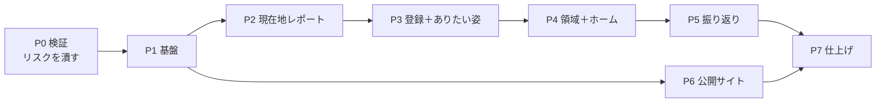

# Flourish Studio MVP バックログ

> Version 0.1
> 最終更新：2026-08-09
> Claude Code での開発を前提としたタスク分解。進め方とスキル設計は `dev-environment.md` を参照。

---

## 1. 読み方

| 記号 | 意味 |
|---|---|
| **CC** | Claude Code が実装する |
| **私** | 人が判断・作成する（AWS操作、外部サービス、コンテンツ、品質判断） |
| **CC＋私** | Claude Code が用意し、人が決める／登録する |

各タスクの `参照` は、**そのタスクで読むべきドキュメントの範囲**である。それ以外を先回りして読ませない。

`依存` が満たされていないタスクは着手できない。

### 見積もりの単位

| 記号 | 目安 |
|---|---|
| **S** | 1セッション（〜1時間） |
| **M** | 1〜2セッション |
| **L** | 3セッション以上。**分割を検討する** |

---

## 2. フェーズの全体像

**P2 の終了時点で、未登録ユーザーが現在地レポートを最後まで体験できる。** ここが最初のデモ可能地点であり、MVPで最も検証価値が高い部分でもある。

P6（公開サイト）は P1 以降いつでも着手できる。**私の作業（記事執筆）が律速になるため早めに始める。**

---

## 3. P0 検証（最優先・約1週間）

**技術構成14章のリスクを潰す。ここを飛ばして本実装に入らない。**

| ID | 担当 | 見積 | タスク | 参照 | 完了条件 |
|---|---|---|---|---|---|
| **P0-1** | **私** | S | AWSアカウント準備、Bedrockでモデルアクセスを有効化（`claude-sonnet-5` / `claude-haiku-4-5`） | `11_技術構成` 8章 | コンソールでモデルが有効。リージョンごとの提供状況を確認済み |
| ~~**P0-2**~~ ✅ | **私** | M | **AI推論をどこで行うか決める（案A/B/C）** | `11_技術構成` 8.4 | 決定を `11_技術構成` 8.4 に追記。プライバシーポリシーの論点に反映 |
| ~~**P0-3**~~ ✅ | CC | M | ストリーミング疎通プロトタイプ（CloudFront → API Gateway `STREAM` → Lambda ＋ Web Adapter → Bedrock） | `11_技術構成` 5.1〜5.4、14.1 | ブラウザで逐次表示される。**圧縮ON/OFF両方で確認** |
| **P0-4** | CC | S | `output_config.format` によるJSON拘束が Bedrock で通るか検証 | `10_AIプロンプト設計` 3.3、`11_技術構成` 8.3 | 通る／通らないの結論。通らなければ案Cのプロンプト雛形を作る |
| **P0-5** | CC | S | プロンプトキャッシュの実効を計測（4,096トークン前後） | `10_AIプロンプト設計` 3.5 | `cache_read_input_tokens` の実測値。共通＋個別ブロックが閾値に届くかの判定 |
| **P0-6** | CC | S | Bedrock の実料金でコスト試算を引き直す | `10_AIプロンプト設計` 7章、`11_技術構成` 12章 | 両ドキュメントの数値を更新 |
| **P0-7** | **私** | S | P0-4 の結果を受けて出力形式の方針を確定 | 同上 | `10_AIプロンプト設計` 未決#1 を解消 |

**成果物はプロトタイプであり、本実装には持ち込まない。** 得るのは結論だけ。

**P0-2完了メモ（2026-08-16）：** AI推論のリージョンを**案B（クロスリージョン推論プロファイル、データ所在は単一国を保証しない）**に決定し、`11_技術構成`8.4に記録した。P2-12/P2-13を進める過程でP7-1（プライバシーポリシー）の依存としてこのタスクの未決に気づき、ユーザーに確認して解消した。

- **推奨だった案A（us-east-1固定）ではなく案Bを採用。** さらに、当初の案Bが前提としていたSonnet 5ではなく、**モデル自体も`jp.anthropic.claude-sonnet-4-6`に変更**した。**AWSのモデルアクセス許可は現行仕様では不要（ユーザー確認）。** モデルは頻繁に更新されるため、`global.anthropic.claude-sonnet-4-6`など別プロファイルへ随時切り替えられる前提で設計した
- `api/app/ai/models.py`：`SONNET`を`jp.anthropic.claude-sonnet-4-6`に変更。定数1箇所の書き換えで切り替えられる構成はP1-14時点から変わっていない
- `api/app/core/config.py`：`bedrock_region`の既定値を`us-east-1`から`ap-northeast-1`（アプリ本体と同じ）に変更。案Aで必要だった「Bedrockのみ別リージョン」という特殊構成が不要になった
- `infra/lib/app-stack.ts`：BedrockのIAM ARNを、リージョンを列挙する方式（`us-east-1`/`us-east-2`/`us-west-2`）から**モデルIDを絞ってリージョンをワイルドカードにする方式**に変更した。**判断の記録：** クロスリージョン推論プロファイルの実際のルーティング先リージョンは非公開かつ変わりうるため、列挙する方式は運用の負債になる。`技術構成`8.5が定める「呼ぶモデルのARNだけを許可する」（意図しないモデルによるコスト事故の防止）という目的は、モデルIDを絞ることで引き続き満たせると判断した
- `infra/test/app-stack.test.ts`：既存のテスト（`Resource: "*"`にしないことの確認）がそのまま通ることを確認。ARNパターン自体を固定した新規テストは追加していない（列挙先のリージョンが非公開のため、固定的な期待値を書くと将来の実際の値と食い違う）
- **`jp.anthropic.claude-sonnet-4-6`というモデルIDの実在・呼び出しリージョンの組み合わせは、CCの知識のカットオフ（2026年1月）より後の情報のためCC側では検証できない。** ユーザーの実機知識に基づく判断として採用した。実際のデプロイ・疎通確認（AWS実機）は別途必要
- `make lint && make test`が通ることを確認済み

**P0-3完了メモ（2026-08-09）：** CloudFront → API Gateway（`STREAM`） → Lambda（Web Adapter） → Bedrock の構成で、圧縮ON/OFF両方でブラウザに逐次表示されることを確認した。検証中に2点判明：
- `11_技術構成` 5.2のCDKコード例に誤りがあった（`ResponseTransferMode` の適用先、統合URI）。5.2を修正済み
- このAWSアカウントでは `claude-sonnet-5` のモデルアクセス（利用目的申請）がまだ承認されておらず、疎通は `claude-haiku-4-5` で代替した。**P0-1は `claude-sonnet-5` について未完了。** 承認され次第、Sonnet 5自体でのストリーミングも確認する（P1-6以降で使う前に）

---

## 4. P1 基盤（約2週間）

| ID | 担当 | 見積 | タスク | 参照 | 完了条件 | 依存 |
|---|---|---|---|---|---|---|
| ~~**P1-1**~~ ✅ | CC | M | リポジトリ雛形。`api/` `web/` `infra/` `tools/` の構成、Makefile、ruff/mypy/eslint/vue-tsc、pre-commit | `11_技術構成` 5.7、13章 | `make lint` が通る | − |
| ~~**P1-2**~~ ✅ | CC | S | GitHub Actions（PR時にlint＋test、mainで dev デプロイ、タグで prod 承認付き） | `11_技術構成` 13.2 | PRでCIが緑 | P1-1 |
| ~~**P1-3**~~ ✅ | **私** | S | ドメイン取得、Route 53 ホストゾーン、ACM証明書（`us-east-1`） | `11_技術構成` 10.4 | 証明書が ISSUED | − |
| ~~**P1-4**~~ ✅ | CC | S | CDK `DataStack`：DynamoDB 2テーブル、TTL、PITR、削除保護 | `08_データモデル` 2章、`11_技術構成` 6.1、10.3 | `cdk deploy` 成功。テーブルが存在 | P1-1 |
| ~~**P1-5**~~ ✅ | **私＋CC** | M | CDK `AuthStack`：Cognito User Pool、パスワードポリシー、Google IdP | `11_技術構成` 7章 | **私**：Google Cloud で OAuth クライアント作成。**CC**：CDK記述 | P1-1 |
| ~~**P1-6**~~ ✅ | CC | M | CDK `AppStack`：Lambda 2種（コンテナ）、API Gateway（`STREAM`）、SQS＋DLQ、IAM | `11_技術構成` 5.2、5.3、5.5、8.5、10.1 | ヘルスチェックが200を返す | P1-4、P0-3 |
| ~~**P1-7**~~ ✅ | CC | M | CDK `EdgeStack`：S3 2種、CloudFront（4ビヘイビア）、WAF、CloudFront Function | `11_技術構成` 4.1〜4.5 | 独自ドメインでSPAが表示される | P1-3、P1-6 |
| ~~**P1-8**~~ ✅ | CC | M | FastAPI 雛形。Lambda Web Adapter コンテナ、設定、ヘルスチェック、ローカル起動 | `11_技術構成` 5.1、5.7、13.1 | `make dev` でローカル起動。本番と同じ起動方法 | P1-1 |
| ~~**P1-9**~~ ✅ | CC | M | **リポジトリ層。** DynamoDBアクセスの基盤、キー生成、トランザクション、条件付き書き込みのヘルパ | スキル `flourish-data`、`08_データモデル` 2章 | DynamoDB Local に対する統合テストが通る | P1-8 |
| ~~**P1-10**~~ ✅ | CC | S | エラー応答の共通形式、例外ハンドラ、`code` の定義 | スキル `flourish-api`、`09_API設計` 2.2〜2.3 | 全ステータスコードのテスト | P1-8 |
| ~~**P1-11**~~ ✅ | CC | M | Cookie とセッションの基盤。`fs_guest` / `fs_session`、ハッシュ化、期限延長の間引き | スキル `flourish-api`、`11_技術構成` 7.2、9.3 | ゲスト発行→登録→ログインの経路がテストで通る | P1-9、P1-5 |
| ~~**P1-12**~~ ✅ | CC | S | 冪等性とレート制限のミドルウェア | スキル `flourish-api` `flourish-data`、`09_API設計` 2.4〜2.5 | 同時リクエストで二重生成しないテスト | P1-9 |
| ~~**P1-13**~~ ✅ | CC | M | 非同期ジョブ基盤。ジョブ登録、SQS送信、ワーカー雛形、`GET /jobs/{id}` | スキル `flourish-api`、`09_API設計` 3.1、`11_技術構成` 5.5 | ダミージョブが `QUEUED`→`SUCCEEDED` を辿る | P1-9、P1-6 |
| ~~**P1-14**~~ ✅ | CC | M | Bedrock クライアントとプロンプト実行基盤。3層構造の組み立て、出力検証、1回再生成、EMFログ | スキル `flourish-ai`、`10_AIプロンプト設計` 2〜3章 | ダミープロンプトで生成・検証・記録が動く | P1-8、P0-7 |
| ~~**P1-15**~~ ✅ | CC | M | Vue 雛形。Vite、ルーター、Pinia、**デザイントークンのCSS変数**、ダークモード初期化 | スキル `flourish-ui`、`07_デザイン原則` 2〜5章 | トークンが定義され、テーマ切替が動く | P1-1 |
| ~~**P1-16**~~ ✅ | CC | M | 共通コンポーネント：ボタン4種、ヘッダー3型、プログレスバー、中断ダイアログ、**生成中画面** | スキル `flourish-ui`、`07_デザイン原則` 6〜7章、`06_ワイヤーフレーム` | Storybook 相当の一覧で全状態を確認できる | P1-15 |
| ~~**P1-17**~~ ✅ | CC | S | APIクライアント（fetch ラッパ、`code` → 文言のマッピング、ジョブのポーリング） | スキル `flourish-api` `flourish-tone` | ポーリングが `poll_after_ms` に従う | P1-15、P1-10 |
| ~~**P1-18**~~ ✅ | CC | S | **CDK配線の欠け。** `AppStack` の Lambda（API・ワーカー）に `DataStack` の DynamoDB テーブルへの IAM 権限と `DYNAMODB_TABLE_NAME` 環境変数を追加する | `11_技術構成` 10.1（スタック分割）、10.3（削除保護） | `cdk test` で API・ワーカー両方のロールに `flourish` テーブルへの読み書き権限（`grantReadWriteData` 相当）が付与されていることを確認できる。実機での疎通確認は次回 `deploy-dev` 実行時に行う | P1-4、P1-6 |

**P1-9（リポジトリ層）と P1-14（プロンプト実行基盤）が後続すべての土台になる。** ここを雑に作ると全フェーズに響く。

**P1-18が生まれた経緯：** P1-13（非同期ジョブ基盤）の実装中に気づいた。`DataStack`（DynamoDB）と `AppStack`（Lambda）はスタックが分かれており（10.1「変更頻度で分ける」）、`bin/infra.ts` には両者を結ぶ `table.grantReadWriteData(...)` も `DYNAMODB_TABLE_NAME` の受け渡しも無い。ローカルはDynamoDB Localへ直接繋ぐため気づきにくいが、**現状のままでは実際にAWSへデプロイしてもAPI・ワーカーはDynamoDBに一切アクセスできない。** P1-9・P1-13どちらの完了条件にも含まれておらず、放置すると次にAWS実機で確認するタイミング（`deploy-dev` の `cdk deploy` 化以降）までこの欠けに気づけない。

**P1-6完了メモ（2026-08-09）：** `AppStack` を実装し、`ap-northeast-1` へデプロイ済み。ヘルスチェック（`GET /health`）が200を返すことを実機で確認した。

- **P1-8前倒しの範囲：** AppStackのLambdaにはコンテナイメージが要るため、`api/` に `/health` のみを持つ最小限のFastAPIアプリと、ワーカーLambda用のプレースホルダーハンドラを先に作成した（本来はP1-8の担当範囲）。P1-8では、この最小構成の上に設定・ローカル起動（`make dev`）・本来のアプリ構造を積み増す
- API GatewayのストリーミングまわりはP0-3で確定した設定（`Integration.ResponseTransferMode`、専用URI、`InvokeWithResponseStream`権限）をそのまま反映した
- BedrockのIAM権限は `claude-sonnet-5` と `claude-haiku-4-5` の両方に、推論プロファイルARNと3リージョン分の基盤モデルARNを許可済み（P0-3参照）。`claude-sonnet-5`自体のモデルアクセスは引き続き承認待ち
- `deploy-dev` の `cdk deploy` への置き換えはP1-7（EdgeStack）完了後にまとめて行う

**P1-7完了メモ（2026-08-10）：** `EdgeStack` を実装した（コミット `056a418`、PR #9）。S3 2種（公開サイト用・SPA用、パブリックアクセスブロック）、CloudFront（4ビヘイビア：`/`・`/api/v1/*`・`/app/*`・`/articles/*`・`/assets/*`）、WAF（Managed Rules＋レート制限）、CloudFront Function（`/app/*` のSPAルーティング）、Route53エイリアスレコードを構築し、`bin/infra.ts` に組み込み済み。テストは `infra/test/edge-stack.test.ts`。

- **完了条件の読み替え：** 完了条件「独自ドメインでSPAが表示される」は、`spaBucket` にコンテンツを置くVue雛形（P1-15、未着手）が前提になる。P1-7の依存にP1-15は含まれておらず、この時点では**CloudFront経由で独自ドメインが名前解決・応答するインフラの疎通確認**に読み替える。実際にSPAが表示されることの確認はP1-15完了後に改めて行う
- `make deploy-dev` は本タスクの時点でも `cdk deploy` へ未置き換え（プレースホルダーのまま）。置き換えとAWSへの実デプロイ・疎通確認は別タスクとして残っている

**P1-8完了メモ（2026-08-10）：** `app/core/config.py` に `Settings`（`pydantic-settings`、環境変数 `ENVIRONMENT` から読み込む。`local`/`dev`/`prod`）を追加し、`main.py` から利用する形にした。`make dev` を `cd api && uvicorn app.main:app --reload --port 8080` に実装し、`/health` が200を返すことをローカル起動・Dockerビルド（`Dockerfile`）の両方で確認した。

- **`make dev` は現時点でAPI単体の起動のみ。** DynamoDB Local（P1-9）・フロントエンド（P1-15）はまだ実装されていないため、CLAUDE.mdが定義する最終形（DynamoDB Local＋API＋フロントを起動）には届いていない。両タスクの完了時にそれぞれ積み増す
- 設定項目は現時点で `environment` のみ。DB接続・Cognito・Bedrockなどの設定は、それぞれを実装するタスク（P1-9、P1-11、P1-14など）で追加する

**P1-9完了メモ（2026-08-10）：** `app/db/` にリポジトリ層の基盤を実装した。

- `keys.py`：`08_データモデル` 2.2の主キー一覧に対応するPK/SK生成関数（`user_pk`、`guest_pk`、`session_pk`、`job_pk`、`idem_pk`、`rate_pk`、`assessment_sk`、`purpose_current_sk`、`area_current_sk`、`reflection_sk`、`history_sk`）
- `repository.py`：`get_item`／`put_item`（条件付き）／`update_item`（条件付き）／`batch_get_items`／`query_by_sk_prefix`／`transact_write_items`（`ConditionCheck`含む）／`put_versioned`（現行版読み取り→履歴退避＋新版書き込みを1トランザクションで行う、スキルflourish-data「更新の型」のヘルパー化）
- `client.py`：boto3の`Table`リソースを`Settings`（`dynamodb_table_name`、`dynamodb_endpoint_url`、`aws_region`）から組み立てる
- `local_bootstrap.py`：DynamoDB Local専用。テーブルが存在しなければ作成する（本番のテーブル定義は`infra/lib/data-stack.ts`が真実の源）
- ルートに `docker-compose.yml`（`dynamodb-local`）を追加。`make dev`／`make test-api`は`dynamodb-local-up`に依存し、自動的にDynamoDB Localを起動してからAPI起動・テスト実行を行う
- `tests/test_repository.py`：冪等性パターン（条件付きput）、レート制限パターン（条件付きupdate）、バージョン管理（`put_versioned`が履歴退避と新版書き込みを行うこと）、`ConditionCheck`によるトランザクションロールバック、`batch_get_items`、`query_by_sk_prefix`をDynamoDB Localに対する統合テストとして実装。`make test`で通ることを確認済み
- **`ASSESSMENT`・`PURPOSE`・`AREA_PLAN`などエンティティ固有の制約（スキルflourish-data「制約はアプリが守る」の表）は未実装。** それぞれの機能タスク（P2-4、P3-8、P4-6など）で、このリポジトリ層を使って実装する

**P1-10完了メモ（2026-08-10）：** `app/core/errors.py` に `AppError` 基底と、09_API設計2.2の各ステータスコード（400/401/403/404/409/422/429/503）に対応するサブクラス（`BadRequestError`〜`ServiceUnavailableError`）を実装した。`app/core/error_handlers.py` の `register_error_handlers` で `main.py` に登録し、`AppError`／`RequestValidationError`（Pydanticのリクエストバリデーション、**400**として扱い422の業務ルール違反と区別）／`StarletteHTTPException` の3種を共通のエラー応答形式（`{"error": {"code", "message", "details"}}`）に変換する。`RateLimitedError` は `Retry-After` ヘッダを付与する。

- 具体的な `code`（`ANSWERS_INCOMPLETE`、`STATEMENT_TOO_LONG`など）は各機能タスクでこの例外クラス群を使って送出する。P1-10では基盤のみ
- `tests/test_error_handlers.py` で全ステータスコード（400/401/403/404/409/422/429/503）と、`RequestValidationError`・未定義ルートの変換を確認済み

**P1-11完了メモ（2026-08-10）：** Cookie とセッションの基盤を実装した。実際の `POST /guest-sessions`／`POST /auth/register`／`POST /auth/login`（Cognito連携を含む）はP2-2・P3-1・P3-2で実装する。P1-11ではその土台となるトークン・セッションの仕組みのみを用意した。

- `app/core/security.py`：Cookie名（`fs_guest`／`fs_session`）と属性の定数（`HttpOnly`／`Secure`／`SameSite=Lax`／`Max-Age=2592000`）、`generate_token`（256bitの不透明トークン）、`hash_token`（`SESSION#<hash>`用）、`set_auth_cookie`／`clear_auth_cookie`
- `app/domain/guest_session.py`：`GUEST_SESSION`（`08_データモデル`6.2）の発行・取得・登録時の紐付け記録（`mark_guest_converted`）。**PKにはトークンをそのまま使う**（`SESSION`と異なり6.2はハッシュ化を要求していない）
- `app/domain/session.py`：`SESSION`（`08_データモデル`6.3）の発行・取得・`touch_session`（**前回の延長から24時間未満なら書き込まない間引き**）。PKには`hash_token`したものを使う
- `app/api/deps.py`：`require_session`（要ログインの依存関係。未認証・期限切れは`401 UNAUTHENTICATED`でクライアントをS-01へ戻す）
- `tests/test_security.py`／`tests/test_guest_session.py`／`tests/test_session.py`：トークンの一意性・ハッシュの一方向性、有効期限切れの判定、延長の間引きが効くこと・24時間以上経てば延長されることを確認
- `tests/test_auth_flow.py`：完了条件「ゲスト発行→登録→ログインの経路がテストで通る」に対応。上記の基盤だけを使った最小限のテスト用ルート（`/test/guest-sessions`・`/test/register`・`/test/me`）で、ゲスト発行→（既存ゲストの再訪で増えない）→登録によるアカウントへの紐付け＋`fs_guest`破棄＋`fs_session`発行→`fs_session`のみでの保護リソースアクセス、および401系（Cookieなし／不正なトークン）を確認
- **DynamoDBの`expires_at`（TTL）は実際の削除がAWS側で遅延しうるため、`get_active_guest_session`／`get_active_session`はアプリ側でも期限切れを判定する**
- Cognito連携（`sub`の取得、パスワード要件、Google連携）、レート制限（P1-12）、実際のエンドポイント3本（`fs_guest`の再訪時再発行スキップを含む）は本タスクの範囲外

**P1-12完了メモ（2026-08-11）：** 冪等性とレート制限を、リポジトリ層の条件付き書き込みだけで実装した（読んでから書かない。`flourish-data`「冪等性・レート制限は条件付き書き込みで」）。まだ生成系のエンドポイント自体が存在しない（P1-13〜P2以降）ため、本タスクの範囲は再利用可能な関数とそのテストに留めた。

- `app/domain/idempotency.py`：`reserve_job_id(owner, idempotency_key, candidate_job_id)`。呼び出し側が候補の`job_id`を渡し、`IDEM#<owner>#<key>`への条件付き`PutItem`（`attribute_not_exists(PK)`）が成功すればその値を、失敗（＝既存）なら既存の`job_id`を返す。**戻り値が候補と一致した場合のみジョブを新規作成する**契約とすることで、先読みなしに同時リクエストを捌く（`08_データモデル`8.2）
- `app/domain/rate_limit.py`：`check_and_increment_user`（登録済み、`RATE#<owner>#<時間枠>`への`ADD`＋条件式、1時間30回）と`check_and_increment_guest`（ゲスト、`GUEST`アイテムの`report_generation_count`への`ADD`＋条件式、1セッション3回）。超過時は`RateLimitedError`（`429`、`code: RATE_LIMITED`）を送出し、`retry_after`は登録済みなら時間枠終了までの秒数、ゲストならゲストセッションの`expires_at`までの秒数とした（**仕様に明記がないため、時間ベースでリセットされる唯一の基準として採用した判断**。ゲストの上限はセッション終了以外でリセットされないため、この値は目安に過ぎない）
- `tests/test_idempotency.py`：同一キー再送で同じ`job_id`が返ること、キー・ownerが異なれば独立すること、`ThreadPoolExecutor`による同時リクエストで二重生成しないこと
- `tests/test_rate_limit.py`：上限までは許可し超過で`RateLimitedError`になること、owner間の独立性、同時リクエストでも上限を超えないこと（登録済み）、ゲストの3回制限とカウンタの実値
- **エンドポイントへの組み込み（`Idempotency-Key`ヘッダの取り出し、各生成系エンドポイントでの呼び出し）は、生成系エンドポイントを実装する各タスク（P1-13以降）で行う。** `app/api/deps.py`にはまだ追加していない

**P1-13完了メモ（2026-08-11）：** 非同期ジョブ基盤（ジョブ登録・SQS送信・ワーカー雛形・`GET /jobs/{id}`）を実装した。実際の生成処理（Bedrock呼び出し）は各生成系タスク（P1-14、P2以降）でワーカーに積み増す。

- `app/domain/job.py`：`JOB`アイテム（`08_データモデル`8.1）の`create_job`／`get_job`／`mark_running`／`mark_succeeded`／`mark_failed`。`create_job`は`job_id`を省略可能にし、`P1-12`の`idempotency.reserve_job_id`が予約したIDをそのまま渡せるようにした。**成果物を別アイテムに書く生成系ジョブは`mark_succeeded`を使わず、`repository.transact_write_items`でJOB更新と成果物保存を1トランザクションにまとめる**（`09_API設計`5.3「成功した時点ではじめて保存される」）
- `app/queue/client.py`／`app/queue/jobs.py`：SQSクライアントと`send_job_message(job_id, kind)`。キューURLは`Settings.job_queue_url`（Lambda環境変数`JOB_QUEUE_URL`）から読む
- `app/worker/handler.py`：SQSイベントの`Records`を`job_id`ごとに処理する雛形。**P1-13時点ではkindを問わずダミーの結果（`{"echo": kind}`）ですぐSUCCEEDEDにする。** kindごとの分岐（Bedrock呼び出し）は後続タスクで足す
- `app/api/deps.py`：`current_owner`（`GET /jobs/{id}`専用。`fs_session`／`fs_guest`のどちらでも識別できるようにし、`USER#<id>`／`GUEST#<id>`の形で返す。どちらも無効なら401）
- `app/api/v1/jobs.py`：`GET /jobs/{id}`。`owner`が一致しなければ`403 JOB_FORBIDDEN`、存在しなければ`404 JOB_NOT_FOUND`。`main.py`に`/api/v1`プレフィックスでマウント
- `infra/lib/app-stack.ts`：APIのLambdaに`JOB_QUEUE_URL`環境変数と`queue.grantSendMessages`を追加（従来はキュー自体はP1-6で作成済みだったが、APIのLambdaから送信する権限・URLの受け渡しが未配線だった）
- `tests/test_job.py`／`tests/test_queue_jobs.py`（`botocore.stub.Stubber`でSQSをスタブ）／`tests/test_worker_handler.py`／`tests/test_jobs_endpoint.py`：**完了条件「ダミージョブがQUEUED→SUCCEEDEDを辿る」**は`test_worker_handler.py::test_handler_processes_a_dummy_job_to_succeeded`で確認（`create_job`→ワーカーへ模擬SQSイベントを直接渡す→`SUCCEEDED`）
- **ローカル開発・テストでは実際のSQSを使わない。** DynamoDB Localのような公式のSQSローカルエミュレータが無く、`11_技術構成`13.1もSQSのローカル方式を定めていないため、送信側は`Stubber`で、受信側（ワーカー）はSQSイベント形式の辞書を直接`handler`に渡すことでテストした。**実際にAWS上でSQS→ワーカーLambdaの配線が動くことは、まだ実機確認していない**（`deploy-dev`が未実装のため。`11_技術構成`5.5のとおりに構成した）
- **DynamoDBテーブルへのIAM権限・環境変数（`DYNAMODB_TABLE_NAME`など）が、`AppStack`のLambda（API・ワーカーとも）にまだ配線されていないことに気づいた。** `DataStack`と`AppStack`はスタックが分かれており（`bin/infra.ts`）、`table.grantReadWriteData`も`DYNAMODB_TABLE_NAME`の受け渡しも存在しない。ローカルではDynamoDB Localへの疎通のみで動くため気づきにくいが、**現状のままでは実際にAWSへデプロイしてもAPI・ワーカーはDynamoDBに一切アクセスできない。** `P1-18`として切り出した

**P1-14完了メモ（2026-08-11）：** Bedrockクライアントとプロンプト実行基盤を`api/app/ai/`に実装した。個別のkindごとのプロンプト本文・出力スキーマは持たず、各機能タスク（P2-5、P2-8、P5-2など）がこの基盤の上に積む。

- `app/ai/client.py`：`AnthropicBedrockMantle`を`Settings.bedrock_region`（既定`us-east-1`、`11_技術構成`8.4）から生成。`max_retries=0`でSDK自身の自動再試行を切り、429/503/タイムアウトは即座に呼び出し側へ返す（破ってはいけない規則5「自動リトライしない」）
- `app/ai/common_block.py`：共通ブロック（`10_AIプロンプト設計`3.2）を全文そのまま定数化
- `app/ai/models.py`：`SONNET`／`HAIKU`のモデルID定数
- `app/ai/schema.py`：`to_wire_schema`。Bedrockの`output_config.format`が対応しない`minItems`/`maxItems`/`minLength`/`maxLength`を送信直前に取り除く。件数・文字数を含む完全な検証はサーバ側で行う（3.3）
- `app/ai/runner.py`：`PromptSpec`／`generate()`。system[0]共通・system[1]個別（`cache_control`つき）・messages入力の3層を組み立ててBedrockを呼ぶ。`stop_reason`を`content`より先に確認し、`refusal`/`max_tokens`/スキーマ違反/APIエラーを`3.8`の表どおりに分類する。**スキーマ違反・件数不足のときだけサーバ内で1回再生成する**（`PromptSpec.retry_on_invalid=False`でGOAL_HINTS向けに無効化できる）
- `app/ai/errors.py`：`AI_PROVIDER_ERROR`／`AI_OUTPUT_INVALID`／`AI_REFUSED`／`AI_MAX_TOKENS`と`retryable`。**`AI_OUTPUT_INVALID`のretryableは3.8に明記がないため`true`とした**（判断の詳細はコード内コメントを参照）
- `app/ai/emf.py`：`08_データモデル`7.1のフィールド（`kind`/`model`/`prompt_version`/`effort`/`status`/トークン各種/`attempt`/`retry_reason`/`error_code`/`safety_flag`/識別子）でEMF形式のJSONを標準出力へ1行書く。プロンプトの入出力本文は出さない
- `tests/test_ai_runner.py`／`test_ai_schema.py`／`test_ai_emf.py`：ダミーのプロンプト・スキーマで、Bedrock呼び出しをフェイクに差し替え、成功・スキーマ違反からの再生成成功・再生成も失敗・`retry_on_invalid=False`・`refusal`・`max_tokens`・APIエラー（再試行可／不可）・EMF記録の各経路を確認した。完了条件「ダミープロンプトで生成・検証・記録が動く」に対応
- **依存`P0-7`は未解決。** `P0-7`は`P0-4`（`output_config.format`がBedrockで実際に通るかの実機検証）の結果を受けて出力形式の方針（3.3の案A/案C）を確定する人間判断タスクだが、`P0-4`も含めて未着手のまま（backlog上に完了マークなし）。本タスクは**ドキュメント8.2のコード例・スキル`flourish-ai`の記載に従い、案A（`output_config.format`によるJSON Schema拘束）を前提に実装した。** サーバ側の検証（`jsonschema`によるスキーマ検証と`validate_output`コールバックによる件数・文字数チェック）は`output_config.format`の成否と無関係に独立して行うため、**P0-4の結果が「通らない」であっても`_call`から`format`を外すだけで案Cへ切り替えられ、設計は壊れない。** ただし実機でBedrockが`output_config.format`を実際に受け付けるかどうかは、このサンドボックス環境からは検証できていない。P0-4/P0-7が解消され次第、本メモを更新する

**P1-15完了メモ（2026-08-11）：** Vue雛形（Vite、vue-router、Pinia、デザイントークンのCSS変数、ダークモード初期化）を`web/`に実装した。画面（S-xx）は1つも実装しない。ルーターには仮のプレースホルダー1画面のみを置き、実際の画面は各機能タスク（P2-2以降）で差し替える。

- `web/src/styles/tokens.css`：`07_デザイン原則`2章のカラートークン（基本7＋派生6）を`:root`に定義。ダークは`[data-theme="dark"]`と`@media (prefers-color-scheme: dark) :root:not([data-theme="light"])`の両方に同じ値を持たせ、**自動（OS追従）／ライト固定／ダーク固定の3状態**を成立させた（3.1）。4章のタイプスケール・書体、5章のレイアウト寸法（幅・間隔・角丸・タップ領域）もCSS変数として定義した。**欧文書体Instrument Sansは変数のみ用意し、Webフォントファイル自体はまだ読み込んでいない。** 実際に領域名を表示する画面（P4系）が来るまで実物のフォント選定・配置を確認できないため、フォント調達はそのときに行う判断とした
- `web/src/stores/theme.ts`：`mode: "auto" | "light" | "dark"`を持つPiniaストア。`cycle()`で自動→ライト→ダーク→自動と循環し（3.2）、`<html>`への`data-theme`属性の付け外しと`localStorage`（キー`flourish-theme`）への保存を行う。**トグルのUI自体はP4-9の範囲。** 本タスクではP4-9が呼び出す土台のみを用意した
- `web/index.html`：起動時のちらつき防止（スキルflourish-ui「初回描画のちらつき防止」）のインラインスクリプトを`<head>`先頭に追加。`localStorage`にライト／ダークの保存があれば、Vue起動前に`data-theme`を即座に付与する。自動（未選択）時は何もせず、tokens.cssの`prefers-color-scheme`に委ねる
- **`localStorage`をアカウントと紐づけない暫定の保存先として採用した判断。** `07_デザイン原則`3.1は「選択はアカウントに紐づけて保存する」と定めるが、P1-15の時点では認証（P3-1〜P3-4）が存在しない。ローカル保存を先に用意し、P4-9（ログイン後にアカウントへ保存し、端末をまたいで一致させる）で置き換える／同期する前提とした
- `web/vite.config.ts`：`base: "/app/"`を設定。**理由：** `infra/lib/edge-stack.ts`のCloudFrontビヘイビアで`/assets/*`は公開サイト用バケット（`publicSiteBucket`）に、`/app/*`はSPA用バケット（`spaBucket`）に振り分けられている。base未設定のままだとViteのデフォルト出力（`/assets/...`）が誤って公開サイト側のオリジンに向いてしまうため、ビルド成果物を`/app/assets/...`に収めて整合させた。`npm run build`で`dist/index.html`が`/app/assets/*`を参照することを確認済み
- vue-router：`createWebHistory("/app/")`。ルートは仮のプレースホルダー1画面のみ
- テスト基盤：`vitest`＋`happy-dom`を追加し、`web/src/stores/theme.spec.ts`でストアの初期状態・`data-theme`の付け外し・`localStorage`保存・循環順序を確認。Makefileに`test-web`を追加し`make test`に組み込んだ
- **Node 22以降の組み込み`localStorage`（experimental webstorage）がhappy-domの実装をglobalスコープで覆い隠す既知の衝突を確認した。** `vite.config.ts`の`test.execArgv`に`--no-experimental-webstorage`を渡して回避した
- `make dev`をAPIとフロントの並行起動に変更した（CLAUDE.mdが定義する最終形「DynamoDB Local＋API＋フロントを起動」に対応。P1-8完了メモの積み残し）。`trap 'kill 0' EXIT`で片方が終了・Ctrl-Cされたときにもう片方も道連れに終了する
- `make lint`（eslint・vue-tsc）、`make test`（vitest含む）、`npm run build`をいずれも確認済み。**ブラウザでの目視確認は本環境に対話的ブラウザツールが無いため実施できていない。** `vite dev`でのHTML/JS/CSS配信、`vite build`での`/app/`配下への出力、ストアの単体テストで代替した

**P1-16完了メモ（2026-08-11）：** 共通コンポーネント7点を`web/src/components/`に実装した。個別画面（S-xx）はまだ1つも実装しない。

- `AppButton.vue`：主要／副次／テキスト／無効の4種を`variant`と`disabled`で切り替える1コンポーネント（7.1）。無効時の理由文言（例：「すべて選ぶと、次に進めます」）はこのコンポーネントの外、呼び出し側が直下に置く設計とした
- ヘッダー3型（6.2）：`AppHeaderHub.vue`（S-41専用、戻るなし。テーマ切替トグルの差し込み先として`right`スロットのみ用意——**トグルUI自体はP4-9の担当**）、`AppHeaderSingle.vue`（戻る＋画面名、プログレスバーなし）、`AppHeaderFlow.vue`（戻る／中断／プログレスバー付き）。**「フロー内」「フローの入口」「生成中」は左のアクションが`back`/`cancel`/`none`と切り替わるだけで見た目の骨格が同じため、`AppHeaderFlow`1コンポーネントに統合した**（3型はHub/Flow/Singleの粒度）
- `AppProgressBar.vue`：6.3のプログレスバー単体。`AppHeaderFlow`から内部で利用する
- `InterruptDialog.vue`：7.2の中断ダイアログ。文言は仕様どおり固定。「つづける」を主ボタンにし、開いたときのキーボードフォーカスも「つづける」に置いた（誤操作で入力を失う側を既定にしない）
- `GeneratingScreen.vue`：7.4の生成中画面本体（ヘッダーを除く）。`failed`propで同一コンポーネント内の中身をエラー表示に入れ替える。`errorMessage`は呼び出し側が具体的に渡す必須の運用とし、**コンポーネント側に定型のフォールバック文言は持たせていない**
- **`--scrim`トークンを`tokens.css`に追加した。** 中断ダイアログの背景幕（スクリム）に使う色がP1-15時点のトークン一覧になかったため、`06_ワイヤーフレーム/mockup.html`が定義する値（ライト`rgba(32,37,34,.45)`／ダーク`rgba(0,0,0,.6)`）をそのまま採用した
- `web/src/views/ComponentGalleryView.vue`：Storybook相当の一覧画面。ルーター`/_gallery`（ユーザー導線には出さない内部確認用）に配置し、ボタン4種・ヘッダー3型・プログレスバー・中断ダイアログ・生成中画面（待ち／失敗）の全状態を1画面で確認できる
- 各コンポーネントに`@vue/test-utils`を追加してユニットテストを実装（`*.spec.ts`、計32件）。`npm run lint`はTypeScriptの型のみを使う`defineEmits`の型引数（例：`MouseEvent`）を誤検知していたため、typescript-eslint公式の推奨に従い`no-undef`ルールを無効化した（TS側の型検査で代替される）
- `make lint-web`・`make test-web`で確認済み。**ブラウザでの目視確認も実施済み**（P1-15時点はツールが無く未実施だったが、本タスクでは`playwright`のCLIを使い`/app/_gallery`をライト／ダーク両テーマでスクリーンショット取得、中断ダイアログと生成中画面の失敗状態への切り替えも操作して確認した。コンソールエラーなし）

**P1-17完了メモ（2026-08-11）：** APIクライアントを`web/src/api/`に実装した。個別エンドポイントの呼び出し関数（`POST /assessments`など）はまだ1つも作らない。各機能タスク（P2-2以降）がこの基盤の上に積む。

- `client.ts`：`api.get`/`post`/`put`/`patch`/`delete`。`/api/v1`配下を`credentials: "include"`で呼ぶ（Cookieのみで認証、トークンはJSから触らない＝BFF方式）。`Idempotency-Key`ヘッダをオプションで付与できる。エラー応答（`09_API設計`2.3の`{error:{code,message,details}}`形）を`ApiError`（`status`/`code`/`message`/`details`/`retryAfterSeconds`）に変換して投げる。`fetch`自体の失敗は`code: "NETWORK_ERROR"`に正規化するが、`AbortError`はポーリングの打ち切りに使うためそのまま伝播させる。`401`（`UNAUTHENTICATED`）時に呼ばれる`onUnauthorized`フックを用意した（**S-01への実際の遷移はまだ配線していない。** S-01自体が未実装のため、P3系のルーティング実装時に`router.push`等を登録する形を想定）
- `errorMessages.ts`：`code` → ユーザー向け文言の変換（`messageForCode`）。サーバーは文言を持たない（スキル`flourish-api`）契約に対応する、クライアント側で唯一この変換を行う場所とした。現時点で判明している`code`（`UNAUTHENTICATED`／`JOB_NOT_FOUND`／`JOB_FORBIDDEN`／`RATE_LIMITED`／AI系4種／`ANSWERS_INCOMPLETE`／`STATEMENT_TOO_LONG`／`GOALS_REQUIRED`／`PURPOSE_REQUIRED`／`NO_GOALS`／`NETWORK_ERROR`）を網羅し、未知の`code`はフォールバック文言に落とす（`flourish-api`「`code`の追加はしても意味は変えない」と整合）。トーンはスキル`flourish-tone`（謝罪・感嘆符・禁止語なし、「書いていただいた内容はそのまま残っています」の明示）に従った
- `jobs.ts`：`waitForJob(jobId, initialPollAfterMs, signal)`。`GET /jobs/{id}`を**サーバーが返す`poll_after_ms`の指示どおりの間隔だけ**呼び続け、`SUCCEEDED`なら`result`を返し、`FAILED`なら`code`/`retryable`を持つ`JobFailedError`を投げる。クライアント側に固定のポーリング間隔は持たせていない。`AbortSignal`でポーリングの打ち切りに対応（画面遷移・中断ダイアログでの離脱を想定。中断ダイアログ自体からの実際の配線はまだ無い）
- **仕様と実装のズレを1件確認した。** `09_API設計`5.15・3.1は「`GET /jobs/{id}`が`poll_after_ms`を返し、クライアントはそれに従う（固定値を持たない）」と定めているが、P1-13で実装済みの`GET /jobs/{id}`（`api/app/api/v1/jobs.py`）は現状`poll_after_ms`を一切返していない。本タスクは仕様どおり、`QUEUED`/`RUNNING`中は`poll_after_ms`が必ず返る前提で`waitForJob`を実装した（値が無ければ例外を投げ、`jobs.spec.ts`でこの検知自体もテスト済み）。**このままではP2以降で実際にジョブ生成系エンドポイントを実装しても、ポーリングが1回目で例外になる。** `poll_after_ms`の具体的な値（`kind`ごとに変えるか、固定1500msかなど）は仕様に明記がなく判断が要るため、`GET /jobs/{id}`への追加は本タスクでは行わず、この場に記録するに留めた（ユーザー確認済み）。P2でジョブ生成系エンドポイントを実装するタスク（P2-5など）で、`GET /jobs/{id}`に`poll_after_ms`を足す作業も一緒に行う必要がある
- テスト：`client.spec.ts`（GET/POST／`Idempotency-Key`／204／エラー変換／`Retry-After`／401フック／ネットワーク断／AbortError伝播）、`errorMessages.spec.ts`（既知`code`・フォールバック・禁止語や感嘆符を含まないこと）、`jobs.spec.ts`（初回は`poll_after_ms`だけ待つこと、以後も固定値を使わずサーバー指示に従うこと、`FAILED`時の`JobFailedError`、`poll_after_ms`欠落時に例外化すること）。`make lint`・`make test`で確認済み

**P1-18完了メモ（2026-08-11）：** `AppStack`のLambda（API・ワーカーとも）に`DataStack`の`flourish`テーブルへのIAM権限と`DYNAMODB_TABLE_NAME`環境変数を配線した。

- `infra/lib/app-stack.ts`：`AppStackProps`に`table: dynamodb.ITable`を追加。API・ワーカー両Lambdaの生成時に`DYNAMODB_TABLE_NAME`環境変数（値はテーブル名。参照先はスタックをまたぐため実体は`Fn::ImportValue`）を設定し、`props.table.grantReadWriteData(...)`を両Lambdaに付与した
- `infra/bin/infra.ts`：`DataStack`のインスタンスを`dataStack`として受け取り、`dataStack.table`を`AppStack`に渡すよう配線した
- **`flourish_article`テーブルは対象外。** バックログの完了条件が「`flourish`テーブルへの読み書き権限」とだけ定めており、`api/`側にも`flourish_article`を読むコードがまだ存在しない（記事機能はP6系で未着手）ため、本タスクの範囲外と判断した。必要になった時点で別途配線する
- `infra/test/app-stack.test.ts`：`synth()`が`DataStack`相当のスタックでテーブルを作り`AppStack`に渡す形に変更。API・ワーカー両方が`DYNAMODB_TABLE_NAME`を環境変数に持つこと、両方のLambdaロールに`dynamodb:GetItem`・`dynamodb:PutItem`を含むポリシーが1つずつ（計2つ）付与されていることを確認するテストを追加した。完了条件「`cdk test`で両方のロールに読み書き権限が付与されていることを確認できる」に対応
- `cdk synth`相当のjestテストのみで確認。**実機での疎通確認（実際にAWSへデプロイしてAPI・ワーカーがDynamoDBに書き込めること）は、完了条件の記載どおり次回`deploy-dev`実行時に行う**

---

## 5. P2 現在地レポート（約2週間）

**このフェーズの終了時点で、未登録ユーザーが最後まで体験できる。**

| ID | 担当 | 見積 | タスク | 参照 | 完了条件 | 依存 |
|---|---|---|---|---|---|---|
| ~~**P2-1**~~ ✅ | CC | M | 質問マスタの定義。4領域×5項目、コミット度、選択肢、`question_set_version` | `05_質問・コンテンツ設計` 2章、`08_データモデル` 1.2、9章 | enum とバージョン定義。過去版を消さない構造 | P1-1 |
| ~~**P2-2**~~ ✅ | CC | S | `POST /guest-sessions` と S-11 | `04_画面設計` S-11、`09_API設計` 5.1 | Cookie が発行され、再読込で増えない | P1-11、P1-16 |
| ~~**P2-3**~~ ✅ | CC | L | **S-12 選択式24問（4画面）。** 目盛りUI、縦積み選択肢、プログレスバー | `05_質問・コンテンツ設計` 2章、`06_ワイヤーフレーム`、スキル `flourish-ui` | 4領域を通して回答でき、未回答では進めない。**タップ領域44px、コントラスト3:1** | P2-1、P1-16 |
| ~~**P2-4**~~ ✅ | CC | M | **事前計算ロジック。** 最高／最低項目、例外パターン、タイブレーク、コミット度スコアと段階 | `05_質問・コンテンツ設計` 3.3、4.1、スキル `flourish-ai` | **全パターンのユニットテスト**（同点、全高、全低、全同値） | P2-1 |
| ~~**P2-5**~~ ✅ | CC | M | P-01 プロンプト実装 ＋ `POST /ai/assessment-questions` | `10_AIプロンプト設計` 4.1 | 8件の問いが生成され、検証を通る | P1-14、P2-4 |
| ~~**P2-6**~~ ✅ | CC | S | S-13 生成中画面と失敗時の再試行 | `04_画面設計` S-13、`07_デザイン原則` 7.4 | 失敗時に同じ画面で中身が入れ替わる | P1-16、P2-5 |
| ~~**P2-7**~~ ✅ | CC | M | S-14 自由記述8問。任意入力、1,000文字上限 | `04_画面設計` S-14、`05_質問・コンテンツ設計` 3章 | 全問空欄でも進める | P2-6 |
| ~~**P2-8**~~ ✅ | CC | L | **P-02 プロンプト実装 ＋ `POST /assessments`。** あだ名・4領域の整理・言語化度 | `10_AIプロンプト設計` 4.2、スキル `flourish-ai` | 検証をすべて通る。**成功時のみ1アイテム保存** | P1-14、P2-4 |
| ~~**P2-9**~~ ✅ | CC | M | S-15 → S-16 結果画面。あだ名の演出、4領域の整理、締め | `04_画面設計` S-15/S-16、`05_質問・コンテンツ設計` 5章、`06_ワイヤーフレーム` | 上から下へ軽い→真面目の構成 | P2-8、P1-16 |
| ~~**P2-10**~~ ✅ | ~~私~~ CC | M | **成長段階アイコン（種・芽・苗・木）の描き起こし** | `07_デザイン原則` 7.6 | 4つ並べて成長の連続が読み取れるSVG | − |
| ~~**P2-11**~~ ✅ | CC | S | 成長段階の表示コンポーネント。4段階を並べ、該当のみ `--primary` | `07_デザイン原則` 7.7 | 数値を出さない。点灯アニメーション | P2-10、P1-16 |
| ~~**P2-12**~~ ✅ | CC | M | P-09 `SAFETY_CHECK` と `safety_flag` の表示 | `10_AIプロンプト設計` 4.9、3.7 | フラグ時に評価を出さず、固定文面を表示 | P2-8、P7-1 |
| ~~**P2-13**~~ ✅ | CC | S | 評価セット10種の実行環境（固定入力→9種の生成を通す） | `10_AIプロンプト設計` 6.1 | コマンド1つで10セットの出力が揃う | P2-8 |
| ~~**P2-14**~~ ✅ | **私** | L | **評価セットのレビュー。あだ名の許容ラインを決める** | `10_AIプロンプト設計` 6.1〜6.2、5章 | 定義書19章 未決#2 を解消。`effort` の最終値を決定 | P2-13 |

**P2-1完了メモ（2026-08-15）：** `05_質問・コンテンツ設計`2章の選択式24問（4領域×5項目＋コミット度4問）を、`api/app/domain/questions.py`にマスタとして実装した。

- `Area`（`CAREER`／`FINANCIAL`／`PHYSICAL`／`SOCIAL`）と`QuestionKind`（`SATISFACTION`／`COMMITMENT`）は、既存コード（`app/db/keys.py`、`app/ai/models.py`）の慣習に合わせてPythonの`Enum`ではなくモジュール直下の文字列定数として定義した
- `Choice`（`score`／`label`）、`AreaItem`（`code`／`area`／`label`）、`QuestionSet`をそれぞれ`frozen`な`dataclass`とし、`QUESTION_SETS: dict[str, QuestionSet]`にバージョン文字列をキーとして格納する構造にした。`08_データモデル`1.2が求める「過去バージョンの定義は消さない」は、**新しいバージョンは`QUESTION_SETS`に新しいキーを追加するだけで成立し、既存キーを書き換えない**という設計で満たした。初版は`"2026-08-v1"`とし、`CURRENT_QUESTION_SET_VERSION`で参照する
- 20項目のコード名（`CAREER_FULFILLMENT`等）は仕様書に明記がなく、2.3の項目名から一意になるよう命名した。`08_データモデル`3.1のサンプルにある`CAREER_FULFILLMENT`はそのまま踏襲した
- `api/tests/test_questions.py`：領域・質問種別のenum定義、バージョンの取得・未知バージョンでの`KeyError`、20項目が5件×4領域で重複なく揃うこと、選択肢が0〜4の5段階であること、`dataclasses.replace`で新バージョンを追加しても既存バージョンの参照が変わらないことを確認した。`make lint && make test`が通ることを完了条件とした
- 選択式画面（S-12）自体のAPI・UIはP2-2・P2-3の範囲であり、本タスクでは触っていない

**P2-2完了メモ（2026-08-15）：** `POST /guest-sessions`（`api/app/api/v1/guest_sessions.py`）とS-11画面（`web/src/views/S-11.vue`）を実装した。

- バックエンド：既存の`fs_guest`が有効なら新規発行せず`200`、未発行または期限切れなら`issue_guest_session`で発行し`201`＋`Set-Cookie`を返す。`09_API設計`5.1本文は「既に有効なfs_guestがある場合はそのまま200を返す」としか書いておらず、通常の発行時のステータスコードは明記がなかったため、スキルflourish-apiのステータスコード表（作成=201）と、5.1の「そのまま200」という表現（＝通常は200以外という含意）から201を採用した判断
- `api/tests/test_guest_sessions_endpoint.py`：初回発行(`201`)、有効なCookieでの再読込時に新規発行しない(`200`・トークン不変)、期限切れCookieでの再発行(`201`・トークンが変わる)を確認。完了条件「Cookieが発行され、再読込で増えない」に対応
- フロントエンド：`web/src/api/guestSessions.ts`（`POST /guest-sessions`の呼び出し）、`web/src/views/S-11.vue`（`04_画面設計`・`06_ワイヤーフレーム`のmockup.html `s11()`に沿った文言・構成）。**ゲストセッションの発行は「はじめる」ボタンではなく画面到達時（`onMounted`）に行う**（`04_画面設計`のS-11「処理」欄の記載どおり）。発行が終わるまで「はじめる」は無効化し、失敗時は自動リトライせず「もう一度試す」ボタンで手動再試行する構成にした（生成中画面と同じ「自動では再試行しない」方針を、AI以外のこの操作にも適用した判断）
- ルーティング：`web/src/router/index.ts`に`/s-11`を追加（ファイル名`S-11.vue`は画面IDで命名する規約どおり）。**「はじめる」の遷移先S-12（P2-3）はまだ存在しない。** ボタンは`router.push("/s-12")`を呼ぶが、一致するルートが無いためP2-3実装まではページが変わらない（コード内にコメントを残した）。S-12用の仮画面は本タスクの範囲外として追加しなかった
- **ローカル開発環境の欠けを1件発見・修正した。** `make dev`はAPI(8080)とVite(5173)を別ポートで並行起動するが、`vite.config.ts`に`/api/v1`へのプロキシが無く、フロントから`fetch("/api/v1/...")`を呼ぶとVite側で404になっていた（本番はCloudFrontが同一オリジンで振り分けるため気づいていなかった。P1-15完了時点ではAPIを呼ぶ画面が存在せず表面化しなかった）。`server.proxy`で`/api/v1`を`http://localhost:8080`へ転送するよう追加した
- `web/src/views/S-11.spec.ts`・`web/src/api/guestSessions.spec.ts`で、mount時の発行、発行完了までボタンが無効なこと、成功時の遷移、失敗時のエラー表示、手動再試行を確認。`make lint && make test`に加え、`make dev`起動下でplaywrightを使い実ブラウザで動作確認した（Cookie発行・再読込で増えないこと・ライト/ダーク両テーマの表示・「はじめる」クリックでの遷移試行）

**P2-3完了メモ（2026-08-15）：** S-12（選択式24問、4領域共通の1画面をルートパラメータで4回通す構成）を`web/src/views/S-12.vue`に実装した。

- `web/src/domain/questions.ts`：`api/app/domain/questions.py`のTS版複製。S-12・S-14の入力はサーバーに問い合わせないクライアント保持のみ（`09_API設計`3章）のため、質問マスタ自体もフロント側に持つ必要がある。項目コード・文言・選択肢は原本と1:1で揃えた。画面表示用に`AREA_META`（`en`/`jp`見出しと導入文用の`introLabel`、ルート用の`slug`）を追加した。`introLabel`（「仕事や働き方」等）と充足感の導入文の文面は、`05_質問・コンテンツ設計`2.2の設問文に加えて、この画面のレイアウト・文言を担う`06_ワイヤーフレーム/mockup.html`の`s12()`関数の実装をそのまま踏襲した（新規に文言を考案していない）
- `web/src/components/ScaleSelector.vue`／`StackedChoiceSelector.vue`：目盛り（5段階・横並び・両端のみラベル）と縦積み選択肢（5段階・全文表示）。ネイティブ`<input type="radio">`をラベルで覆う実装とし、キーボード操作・スクリーンリーダーの意味付けをブラウザ標準に委ねた。操作部品の枠は`--control-border`（`--border`ではない。3:1コントラストを満たすトークン、flourish-ui「`--border`と`--control-border`を混同しない」）を使用し、タップ領域は`--tap-target-min`（44px）を満たす。完了条件「タップ領域44px、コントラスト3:1」に対応
- `web/src/stores/assessmentAnswers.ts`：Piniaストア。領域ごとの6件をまとめて`recordArea`で記録し、`09_API設計`5.2の`scale_answers`形式（`{area, question_kind, item_code?, score}`）でそのまま保持する。S-13（`POST /ai/assessment-questions`、P2-6で実装）が消費する想定
- `web/src/views/S-12.vue`：ヘッダーは`AppHeaderFlow`の`left-action="cancel"`（`06_ワイヤーフレーム/wireframe-spec.md`「S-12は× 中断＋プログレスのみで、‹ 戻るは無い」）。全6問回答するまで「次へ」を無効化し、直下に「すべて選ぶと、次に進めます」（wireframe-spec.mdの状態表から引用）を表示。Socialの「次へ」は未実装のS-13（P2-6）へ遷移する（S-11がP2-3未実装時にとった手法と同じく、実装され次第有効になるコメント付き）
- **ルート設計上の判断：** 4領域は`/s-12/:area`という1つのルートで、コンポーネントを使い回さず領域ごとに作り直す設計にした。Vue Routerは同一コンポーネントに解決されるルート間のパラメータ変更ではデフォルトでインスタンスを再利用するため、何もしなければCareerの回答状態がFinancial表示に残ってしまう危険がある。`App.vue`の`<router-view>`に`:key="route.fullPath"`を付け、パスが変わるたびに強制的に作り直す方式にした（S-12にはそもそも「‹ 戻る」がなく前進のみのフローのため、他画面のUX上の副作用はない）。この判断はP4-2（S-51、同じく4領域×1画面の構成）にもそのまま使える
- `web/src/domain/questions.spec.ts`／`assessmentAnswers.spec.ts`／`ScaleSelector.spec.ts`／`StackedChoiceSelector.spec.ts`／`S-12.spec.ts`：質問マスタの整合性、ストアの記録・上書き・リセット、両選択コンポーネントの表示・選択状態・イベント発火、画面レベルでの未回答時無効化・全問回答での有効化・店舗への記録・次領域/S-13への遷移・中断ダイアログ（やめる→リセット＋トップへ、つづける→継続）・不正な`:area`でのS-11への差し戻しを確認。`make lint-web && make test-web`が通ることを確認済み
- `make dev`起動下でplaywrightを使い、Career領域の未回答→全問回答→「次へ」で実際にFinancialへ遷移し回答状態がリセットされること、中断ダイアログの表示、ライト/ダーク両テーマでの見た目をブラウザで確認した（コンソールエラーなし）
- バックエンド側の変更はなし。`09_API設計`3章の「S-12の入力はクライアントが保持する」方針どおり、本タスクはAPIエンドポイントを持たない

**P2-4完了メモ（2026-08-15）：** 選択式24問から、自由記述(S-14)の対象項目とコミット度の段階を確定する事前計算ロジックを`api/app/domain/assessment_precompute.py`に実装した。

- `pick_free_text_targets`：領域ごとに`question_set`の項目順(2.3)を基準に、最高／最低スコアの項目を選ぶ。同スコアは並び順が先のものを優先（`next()`で先頭一致を採用）。**「5項目すべて同スコア」（3.3）だけは一般のタイブレーク規則より優先し、先頭を`satisfied`・末尾を`concern`に固定**した（全部同スコアかつ全部3以上のケースでも、タイブレークではなくこの固定規則を使うことをテストで明示的に確認した）。`all_high`（3以上のみ）／`all_low`（1以下のみ）は対象項目の選定には影響させず、P2-5のAIプロンプトが問い文のテンプレートを切り替えるための判定材料としてだけ返す
- `compute_commitment`：Q6の4領域合計（0〜16）と、4.1の閾値表に対応する段階（`GrowthStage`）を返す。段階の4値（種/芽/苗/木）は`app/domain/growth_stage.py`に切り出した。**言語化度（AI判定、P2-8）も同じ4段階を使う**ため、`questions.py`ではなく独立モジュールにした
- `app/domain/assessment_precompute.py`の`ScaleAnswer`は、`09_API設計`5.2のリクエスト形式（`area`/`question_kind`/`item_code`/`score`）に対応する最小限のドメイン型。P2-5が実際のリクエストスキーマ（Pydantic）からこの型を組み立てて渡す想定で、本タスクではAPIエンドポイントは作らない
- `api/tests/test_assessment_precompute.py`：完了条件どおり、通常時（タイブレークなし）、同点（一部のみ）、全部高い、全部低い、全部同スコア（全部同スコア×全部高いの組み合わせを含む）の5パターンと、コミット度の合計・4段階すべての境界値（0/3/4/7/8/11/12/16）を確認した。`make lint && make test`が通ることを確認済み

**P2-5完了メモ（2026-08-15）：** P-01（`ASSESSMENT_QUESTIONS`）プロンプトと`POST /ai/assessment-questions`を実装した。

- **仕様の矛盾を1件、着手前にユーザーへ確認した。** `ASSESSMENT_QUESTIONS`の`effort`/`max_tokens`が、参照ドキュメント`10_AIプロンプト設計`4.1（`medium`/8,000）とスキル`flourish-ai`の対応表（`low`/6,000）とで食い違っていた。ユーザーの指示によりドキュメント優先（`medium`/8,000）を採用した。スキル側の表は未修正のまま残っているため、次にこのスキルを読む際は注意が要る
- `api/app/ai/prompts/assessment_questions.py`：個別ブロック・出力スキーマ（4.1から一字一句書き写した）、`QuestionTarget`（P2-4の`FreeTextTarget`にスコアを添えた、SQS転送用の平型dataclass）、`build_targets`（P2-4の`pick_free_text_targets`を呼び、対象項目にスコアを添える）、`build_messages`（`<targets>`ブロックの組み立て）、`validate_output`（4.1「サーバ側の検証」の4項目）、`generate_assessment_questions`（`app.ai.runner.generate`の呼び出し）を実装した
- `app/domain/questions.py`：`AREA_LABELS`（プロンプト入力の「Career（仕事・働き方）」表記）を追加。`web/src/domain/questions.ts`の`AREA_META`のen/jpと値を揃えた
- `app/domain/assessment_precompute.py`：`validate_scale_answers`を追加した。**P2-4完了時点では存在しなかった関数。** `09_API設計`5.2の「件数」「重複」の2検証は、期待される24通りの`(area, question_kind, item_code)`の集合と受け取った集合の一致判定1つにまとめられ、両方をカバーできる。重複時の`code`は仕様に明記がなく、**件数不足と同じ`ANSWERS_INCOMPLETE`を再利用する判断とした**（重複があれば必然的に別の組が欠けるため、意味的にも「揃っていない」で一貫する）。`POST /assessments`（P2-8）も同じ関数を使う想定
- `app/queue/jobs.py`：`send_job_message`に任意の`payload`引数を追加した。**JOBアイテムは生成の入力を保存しない**（5.2「保存しない」）ため、AIの生成に入力が要るkindはSQSメッセージ自体に入力を乗せてワーカーへ渡す設計とした。`payload`省略時は従来どおりのメッセージ本文（既存テストに影響なし）
- `app/worker/handler.py`：kindによる分岐を追加した。`ASSESSMENT_QUESTIONS`は実際にBedrock呼び出し・検証まで行い、それ以外は引き続きP1-13のダミー処理（即`SUCCEEDED`）のまま
- `app/api/v1/ai_assessment_questions.py`：`POST /ai/assessment-questions`。`Idempotency-Key`ヘッダの読み取りと`idempotency.reserve_job_id`（P1-12）、登録済みユーザーのみのレート制限（`rate_limit.check_and_increment_user`）を組み込んだ。**ゲストのレート制限（1セッション3回）は掛けていない。** `09_API設計`2.4・7.3の「レポート生成は」という限定表現と、`08_データモデル`6.2の`report_generation_count`というフィールド名から、ゲストの回数制限は`POST /assessments`（P2-8、レポート生成本体）専用と読み、本エンドポイントには適用しない判断とした
- **`GET /jobs/{id}`に`poll_after_ms`を追加した。** P1-17完了メモで「P2でジョブ生成系エンドポイントを実装するタスク（P2-5など）で一緒に行う」と名指しされていた積み残し。`QUEUED`/`RUNNING`中は固定値1,500msを返す（`09_API設計`3.1のシーケンス図にある唯一の具体値をそのまま採用した判断。仕様はkindごとの間隔を明記していない）。`web/src/api/jobs.ts`の該当する注記コメントも削除した
- `api/tests/test_assessment_questions_prompt.py`：`build_targets`・`build_messages`（`<targets>`ブロックの整形、例外パターンの言い換え）・`validate_output`（合格、件数不足、`target_item_code`不一致）を確認
- `api/tests/test_ai_assessment_questions_endpoint.py`：`scale_answers`が23件のときの`422 ANSWERS_INCOMPLETE`、正常系での`202`・ジョブ作成・SQS送信ペイロード、`Idempotency-Key`再送で新規ジョブを作らないことを確認（実際のBedrock・SQSは呼ばず`send_job_message`をフェイクに差し替え）
- `api/tests/test_worker_handler.py`：**完了条件「8件の問いが生成され、検証を通る」**を、Bedrock呼び出しをフェイクに差し替えた統合テストで確認（`test_handler_generates_assessment_questions_to_succeeded`）。あわせてスキーマ違反が再生成（1回）でも直らない場合に`FAILED`・`AI_OUTPUT_INVALID`になることも確認した。既存の`test_handler_processes_multiple_records`は`ASSESSMENT_QUESTIONS`が実処理に切り替わったため、ダミー処理を確認する対象を未実装のkind（`AREA_PROPOSALS`）に差し替えた
- `api/tests/test_jobs_endpoint.py`：`QUEUED`応答に`poll_after_ms`が含まれることを反映
- テストは完了条件と主要な分岐（検証失敗・冪等性・レート制限の対象外化）に絞り、網羅的な組み合わせテストは追加していない（指示によりテストを最小限にした）
- `make lint && make test`が通ることを確認済み。実際のBedrock・AWS実機での疎通確認は行っていない（本タスクの範囲外）

**P2-6完了メモ（2026-08-15）：** S-13（自由記述の問い生成中）を`web/src/views/S-13.vue`に実装した。画面到達時に`POST /ai/assessment-questions`を呼び、成功したら結果をストアへ保存してS-14へ、失敗したら`GeneratingScreen`（P1-16）の中身をエラー表示に入れ替える（別画面へ遷移しない・自動リトライしない）。

- `web/src/api/assessmentQuestions.ts`：`generateAssessmentQuestions`。`POST /ai/assessment-questions`でジョブを作り、`waitForJob`（P1-17）で完了を待って`questions`配列を返す
- `web/src/stores/assessmentQuestions.ts`：S-14（P2-7、未実装）が消費する想定で、生成した8問をクライアント保持のみのPiniaストアに置いた（`scaleAnswers`と同じ「保存しない」方針）
- `web/src/views/S-13.vue`：ヘッダーは`AppHeaderFlow`の`left-action="none"`・stepなし・`percent=67`固定（`06_ワイヤーフレーム/wireframe-spec.md`「生成中画面はステップ番号を出さない。バーは直前のステップの位置で止める」。この値はP2-3で実装済みのS-12の4/6ステップと揃えた）。文言は`GeneratingScreen`（P1-16）にそのまま乗せ、進行メッセージ・エラー文・ボタン文言は`06_ワイヤーフレーム/mockup.html` `s13()`の文言をそのまま踏襲した（新規に文言を考案していない。スキル`flourish-tone`のトーン規則にも適合することを確認済み）
- **画面到達時に`scaleAnswers`が24件揃っていなければS-11へ差し戻す。** S-12を経ずに`/s-13`を直接開いた場合の防御で、S-12の「未知の`:area`パラメータはS-11へ」（P2-3）と同じ考え方
- **「回答に戻る」の遷移先をSocial（`/s-12/social`）とした判断。** `04_画面設計`・`07_デザイン原則`とも「S-12へ」としか定めておらず、4領域のうちどこへ戻すかは明記がない。直前に完了した領域に戻すのが最も自然だと判断した
- コンポーネントアンマウント時（画面遷移等）は`AbortController`で生成中のリクエスト・ポーリングを打ち切り、`AbortError`は失敗表示にしない
- `web/src/router/index.ts`に`/s-13`を追加。S-12・S-11にあった「P2-6未実装」コメントを削除した
- `web/src/api/assessmentQuestions.spec.ts`／`web/src/stores/assessmentQuestions.spec.ts`／`web/src/views/S-13.spec.ts`：24件未満でのS-11差し戻し、成功時のストア保存とS-14遷移、失敗時に画面遷移せずエラー表示へ切り替わること、「もう一度生成する」でのみ再試行すること、「回答に戻る」でS-12(Social)へ遷移することを確認
- `make lint && make test`が通ることを確認済み。加えて`make dev`起動下でplaywrightを使い、`/s-13`への直接アクセスがS-11へ差し戻されること、S-11→S-12×4→S-13の経路を実際にブラウザで通した。**このサンドボックス環境にはAWS認証情報がなくBedrock呼び出しが失敗するため、実際に生成が失敗する経路がそのまま踏め、完了条件「失敗時に同じ画面で中身が入れ替わる」をライト／ダーク両テーマで目視確認できた**（コンソールエラーは想定どおりの500のみ）。生成が成功する経路（S-14への遷移）は実機のBedrock疎通ができないため、テストのみでの確認に留まる

**P2-7完了メモ（2026-08-15）：** S-14（自由記述8問）を`web/src/views/S-14.vue`に実装した。S-13が生成した8問を領域ごと（Career→Financial→Physical→Social）に「満たされている項目→気になっている項目」の順で表示し、すべて任意入力・全問空欄でも「レポートを作る」で進める。

- `web/src/views/S-14.vue`：`assessmentQuestions`ストア（P2-6）の8問を読み、`textarea`×8を1画面にスクロール表示する。各`textarea`に`maxlength="1000"`（`10_AIプロンプト設計`3.7の推奨値。バックログのタスク記述に明記済みの数値をそのまま採用した）と、下に文字数カウンタ（`0 / 1000`）を添えた
- `web/src/stores/freeTextAnswers.ts`：新規。`09_API設計`5.3の`POST /assessments`の`free_text_answers`形式（`area`/`slot`/`target_item_code`/`generated_question`/`body`）とそのまま一致する形でクライアント保持する。`generated_question`にはS-13が生成した問い文をそのまま入れ、回答だけでは意味が復元できない（5.3の検証欄）ことに対応した
- 画面到達時、`assessmentQuestions`ストアが8件でなければ（S-13を経ずに直接開かれた場合など）S-11へ差し戻す。S-12・S-13と同じガードの型
- ヘッダーは`AppHeaderFlow`の`left-action="back"`・`step="5 / 6"`・`percent=83`（`06_ワイヤーフレーム/wireframe-spec.md`のS-14の行の値をそのまま使用）。「‹ 戻る」はダイアログを出さずS-12（Social）へ直接遷移する（`04_画面設計`「S-13を経由せずS-12へ直接戻す」。どの領域に戻すかは明記がなく、S-13の「回答に戻る」と同じ判断でSocialとした）
- 冒頭の案内文・`textarea`のプレースホルダーは`06_ワイヤーフレーム/mockup.html`の`s14()`関数の文言をそのまま踏襲した（新規に文言を考案していない）
- 領域見出し（en/jp）は`web/src/domain/questions.ts`の`AREA_META`をS-12と同じ形で再利用した。アイコン（mockup.htmlの`ICON[en]`）はP2-10（成長段階アイコン）・P7-3（4領域アイコン選定）が未着手のため、S-12と同じくアイコンなしで実装した
- `web/src/router/index.ts`に`/s-14`を追加
- `web/src/stores/freeTextAnswers.spec.ts`／`web/src/views/S-14.spec.ts`：8問未満でのS-11差し戻し、領域ごとの問いの順序、`maxlength`が1000であること、全問空欄のまま「レポートを作る」で進めること（完了条件）、入力内容が`generated_question`と一緒にストアへ保存されること、「戻る」でS-12(Social)へ直接遷移することを確認
- `make lint && make test`が通ることを確認済み。加えて`make dev`起動下でplaywrightを使い、`POST /ai/assessment-questions`と`GET /jobs/{id}`をモックしてS-13の生成成功を再現し、S-11→S-12×4→S-13→S-14の経路を実際にブラウザで通した。全問空欄のまま「レポートを作る」でS-15（未実装）への遷移が呼ばれること、ライト／ダーク両テーマの表示、`/s-14`への直接アクセスがS-11へ差し戻されることを目視確認した（コンソールエラーなし）。**Bedrockの実機呼び出し自体は本タスクの範囲外（P2-6で確認済み）のため、モックでの代替とした**

**P2-8完了メモ（2026-08-15）：** P-02（`ASSESSMENT_REPORT`）プロンプトと`POST /assessments`を実装した。MVPで最も重い生成であり、成功した時点ではじめてASSESSMENTアイテムを保存する。

- **仕様の食い違いを2件、着手前にユーザーへ確認した。**
  1. `effort`/`max_tokens`が`10_AIプロンプト設計`4.2（`high`/16,000）とスキル`flourish-ai`の対応表（`medium`/12,000）とで食い違っていた。P2-5と同種の食い違いで、そのときと同じくドキュメント優先（`high`/16,000）を採用した
  2. `articulation_reason`（言語化度の判定理由）は4.2脚注で「`ASSESSMENT_RESULT`に保存せず、`AI_GENERATION`側に記録する」とされるが、`08_データモデル`7.1のEMF出力項目一覧にこのフィールドが無く、P1-14実装済みの`app/ai/emf.py`もkind横断の固定引数しか持たなかった。ユーザー指示により、`emf.emit()`に汎用の`extra: dict[str, Any] | None`引数を追加し、`app/ai/runner.py`の`generate()`/`_log()`にも`extra_log_fields`（成功出力からkind固有フィールドを作るコールバック）を通す形で共通基盤を拡張した（既存呼び出し側は省略時に挙動不変）
- **仕様に明記のない判断を1件、着手前にユーザーへ確認した。** `<context>`の「領域間のスコア差」（4領域の充足感合計、各0〜20点、の最大−最小）を「大きい」等の語にどう区分するかが未定義だった。3段階（大きい: 差8以上／普通: 3〜7／小さい: 差2以下）で閾値を設ける方針を採用した
- `app/ai/prompts/assessment_report.py`：個別ブロック・出力スキーマ（4.2から一字一句書き写した）、`<answers>`（5項目の充足感＋自由記述2問を領域ごとに）・`<context>`（最高／最低領域、スコア差の語、自由記述の記入状況をコードが算出）の組み立て、`validate_output`（4領域の網羅・非空文字列・`articulation_stage`の妥当性）、`generate_assessment_report`を実装した。`<context>`の最高／最低領域が同点のときのタイブレークは、P2-4`pick_free_text_targets`と同じ「先頭（`AREAS`の並び順）優先」を踏襲した（Pythonの`max`/`min`が同点時に先勝ちする性質を利用）
- `app/domain/assessment_precompute.py`：`FreeTextAnswer`と`validate_free_text_answers`を追加した。`09_API設計`5.3の「自由記述の件数」（ちょうど8件、`body`はnull許容）「問い文」（`generated_question`必須）を検証する。件数不足・組不整合の`code`は仕様に明記がなく、`validate_scale_answers`と同じ`ANSWERS_INCOMPLETE`を再利用する判断とした（P2-5の重複時の判断を踏襲）
- `app/domain/assessment.py`：新規。ASSESSMENTアイテム（`08_データモデル`3.1）の組み立て（`build_assessment_item`）と、`started_at`/`completed_at`/`generated_at`用のISO8601（`...Z`）フォーマッタ（`now_iso`）。ゲスト所有時のみ`guest_session_id`と`expires_at`（このアイテム独自の30日TTL。ゲストセッション本体の残りTTLとは連動させない判断とした。JOB・IDEM・RATEなど他のTTL付きアイテムと同じく各アイテムが独立してTTLを持つ設計を踏襲）を設定する
- `app/domain/job.py`：`mark_succeeded_with_item`を追加した。JOB更新（`SUCCEEDED`・`result`）とASSESSMENTアイテムのPutを1トランザクションにまとめ、片方だけが書かれる状態を作らない（`09_API設計`5.3「成功した時点ではじめて保存される」）
- `app/api/v1/assessments.py`：`POST /assessments`。`validate_scale_answers`・`validate_free_text_answers`、冪等性（`idempotency.reserve_job_id`）、レート制限を実装した。**ゲストのレート制限（`check_and_increment_guest`、1セッション3回）をこのエンドポイントに掛けた。** P2-5（`POST /ai/assessment-questions`）は「レポート生成」という限定表現からゲスト制限の対象外としたが、本エンドポイントはその「レポート生成」本体であるため対象とした
- `app/worker/handler.py`：`ASSESSMENT_REPORT`の実処理を追加した。生成成功時は`compute_commitment`（コードが算出、AIは扱わない）と`build_assessment_item`でアイテムを組み立て、`mark_succeeded_with_item`で保存する
- 既存の`test_handler_processes_a_dummy_job_to_succeeded`・`test_handler_processes_multiple_records`は`ASSESSMENT_REPORT`をダミーkindとして使っていたため、P2-5がASSESSMENT_QUESTIONSに対して行ったのと同じ要領で、まだ未実装の`PURPOSE_PROPOSALS`に差し替えた
- `api/tests/test_assessment_report_prompt.py`／`test_assessment_precompute.py`（追加分）／`test_assessments_endpoint.py`／`test_worker_handler.py`（追加分）／`test_ai_emf.py`・`test_ai_runner.py`（`extra`/`extra_log_fields`の追加分）／`test_job.py`（追加分）：**完了条件「検証をすべて通る。成功時のみ1アイテム保存」**は`test_worker_handler.py::test_handler_generates_assessment_report_to_succeeded`（生成成功→アイテム保存、`articulation_reason`はアイテムに残らないことを確認）と`test_handler_does_not_save_an_item_when_ai_output_is_invalid`（2回目のスキーマ違反でも直らない→アイテムは何も残らない）で確認した
- `make lint && make test`が通ることを確認済み。実際のBedrock・AWS実機での疎通確認は行っていない（本タスクの範囲外）

**P2-9完了メモ（2026-08-15）：** S-15（現在地レポート生成中）とS-16（結果画面）を実装した。あわせて、S-16が結果を読むのに必要な`GET /assessments/{id}`（`09_API設計`5.4、未実装だった）も実装した。

- **仕様上の欠けを1件、着手前に確認せず実装で埋めた（判断の記録）。** `09_API設計`エンドポイント一覧に`GET /assessments/{id}`は明記されていたが未実装だった。S-16はこれでレポート本文を取得する構成になっており、本タスクの完了条件を満たすために必須だったため、5.4の記述どおりに実装した。認可は`08_データモデル`2.3「所有者はCookieから分かる」のとおり、ASSESSMENTアイテムのPKが`owner`（`USER#<id>` / `GUEST#<id>`）そのものであることを利用し、`current_owner`のキーで引けなければ（存在しない／他人の所有のいずれでも）`403 ASSESSMENT_FORBIDDEN`とした。5.4は「それ以外は403」とのみ定め404には触れておらず、PKが所有者スコープである以上「存在しない」と「他人の所有」は区別できない（`GET /jobs/{id}`の「存在有無は漏らさない」と同じ考え方）
- **仕様に明記のない判断を1件。** 成長段階（種・芽・苗・木）の表示は`06_ワイヤーフレーム`3章で「線画アイコンを4つ並べる」とあるが、アイコンの描き起こし（P2-10、担当**私**）と表示コンポーネント（P2-11、依存P2-10）はどちらも別タスクで未着手。既存画面（S-12/S-14）がすべてアイコン未導入でテキストラベルのみを使っている前例に合わせ、S-16でもアイコンなしでテキストラベル（種/芽/苗/木）＋点灯色のみの表示とした。P2-11着手時に表示コンポーネントとして切り出す想定
- `api/app/api/v1/assessments.py`：`GET /assessments/{assessment_id}`を追加した。`repository.get_item(owner, assessment_sk(id))`で引き、無ければ403、あれば`result`（あだ名・4領域・言語化度/コミット度の段階）をそのまま返す
- `api/tests/test_assessments_endpoint.py`：所有者本人（ゲスト・登録済み双方）が200で結果を取得できること、他人の所有・存在しないIDの両方で403になることを追加した
- `web/src/api/assessments.ts`：`generateAssessmentReport`。`POST /assessments`→ジョブ完了待ち→`GET /assessments/{id}`までを1関数にまとめた。S-16は「AI生成が成功した場合のみ到達する画面」で状態バリエーションを持たない（06_ワイヤーフレーム3章）ため、結果取得の失敗もS-15側（この関数の中）で使い切り、S-16には成功した結果だけを渡す設計とした
- `web/src/views/S-15.vue`：生成中画面。S-13と同じ構成（`GeneratingScreen`、失敗時は同画面の中身が入れ替わる、自動リトライしない）
- `web/src/views/S-16.vue`：結果画面。あだ名（登場アニメーション）→免責→4領域（Career→Financial→Physical→Socialの順に並べ替え。AI出力の順序に依存しない）→言語化度・コミット度（4段階を並べ、該当のみ点灯。数値は出さない）→締め→「ありたい姿を作る」。`prefers-reduced-motion: reduce`ではアニメーションを付けない
- `web/src/domain/growthStage.ts`：成長段階の4値と日本語ラベルを追加（`api/app/domain/growth_stage.py`と対応）
- `web/src/stores/assessmentResult.ts`：S-15が取得した結果をS-16へ渡すストア（S-14→S-15の`freeTextAnswers`と同じ、URLではなくクライアント状態で渡す設計を踏襲）
- `web/src/router/index.ts`：`/s-15`・`/s-16`を追加
- 完了条件「上から下へ軽い→真面目の構成」は`web/src/views/S-16.spec.ts`（あだ名→4領域→言語化度・コミット度→締めの順に描画されること、4領域の並び順、該当段階のみ点灯・数値非表示）で確認した
- `make lint && make test`が通ることを確認済み。加えて、AWS Bedrock/SQSがローカルにないため`POST /ai/assessment-questions`・`POST /assessments`・`GET /jobs/{id}`をネットワークレベルでフェイクに差し替えたPlaywrightスクリプトで、S-11→S-12×4→S-13→S-14→S-15→S-16の実画面遷移とS-16のライト/ダーク両方の描画、およびS-15の失敗表示を確認した（コンソールエラーなし）

**P2-10完了メモ（2026-08-15）：** 成長段階（種・芽・苗・木）の線画アイコンを描き起こした。

- **担当の変更。** バックログ上は担当**私**（人によるイラスト作成）だが、ユーザーの指示によりCCが担当した
- **仕様に明記のない判断。** `07_デザイン原則`7.6は「線画・線幅1.6px・24pxグリッド・線端と接合部を丸める・`currentColor`・4つ並べたときに成長の連続が読み取れること」を要件とするが、具体的な形状（種／芽／苗／木それぞれのモチーフ）までは指定していない。4つを同じ接地線の上に立たせ、種（幹を持たない閉じた形）→芽（短い幹＋小さい葉1対）→苗（高い幹＋大きい葉1対＋伸びる先端）→木（最も高い幹＋丸い樹冠）と、**高さと複雑さが単調に増える**構成にすることで、モチーフを知らなくても「4つ並べたときに成長の連続として読み取れる」という完了条件そのものを満たす設計とした。プロトタイプをPlaywrightでレンダリングし、大サイズ・実サイズ（28px）・ライト/ダーク両方で視認性を確認したうえで確定した
- `web/src/domain/growthStage.ts`：`GROWTH_STAGE_ICONS`（`GrowthStage`ごとの`viewBox`と`paths`）を追加した。表示側は`<path :d="...">`を並べ、`fill="none" stroke="currentColor" stroke-width="1.6" stroke-linecap="round" stroke-linejoin="round"`を付けて使う想定（`07_デザイン原則`7.6「インラインSVG」）
- `web/src/domain/growthStage.spec.ts`：新規。4段階すべてにラベル・`viewBox`・`paths`が揃うこと、4段階とも同じ接地線（`M7 20.25H17`）から始まることを確認した
- `web/src/views/ComponentGalleryView.vue`：P1-16のStorybook相当画面に「成長段階アイコン」セクションを追加し、4つを並べた状態と実表示サイズ（28px）・点灯色（`--primary`）を確認できるようにした。**表示コンポーネント自体（該当段階のみ点灯、点灯アニメーション）はP2-11の範囲のため作っていない**。ここでは生のSVGを並べているだけで、再利用可能なコンポーネントとしては切り出していない
- 完了条件「4つ並べて成長の連続が読み取れるSVG」は、上記ギャラリー画面をPlaywrightで実描画してライト/ダーク両方をスクリーンショット確認した（コンソールエラーなし）
- `make lint && make test`が通ることを確認済み

**P2-11完了メモ（2026-08-15）：** 成長段階（種・芽・苗・木）の表示コンポーネントを実装し、S-16の重複していた表示をこれに置き換えた。

- **仕様の矛盾を1件、着手前に確認した（判断の記録）。** `07_デザイン原則`7.7「該当する段階だけを`--primary`で塗る」・4章のPrimary使用可否表「成長段階の**現在位置**」（単数）と、10.2「種から順に灯り、現在地で止まる」の間で、点灯後の最終状態（現在地のみ点灯か、現在地までが点灯した状態で残るか）の解釈が分かれたため、実装前にユーザーに確認した。回答は「現在地のみ点灯」。これを踏まえ、点灯アニメーションは種側から現在地へ光が**通り過ぎていく**演出（手前の段階は一瞬灯って元に戻る`--pass`、現在地は灯ったまま止まる`--arrive`）とし、静止状態は現在地の1段階のみが`--primary`になるようにした
- `web/src/components/GrowthStageDisplay.vue`：新規。`axisName`（軸名）・`axisDescription`（軸の説明）・`stage`（現在地）をpropsに取り、P2-10の`GROWTH_STAGE_ICONS`をアイコンとして4段階を並べる。`prefers-reduced-motion`ではアニメーションなしで最終状態を即座に表示する
- `web/src/components/GrowthStageDisplay.spec.ts`：新規。4段階の表示、該当現在地のみの点灯、数値を含まないこと、軸名・軸の説明の表示、`role="img"`とaria-labelを確認した
- `web/src/views/S-16.vue`：言語化度・コミット度で重複していた段階表示のマークアップ（ドット＋テキストラベル）を`GrowthStageDisplay`の呼び出し2回に置き換えた。あわせて、線画アイコンを持たなかったP2-9時点の表示から、P2-10のアイコン表示に切り替わった
- `web/src/views/S-16.spec.ts`：段階の表示クラス名を新コンポーネントのものに合わせて更新した
- `web/src/views/ComponentGalleryView.vue`：「成長段階の表示」セクションを追加し、現在地が種／芽／苗／木それぞれの場合の表示をP1-16のStorybook相当画面で確認できるようにした
- 完了条件「数値を出さない。点灯アニメーション」は、上記ギャラリー画面をPlaywrightで実描画してライト/ダーク両方をスクリーンショット確認した（コンソールエラーなし、数値の表示なし）
- `make lint && make test`が通ることを確認済み

**P2-12完了メモ（2026-08-16）：** 2026-08-15時点では判定ロジックのみ先行実装し、固定文面はP7-1待ちとしていた（下記）。P7-1が完了したため、`web/src/views/S-16.vue`に固定文面本体を実装し、完了条件を満たした。

- `docs/14_法務文書/safety-consultation.md`（P7-1）の文面をそのまま`s16__safety-*`のマークアップに反映した。よりそいホットライン・いのちの電話・まもろうよ こころ（厚生労働省）の3窓口と、「書いていただいた内容はそのまま残っています」の一文を表示する
- **CTA・ナビゲーションは置いていない。** ホーム画面（S-41）自体がP4-8まで未実装で、適切な戻り先を示せないため（safety-consultation.mdの判断を踏襲）
- `web/src/views/S-16.spec.ts`：固定文面（両相談窓口名・「内容はそのまま残っています」の一文）が表示されること、ボタンが存在しないことを追加確認した
- `make lint && make test`が通ることを確認済み。**ブラウザでの目視確認も実施した。** Playwrightで`POST /assessments`・`GET /jobs/{id}`・`GET /assessments/{id}`をネットワークレベルでフェイクに差し替え（`safety_flag: true`を返す）、S-11→S-12×4→S-14→S-16の経路を実際に通して固定文面の表示をライト／ダーク両テーマでスクリーンショット確認した（コンソールエラーなし）

**以下は2026-08-15時点の先行実装メモ：**

- **依存の読み方：** P2-12の依存列にはP2-8（✅）とP7-1（未完了）がある。`10_AIプロンプト設計`3.7「文面をAIに書かせない理由」（相談窓口の名称・連絡先は正確でなければならず、法務・専門家レビュー対象になる）から、この固定文面はP7-1の成果物そのものであることを確認し、着手前にユーザーに実装範囲を確認した
- `api/app/ai/prompts/safety_check.py`：P-09 `SAFETY_CHECK`プロンプト（4.9）を新規実装した。**共通ブロックを使わない独立したプロンプト**で、`app.ai.runner.generate`（system[0]に共通ブロックを固定で載せる設計）を使わず専用の呼び出し経路（`check_safety`）を持つ。Haiku 4.5は`effort`非対応のため`output_config`に`effort`を含めない。**判定が失敗しても対話を止めない**契約とし、API/refusal/max_tokens/スキーマ違反のいずれでも例外を投げず`flagged=False`にフォールバックする（再生成もしない。3.7「判定が失敗しても対話を止めない」）
- `api/app/ai/emf.py`：`effort`引数を`str | None`に広げた。`SAFETY_CHECK`は`effort`を持たないため
- `api/app/ai/models.py`：既存の`HAIKU`定数（P1-14時点で「セーフティ判定のみこちらを使う」とコメント済みだった）をそのまま使用した
- **`check_safety`はまだどこからも呼ばれていない。** 4.9の対象画面はS-32/S-52（対話の裏で並行実行）で、対話機能自体（`PURPOSE_DIALOGUE`/`AREA_DIALOGUE`）はP3/P5で未実装のため、呼び出し側の配線はそれぞれのタスクで行う
- `web/src/views/S-16.vue`：`ASSESSMENT_REPORT`（P-02）の`safety_flag`が立っている場合に、あだ名・4領域の整理・言語化度＆コミット度の表示を出さないよう分岐を追加した（`isSafetyFlagged`）。代わりに表示する固定文面はP7-1待ちのため、`data-testid="safety-notice"`を持つ空のコンテナのみを置き、中身はコード内のTODOコメントで明示した。CTA（「ありたい姿を作る」）もこの状態では出さない（適切な次のアクションが未確定のため）
- **P-02（`ASSESSMENT_REPORT`）のプロンプト・スキーマ自体は変更していない。** `safety_flag`はP2-8時点で既にAI出力スキーマに含まれ、共通ブロック（P1-14実装済み）の「安全に関する優先ルール」がAI側の評価・分析の抑制と`safety_flag`のtrue化を指示済みだったため、本タスクでの追加は不要だった
- `api/tests/test_safety_check.py`：フェイククライアントで、通常判定・フラグあり判定・APIエラー/refusal/max_tokens/スキーマ違反での`flagged=False`フォールバック（いずれも再試行なし・1回呼び出しのみ）・共通ブロックを使わないこと・`<user_input>`同様の`<`エスケープ・EMFログの内容を確認した
- `web/src/views/S-16.spec.ts`：`safety_flag: true`のとき、あだ名・4領域見出し・成長段階表示が出ないこと、`safety-notice`コンテナが存在することを確認した
- `make lint && make test`が通ることを確認済み。**ブラウザでの目視確認はしていない。** 変更が既存の条件分岐（v-if）の追加に留まり新規CSSを伴わないため、コンポーネントテストで代替した
- ~~**残っている作業：** P7-1完了後、(1) 固定文面そのものの実装、(2) その際のレイアウト・CTAの扱い（今回CTAごと非表示にしたが、これで良いかは要検討）を別タスクとして行う~~ → 2026-08-16、上記の完了メモのとおり実装済み

**P2-13完了メモ（2026-08-16）：** 実機で`make eval`を実行し、8セット×2種（実装済みのASSESSMENT_QUESTIONS・ASSESSMENT_REPORT）が全てSUCCEEDEDになることを確認した。危機的表現を含むセット7では`safety_flag: true`が正しく検知された。

- **実機実行で2つの実バグを発見・修正した。**
  1. **`AnthropicBedrockMantle`が新しいモデル・推論プロファイルを認識しない。** P0-2でモデルを`jp.anthropic.claude-sonnet-4-6`に切り替えた際に判明（前回セッションで報告済み）。`api/app/ai/client.py`を`AnthropicBedrockMantle`から`AnthropicBedrock`（同じAnthropic SDK内の別クラス。`bedrock-runtime.*`エンドポイントを直接叩く）に変更した。呼び出し側（`runner.py`・`safety_check.py`・各プロンプト）のインターフェースは同一のため変更不要だった。あわせて`HAIKU`定数もオンデマンド呼び出し非対応と判明したため、`jp.anthropic.claude-haiku-4-5-20251001-v1:0`（推論プロファイル）に変更した
  2. **`ASSESSMENT_QUESTIONS`（P-01）のプロンプトが`target_item_code`を検証できない設計になっていた。** `<targets>`ブロック（`10_AIプロンプト設計`4.1の入力例含む）はAIに項目名（人が読む表記）しか渡しておらず、項目コード自体を渡していないため、AIが`target_item_code`を正しく書き戻すことは原理的に不可能だった。これはP2-5実装時にBedrock実機テストをしていなかった（フェイククライアントのみ）ため気づけなかった、仕様書自体に含まれていたバグ。**`(area, slot)`の組が対象項目1件と1:1対応する**ことを利用し、AIの出力スキーマから`target_item_code`を除外、`generate_assessment_questions`内でサーバがコード側の対応表から付与する方式に変更した（ユーザーとの相談の上で決定）。クライアントに返る最終的なワイヤーフォーマットは変わらない
- `api/app/ai/prompts/assessment_questions.py`：`OUTPUT_SCHEMA`から`target_item_code`を削除、`validate_output`から一致検証を削除、`_expected_item_codes`ヘルパーを追加し`generate_assessment_questions`で出力に付与するようにした
- `docs/10_AIプロンプト設計/ai-prompt-design.md`4.1：出力スキーマと検証表を実装に合わせて更新した
- `api/tests/test_assessment_questions_prompt.py`・`test_worker_handler.py`・`test_eval_run.py`：フェイクのAI応答から`target_item_code`を削除し、`target_item_code`不一致テストを廃止（その分岐自体が無くなったため）。`test_handler_generates_assessment_questions_to_succeeded`に、コード側が正しく`target_item_code`を付与することの確認を追加した
- `make lint && make test`が通ることを確認済み。**実機での`make eval`実行（8セット×2種、`safety_flag`の検知含む）を確認済み。** 出力内容の6.2観点でのレビュー・あだ名の許容ライン決定はP2-14（担当私）で行う

**以下は2026-08-15時点、実装済み2種のみを対象にした先行実装のメモ：**

- **10種のうち、対話専用のセット9・10は対象外。** 6.1のセット9・10は`PURPOSE_DIALOGUE`/`AREA_DIALOGUE`（対話）向けで、これらのプロンプト自体がP3/P5で未実装のため通しようがない
- **`SAFETY_CHECK`（P-09）も対象外。** P2-12の作業中に、判定ロジック（`SAFETY_CHECK`）自体を今回のセッションでは利用しない方針をユーザーに確認した。これを受けて評価セット実行環境からも対象外とした
- **残る8種のうち、`api/app/ai/prompts/`に実装済みなのは`ASSESSMENT_QUESTIONS`（P-01）と`ASSESSMENT_REPORT`（P-02）の2種のみ。** `PURPOSE_DIALOGUE`/`PURPOSE_PROPOSALS`/`AREA_DIALOGUE`/`AREA_PROPOSALS`/`GOAL_HINTS`/`REFLECTION_SUMMARY`はそれぞれP3・P4・P5の未着手タスクの担当範囲でコードが存在しない。バックログの依存列は`P2-8`のみだが、完了条件「8種すべて」は依存に含まれないこれらのタスク完了が前提になっており、現状は満たせない。**この読み替えをユーザーに確認した上で、実装済み2種のみを対象に進めた。** そのためチェックは入れていない

- `api/app/eval/fixtures.py`：6.1の8セット（対話専用2種・`SAFETY_CHECK`を除く）を`EvalSet`として定義。各セットは選択式24問（`ScaleAnswer`）と自由記述8問の回答本文（`(area, slot)`ごと）からなる。セット1・2・4は`_uniform_scale_answers`（全項目同一スコア）、セット3は`_contrast_scale_answers`（Career高・Financial低、Physical/Socialは仕様が明記しないため中間値とした判断）、セット5〜8は`_varied_scale_answers`（自由記述側の違いだけを見るための、極端でない標準パターン）を使う。自由記述本文は標準文言・全問空欄・500文字（標準文言を繰り返して生成）・危機的表現1件混入・プロンプト注入1件混入の4パターン
- `api/app/eval/run.py`：`run_all()`が各セットについて`ASSESSMENT_QUESTIONS`（P-01）→`ASSESSMENT_REPORT`（P-02）の順で実運用と同じ関数（`generate_assessment_questions`/`generate_assessment_report`）を呼ぶ。**P-01の出力（`generated_question`）と評価セットの固定回答本文を組み合わせて`FreeTextAnswer`を作る**——実際のS-13（AIが問いを生成）→S-14（ユーザーが回答）の順序をそのまま再現した。P-01が失敗した場合はそのセットのP-02をスキップする（実運用でも自由記述の問いが無ければ回答画面に進めないため）。結果は`api/eval_output/set_NN.json`にJSONで書き出す（`.gitignore`に追加、生成物のためコミット対象外）。**現時点では2種のみを呼ぶが、P3以降で他のプロンプトが実装され次第、`_run_one`に追加していく拡張前提の構成にした**
- `Makefile`：`make eval`を追加（`cd api && .venv/bin/python -m app.eval.run`）。完了条件の「コマンド1つ」に対応
- **このサンドボックス環境にはAWS認証情報が無く（`aws sts get-caller-identity`が`NoCredentials`）、実機でのBedrock呼び出しはできない。** そのため実際に8セット×2種の出力を得るところまでは確認できていない（P1-14と同じ制約）。`api/tests/test_eval_run.py`で`app.ai.runner.get_client`をフェイクに差し替え、全セット成功時に8ファイルが書き出されること、P-01失敗時にそのセットのP-02がスキップされファイルに反映されることを確認した
- `make lint && make test`が通ることを確認済み。**実機での`make eval`実行（実際にBedrockを呼んで8セットの出力を得て、6.2の観点でレビューする）は次回AWS認証が可能な環境で行う必要がある**
- **残っている作業：** (1) P3〜P5で`PURPOSE_DIALOGUE`等が実装され次第、`_run_one`に追加する、(2) `SAFETY_CHECK`を評価対象に含めるかどうかは、この判定ロジックを利用する方針に戻ったタイミングで改めて判断する、(3) ~~実機での`make eval`実行~~ → 2026-08-16に完了（上記の完了メモ参照）。6.2観点でのレビュー・あだ名の許容ライン決定はP2-14として引き続き残る

**P2-14完了メモ（2026-08-16）：** P2-13で得た評価セットの出力（`api/eval_output/set_01.json`〜`set_08.json`、`ASSESSMENT_QUESTIONS`・`ASSESSMENT_REPORT`の2種）をユーザーが6.2の観点でレビューし、2件の未決を解消した。

- **あだ名の許容ライン（定義書19章 未決#2、`10_AIプロンプト設計` 9章#4）：** 出力どおりで問題なしと判断。対比の効かせ方・低スコア領域の扱いを含め、5章「出力の危険な組み合わせ」に該当する事例は無く、プロンプト・検証ロジックの変更は行わない。`10_AIプロンプト設計` 6.1・`01_全体コンセプト` 19章に反映した
- **`effort`の最終値（`10_AIプロンプト設計` 9章#5）：** 2.2の初期値表（`ASSESSMENT_QUESTIONS: low`／`ASSESSMENT_REPORT: medium`ほか）のまま確定。7.5「上げる余地」は使わない。`10_AIプロンプト設計` 2.2に反映した
- **判断の記録：** 今回レビューできたのは、実装済みの2種（`ASSESSMENT_QUESTIONS`／`ASSESSMENT_REPORT`）の出力のみ。残り6種（`PURPOSE_DIALOGUE`等）はP3〜P5で未実装のため対象外だが、あだ名は`ASSESSMENT_REPORT`のみが生成する要素であり、19章 未決#2の解消はこの2種のレビューで十分と判断した。`effort`の最終値は8種すべてに及ぶ決定のため、未実装6種については実装後の`make eval`拡張時（P2-13の残作業）に品質が想定と異なれば7.5の順で見直す前提とした
- 担当は「私」（品質判断そのもの）のため、CC側でのコード変更・テストの追加は無い。`10_AIプロンプト設計`・`01_全体コンセプト`のドキュメント更新のみ

---

## 6. P3 登録とありたい姿（約2週間）

| ID | 担当 | 見積 | タスク | 参照 | 完了条件 | 依存 |
|---|---|---|---|---|---|---|
| ~~**P3-1**~~ ✅ | CC | M | `POST /auth/register` ＋ S-21。**ゲストデータの紐付け**、流出パスワード照合 | `09_API設計` 5.5、`11_技術構成` 7.2、7.4、`08_データモデル` 3.4 | 登録でレポートがアカウントへ移る。ゲスト側はTTLに委ねる | P1-11、P2-8 |
| ~~**P3-2**~~ ✅ | CC | S | `POST /auth/login` ＋ S-02 | `04_画面設計` S-02 | ログインでホームへ | P3-1 |
| ~~**P3-3**~~ ✅ | CC | M | Google 連携（`/auth/google` → callback → セッション発行） | `11_技術構成` 7.5 | **トークンをブラウザに渡していないこと**を確認 | P3-1、P1-5 |
| ~~**P3-4**~~ ✅ | CC | S | `POST /auth/logout`、`GET /me`、`PATCH /me` | `09_API設計` 4章 | ログアウトで `fs_guest` を再発行しない | P3-1 |
| ~~**P3-5**~~ ✅ | CC | M | S-31 選択式3問（価値観・充足の瞬間・理想の毎日） | `05_質問・コンテンツ設計` 6章 | 3問が仕様どおり | P1-16 |
| ~~**P3-6**~~ ✅ | CC | L | **P-03 対話（SSE）＋ S-32。** 3往復、往復数はコードが数える | `10_AIプロンプト設計` 4.3、`09_API設計` 5.6、スキル `flourish-api` | 逐次表示される。`remaining` が0で「候補を作る」が出る | P1-14、P0-3 |
| ~~**P3-7**~~ ✅ | CC | M | P-04 3案生成 ＋ S-33 → S-34 | `10_AIプロンプト設計` 4.4、`05_質問・コンテンツ設計` 8章 | **必ず3件、direction 重複なし。3件未満は FAILED** | P3-6 |
| ~~**P3-8**~~ ✅ | CC | M | S-35 編集・確定 ＋ `POST /purposes`。60文字上限 | `09_API設計` 5.8、`08_データモデル` 4.1、4.4 | 確定時にはじめて保存。対話全文も一緒に | P3-7、P1-9 |
| ~~**P3-9**~~ ✅ | CC | M | S-36 閲覧 / S-37 編集 ＋ `GET`/`PUT /purposes/current` | `09_API設計` 5.8.1 | **PUTは新バージョンを作る。既存の AREA_PLAN を再作成しない** | P3-8 |

**P3-1完了メモ（2026-08-16）：** `POST /auth/register`を実装した。Cognitoで仮登録（`SignUp`）→即時確認（`AdminConfirmSignUp`）を行い、`fs_guest`があればゲストの現在地レポートをアカウントへ紐付け直す。

- **未決#5（パスワードリセットをMVPに含めるか）をタスク開始前にユーザーに確認し、「含めない」で解消した。** `01_全体コンセプト`19章・`09_API設計`9章・`04_画面設計`6章・`12_開発計画`backlog.md 14章を更新済み
- `api/app/domain/cognito.py`：Cognitoクライアントのラッパー。`sign_up_and_confirm`が`SignUp`→`AdminConfirmSignUp`を行い`sub`を返す。`UsernameExistsException`→`EmailTakenError`、`InvalidPasswordException`→`InvalidPasswordError`に変換
- `api/app/domain/weak_password.py`：流出パスワード照合。`api/app/data/common_passwords.txt`（SecLists由来、上位1万件）をLambdaに同梱し、Cognito呼び出しの前に照合する（11_技術構成7.4）
- `api/app/domain/user.py`：USER/PROFILEアイテムの組み立て（08_データモデル6.1）
- `api/app/domain/session.py`・`guest_session.py`：`build_session_item`・`build_conversion_transact_item`を追加し、アイテムの組み立てとDB書き込みを分離した。登録処理はPROFILE作成・ASSESSMENT引き継ぎ・SESSION発行・GUESTの変換記録を**1つの`TransactWriteItems`**で行う（08_データモデル3.4）
- `api/app/api/v1/auth.py`：エンドポイント本体。`fs_guest`があれば`Query(GUEST#<id>, begins_with ASSESSMENT#)`で対象を探す。**クライアントはゲストIDもassessment_idも送らない**（09_API設計2.1）ため、データモデル3.4の疑似コードにある`GetItem`をQueryに置き換える判断をした（1ゲストが複数レポートを持つ可能性も含めすべて移す）
- **CDKの配線漏れを見つけ、本タスクの範囲として対応した。** `AuthStack`のCognito UserPool/UserPoolClientが`AppStack`のLambdaに一切渡っておらず（環境変数もIAM権限も無し）、このままでは`POST /auth/register`が実機で動かない状態だった。`infra/bin/infra.ts`で`AuthStack`を変数に受け、`infra/lib/app-stack.ts`に`COGNITO_USER_POOL_ID`・`COGNITO_USER_POOL_CLIENT_ID`環境変数と`cognito-idp:SignUp`・`cognito-idp:AdminConfirmSignUp`のIAM権限を追加した（ログイン等P3-2以降に要る権限はそれぞれのタスクで追加する）
- `Makefile`の`setup-api`に`boto3-stubs`の`cognito-idp`extraを追加。`api/requirements.txt`に`email-validator`を追加（`pydantic.EmailStr`用）
- テスト：`api/tests/test_auth_register_endpoint.py`（正常系のCookie発行とPROFILE保存、`EMAIL_TAKEN`、流出パスワードでの`WEAK_PASSWORD`とCognito起因の`WEAK_PASSWORD`の両方、ゲストレポートの引き継ぎと`fs_guest`→`fs_session`の切り替え）。実際のCognito呼び出しは`sign_up_and_confirm`をフェイクに差し替えて避けた。`infra/test/app-stack.test.ts`にCognito環境変数・IAM権限の配線テストを追加
- `make lint && make test`が通ることを確認済み。**実際のCognito呼び出し（`cdk deploy`後の実機確認）は本タスクの範囲外**（1タスク＝1セッションの方針、他タスクの完了メモと同様）

**P3-2完了メモ（2026-08-16）：** `POST /auth/login`とS-02を実装した。

- **着手前にユーザーへ3件確認し、判断を得た。**
  1. `09_API設計`に`POST /auth/login`の詳細仕様（リクエスト/レスポンス形式・エラーコード）を定めるセクションが存在しなかった（5.1〜5.15のうちloginだけ欠落）。**CCが仕様を起草する**方針の了承を得て、`09_API設計`5.5.1として新規に追記した（`200`成功／`401 INVALID_CREDENTIALS`。メール未登録とパスワード不一致は区別しない）
  2. Cognitoの呼び出し方式（`InitiateAuth`系のフロー）も仕様書に明記がなかった。**`AdminInitiateAuth`（`ADMIN_USER_PASSWORD_AUTH`フロー）を採用**（P3-1の`AdminConfirmSignUp`と同じAdmin*系APIに揃える判断）
  3. 遷移先S-41（ホーム）はP4-8まで未実装。**`/s-41`へ`router.push`しておく**（ルート自体は後続タスクが実装するまで何も表示しないが、遷移ロジック自体は仕様どおり実装してテストする）
- `api/app/domain/cognito.py`：`authenticate(email, password)`を追加。`AdminInitiateAuth`で認証し、成功後に`AdminGetUser`で`sub`属性を取り直す（IDトークンのデコード用ライブラリを新規に増やさない判断）。`NotAuthorizedException`・`UserNotFoundException`のどちらも`InvalidCredentialsError`にまとめる
- `api/app/api/v1/auth.py`：`POST /auth/login`を追加。P1-11で用意済みだった`session.create_session`（未使用のまま残っていたヘルパー）をそのまま使用した
- `infra/lib/auth-stack.ts`：UserPoolClientに`authFlows: { adminUserPassword: true }`を追加。CDKの既定値には`ADMIN_USER_PASSWORD_AUTH`が含まれず、追加しないと実機で`AdminInitiateAuth`が失敗するため必須の変更
- `infra/lib/app-stack.ts`：APIのLambdaに`cognito-idp:AdminInitiateAuth`・`cognito-idp:AdminGetUser`のIAM権限を追加（P3-1完了メモの「ログイン等の権限はP3-2で追加する」を回収）
- **副次的な修正：** `web/src/api/client.ts`の`onUnauthorized`ハンドラが、ステータス`401`であれば`code`を問わず発火する実装だった。ログイン失敗（`401 INVALID_CREDENTIALS`）も同じ401であるため、将来`onUnauthorized`が実際に配線された時点で「ログイン失敗のはずがセッション切れ扱いでどこかへ強制遷移する」不具合になり得ると判断し、`code === "UNAUTHENTICATED"`のときだけ発火するよう限定した。現時点では`onUnauthorized`はまだどこからも呼ばれていない（P1-17完了メモのとおり未配線）ため既存動作への影響はない
- `web/src/views/S-02.vue`：ヘッダーは`AppHeaderSingle`（初めて使用。プログレスバーなしの単独画面型、P1-16実装済み）。メールアドレス・パスワードの入力欄、送信中は「ログイン」を無効化、失敗時は入力内容を消さず同画面にエラー表示（破ってはいけない規則2）。「トップに戻る」・ヘッダー「‹ 戻る」はいずれも`/`（現状はプレースホルダー、S-01はP6-4で実装予定）へ遷移する
- `web/src/router/index.ts`：`/s-02`を追加
- `api/tests/test_auth_login_endpoint.py`：成功時の`200`・Cookie発行、パスワード不一致・メール未登録どちらも`401 INVALID_CREDENTIALS`になることを確認
- `infra/test/auth-stack.test.ts`・`infra/test/app-stack.test.ts`：`ADMIN_USER_PASSWORD_AUTH`フローの有効化、API Lambdaの`AdminInitiateAuth`/`AdminGetUser`権限を確認
- `web/src/api/auth.spec.ts`・`web/src/api/client.spec.ts`（`onUnauthorized`の限定）・`web/src/api/errorMessages.spec.ts`・`web/src/views/S-02.spec.ts`：成功時のS-41遷移、失敗時のエラー表示と入力保持、戻る導線を確認
- `make lint && make test`が通ることを確認済み。**完了条件「ログインでホームへ」の確認方法：** `make dev`起動下でPlaywrightを使い、S-02の実画面をライト/ダーク両テーマで確認した。このサンドボックス環境にはAWS認証情報がなくCognito呼び出しは失敗するため、実際の認証成功経路（S-41への遷移）はユニットテスト（`S-02.spec.ts`の`login()`をモックした経路）でのみ確認し、失敗経路（入力保持・エラー表示・「トップに戻る」）はブラウザで目視確認した。実際のCognito呼び出し・`cdk deploy`後の実機確認は本タスクの範囲外

**P3-3完了メモ（2026-08-16）：** Google連携（`GET /auth/google` → `GET /auth/google/callback`）を実装した。画面（S-02/S-21）側のボタン追加はバックログの参照列（`11_技術構成`7.5のみ）に含まれないため、本タスクの範囲外とした（09_API設計のエンドポイント一覧に画面との対応は記載があるが、ボタンの設置自体は別タスクの積み残しとして残る）。

- **CDKの配線バグを1件発見・修正した。** `AuthStack`（P1-5）の`UserPoolClient.callbackUrls`が`https://{domain}/auth/google/callback`のままだったが、CloudFrontは`/api/v1/*`ビヘイビアだけをAPI Lambdaへ振り分ける構成（P1-7）のため、このパスでは実際のAPIに届かない。`/api/v1/auth/google/callback`に修正した。これに気づかないまま実装を進めていたら、実機で「Cognitoの認可コードは発行されるがコールバックが常に別ハンドラ（公開サイト）に着地する」という壊れ方をしていたはずで、本タスクの完了条件（トークンをブラウザに渡さないことの確認）以前に機能自体が成立しなかった
- **仕様に明記のない判断を3件、実装しながら記録した（着手前にユーザーへ確認するほどの分岐ではないと判断し、既存の判断パターンを踏襲した）。**
  1. **CSRF対策の`state`パラメータ。** `11_技術構成`7.5はOAuthの`state`検証に触れていないが、RFC 6749 10.12が定める標準的な対策であり省略する理由がないため実装した。`GET /auth/google`で発行しHttpOnly Cookie（`fs_oauth_state`、10分TTL）に一時保存、コールバックでクエリの`state`と照合し、不一致・欠落は`GoogleAuthFailedError`と同じ扱い（S-02へ差し戻す）にした
  2. **新規アカウントか既存アカウントかの判定。** Cognitoは初回のGoogleサインインで新しい`sub`を発行する（メール一致による自動アカウント統合は設定していない）。この`sub`に対応する`PROFILE`アイテムがDynamoDBに無ければ新規（PROFILE作成・ゲスト紐付けをregisterと共有する`_build_new_account_transact_items`を実行）、あれば既存（SESSION発行のみ）として扱った。同一メールでのメール認証アカウントとの統合は行わない（仕様に記載がなく、統合には追加のCognito設定・移行判断が要るため対象外とした）
  3. **App ClientのシークレットをCDK側で複製せず、実行時に`DescribeUserPoolClient`で都度取得する設計にした。** Google自身のOAuthクライアントシークレット（P1-5）がSecrets Manager経由である一方、Cognito App Client自身のシークレットはCDKの`SecretValue`を`unsafeUnwrap()`しない限りLambda環境変数に渡せない。IAM権限だけで完結し、シークレットをCloudFormationテンプレートや環境変数に平文で持たせない方を選んだ
- `api/app/domain/cognito.py`：`google_authorize_url`（Hosted UIの認可URL組み立て）、`exchange_google_code`（認可コードのトークン交換。標準ライブラリ`urllib`でOAuth2のトークンエンドポイントを直接叩く。P3-2の`authenticate`と同じく「デコード用の依存を増やさない」判断を踏襲し、アクセストークンで`GetUser`を呼んで`sub`を取り直す）、`GoogleAuthFailedError`を追加
- `api/app/api/v1/auth.py`：`GET /auth/google`・`GET /auth/google/callback`を追加。`register`にあったPROFILE作成・ゲスト紐付けの組み立てを`_build_new_account_transact_items`に切り出し、両エンドポイントで共有した
- `api/app/core/security.py`：`OAUTH_STATE_COOKIE_NAME`・`set_oauth_state_cookie`・`clear_oauth_state_cookie`を追加
- `api/app/core/config.py`：`cognito_domain_prefix`・`public_domain_name`を追加
- `infra/lib/auth-stack.ts`：`callbackUrls`のパス修正（上記）
- `infra/lib/app-stack.ts`：`AppStackProps`に`domainName`・`cognitoDomainPrefix`を追加し、APIのLambdaに`COGNITO_DOMAIN_PREFIX`・`PUBLIC_DOMAIN_NAME`環境変数と`cognito-idp:GetUser`・`cognito-idp:DescribeUserPoolClient`のIAM権限を追加した
- `infra/bin/infra.ts`：`domainName`・`cognitoDomainPrefix`を`AppStack`にも渡すよう配線
- `api/tests/test_cognito_google.py`：認可URLの組み立て、トークン交換の成功・失敗（HTTPエラー・`access_token`欠落）
- `api/tests/test_auth_google_endpoint.py`：**完了条件「トークンをブラウザに渡していないことを確認」**は、コールバック成功時のレスポンスに含まれるCookieが不透明なセッショントークン（ピリオド区切りのJWT形式でない）のみであることを直接アサートして確認した。あわせて、新規アカウント作成、既存Googleアカウントでの再サインイン時にPROFILEを作り直さないこと、ゲストの現在地レポート引き継ぎ、`state`不一致・`code`欠落・トークン交換失敗でS-02へ差し戻すことを確認。Cookieは`client.cookies.set(...)`で手動投入せず実エンドポイント経由で発行させた（P3-1完了メモが指摘したhttpx CookieJarのドメイン属性の落とし穴を踏襲して回避）
- `infra/test/auth-stack.test.ts`・`infra/test/app-stack.test.ts`：修正後の`callbackUrls`、新規環境変数・IAM権限を確認
- `make lint && make test`が通ることを確認済み。実際のGoogle・Cognito呼び出し（`cdk deploy`後の実機確認）は本タスクの範囲外

**P3-5完了メモ（2026-08-16）：** S-31（ありたい姿：選択式3問）を`web/src/views/S-31.vue`に実装した。Q1（価値観・チップ・3つまで）、Q2（満たされている瞬間・チェックボックス・上限なし）、Q3（理想の毎日・ラジオ・単一選択）の3問構成。保存はしない（クライアント保持のみ）。

- **仕様に明記のない判断を2件、記録した。**
  1. **未回答時の進行可否。** `05_質問・コンテンツ設計`6章・`04_画面設計`screen-list.mdのどちらにも明記がなく、S-12（全問必須）とS-14（空欄可）で前例が分かれている。着手前にユーザーへ確認するほどの分岐だが、バックグラウンド実行のため確認が取れず、より保守的なS-12側に合わせて**全問回答必須**とした（Q1は1つ以上3つまで、Q2は1つ以上、Q3は1つ選ぶまで「次へ」を無効化）
  2. **チップの上限超過時の挙動。** `06_ワイヤーフレーム/wireframe-spec.md`は「価値観12個はチップ形式、3つまで」とだけ定め、4つ目を選ぼうとしたときの挙動は明記がない。3つ選択済みの状態では未選択のチップを無効化する実装とした（選択済みのチップを外せば再度選べる）。選択済みの3つを消さずに残す点で規則2「ユーザーの言葉を消さない」の精神（選んだ内容を勝手に入れ替えない）に沿うと判断した
- **新規コンポーネントを2つ追加した（P1-16時点では存在しなかった形のため）。** `web/src/components/ChipMultiSelect.vue`（上限つきチップ複数選択、Q1用）、`web/src/components/CheckboxChoiceSelector.vue`（上限なしチェックボックス複数選択、Q2用。見た目はP1-16の`StackedChoiceSelector`と揃え、印だけ丸→四角にした）。Q3は既存の`StackedChoiceSelector`（単一選択）をそのまま再利用し、選択肢配列を`{score: index, label}`の形に変換して渡した。両新規コンポーネントは`web/src/views/ComponentGalleryView.vue`にも追加し、既存コンポーネントと並べて状態を確認できるようにした（P2-11の前例を踏襲）
- `web/src/domain/purposeChoices.ts`：Q1〜Q3の選択肢マスタを新規追加。文言・順序は`05_質問・コンテンツ設計`6章と`06_ワイヤーフレーム/mockup.html` `s31()`の記載をそのまま踏襲し、新規に文言を考案していない（P2-3・P2-7・P3-3が踏襲した判断と同じ）。各選択肢の`code`はドキュメントにない実装上の識別子で、S-12の`AreaItem.code`と同じ考え方で追加した
- `web/src/stores/purposeChoices.ts`：S-12の`assessmentAnswers`・S-14の`freeTextAnswers`と同じパターンで、3問の回答（`values`・`fulfillingMoments`・`idealDailyLife`）をPiniaで保持する。サーバーへは送らない
- `web/src/views/S-31.vue`：ヘッダーは`AppHeaderFlow`の`left-action="none"`（S-13の前例どおり。戻り先がS-21のためヘッダーに戻る/中断を置かない）、`percent=25`・`step="1 / 4"`（`06_ワイヤーフレーム/wireframe-spec.md`1.1のとおり）。案内文・ボタン文言（「次へ」）は`mockup.html` `s31()`をそのまま踏襲した。「次へ」を押すと回答をstoreへ保存し`/s-32`へ`router.push`する。S-32はP3-6が未実装のため、S-11がP2-3未実装時・S-12がP2-6未実装時にとった手法どおり、遷移ロジック自体は仕様どおり実装してテストするに留めた
- `web/src/router/index.ts`：`/s-31`を追加。S-21（登録画面）はまだ実装されていないため、この画面への実際の遷移元はまだ無い（S-11/S-12が未実装の前段画面からの遷移を考慮しなかった前例と同じ）
- `web/src/components/ChipMultiSelect.spec.ts`・`CheckboxChoiceSelector.spec.ts`・`web/src/stores/purposeChoices.spec.ts`・`web/src/views/S-31.spec.ts`：3問の表示、上限つき複数選択の追加/解除/上限到達時の無効化、上限なし複数選択、単一選択、全問回答必須による「次へ」の有効/無効切り替え、回答のstore保存とS-32への遷移、ヘッダーに戻る/中断が無いことを確認
- `make lint && make test`が通ることを確認済み（web 147件・api 173件・infra 30件、全てpass）。**完了条件「3問が仕様どおり」の確認方法：** `05_質問・コンテンツ設計`6章の選択肢文言・数・選択方式（Q1チップ3つまで／Q2チェックボックス上限なし／Q3ラジオ単一）がテストと実装のいずれにも仕様どおり反映されていることを確認した。**このセッションにはブラウザ操作の手段がなく、`make dev`での実画面の目視確認（ライト/ダーク・タップ領域44px・コントラスト3:1）は実施できていない。** レイアウト・トークンの選定はP1-16/P2-3の既存パターン（`--control-border`、`--tap-target-min`、`--primary-soft`等）をそのまま踏襲したのみで、実画面での見た目確認は次のセッションでの確認事項として残る

**P3-4完了メモ（2026-08-16）：** `POST /auth/logout`・`GET /me`・`PATCH /me`を実装した。`09_API設計`4章はエンドポイント一覧の行のみで、3本ともリクエスト/レスポンスの詳細セクションが存在しなかったため、既存のPROFILEアイテム（`08_データモデル`6.1）・エラーコード表・ステータスコード表（`09_API設計`2.2・2.3）から実装した。

- **logout：** `app/domain/session.py`に`invalidate_session(item)`を追加した。DynamoDBのTTLによる物理削除を待たず、`expires_at`を現在時刻まで下げて`get_active_session`の既存の期限切れ判定にそのまま乗せる（新しい削除プリミティブを増やさない判断）。`app/api/v1/auth.py`の`POST /auth/logout`（`204`）は`fs_session`が指す**そのセッションだけ**を無効化する（同一ユーザーの他デバイスのセッションは残す）。**`fs_guest`は一切参照・発行しない**——完了条件「ログアウトで`fs_guest`を再発行しない」は、Cookie発行ロジック自体を書かないことで自明に満たした
- **`GET /me`・`PATCH /me`：** 新規`app/api/v1/me.py`。返す/受け取るフィールドは`theme_preference`（`AUTO`/`LIGHT`/`DARK`）のみとした。**仕様に明記のない判断：** PROFILEアイテムのうち、メールアドレス・パスワード・Google連携はCognitoに一本化されアプリ側に複製が無く（`08_データモデル`6.1「Version 0.2にあった`email`等を廃止」）、`theme_preference`以外に公開すべき属性が無かったため。`PATCH`のリクエストボディはPydanticの`Literal["AUTO", "LIGHT", "DARK"]`で検証し、範囲外の値はP1-10実装済みの`RequestValidationError`ハンドラ経由で自動的に`400`になる（新しいバリデーションコードを書いていない）
- `app/domain/user.py`：`get_profile`・`update_theme_preference`を追加。どちらも`require_session`（P1-11）が返す`user_id`からPROFILEを直接読み書きするだけの薄い関数
- `main.py`：`me`ルーターを`/api/v1`にマウント
- **テストでのCookie操作の判断：** logoutは「Cookieを消す」動作そのものが完了条件に関わるため、`client.cookies`（永続ジャー）を直接アサートすると、P3-1/P3-3完了メモが指摘した「手動投入したCookieの削除が別エントリとして扱われる」落とし穴を再び踏む。**レスポンスの`Set-Cookie`ヘッダを直接検証する**方式に変更し、この問題を回避した（`api/tests/test_auth_logout_endpoint.py`）
- `api/tests/test_auth_logout_endpoint.py`：**完了条件「ログアウトで`fs_guest`を再発行しない」**を含め、204・Cookie削除・セッション即時無効化・`fs_guest`未発行・Cookie無し/無効トークンでの401を確認
- `api/tests/test_me_endpoint.py`：既定値`AUTO`の取得、更新の反映と永続化、未知の値での`400`、未認証での`401`を確認
- `api/tests/test_session.py`：`invalidate_session`の単体テストを追加
- CDKの変更なし。Cognito呼び出しを伴わず（DynamoDBのみ）、IAM権限は`P1-18`で配線済みのテーブルアクセス権限で足りる
- `make lint && make test`が通ることを確認済み（api 183件・web 147件・infra 30件、全てpass）。**実機での確認は本タスクの範囲外**（他のP3系タスクと同様、Cognito呼び出しを伴わないためこの制約の影響は小さい）

**P3-6完了メモ（2026-08-16）：** P-03（`PURPOSE_DIALOGUE`）のSSE対話と、S-32（ありたい姿：AI対話）を実装した。CDKインフラ側の変更は不要だった（`AppStack`のLambdaプロキシは全メソッドに`ResponseTransferMode: STREAM`が既に付与済みで、`EdgeStack`の`/api/v1/*`ビヘイビアも圧縮無効が既にP0-3/P1-7で設定済みだったため）。

- `api/app/domain/purpose_choices.py`：新規。S-31の選択肢マスタ（`web/src/domain/purposeChoices.ts`）のPython版対応表。`<choices>`ブロック用のコード→ラベル変換と、`validate_choices`（Q1〜Q3がちょうど1件ずつ・件数の上下限・未知の`option_codes`を検証、`422 CHOICES_INVALID`）を持つ。件数の上下限はP3-5がクライアント側で課した制約（Q1は1〜3、Q2は1以上、Q3はちょうど1）をサーバー側にもそのまま適用した判断
- `api/app/ai/prompts/purpose_dialogue.py`：新規。個別ブロック（4.3から一字一句書き写した）、`compute_turn`（往復数はコードが数える。`messages`の並びが崩れていれば`400 MESSAGES_INVALID`）、`build_messages`（`<choices>`・`<turn>`・`<conversation>`の組み立て）、`stream_reply`（SSEイベント文字列を`delta`→`done`/`error`の順で生成するジェネレータ）を実装した。対話はプレーンテキストのストリーミングでJSON Schema検証を前提にした`app.ai.runner.generate`を使えないため、`safety_check.py`と同じく専用の呼び出し経路を持つ
- **`effort`/`max_tokens`の食い違いを1件確認した。** P2-5・P2-8と同種で、`10_AIプロンプト設計`4.3（`medium`/4,000）とスキル`flourish-ai`の対応表（`low`/3,000）が食い違っていたため、確立済みの「ドキュメント優先」を踏襲し`medium`/4,000を採用した（3件目の同種の食い違い。スキル側の表は未修正のまま残る）
- **`Idempotency-Key`は受け付けない判断とした。** `09_API設計`2.5の冪等性は「同じキーの再送に既存の`job_id`を返す」というジョブベースの仕組みで、ジョブを作らないSSEエンドポイントにはそのまま当てはまらない。対話履歴はサーバーに残さずクライアントが保持するため、通信断による二重生成も「新しいAI応答がもう1つ生成される」だけで整合性を壊さない
- **セーフティ判定（案B）を実装した。** 直近のUSER発言があるときだけ`ThreadPoolExecutor`で`check_safety`（P2-12実装済み、Haiku 4.5）を並行実行し、本文のストリーミングをブロックしない。`done`イベントの`safety_flag`はこの判定結果を使う。**PURPOSE_DIALOGUE自身のEMFログの`safety_flag`は常に`None`とした。** この生成自体の出力（プレーンテキスト）に含まれる値ではなく、`check_safety`が自身のEMF行（`kind: SAFETY_CHECK`）に別途記録するため
- **3往復を超えて対話が続いた場合の判断。** `wireframe-spec.md`「3往復完了後も入力欄は残す。ユーザーが続けたい場合を止めない」により、`remaining`が0になった後もクライアントは送信を許す。個別ブロックの「往復ごとの狙い」は3往復目までしか定義していないため、AIに渡す`<turn>`表示は3で頭打ちにし（3往復目の狙い「将来につなげる」を続けるのが自然な落とし所と判断）、`remaining`は0で下限を切る
- `api/app/api/v1/ai_purpose_dialogue.py`：`POST /ai/purpose-dialogue`。`require_session`（要ログイン）、`validate_choices`、`compute_turn`、登録済みユーザーの生成系レート制限（`rate_limit.check_and_increment_user`）を経て`StreamingResponse`（`media_type="text/event-stream"`）を返す
- `web/src/api/purposeDialogue.ts`：新規。`fetch`の`ReadableStream`を直接読み、SSEイベント（`event:`/`data:`行、チャンク境界をまたいでも解釈できるようバッファリング）を`delta`/`done`/`error`に分けて処理する。`client.ts`のJSON専用ラッパ（`api`）は使わず、`jobs.ts`が独自にポーリングを実装するのと同じ考え方で専用実装にした。`AbortError`はそのまま伝播させる
- `web/src/stores/purposeDialogue.ts`：新規。対話履歴（`messages`）と`remaining`をクライアント保持のみで持つ。`canCreateProposals`ゲッターで「候補を作る」の出現条件を判定する。確定時（`POST /purposes`、P3-8）の対話全文送信はこのストアを消費する想定
- `web/src/views/S-32.vue`：新規。画面到達時、対話履歴が空ならAI主導の1往復目を自動生成する（4.3「1往復目は空」）。AI発言は左寄せ・グレー地、ユーザー発言は右寄せ・白地に枠線（wireframe-spec.md 4章）。応答待ちは画面内のインライン表示（生成中画面を挟まない、screen-list.md S-32「応答待ち」）。失敗時は直近の発言位置にエラーと再送ボタンを出し、ユーザーの発言自体は消さない（破ってはいけない規則2）。「‹ 戻る」はダイアログを出さずS-31へ直接遷移する（S-14と同じ型）。「候補を作る」はS-33（P3-7、未実装）へ遷移するが、S-11/S-12が前例としたのと同じ手法でルートが無いため実際には画面が変わらない
- **`done`イベントの`safety_flag`は現時点でUIに反映しない判断とした。** S-16（P2-12）は`safety_flag`が立ったときに相談窓口の固定文面（P7-1）へ切り替えるが、S-32についてはそのような固定文面・画面仕様がこのタスクの参照範囲（4.3・5.6・スキル`flourish-api`）に含まれておらず、対話中に何を表示するかは法務レビューを要する別判断だと考えた。値は受け取るが、UIでは未使用のまま残した
- `api/tests/test_purpose_choices.py`／`test_purpose_dialogue_prompt.py`／`test_ai_purpose_dialogue_endpoint.py`：`validate_choices`の全パターン、`compute_turn`の往復数計算と不正な並びの検出、`build_messages`の`<choices>`/`<turn>`/`<conversation>`組み立てと`<user_input>`エスケープ、`stream_reply`の成功・provider error・refusal・max_tokens・空出力・セーフティ判定の並行実行・EMF記録、エンドポイントの401/422/400/429とSSE応答本文を確認した（`app.ai.prompts.purpose_dialogue.get_client`をフェイクに差し替え、実際のBedrockへは接続しない）
- `web/src/api/purposeDialogue.spec.ts`／`web/src/stores/purposeDialogue.spec.ts`／`web/src/views/S-32.spec.ts`：SSEパース（チャンク分割を跨ぐケース含む）、`error`イベント・ストリーム開始前の失敗・ネットワーク断・`AbortError`の扱い、ストアの`canCreateProposals`、画面の自動1往復目生成・送信・「候補を作る」出現と遷移・失敗時のエラー表示と再送・応答待ち中の入力無効化を確認した
- `make lint && make test`が通ることを確認済み（api 214件・web 167件・infra 30件、全てpass）。加えて`make dev`起動下でPlaywrightを使い、`POST /ai/purpose-dialogue`をネットワークレベルでフェイクに差し替え、S-31→S-32の実画面遷移、1往復目の自動生成→逐次表示→ユーザー送信→「候補を作る」出現→S-33への遷移、失敗時のエラー表示→再送→復帰の両経路を、ライト／ダーク両テーマでスクリーンショット確認した（コンソールエラーなし）。**実際のBedrock・AWS実機での疎通確認は行っていない**（他のAI生成系タスクと同様、本タスクの範囲外）

**P3-7完了メモ（2026-08-16）：** P-04（`PURPOSE_PROPOSALS`）の3案生成と、S-33（3案生成中）→S-34（3案提示・選択）を実装した。

- **`effort`/`max_tokens`の食い違いを1件確認した。** P2-5・P2-8・P3-6と同種で、`10_AIプロンプト設計`4.4（`high`/8,000）とスキル`flourish-ai`の対応表（`medium`/6,000）が食い違っていたため、確立済みの「ドキュメント優先」を踏襲し`high`/8,000を採用した（4件目の同種の食い違い。スキル側の表は未修正のまま残る）
- `api/app/ai/prompts/purpose_dialogue.py`：`<choices>`・`<conversation>`ブロックの整形関数（`_build_choices_block`・`_build_conversation_block`）を`build_choices_block`・`build_conversation_block`として公開化した。4.4「選択式3問の回答と、対話の全文を渡す（P-03と同じ形式）」のとおり、P-04もこの2ブロックを使うため、書式のズレを防ぐ目的でP-03と共有する判断とした（`<turn>`はP-04には無い。往復目の概念自体が無いため）
- `api/app/ai/prompts/purpose_proposals.py`：新規。個別ブロック・出力スキーマ（4.4から一字一句書き写した）、`build_messages`（`<choices>`・`<conversation>`の組み立て）、`validate_output`（3件ちょうど・`direction`3種の網羅と重複なし・`statement`60文字以内かつ空でない・`label`20文字以内・3案の`statement`が相互に一致しない、の5検証）、`generate_purpose_proposals`を実装した
- `api/app/api/v1/ai_purpose_proposals.py`：`POST /ai/purpose-proposals`。S-33は「要ログイン」（`09_API設計`5.7の表）のため`require_session`を使う（`current_owner`ではない。ASSESSMENT_QUESTIONS/REPORTとの違い）。`Idempotency-Key`・登録済みユーザーのレート制限（`rate_limit.check_and_increment_user`）を実装し、ジョブ登録後は`choices`/`messages`をSQSペイロードに乗せてワーカーへ渡す（JOBアイテムは入力を保存しない。09_API設計5.2）
- `api/app/worker/handler.py`：`PURPOSE_PROPOSALS`の分岐を追加した。生成結果はASSESSMENT_QUESTIONSと同じく`mark_succeeded`のみ（別アイテムに保存しない。「保存しない」`09_API設計`5.7）。確定時の保存は`POST /purposes`（P3-8、未実装）が担う
- `api/tests/test_worker_handler.py`：既存の`test_handler_processes_a_dummy_job_to_succeeded`・`test_handler_processes_multiple_records`は`PURPOSE_PROPOSALS`をダミーkindとして使っていたため、P2-5・P2-8が踏襲してきたのと同じ要領で、まだ未実装の`AREA_PROPOSALS`／`GOAL_HINTS`に差し替えた
- **完了条件「必ず3件、direction重複なし。3件未満はFAILED」**は`api/tests/test_worker_handler.py::test_handler_generates_purpose_proposals_to_succeeded`（3件・3方向の網羅）と`test_handler_fails_purpose_proposals_job_when_fewer_than_three_persist`（0件が再生成しても直らない→`FAILED`・`AI_OUTPUT_INVALID`）で確認した
- `web/src/stores/purposeChoices.ts`：`asChoices`ゲッターを追加した。`POST /ai/purpose-dialogue`（S-32）と`POST /ai/purpose-proposals`（S-33）の両方が同じ`choices`形式を要求するため、S-32.vue内にあった`buildChoicesPayload`をストア側へ引き上げて共有した（S-32.vueもこのゲッターを使うよう置き換え済み）
- `web/src/api/purposeProposals.ts`：`generatePurposeProposals`。`POST /ai/purpose-proposals`でジョブを作り、`waitForJob`（P1-17）で完了を待つ。ASSESSMENT_QUESTIONSと同型
- `web/src/stores/purposeProposals.ts`：新規。生成された3案とS-34での選択（`selectedDirection`）をクライアント保持のみで持つ。S-35（P3-8、未実装）へはURLではなくこのストアで渡す設計を踏襲した
- `web/src/views/S-33.vue`：生成中画面。S-13/S-15と同じ構成（`GeneratingScreen`、失敗時は同画面の中身が入れ替わる、自動リトライしない）。バーはS-32の位置（2/4・50%）で止める（`wireframe-spec.md`「生成中画面はステップ番号を出さない」）。`GeneratingScreen`の`message`／`errorTitle`／`errorMessage`／`backLabel`は、P2-6・P2-8が確立した「mockup.htmlの`waiting()`の`sub`/`errTitle`/`errSub`/`backをそのまま使い、`title`は使わない」という踏襲パターンに合わせた
- `web/src/views/S-34.vue`：3案提示・選択画面。3案は常に`SELF→OTHERS→SOCIETY`の順で並べる（AI出力の順序に依存しない。S-16の4領域並べ替えと同じ考え方、`wireframe-spec.md`「回答による並べ替えはしない」）。1案を選ぶまで「この案で進む」を無効化し、直下に「1つ選ぶと、次に進めます」を表示（S-12/S-31と同型の無効化理由）
- **仕様に明記のない判断を2件、既存の判断パターンを踏襲して記録した（着手前にユーザーへ確認するほどの分岐ではないと判断）。**
  1. **S-34ヘッダーの「‹ 戻る」の遷移先。** `wireframe-spec.md`はS-34に`‹ 戻る`があることは定めるが、戻り先の画面は明記していない。生成中の一時画面であるS-33を経由させず、直前の実質的な入力画面であるS-32へ直接戻す設計とした（S-14の「戻る」がS-13を飛ばしてS-12へ戻る判断と同じ考え方）
  2. **S-33失敗時の「対話に戻る」・S-34の「作り直す」の遷移先。** それぞれ`screen-list.md`が「S-32」「S-33」と明記しているためそのとおり実装した（判断ではなく確認のみ）
- `api/tests/test_purpose_proposals_prompt.py`／`test_ai_purpose_proposals_endpoint.py`：`build_messages`（`<choices>`/`<conversation>`の組み立て、`<turn>`を含まないこと）、`validate_output`の5検証、エンドポイントの401/422/429/202/冪等性を確認した
- `web/src/api/purposeProposals.spec.ts`／`web/src/stores/purposeProposals.spec.ts`／`web/src/stores/purposeChoices.spec.ts`（`asChoices`追加分）／`web/src/views/S-33.spec.ts`／`web/src/views/S-34.spec.ts`：ジョブ作成・ポーリング、ストアの選択・リセット、S-33の差し戻し・生成成功時の遷移・失敗表示・手動再試行・「対話に戻る」、S-34の差し戻し・並べ替え・無効化・選択・「この案で進む」・「作り直す」・「‹ 戻る」を確認した
- `make lint && make test`が通ることを確認済み（api 228件・web 186件・infra 30件、全てpass）。加えて`make dev`起動下でPlaywrightを使い、DynamoDB LocalへCognitoを介さず直接`SESSION`アイテムを作って認証済みセッションを用意し（このサンドボックス環境にはAWS認証情報が無くCognito呼び出しができないため）、`POST /ai/purpose-dialogue`・`POST /ai/purpose-proposals`・`GET /jobs/{id}`をネットワークレベルでフェイクに差し替えて、S-31→S-32→S-33→S-34の実画面遷移、S-34での未選択時の無効化と選択後の有効化、S-33の失敗表示と「対話に戻る」を、ライト／ダーク両テーマでスクリーンショット確認した（コンソールエラーなし）。**実際のBedrock・AWS実機での疎通確認は行っていない**（他のAI生成系タスクと同様、本タスクの範囲外）

**P3-8完了メモ（2026-08-16）：** S-35（ありたい姿：編集・確定）と`POST /purposes`を実装した。ここではじめてPURPOSEアイテムを保存する（それまでの選択式回答・対話履歴はP3-5〜P3-7が実装したとおりクライアント保持のみ）。

- `api/app/domain/purpose.py`：新規。`save_purpose`が`PURPOSE`アイテム（`08_データモデル`4.1）を組み立て、`repository.put_versioned`（P1-9）で`PURPOSE#CURRENT`へ保存する。リクエストの`messages`（`role`/`body`のみ）から、アイテムが持つ`conversation`（`seq`付き）を受信順に採番して組み立てる関数（`_build_conversation`）を持つ
- `api/app/api/v1/purposes.py`：新規。`POST /purposes`（`09_API設計`5.8）。`choices`は`purpose_choices.validate_choices`（P3-7が実装済み）でそのまま検証する。`statement`の60文字上限・空文字不可は、検証表自体は5.8.1（`PUT /purposes/current`）の節にあるが、本タスクの完了条件が明記する「60文字上限」に合わせて確定時の`POST /purposes`にも適用した。**空文字の専用`code`は仕様に無いため、新しいcodeを増やさず`STATEMENT_TOO_LONG`に含めた**（1〜60文字という範囲チェックとして扱う判断。S-35側は空文字時に「確定する」を無効化するため、通常はこの経路に到達しない）
- `main.py`：`purposes.router`を登録
- `web/src/api/purposes.ts`：新規。`createPurpose`。他のAPIクライアント（`purposeDialogue.ts`など）と同じくリクエスト/レスポンスをsnake_caseのまま型付けした
- `web/src/views/S-35.vue`：新規。S-34で選ばれた案（`purposeProposalsStore.selectedProposal`）の`statement`を編集可能な初期値にし、「これで確定する」で`POST /purposes`を呼ぶ。**`wireframe-spec.md`7.4「完了画面を挟まないため、この画面が成果物の提示を兼ねる。確定後に一文を大きく見せてからS-50へ」**に対応するため、確定成功後は同じ画面のまま状態を切り替え、ヘッダーの「‹ 戻る」を消し、確定した一文を大きく表示してから「進む」ボタンでS-50へ進める設計にした（画面遷移ではなく状態切り替えで表現）。**判断：**「一文を大きく見せる」の具体的なサイズはワイヤーフレームに指定が無いため、S-16（あだ名）専用の`--font-size-nickname`（28px/700/1.35）を、大きな一文を見せる役割が共通する箇所として流用した（新しいトークンは増やさない）。失敗時はS-02と同じパターン（`ApiError`→`messageForCode`）でエラーを表示し、入力内容は消さない
- `web/src/router/index.ts`：`/s-35`を登録
- `api/tests/test_purposes_endpoint.py`：401、`STATEMENT_TOO_LONG`（60文字超過・空文字）、`CHOICES_INVALID`、保存成功（`conversation`の`seq`付与を含む）、2回目の確定で`version`が2になり旧版が`HIST#PURPOSE#000001`へ退避することを確認した
- `web/src/views/S-35.spec.ts`：選ばれた案が無いときのS-31差し戻し、編集欄の初期値、空文字での無効化、確定成功時の`createPurpose`呼び出し引数と状態切り替え・「進む」でのS-50遷移、失敗時のエラー表示と入力保持、「案を選び直す」「‹ 戻る」でのS-34遷移を確認した
- `make lint && make test`が通ることを確認済み（api 234件・web 193件・infra 30件、全てpass）。加えて`make dev`起動下でPlaywrightを使い、一時的なデバッグルート（確認後に削除）でストアへ選択済みの案をセットしてS-35へ遷移させ、編集画面と確定後の提示状態をライト／ダーク両テーマでスクリーンショット確認した。DynamoDB LocalへCognitoを介さず直接`SESSION`アイテムを作って認証済みセッションでの確定成功、未認証（Cookie無し）での401エラー表示（入力内容が消えないこと）も確認した（コンソールエラーなし）。**実際のBedrock・AWS実機での疎通確認は行っていない**（本タスクはAI生成を伴わないため対象外）

**P3-9完了メモ（2026-08-16）：** S-36（ありたい姿：閲覧）・S-37（ありたい姿：編集）と`GET`/`PUT /purposes/current`を実装した。

- `api/app/domain/purpose.py`：`get_current_purpose`（`GET`用）・`update_purpose_statement`（`PUT`用）を追加した。`update_purpose_statement`は現行の`PURPOSE`アイテムから`selected_direction`/`selected_label`/`choices`/`conversation`をそのまま引き継ぎ、`statement`だけを書き換えた新しいバージョンを`repository.put_versioned`（P1-9・P3-8で確立済み）で保存する。`original_statement`には前の版の文言を入れる（`09_API設計`5.8.1「AI原文ではない」）
- `api/app/api/v1/purposes.py`：`GET`/`PUT /purposes/current`を追加。レスポンス形式は`POST /purposes`と揃え、共通の`_serialize`ヘルパーに切り出した。**`version`をDynamoDBから読み込むとDecimal型になり、そのままJSON化すると文字列化される不具合に気づき、`_serialize`内で`int()`にキャストして修正した**（`POST`のレスポンスは`put_versioned`が返すPython nativeのdictのため気づきにくかった）。存在しない場合（未作成のまま直接アクセスされた場合の防御）は両エンドポインとも新規コード`PURPOSE_NOT_FOUND`で404とした。仕様（`09_API設計`5.8.1）はこの場合の応答を明記していないため、既存の`GET /assessments/{id}`などの404の使い方に合わせた判断
- `web/src/api/purposes.ts`：`getCurrentPurpose`・`updateCurrentPurpose`を追加。`CreatePurposeResponse`型は`PurposeResponse`に改名し、3エンドポイントで共有した
- `web/src/views/S-36.vue`：新規。`GET /purposes/current`で取得した一文と作成日付を表示し、「編集する」→S-37、「AIと話して作り直す」→S-31。**判断：** `screen-list.md`のS-36主要素は「確定済みのありたい姿／作成した日付／4領域とのつながりの要約」だが、本タスクの参照範囲（`09_API設計`5.8.1のみ）・依存（P3-8のみ）は4領域（`AREA_PLAN`）を含まず、`AREA_PLAN`のAPI自体がP4系未着手でまだ存在しない。そのため「4領域とのつながりの要約」は本タスクでは実装せず、P4系のタスクで追加する前提とした。「戻る」の遷移先S-41（`screen-list.md`）はP4-8が未実装のため、S-02が確立した「ルートが無いままpushする」手法を踏襲した
- `web/src/views/S-37.vue`：新規。マウント時に`GET /purposes/current`で現在の一文を取得して編集欄の初期値にし（S-36から遷移せず直接開かれても動くようにするため、S-35のようなPiniaストア経由ではなく毎回取得する設計）、「保存する」で`PUT /purposes/current`を呼ぶ。60文字上限・文字数カウンタ・空文字時のボタン無効化（理由文言つき）はS-35と同じ型。「書き換えても、4つの領域で作った理想の状態と目標はそのまま残ります」の説明カード（`mockup.html`s37()）をそのまま文言化した
- `web/src/router/index.ts`：`/s-36`・`/s-37`を登録
- `api/tests/test_purposes_endpoint.py`：`GET`/`PUT`それぞれの401・404（`PURPOSE_NOT_FOUND`）、`PUT`の422（`STATEMENT_TOO_LONG`）、`GET`が保存済みの内容を返すこと、`PUT`が新バージョンを作り旧版を`HIST#PURPOSE#000001`へ退避しつつ`selected_direction`等を引き継ぐことを確認した
- `web/src/views/S-36.spec.ts`／`S-37.spec.ts`：取得成功時の表示、取得失敗時のエラー表示、各ボタンの遷移先、S-37の初期値・空文字無効化・保存成功時の遷移・保存失敗時のエラー表示と入力保持を確認した
- `make lint && make test`が通ることを確認済み（api 240件・web 204件・infra 30件、全てpass）。加えて`make dev`起動下でDynamoDB LocalへCognitoを介さず直接`SESSION`・`PURPOSE`アイテムを作って認証済みセッションを用意し、Playwrightで実際にS-36→S-37→保存→S-36の遷移、保存内容の反映をライト／ダーク両テーマでスクリーンショット確認した（コンソールエラーなし）。**完了条件「PUTは新バージョンを作る。既存のAREA_PLANを再作成しない」のうちAREA_PLAN側は、P4系未着手で`AREA_PLAN`自体が存在しないため実地確認はできない。** `PUT /purposes/current`が`AREA_PLAN`関連のアイテムに一切触れない実装であること（`update_purpose_statement`のトランザクションは`PURPOSE`系のキーのみを対象とする）で条件を満たしたと判断した

---

## 7. P4 領域とホーム（約2週間）

| ID | 担当 | 見積 | タスク | 参照 | 完了条件 | 依存 |
|---|---|---|---|---|---|---|
| ~~**P4-1**~~ ✅ | CC | S | S-50 最初の領域を選ぶ。「あとで」でスキップ | `05_質問・コンテンツ設計` 9.1 | 推奨や優先度を出さない | P3-8 |
| ~~**P4-2**~~ ✅ | CC | L | **S-51 領域の選択式3問 × 4領域分。** Q2・Q3 は領域ごとに10選択肢 | `05_質問・コンテンツ設計` 9.2（全文） | 4領域すべての選択肢が仕様どおり | P2-1 |
| ~~**P4-3**~~ ✅ | CC | M | P-05 対話（SSE）＋ S-52。2往復。**ありたい姿を常時表示** | `10_AIプロンプト設計` 4.5 | 2往復目で必ずありたい姿に触れる | P3-6、P4-2 |
| ~~**P4-4**~~ ✅ | CC | M | P-06 3案生成 ＋ S-53 → S-54。深める／変える／広げる | `10_AIプロンプト設計` 4.6、`05_質問・コンテンツ設計` 9.4 | **順序固定。回答で並べ替えない** | P4-3 |
| ~~**P4-5**~~ ✅ | CC | S | S-55 理想状態の編集 | `05_質問・コンテンツ設計` 9.5 | 上部にありたい姿を表示し続ける | P4-4 |
| ~~**P4-6**~~ ✅ | CC | M | S-56 年間目標1〜3個 ＋ P-07 AIヒント（同期・10秒） ＋ `POST /area-plans` | `10_AIプロンプト設計` 4.7、`09_API設計` 5.10、5.11 | ヒント失敗でも進行が止まらない。**目標0件は422** | P4-5、P1-9 |
| ~~**P4-7**~~ ✅ | CC | M | S-57 閲覧 / S-58 編集 ＋ `GET`/`PUT /area-plans/{area}` | `09_API設計` 5.12、`08_データモデル` 4.5 | **`goal_key` の引き継ぎ**をテストで確認 | P4-6 |
| **P4-8** | CC | M | **S-41 ホーム ＋ `GET /home`。** BatchGet 1回、未作成は破線 | `09_API設計` 5.9、`04_画面設計` S-41、`07_デザイン原則` 原則2 | 「未完成」「空欄」と表示しない。立ち上がりの演出 | P4-7 |
| **P4-9** | CC | S | テーマ切替トグル（自動→ライト→ダーク→自動） | `07_デザイン原則` 3.2 | ホーム以外に置かない。アカウントに保存 | P4-8、P3-4 |

**P4-1完了メモ（2026-08-16）：** S-50（最初の領域を選ぶ）を`web/src/views/S-50.vue`に実装した。P3-8完了時点でP3-8完了メモ（S-35の「進む」）が名指ししていた`/s-50`遷移先が、これで初めて実体を持つ。

- `web/src/views/S-50.vue`：新規。ヘッダーは`AppHeaderHub`（title="Flourish Map"、`06_ワイヤーフレーム/wireframe-spec.md`1.1「S-50 領域を選ぶ | − | Flourish Map | − | −」のとおり戻る・中断・プログレスのいずれも置かない）。4領域（`AREAS`の並び順＝Career→Financial→Physical→Social）を2×2グリッドで同列に表示し、カードのタップで`/s-51/{slug}`へ、「あとで」で`/s-41`へ遷移する
- **判断：`AppHeaderHub`の再利用。** P1-16実装時点ではコード上のコメントが「S-41ホーム専用」としていたが、コンポーネント自体は`title`をpropsで受け取る汎用実装で、S-50の見た目（左アクションなし・中央タイトル・右スロットのみ・プログレスなし）とハブ型の骨格がそのまま一致した。新規コンポーネントを増やさず`AppHeaderHub`を再利用し、`title="Flourish Map"`を渡す形にした。コメントを「S-41ホーム、S-50領域を選ぶなど」に更新した
- **完了条件「推奨や優先度を出さない」の満たし方：** 4領域を`AREAS`の宣言順のまま並べ、順序の並べ替え・バッジ・Primaryトークンによる強調のいずれも行わない実装にした（スキル`flourish-ui`「4領域に固有色を割り当てない」「Primaryを使ってよい場所」に領域カードの区別は含まれない）。4領域アイコン自体はP7-3（担当私、未着手）で未選定のため、S-12・S-14・S-31が踏襲してきたとおりアイコンなし（英語ラベル＋日本語ラベルのみ）で実装した
- 選択先S-51（P4-2、未実装）・「あとで」の遷移先S-41（P4-8、未実装）は、S-11がP2-3未実装時にとった手法と同じく、遷移ロジック自体は仕様どおり実装してテストするに留めた（ルートが無いため実際には画面が変わらない）
- `web/src/router/index.ts`：`/s-50`を追加
- `web/src/views/S-50.spec.ts`：タイトル・案内文の表示、戻る/中断が無いこと、4領域が`AREAS`順で同列に表示されること、推奨バッジ等が一切無いこと、領域カード選択での`/s-51/{slug}`遷移、「あとで」での`/s-41`遷移を確認した
- `make lint && make test`が通ることを確認済み（api 240件・web 209件・infra 30件、全てpass）。加えて`make dev`起動下でPlaywrightを使い、`/s-50`の実画面をライト／ダーク両テーマでスクリーンショット確認（コンソールエラーなし）、Financialカードのクリックで`/s-51/financial`へ、「あとで」のクリックで`/s-41`へURLが遷移することを確認した

**P4-2完了メモ（2026-08-16）：** S-51（領域：選択式質問）を`web/src/views/S-51.vue`に実装した。4領域共通の1画面とし、P2-3（S-12）・P4-1が確立した`:area`ルートパラメータ方式をそのまま踏襲した。

- `web/src/domain/areaChoices.ts`：新規。Q2（大切にしたいこと）・Q3（人生の中での位置づけ）の選択肢マスタ。`05_質問・コンテンツ設計`9.2の4領域×2問×10項目（計80項目）を一字一句書き写した。codeはドキュメントにない実装上の識別子（S-12の`AreaItem.code`・S-31の`PurposeChoiceOption`と同じ考え方）。Q1（いちばん変えたい項目）は現在地レポートで使った5項目をそのまま提示する仕様（9.2）のため、新規のマスタを持たずS-12と同じ`questions.ts`の`itemsForArea`を再利用した
- `web/src/stores/areaChoices.ts`：新規。Q1〜Q3の回答をクライアント保持のみで持つ（screen-list.md S-51「保存: しない」）。ありたい姿（`purposeChoices`）と異なり、この画面は一度に1領域分だけを扱う設計（`03_ユーザーフロー`「領域作成」は1領域ずつ進むフロー）にした
- `web/src/views/S-51.vue`：新規。ヘッダーは`AppHeaderFlow`（`title`に領域の英語ラベル、`left-action="cancel"`、`step="1 / 5"`、`percent=20`、`06_ワイヤーフレーム/wireframe-spec.md`1.1の値どおり）。上部に確定済みの「ありたい姿」を常時表示する（9.2）ため、マウント時に`GET /purposes/current`を呼ぶ（S-36が確立したパターンをそのまま再利用）
- **判断：認証ガードの扱い。** S-51は「認証状態: 登録済」（screen-list.md）の画面だが、フロント側にルートレベルの認証ガード機構はまだ存在しない（S-36完了時点から変わっていない）。`GET /purposes/current`の401はS-36と同じくインラインのエラー表示（`messageForCode("UNAUTHENTICATED")`）に留め、ログイン画面への強制遷移などは実装しなかった
- **判断：Q1〜Q3すべて回答必須、Q2・Q3は上限なし。** 9.2・screen-list.mdのどちらも「未回答で進めるか」「上限の有無」を明記していない。P3-5（S-31）が全く同じ構成（単一選択1問＋上限なし複数選択2問）で下した「より保守的なS-12側＝全問必須、上限は設けない」という判断をそのまま踏襲した（新規の分岐ではなく、既存の判断パターンの適用）
- 「次へ」の遷移先は`/s-52/{同じ領域のslug}`。S-52（P4-3、未実装）のため、S-11がP2-3未実装時にとった手法と同じく遷移ロジックのみ実装してテストした。中断ダイアログの「やめる」はS-41（P4-8、未実装）へ遷移する
- `web/src/router/index.ts`：`/s-51/:area`を追加
- `web/src/views/S-51.spec.ts`：領域名・ありたい姿の表示、3問（Q1が5択・Q2/Q3が各10択）の表示、領域ごとにQ2/Q3の文言と選択肢が変わること（Financialで確認）、ありたい姿取得失敗時のエラー表示（設問を出さない）、未回答時の「次へ」無効化、全問回答での有効化、回答のstore記録と`/s-52/career`への遷移、未知の領域パラメータでの`/s-50`差し戻し、中断ダイアログの「やめる」（storeリセット＋`/s-41`遷移）・「つづける」を確認した
- `make lint && make test`が通ることを確認済み（api 240件・web 219件・infra 30件、全てpass）。加えて`make dev`起動下で、DynamoDB LocalへCognitoを介さず直接`SESSION`・`PURPOSE`アイテムを作って認証済みセッションを用意し（P3-7以降が確立したパターン）、Playwrightで`/s-51/career`の実画面をライト／ダーク両テーマでスクリーンショット確認（コンソールエラーなし）。未認証での`GET /purposes/current`失敗時のエラー文言表示、未知の領域パラメータでの`/s-50`差し戻し、全問回答→「次へ」での`/s-52/career`へのURL遷移も確認した

**P4-3完了メモ（2026-08-17）：** P-05（`AREA_DIALOGUE`）のSSE対話と、S-52（領域：AI対話）を実装した。S-32（P3-6）と同じ型のチャットUIを踏襲し、対象領域とありたい姿の扱いだけが加わる。

- **`effort`/`max_tokens`の食い違いを1件確認した。** P2-5・P2-8・P3-6・P3-7と同種で、`10_AIプロンプト設計`4.5（`medium`/4,000）とスキル`flourish-ai`の対応表（`PURPOSE_DIALOGUE`/`AREA_DIALOGUE`まとめて`low`/3,000）が食い違っていたため、確立済みの「ドキュメント優先」を踏襲し`medium`/4,000を採用した（5件目の同種の食い違い。スキル側の表は未修正のまま残る）
- **判断：確定済みの「ありたい姿」はクライアントから送らせず、サーバーが`PURPOSE#CURRENT`から読む。** 4.5の個別ブロックは「一字一句そのまま使う」ことを前提にしており、クライアント入力に委ねると改変・別ユーザーの文言の混入を防げない。P-02（`ASSESSMENT_REPORT`）の`<context>`をサーバー側で計算する判断と同じ考え方を踏襲した。現行の`PURPOSE`が無ければ、`09_API設計`5.11が`POST /area-plans`向けに定義済みの`409 PURPOSE_REQUIRED`をそのまま流用した（ルートレベルの認証・前提画面ガードがまだ無く、S-51を経ずに直接この画面に到達した場合の防御にもなる）
- `api/app/domain/area_choices.py`：新規。S-51（P4-2）の選択肢マスタのサーバー側対応表。Q1（いちばん変えたい項目）は`app.domain.questions`の5項目を領域で絞り込んで再利用し、Q2・Q3（各10項目×4領域）は`web/src/domain/areaChoices.ts`と1:1で書き写した。`validate_area_choices`は`purpose_choices.validate_choices`と同じ考え方（全問必須、Q1のみ単一選択）
- `api/app/ai/prompts/area_dialogue.py`：新規。個別ブロック（4.5から一字一句書き写した）、`build_messages`（`<purpose>`・`<area>`・`<choices>`・`<turn>`・`<conversation>`の組み立て）、`stream_reply`を実装した。`DialogueMessage`・`compute_turn`・`build_conversation_block`は`purpose_dialogue.py`から再利用した（`PURPOSE_PROPOSALS`が`purpose_dialogue`のビルダー関数を共有する既存パターンと同じ）。セーフティ判定は案Bのまま（P-03と同一）。往復数の頭打ちは2(`TOTAL_TURNS`)に変わる
- **判断：Q2・Q3のプロンプト用ラベル（`QUESTION_LABELS`）は4.5の入力例がCareerのみ明記していたため、他3領域は同じパターン（領域名の名詞を差し替え）で作成した。** UIの設問文（`AREA_VALUES_PROMPT`等）とは別の、プロンプト専用の短い表記という位置づけは`purpose_choices.py`のQUESTION_LABELSと同じ
- `api/app/api/v1/ai_area_dialogue.py`：`POST /ai/area-dialogue`。`require_session`、`validate_area_choices`、`compute_turn`、`PURPOSE_REQUIRED`チェック、登録済みユーザーのレート制限を経て`StreamingResponse`を返す。`Idempotency-Key`は`ai_purpose_dialogue.py`と同じ理由で受け付けない
- `web/src/api/areaDialogue.ts`：`purposeDialogue.ts`と同型。`streamAreaDialogue(area, choices, messages, callbacks, signal)`。リクエストに`purpose_statement`は含めない（サーバーが読むため）
- `web/src/stores/areaDialogue.ts`：新規。`remaining`初期値2、`canCreateIdealState`ゲッター（`purposeDialogue`ストアの`canCreateProposals`と同型）
- `web/src/stores/areaChoices.ts`：`asChoices`ゲッターを追加した。S-52・S-53（P4-4）の両方が同じ`choices`形式を要求するため、`purposeChoices`ストアの`asChoices`と同じ考え方でストア側に持たせた
- `web/src/views/S-52.vue`：新規。S-32と同じ構成（自動1往復目、インラインの応答待ち、失敗時のインラインエラー＋再送、2往復完了後も入力欄を残す）に、上部の「ありたい姿」常時表示カード（`GET /purposes/current`をS-51と同様に独自取得。表示専用で、AI対話自体に渡す文言はサーバー側が読む）を加えた。ヘッダーは`AppHeaderFlow`（`left-action="back"`→S-51〔同じ領域〕、`step="2 / 5"`、`percent=40`、`wireframe-spec.md`1.1の値どおり）。CTA文言「理想の状態を作る」はscreen-list.md S-52の「遷移先」表記をそのまま使った。遷移先S-53（P4-4、未実装）は、S-11がP2-3未実装時にとった手法と同じく遷移ロジックのみ実装した
- `web/src/router/index.ts`：`/s-52/:area`を追加
- `api/tests/test_area_choices.py`／`test_area_dialogue_prompt.py`／`test_ai_area_dialogue_endpoint.py`：選択肢マスタの検証（領域をまたぐcode混在の拒否を含む）、`build_messages`の`<purpose>`/`<area>`/`<choices>`/`<turn>`組み立てとエスケープ、`stream_reply`の成功・エラー各経路・EMF記録、エンドポイントの401/422/400/409(`PURPOSE_REQUIRED`)/429とSSE応答本文を確認した（`app.ai.prompts.area_dialogue.get_client`をフェイクに差し替え、実際のBedrockへは接続しない）
- `web/src/api/areaDialogue.spec.ts`／`web/src/stores/areaDialogue.spec.ts`／`web/src/stores/areaChoices.spec.ts`（新規）／`web/src/views/S-52.spec.ts`：SSEパース、ストアの`canCreateIdealState`・`asChoices`、画面の未知領域/未回答時の差し戻し、ありたい姿の常時表示、自動1往復目生成、CTA出現と遷移、失敗時のエラー表示、「‹ 戻る」でのS-51直接遷移、ありたい姿取得失敗時のエラー表示を確認した
- `make lint && make test`が通ることを確認済み（api 273件・web 244件・infra 30件、全てpass）。加えて`make dev`起動下で、DynamoDB Localへ直接`SESSION`・`PURPOSE`アイテムを作って認証済みセッションを用意し、`POST /ai/area-dialogue`をネットワークレベルでフェイクに差し替えて、S-51→S-52の実画面遷移、ありたい姿の表示、2往復のチャット、「理想の状態を作る」の出現、「‹ 戻る」でのS-51復帰を、ライト／ダーク両テーマでスクリーンショット確認した（コンソールエラーなし）。**実際のBedrock・AWS実機での疎通確認は行っていない**（他のAI生成系タスクと同様、本タスクの範囲外）

**P4-4完了メモ（2026-08-17）：** P-06（`AREA_PROPOSALS`）の理想状態3案生成と、S-53（3案生成中）→S-54（3案提示・選択）を実装した。P3-7（`PURPOSE_PROPOSALS`）と同じ非同期ジョブの型に、完了条件が要求する「順序固定」の検証を上乗せした。

- **`effort`/`max_tokens`の食い違いを1件確認した。** P2-5・P2-8・P3-6・P3-7・P4-3と同種で、`10_AIプロンプト設計`4.6（`high`/8,000）とスキル`flourish-ai`の対応表（`PURPOSE_PROPOSALS`/`AREA_PROPOSALS`まとめて`medium`/6,000）が食い違っていたため、確立済みの「ドキュメント優先」を踏襲し4.6の値を採用した（6件目の同種の食い違い。スキル側の表は未修正のまま残る）
- **サーバ側の検証がP-04と異なる点を1つ実装した。** 4.6「サーバ側の検証」は「P-04と同じ（3件、direction重複なし、順序固定、相互不一致）」と、P-04には無い「順序固定」を明示的に加えている。`api/app/ai/prompts/area_proposals.py`の`validate_output`は`zip(DIRECTIONS, proposals, strict=True)`で位置ごとに期待する`direction`と比較し、AIが並べ替えて出力した場合は`OutputValidationError`（再生成→それでも直らなければ`FAILED`）にする。3件ちょうど・重複なし・全方向網羅は、この位置検証だけで自動的に満たされるため、P-04のような集合ベースの検証は行っていない
- `api/app/ai/prompts/area_proposals.py`：新規。個別ブロック・出力スキーマ（4.6から一字一句書き写した。ただし例の1行がruffの行幅制限〔全角文字を幅2で数える〕を超えたため、文意を変えずに改行位置だけ調整した）、`<purpose>`・`<area>`・`<choices>`・`<conversation>`の組み立て（`<turn>`は含めない。往復目の概念が無い、`PURPOSE_PROPOSALS`と同じ判断）、`validate_output`、`generate_area_proposals`を実装した。`<choices>`の組み立ては`area_dialogue.build_choices_block`（P4-3）を、`<conversation>`・`DialogueMessage`は`purpose_dialogue`（P3-6）を再利用した（`PURPOSE_PROPOSALS`が確立した「ビルダー関数の共有」パターンをそのまま踏襲）
- **確定済みの「ありたい姿」はクライアントから送らせず、サーバーが`PURPOSE#CURRENT`から読む。** `ai_area_dialogue.py`（P4-3）と同じ判断（4.6「確定済みの『ありたい姿』につながっている必要がある」を、クライアント入力に委ねず改変・混入を防ぐため）。現行の`PURPOSE`が無ければ同じく`409 PURPOSE_REQUIRED`を流用する
- `api/app/api/v1/ai_area_proposals.py`：`POST /ai/area-proposals`。`require_session`・`validate_area_choices`・`PURPOSE_REQUIRED`チェック・登録済みユーザーのレート制限を経て、サーバーが読んだ`purpose_statement`を含めてSQSペイロードに乗せワーカーへ渡す（JOBアイテムは入力を保存しない。09_API設計5.2）。`Idempotency-Key`は`ai_purpose_proposals.py`と同じ扱いで受け付ける
- `api/app/worker/handler.py`：`AREA_PROPOSALS`の分岐を追加した。保存しない（S-55経由の`POST /area-plans`、P4-6で確定時にはじめて保存する）
- `api/tests/test_area_proposals_prompt.py`／`test_ai_area_proposals_endpoint.py`／`test_worker_handler.py`（追加分）：**完了条件「順序固定。回答で並べ替えない」**は、AIが逆順で出力したケースを`validate_output`・ワーカー統合テストの両方で`AI_OUTPUT_INVALID`になることを確認して満たした。既存の`test_handler_processes_a_dummy_job_to_succeeded`等はダミーkindを`AREA_PROPOSALS`から未実装の`REFLECTION_SUMMARY`に差し替えた（P2-8・P3-7が同種の差し替えを行った前例を踏襲）
- `web/src/api/areaProposals.ts`：`generateAreaProposals`。`purposeProposals.ts`と同型で、リクエストに`purpose_statement`は含めない（サーバーが読むため。`areaDialogue.ts`と同じ設計）
- `web/src/stores/areaProposals.ts`：`purposeProposals`ストアと同型。S-55（P4-5、未実装）へURLではなくクライアント状態で渡す想定
- `web/src/views/S-53.vue`：新規。S-33と同じ構成（`GeneratingScreen`、失敗時は同画面の中身が入れ替わる、自動リトライしない）に、4領域共通の1画面としてルートパラメータ(`:area`)で切り替える構成（S-51・S-52が確立した設計）を組み合わせた。**ヘッダーの表示に、ワイヤーフレーム文書内の矛盾を1件見つけて判断した。** `wireframe-spec.md`1.1の表はS-53のstepを「なし」（太字で強調）、48行目の一般則は「生成中画面（…S-53…）はステップ番号を出さない。バーは直前のステップの位置で止める」と明記し、`mockup.html`の`s53()`も`pct:40`（S-52と同じ値）で実装されている。一方、同文書6章の本文見出しには「ヘッダー：戻るなし＋プログレス（3 / 5）」という記述があり、これらと食い違う。**表・一般則・mockmpの3点が一致し、かつS-33（P3-7）が同種の食い違いを「直前のステップの位置で止める」で解決した前例がある**ため、6章本文の記述を単純な記載漏れ（他の生成中画面の書式を書き写す際の消し忘れ）と判断し、質問せずpercent=40・stepなしを採用した
- `web/src/views/S-54.vue`：新規。S-34と同じ構成（3案を固定順で並べ、1案選ぶまで「この案で進む」を無効化）。表示順は`DIRECTION_ORDER = ["DEEPEN", "CHANGE", "EXPAND"]`で固定し、サーバー側で順序を検証済みではあるが、S-34がAI出力の順序に依存しない表示にした前例をそのまま踏襲した。ガード失敗時の差し戻し先は、S-53（生成中の一時画面）を飛ばしてS-52（実質的な入力画面）へ、3案が揃っていない場合はS-51（その領域の入口）へ（S-34の「S-33を飛ばしてS-32へ」「揃っていなければS-31へ」という2段階の判断をそのまま踏襲）
- `web/src/router/index.ts`：`/s-53/:area`・`/s-54/:area`を追加。S-52ルートの「S-53未実装」コメントを削除した
- `web/src/api/areaProposals.spec.ts`／`web/src/stores/areaProposals.spec.ts`／`web/src/views/S-53.spec.ts`／`web/src/views/S-54.spec.ts`：ジョブ完了待ち・ストアの選択/リセット、画面の未知領域/対話未完了時の差し戻し、生成成功時の同一領域S-54への遷移、失敗時のインラインエラー、「もう一度やってみる」の手動再試行、「対話に戻る」でのS-52復帰、3案の固定順表示（AI出力の順序に依存しないこと）、未選択時の無効化、選択後のS-55遷移、「3つとも作り直す」でのS-53再遷移を確認した
- `make lint && make test`が通ることを確認済み（api 291件・web 263件・infra 30件、全てpass）。加えて`make dev`起動下でPlaywrightを使い、DynamoDB Localへ直接`SESSION`・`PURPOSE`アイテムを作って認証済みセッションを用意し、`POST /ai/area-dialogue`・`POST /ai/area-proposals`・`GET /jobs/{id}`をネットワークレベルでフェイクに差し替えて、S-51→S-52（2往復）→S-53→S-54の実画面遷移を通した。3案がDEEPEN→CHANGE→EXPANDの固定順で表示されること、選択で「この案で進む」が有効になることを、ライト／ダーク両テーマでスクリーンショット確認した（コンソールエラーなし）。S-53の失敗表示（「対話に戻る」ボタン含む）も別シナリオで確認した。**実際のBedrock・AWS実機での疎通確認は行っていない**（他のAI生成系タスクと同様、本タスクの範囲外）

**P4-5完了メモ（2026-08-17）：** S-55（領域：理想状態の編集・確定）を`web/src/views/S-55.vue`に実装した。S-54で選んだ案を自由に編集でき、上部に確定済みの「ありたい姿」を表示し続ける。この時点では保存しない。

- `web/src/views/S-55.vue`：新規。ヘッダーは`AppHeaderFlow`（`percent=80`・`step="4 / 5"`・`left-action="back"`、wireframe-spec.md「S-55 編集・確定 | ‹ 戻る | 領域名 | 4 / 5 | 80%」）。「ありたい姿」の表示はS-51/S-52と同じ`GET /purposes/current`のパターンを踏襲し、取得できるまでは編集欄自体を出さない（取得失敗時は`s55__error`のみ表示）。編集用`textarea`は選んだ案の`ideal_state`（`areaProposals`ストアの`editedIdealState`があればそちらを優先）で初期化し、空でなければ「次へ」を有効化する
- **文字数上限を設けない判断。** ありたい姿(S-35)は定義書9.4により60文字上限だが、9.5・screen-list.mdのどちらも領域の理想状態の編集に文字数上限を課していない（P-06のプロンプト側の200文字はAI生成時の制約であり、ユーザー編集の制約として読み替える根拠が無い）ため、仕様に明記のない制約を追加しない方針で上限なしとした
- `web/src/stores/areaProposals.ts`：`editedIdealState`（編集後の文、`string | null`）を追加した。`select()`・`setProposals()`・`reset()`はいずれも`editedIdealState`をリセットする（選び直した案ごとに編集をやり直す）。S-56（P4-6、未実装）の`POST /area-plans`が`ideal_state`（編集後）・`original_ideal_state`（`selectedProposal.ideal_state`、AI原文）として使う想定
- `web/src/views/S-54.vue`：P4-5実装により`/s-55/:area`ルートが存在するようになったため、「この案で進む」の遷移先が未実装であることを示していたコメントを削除した
- `web/src/router/index.ts`：`/s-55/:area`を追加。S-56未実装のため、S-55の「次へ」の遷移先ルートはまだ無い（S-54がP4-5未実装時にとった手法を踏襲）
- `web/src/views/S-55.spec.ts`／`web/src/stores/areaProposals.spec.ts`（追加分）：未知の領域でのS-50差し戻し、選ばれた案が無い場合の同一領域S-54への差し戻し、ありたい姿と選んだ案の理想状態の表示、ありたい姿取得失敗時にエラー表示のみで編集欄を出さないこと、編集して「次へ」でstoreに保存され同一領域のS-56へ進むこと、編集欄が空のあいだ「次へ」が無効なこと、「案を選び直す」とヘッダー「‹ 戻る」がいずれも同一領域のS-54へ戻ること、ストアの`editedIdealState`の設定・選び直し時のリセット・`reset()`でのクリアを確認した
- `make lint && make test`が通ることを確認済み（api 291件・web 281件・infra 30件、全てpass）。加えて`make dev`起動下で、DynamoDB Localへ直接`SESSION`・`PURPOSE`アイテムを作って認証済みセッションを用意し、`POST /ai/area-dialogue`・`POST /ai/area-proposals`・`GET /jobs/{id}`をネットワークレベルでフェイクに差し替えて、S-51→S-52（2往復）→S-53→S-54→S-55の実画面遷移をPlaywrightで通した。S-55で「ありたい姿」が上部に表示され続けること、選んだ案の理想状態が編集欄に反映されること、編集後に「次へ」で`/s-56/career`への遷移が試みられることを、ライト／ダーク両テーマでスクリーンショット確認した（コンソールエラーなし）。**実際のBedrock・AWS実機での疎通確認は行っていない**（他のAI生成系タスクと同様、本タスクの範囲外）

**P4-6完了メモ（2026-08-18）：** S-56（領域：年間目標の設定）と、P-07 `GOAL_HINTS`（同期・10秒）・`POST /area-plans`を実装した。S-51〜S-55で集めたデータを`POST /area-plans`でまとめて確定し、ここではじめてAREA_PLANが保存される。

- `api/app/ai/runner.py`：`PromptSpec`に`timeout: float | None`を追加した。GOAL_HINTSだけ同期呼び出しで10秒の上限があるため（4.7）、指定されたときだけ`messages.create(timeout=...)`に渡す。他のkind（非同期ジョブ）は指定せず、Lambdaのタイムアウト自体が上限になる従来どおりの挙動を維持した
- `api/app/ai/prompts/goal_hints.py`：新規。P-07の個別ブロック・出力スキーマを4.7から一字一句書き写した。`retry_on_invalid=False`（サーバ内再生成をしない、runner.py側は既にこの前提でコメントされていた）。**`effort`/`max_tokens`の食い違いを1件確認した。** `10_AIプロンプト設計`4.7（`low`/2,000）とスキル`flourish-ai`の対応表（`low`/1,500）が食い違っていたため、確立済みの「ドキュメント優先」を踏襲し4.7の値を採用した（6件目の同種の食い違い。スキル側の表は未修正のまま残る）。`<existing_goals>`が複数件になる場合の表記は4.7に例が無いため、「、」で連結する判断とした
- `api/app/domain/area_plan.py`：新規。`save_area_plan`が08_データモデル4.4のトランザクション（`ConditionCheck`でPURPOSE_REQUIRED、旧版があればHISTへ退避、新版をPut）をそのまま実装した。**判断：`goal_key`はサーバーが`uuid.uuid4().hex`で採番し、`sort_order`はクライアントの値を使わずリクエストの配列位置から採番し直す。** 08_データモデル4.2「並び順の一意性はリストの位置そのもの」という設計意図を字義通り満たすため、purpose.pyの`_build_conversation`が`seq`を採番し直すのと同じ考え方を踏襲した。目標1〜3件の範囲外（0件・4件以上）はどちらも`GOALS_REQUIRED`にまとめた（5.11は0件の場合のコードのみ明記。purposes.pyが`STATEMENT_TOO_LONG`を空文字・超過の両方に使う先例と同じ判断）
- `api/app/api/v1/ai_goal_hints.py`：新規。`POST /ai/goal-hints`。`ai_area_dialogue.py`と同じく確定済みの「ありたい姿」はサーバーが`PURPOSE#CURRENT`から読み、無ければ`409 PURPOSE_REQUIRED`。生成失敗時（スキーマ違反・拒否・タイムアウト含む全経路）は常に`503`に変換する（5.10「候補が出なくてもユーザーは自分で書けるので進行は止まらない」）
- `api/app/api/v1/area_plans.py`：新規。`POST /area-plans`。`validate_area_choices`（P4-3が実装済み）をそのまま再検証に使う
- `api/app/main.py`：両ルーターを登録
- `web/src/api/goalHints.ts`／`web/src/api/areaPlans.ts`：新規。他のAPIクライアントと同型
- `web/src/views/S-56.vue`：新規。**判断：目標欄は既定で2つ表示し（mockup.html s56()「2つ目（任意）」）、「＋ 目標を追加」で3つ目まで増やせる。** 1つ目のみ必須で、空欄は確定時に取り除く（9.6「無理に3個作らせない。1個で確定できる」）。AIヒントは画面遷移せず、押したときだけ画面内のローディングで処理する（生成中画面を挟まない、9.6の例外）。候補をタップすると最初の空欄に反映され、そのまま編集もできる。**判断：確定成功後、`areaChoices`/`areaDialogue`/`areaProposals`ストアをリセットする。** これらは確定前の一時状態を運ぶためだけのものであり、成果物はサーバーに保存済みのため、同じ領域を将来作り直す（S-57「AIと話して見直す」、P4-7未実装）ときに前回の入力が残っていると混乱するための判断
- `web/src/router/index.ts`：`/s-56/:area`を追加。「確定する」の遷移先S-41（`screen-list.md`）はP4-8が未実装のため、S-54/S-55が確立した「ルートが無いままpushする」手法を踏襲した。S-55の「S-56未実装」コメントは不要になったため削除した
- `api/tests/test_goal_hints_prompt.py`／`test_ai_goal_hints_endpoint.py`／`test_area_plans_endpoint.py`：401・409（PURPOSE_REQUIRED）・429・422（GOALS_REQUIRED、0件と4件以上の両方）・タイムアウト時の503・スキーマ違反時に再生成せず503になること・GOAL_HINTSの`timeout`が実際にBedrock呼び出しへ渡ること・バージョン管理（2回目の確定でversion 2＆HIST退避）・`goal_key`/`sort_order`の採番（クライアントの`sort_order`を無視して配列順で振り直すこと）を確認した。`test_ai_runner.py`にも`spec.timeout`の伝播・非設定時に`timeout`引数自体を渡さないことのテストを追加した
- `web/src/views/S-56.spec.ts`：画面ガード（未知の領域→S-50、案未選択→S-54、理想状態未編集→S-55）、目標欄の既定2つ・追加ボタン、確定ボタンの有効化条件、AIヒントの取得・反映・失敗時のエラー表示、確定時の`createAreaPlan`呼び出し引数とストアリセット・S-41遷移、確定失敗時のエラー表示と入力保持、‹戻るでのS-55遷移を確認した
- `make lint && make test`が通ることを確認済み（api 315件・web 285件・infra 30件、全てpass）。加えて`make dev`起動下で、DynamoDB Localへ直接`SESSION`・`PURPOSE`アイテムを作って認証済みセッションを用意し、`POST /ai/area-dialogue`・`POST /ai/area-proposals`・`GET /jobs/{id}`・`POST /ai/goal-hints`・`POST /area-plans`をネットワークレベルでフェイクに差し替えて、S-51→S-52（1往復）→S-54→S-55→S-56の実画面遷移をPlaywrightで通した。理想の状態の表示、AIヒントの取得・候補タップでの反映、確定時に送られるリクエストボディの内容（`choices`/`messages`/`selected_direction`/`original_ideal_state`/`ideal_state`/`goals`のsort_order）を実際に確認し、ライト／ダーク両テーマでスクリーンショット確認した（コンソールエラーなし）。**実際のBedrock・AWS実機での疎通確認は行っていない**（他のAI生成系タスクと同様、本タスクの範囲外）

**P4-7完了メモ（2026-08-18）：** S-57（領域：閲覧）・S-58（領域：編集）と、`GET`/`PUT /area-plans/{area}`を実装した。S-57はS-36と同じ型、S-58は`PUT /purposes/current`（S-37）と同じ「新しいバージョンを作る」型に、`goal_key`の引き継ぎ・新規採番・削除を上乗せした。

- `api/app/domain/area_plan.py`：`get_area_plan`（`GET`用、単純な`get_item`）、`GoalUpdateInput`（`goal_key: str | None`）、`_build_goals_for_update`、`update_area_plan`（`PUT`用）を追加した。`update_area_plan`は`purpose.py`の`update_purpose_statement`と同じく`repository.put_versioned`をそのまま使う。**AREA_PLANは作成時点(`POST /area-plans`)で既に`PURPOSE_REQUIRED`のConditionCheckを通過済みのため、更新時に重ねて検証しない**判断とした（`purpose.py`が更新時にConditionCheckを持たないのと同じ考え方）
- **`goal_key`の引き継ぎ・新規採番・削除の実装：** `_build_goals_for_update`は、`goal_key`を送る目標はそのキーを保ったまま`body`だけ差し替え、送らない目標は`uuid.uuid4().hex`で新規採番する（`_build_goals`と同じ採番方式）。「送られなかった既存の`goal_key`は削除」（08_データモデル4.5）は専用の削除ロジックを持たず、**PUTのたびに送られた目標の集合で`goals`配列を丸ごと置き換えるだけ**で自然に満たされる。`sort_order`は`POST`と同じくクライアントの値を無視してリクエスト配列の位置から採番し直す
- `validate_goals`の型注釈を`list[GoalInput]`から`Sequence[GoalInput] | Sequence[GoalUpdateInput]`に広げ、`POST`/`PUT`両方の目標件数検証（1〜3件）で共有した
- `api/app/api/v1/area_plans.py`：`GET`/`PUT /area-plans/{area}`を追加。未作成の領域への直接アクセスはどちらも`404 AREA_PLAN_NOT_FOUND`とした（`09_API設計`はこの場合の応答を明記していないが、`GET /purposes/current`が下した「他の404の使い方に合わせる」判断をそのまま踏襲。`errorMessages.ts`に対応するcodeは追加していない——`PURPOSE_NOT_FOUND`も未追加のままフォールバック文言に委ねる、P3-9で確立済みの前例と同じ）
- `web/src/api/areaPlans.ts`：`getAreaPlan`・`updateAreaPlan`を追加。`AreaPlanGoalUpdateIn`（`goal_key`は省略可能）を新規に定義した
- `web/src/views/S-57.vue`：新規。ヘッダーは`AppHeaderSingle`（wireframe-spec.mdの型がS-36と一致。コンポーネントのコメント自体がP1-16時点で「S-57/S-58など」を想定済みだった）。`GET /area-plans/{area}`で理想の状態・目標一覧を取得し、「編集する」→S-58、「AIと話して見直す」→S-51（同じ領域）、「‹ 戻る」→S-41（P4-8未実装のためルートはまだ無い。S-36が確立した手法を踏襲）
- `web/src/views/S-58.vue`：新規。マウント時に`GET /area-plans/{area}`で現在の理想の状態・目標を取得して編集欄の初期値にする（S-37と同じくストア経由ではなく毎回取得）。目標欄は行ごとに「削除」ボタンを持つ（screen-list.md「目標の削除はS-58でのみ行う。各行に削除ボタン」）。**削除ボタンの見た目はワイヤーフレームに指定が無いため、装飾アイコンを増やさずテキストボタンで実装した判断。** 「＋ 目標を追加」で最大3個までS-56と同じ上限。「保存する」は理想の状態が空でない、かつ目標が1件以上残っているときのみ有効（`GOALS_REQUIRED`と同じ1〜3件の下限をUI側でも表現）。保存成功後はS-57（同じ領域）へ遷移する
- `web/src/router/index.ts`：`/s-57/:area`・`/s-58/:area`を追加
- `api/tests/test_area_plans_endpoint.py`：`GET`/`PUT`それぞれの401・404（`AREA_PLAN_NOT_FOUND`）、`PUT`の422（`GOALS_REQUIRED`）、`GET`が保存済みの内容を返すこと、`PUT`が新バージョンを作り旧版を`HIST#AREA#CAREER#000001`へ退避しつつ`selected_direction`等を引き継ぐこと、そして**完了条件「`goal_key`の引き継ぎ」**を`test_put_carries_over_goal_key_for_existing_goals_and_assigns_new_ones`で確認した（既存の目標は送った`goal_key`をそのまま引き継ぎ、キーを送らない新規の目標は別の値が採番され、送らなかった既存のキーはDB上から消えること）
- `web/src/views/S-57.spec.ts`・`S-58.spec.ts`：未知の領域でのS-50差し戻し、取得内容の表示・編集欄への反映、取得失敗時のエラー表示、S-57の各ボタンの遷移先、S-58の目標の削除・追加・上限到達、目標0件時の保存無効化、保存時に`goal_key`を送る目標／送らない目標が正しく`updateAreaPlan`へ渡ること、保存失敗時のエラー表示と入力保持、「‹ 戻る」の遷移先を確認した
- `make lint && make test`が通ることを確認済み（api 324件・web 301件・infra 30件、全てpass）。加えて`make dev`起動下で、DynamoDB Localへ直接`SESSION`・`PURPOSE`・`AREA_PLAN`アイテムを作って認証済みセッションを用意し、Playwrightで実際に`/s-57/career`→`/s-58/career`（目標の削除・追加・理想状態編集）→保存→`/s-57/career`への遷移を通した。ライト／ダーク両テーマの表示を確認し（コンソールエラーなし）、保存後にDynamoDBを直接読んで**既存の目標の`goal_key`が版をまたいで同一の値のまま引き継がれ、削除した目標のキーはDBから消え、新規の目標には別のキーが採番されていること**を実データで確認した。**実際のCognito・AWS実機での疎通確認は行っていない**（Cognito呼び出しを伴わないため他のP4系タスクより制約の影響は小さい）

---

## 8. P5 Weekly Reflection（約1週間）

| ID | 担当 | 見積 | タスク | 参照 | 完了条件 | 依存 |
|---|---|---|---|---|---|---|
| **P5-1** | CC | M | `GET /reflections/context` ＋ S-61。3段階評価、自由記述1つ | `05_質問・コンテンツ設計` 10.1〜10.2、`09_API設計` 5.13 | 目標0件でも空配列を返す（409にしない） | P4-7 |
| **P5-2** | CC | M | P-08 ＋ `POST /reflections` ＋ S-62 → S-63 | `10_AIプロンプト設計` 4.8、`09_API設計` 5.14 | **全体に1つ返す。次の一歩は1つだけ** | P5-1、P1-14 |
| **P5-3** | CC | S | ホームのWR導線（目標0個で無効、理由を添える） | `03_ユーザーフロー` Step 8 | 無効ボタンを消さない | P4-8、P5-1 |

---

## 9. P6 公開サイト（P1以降いつでも）

| ID | 担当 | 見積 | タスク | 参照 | 完了条件 | 依存 |
|---|---|---|---|---|---|---|
| **P6-1** | **私** | L | **記事コンテンツの執筆**（5カテゴリ、各2〜3本を目安） | `01_全体コンセプト` 12章 | 記事本文。カテゴリは4領域＋Flourishとは | − |
| **P6-2** | CC | S | 記事の投入スクリプト（`flourish_article` へ） | `08_データモデル` 6.4 | 冪等に投入できる | P1-4 |
| **P6-3** | CC | M | **静的サイトジェネレータ。** DynamoDB → HTML → S3 → invalidation | `11_技術構成` 4.4 | `make publish-site` で反映 | P6-2 |
| **P6-4** | CC | M | S-01 トップページ（7セクション） | `04_画面設計` S-01、`06_ワイヤーフレーム`、`01_全体コンセプト` 17章 | 最大幅960px。SPAへの導線 | P6-3、P1-15 |
| **P6-5** | CC | M | K-01 記事一覧 / K-02 記事詳細。末尾に共通CTA | `04_画面設計` K-01/K-02 | ログイン不要で全文が読める | P6-3 |
| **P6-6** | CC | S | メタタグ、OGP、sitemap.xml、robots.txt | − | 検索エンジンにインデックスされる状態 | P6-4、P6-5 |

**P6-1 が律速になる。** 記事は Claude Code に書かせず、人が書く（`flourish-tone` の適用が最も難しい領域であり、サービスの声そのものになるため）。

---

## 10. P7 仕上げ（約1週間）

| ID | 担当 | 見積 | タスク | 参照 | 完了条件 | 依存 |
|---|---|---|---|---|---|---|
| ~~**P7-1**~~ ✅ | **私** | L | **プライバシーポリシー、利用規約、相談窓口の文面**（専門の確認を含む） | `08_データモデル` 11.1、`10_AIプロンプト設計` 3.7、`11_技術構成` 8.4 | 退会後のデータ保持、AI処理を行う国、相談窓口が明記されている | P0-2 |
| **P7-2** | CC | S | ポリシー・規約ページの実装 | P7-1 の成果物 | 公開サイトとアプリ内の両方から到達できる | P7-1、P6-3 |
| **P7-3** | **私** | M | **4領域アイコンの選定**、ロゴとサービス名のロックアップ | `07_デザイン原則` 7.6、12章 | 線画SVG。定義書19章 未決#4 を解消 | − |
| **P7-4** | CC | M | アクセシビリティ検証（コントラスト実測、キーボード操作、文字拡大、`prefers-reduced-motion`） | `07_デザイン原則` 9〜10章 | WCAG 2.1 AA 相当を満たす。**実測値を記録** | P4-9 |
| **P7-5** | CC | M | 監視とアラーム（DLQ、エラー率、レイテンシ、スロットリング、**AI日次コスト**） | `11_技術構成` 11章 | アラームが発火することをテスト | P1-6 |
| **P7-6** | CC | M | ダッシュボード（EMFログから `kind` ごとの失敗率・トークン・`safety_flag`） | `11_技術構成` 11.2、`10_AIプロンプト設計` 6.3 | 6つの指標が見える | P7-5 |
| **P7-7** | CC | M | **S3エクスポート＋Athena の経路を一度通す** | `11_技術構成` 6.5、`08_データモデル` 12.3 | サンプルクエリが実行できる。**手順を文書化** | P1-4 |
| **P7-8** | CC | M | 通しの結合テスト（S-01 → S-16 → 登録 → ありたい姿 → 領域 → ホーム → 振り返り） | `03_ユーザーフロー` 1章 | 全経路が通る。**離脱・再試行・失敗の分岐も** | P5-3、P6-5 |
| **P7-9** | **私** | S | 本番デプロイの承認と実行 | `11_技術構成` 13.2 | prod で通しの動作確認 | P7-8、P7-2 |

**P7-1完了メモ（2026-08-16）：** ユーザー指示によりCCが文面を起草し、ユーザーが内容を確認して確定した。

- `docs/14_法務文書/privacy-policy.md`・`terms-of-service.md`・`safety-consultation.md`の3文書を新規作成した
- **完了条件の3項目への対応：** 退会後のデータ保持（privacy-policy.md 5章。ユーザー確認済み方針＝無期限に論理削除のみ保持）／AI処理を行う国（同3章。P0-2の案B決定＝単一国を保証しないことをそのまま反映）／相談窓口（safety-consultation.md。よりそいホットライン・いのちの電話・厚生労働省「まもろうよ こころ」の3窓口）
- **運営者名・所在地・連絡先メールアドレス・管轄裁判所・制定日は記載しない判断とした。** これらはP7-1完了条件の3項目（退会後のデータ保持・AI処理を行う国・相談窓口）に含まれず、docs/全体を調査しても運営者情報は完全に未定義だった。ユーザー確認の結果、無理に埋めず「一般公開する段階（P7-9）までに追記する」という注記に留めた（個人情報保護法上、開示等請求の窓口としては公開前に必須になる）
- **ユーザー確認済みの方針：** AIへの入力はモデルの学習に使わない（privacy-policy.md 3章）、利用最低年齢の制限なし（terms-of-service.md 2章）
- **CCの知識時点（2026年1月）の情報である旨を明記した。** 相談窓口の電話番号・受付時間は実際に架電して確認したものではなく、safety-consultation.mdに要検証と明記した
- **副次的に発見した仕様ギャップ：** 退会（アカウント削除）用のAPIエンドポイントが`09_API設計`に存在しない。利用規約9章は退会の権利を定めているが、実装が伴っていない。別タスクとして扱う必要がある
- 次の一歩：P2-12（固定文面の実装）とP7-2（ページ実装）に進める

---

## 11. 私の作業だけを抜き出したもの

**これらは Claude Code の進行をブロックする。前倒しで着手する。**

| ID | 内容 | ブロックするもの | 前倒し可否 |
|---|---|---|---|
| **P0-1** | AWSアカウント、Bedrockモデル有効化 | **P0以降すべて** | **最優先** |
| ~~P0-2~~ ✅ | AI推論のリージョン判断 | P0-3以降、P7-1 | 済 |
| ~~P1-3~~ ✅ | ドメイン、証明書 | P1-7 | 早めに |
| ~~P1-5~~ ✅ | Google OAuth クライアント | P3-3 | 早めに |
| ~~P2-10~~ ✅ | 成長段階アイコンの描き起こし（ユーザー指示によりCCが担当） | P2-11 | **P2着手と同時に** |
| **P2-14** | **評価セットのレビュー、あだ名の許容ライン** | 品質確定 | P2-13の直後 |
| **P6-1** | **記事の執筆** | P6-3以降 | **今すぐ着手可** |
| ~~P7-1~~ ✅ | プライバシーポリシー・規約・相談窓口 | P7-2、リリース | 済（運営者情報のみP7-9までに追記） |
| P7-3 | アイコン選定、ロゴ | 仕上げ | いつでも |
| P7-9 | 本番デプロイ承認 | リリース | 最後 |

**P6-1 は今日から着手できる。**

---

## 12. 進め方の約束

| # | 約束 |
|---|---|
| 1 | **1タスク＝1セッション。** セッションの冒頭でタスクIDを宣言する |
| 2 | **参照に書かれていないドキュメントを先回りして読まない** |
| 3 | 実装後は `make lint && make test` を通す |
| 4 | **仕様に書かれていないことを勝手に決めない。** 判断が要るときは止めて聞く |
| 5 | **仕様の矛盾を見つけたら、実装を進める前に報告する** |
| 6 | 完了条件を満たしたら、このバックログにチェックを入れる |

---

## 13. 見積もりの合計

| フェーズ | CC | 私 | 期間の目安 |
|---|---|---|---|
| P0 検証 | 4タスク | 3タスク | 1週間 |
| P1 基盤 | 15タスク | 2タスク | 2週間 |
| P2 現在地レポート | 11タスク | 2タスク | 2週間 |
| P3 登録＋ありたい姿 | 9タスク | − | 2週間 |
| P4 領域＋ホーム | 9タスク | − | 2週間 |
| P5 振り返り | 3タスク | − | 1週間 |
| P6 公開サイト | 5タスク | 1タスク | 1週間（記事執筆と並行） |
| P7 仕上げ | 6タスク | 3タスク | 1週間 |
| **合計** | **62タスク** | **11タスク** | **約12週間** |

**この見積もりは実装の手戻りを含まない。** P0の結果次第で P1-6・P1-14 が変わる可能性がある。

---

## 14. 未決との対応

| 定義書19章の未決 | 解消するタスク |
|---|---|
| #1 プライバシーポリシー、退会データ | 済（**P7-1**、`docs/14_法務文書/`） |
| #2 あだ名の許容ライン | **P2-14** |
| #3 AIプロンプト設計 | 済（`10_AIプロンプト設計`） |
| #4 ロゴとロックアップ | **P7-3** |
| #5 パスワードリセットをMVPに含めるか | 済（**P3-1**、2026-08-16。MVPに含めない） |
