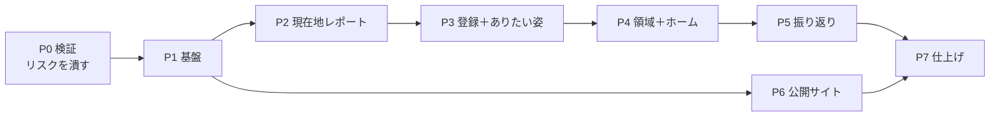

# Flourish Studio MVP バックログ

> Version 0.1
> 最終更新：2026-08-09
> Claude Code での開発を前提としたタスク分解。進め方とスキル設計は `dev-environment.md` を参照。

---

## 1. 読み方

| 記号 | 意味 |
|---|---|
| **CC** | Claude Code が実装する |
| **私** | 人が判断・作成する（AWS操作、外部サービス、コンテンツ、品質判断） |
| **CC＋私** | Claude Code が用意し、人が決める／登録する |

各タスクの `参照` は、**そのタスクで読むべきドキュメントの範囲**である。それ以外を先回りして読ませない。

`依存` が満たされていないタスクは着手できない。

### 見積もりの単位

| 記号 | 目安 |
|---|---|
| **S** | 1セッション（〜1時間） |
| **M** | 1〜2セッション |
| **L** | 3セッション以上。**分割を検討する** |

---

## 2. フェーズの全体像

**P2 の終了時点で、未登録ユーザーが現在地レポートを最後まで体験できる。** ここが最初のデモ可能地点であり、MVPで最も検証価値が高い部分でもある。

P6（公開サイト）は P1 以降いつでも着手できる。**私の作業（記事執筆）が律速になるため早めに始める。**

---

## 3. P0 検証（最優先・約1週間）

**技術構成14章のリスクを潰す。ここを飛ばして本実装に入らない。**

| ID | 担当 | 見積 | タスク | 参照 | 完了条件 |
|---|---|---|---|---|---|
| **P0-1** | **私** | S | AWSアカウント準備、Bedrockでモデルアクセスを有効化（`claude-sonnet-5` / `claude-haiku-4-5`） | `11_技術構成` 8章 | コンソールでモデルが有効。リージョンごとの提供状況を確認済み |
| **P0-2** | **私** | M | **AI推論をどこで行うか決める（案A/B/C）** | `11_技術構成` 8.4 | 決定を `11_技術構成` 8.4 に追記。プライバシーポリシーの論点に反映 |
| ~~**P0-3**~~ ✅ | CC | M | ストリーミング疎通プロトタイプ（CloudFront → API Gateway `STREAM` → Lambda ＋ Web Adapter → Bedrock） | `11_技術構成` 5.1〜5.4、14.1 | ブラウザで逐次表示される。**圧縮ON/OFF両方で確認** |
| **P0-4** | CC | S | `output_config.format` によるJSON拘束が Bedrock で通るか検証 | `10_AIプロンプト設計` 3.3、`11_技術構成` 8.3 | 通る／通らないの結論。通らなければ案Cのプロンプト雛形を作る |
| **P0-5** | CC | S | プロンプトキャッシュの実効を計測（4,096トークン前後） | `10_AIプロンプト設計` 3.5 | `cache_read_input_tokens` の実測値。共通＋個別ブロックが閾値に届くかの判定 |
| **P0-6** | CC | S | Bedrock の実料金でコスト試算を引き直す | `10_AIプロンプト設計` 7章、`11_技術構成` 12章 | 両ドキュメントの数値を更新 |
| **P0-7** | **私** | S | P0-4 の結果を受けて出力形式の方針を確定 | 同上 | `10_AIプロンプト設計` 未決#1 を解消 |

**成果物はプロトタイプであり、本実装には持ち込まない。** 得るのは結論だけ。

**P0-3完了メモ（2026-08-09）：** CloudFront → API Gateway（`STREAM`） → Lambda（Web Adapter） → Bedrock の構成で、圧縮ON/OFF両方でブラウザに逐次表示されることを確認した。検証中に2点判明：
- `11_技術構成` 5.2のCDKコード例に誤りがあった（`ResponseTransferMode` の適用先、統合URI）。5.2を修正済み
- このAWSアカウントでは `claude-sonnet-5` のモデルアクセス（利用目的申請）がまだ承認されておらず、疎通は `claude-haiku-4-5` で代替した。**P0-1は `claude-sonnet-5` について未完了。** 承認され次第、Sonnet 5自体でのストリーミングも確認する（P1-6以降で使う前に）

---

## 4. P1 基盤（約2週間）

| ID | 担当 | 見積 | タスク | 参照 | 完了条件 | 依存 |
|---|---|---|---|---|---|---|
| ~~**P1-1**~~ ✅ | CC | M | リポジトリ雛形。`api/` `web/` `infra/` `tools/` の構成、Makefile、ruff/mypy/eslint/vue-tsc、pre-commit | `11_技術構成` 5.7、13章 | `make lint` が通る | − |
| ~~**P1-2**~~ ✅ | CC | S | GitHub Actions（PR時にlint＋test、mainで dev デプロイ、タグで prod 承認付き） | `11_技術構成` 13.2 | PRでCIが緑 | P1-1 |
| ~~**P1-3**~~ ✅ | **私** | S | ドメイン取得、Route 53 ホストゾーン、ACM証明書（`us-east-1`） | `11_技術構成` 10.4 | 証明書が ISSUED | − |
| ~~**P1-4**~~ ✅ | CC | S | CDK `DataStack`：DynamoDB 2テーブル、TTL、PITR、削除保護 | `08_データモデル` 2章、`11_技術構成` 6.1、10.3 | `cdk deploy` 成功。テーブルが存在 | P1-1 |
| ~~**P1-5**~~ ✅ | **私＋CC** | M | CDK `AuthStack`：Cognito User Pool、パスワードポリシー、Google IdP | `11_技術構成` 7章 | **私**：Google Cloud で OAuth クライアント作成。**CC**：CDK記述 | P1-1 |
| ~~**P1-6**~~ ✅ | CC | M | CDK `AppStack`：Lambda 2種（コンテナ）、API Gateway（`STREAM`）、SQS＋DLQ、IAM | `11_技術構成` 5.2、5.3、5.5、8.5、10.1 | ヘルスチェックが200を返す | P1-4、P0-3 |
| ~~**P1-7**~~ ✅ | CC | M | CDK `EdgeStack`：S3 2種、CloudFront（4ビヘイビア）、WAF、CloudFront Function | `11_技術構成` 4.1〜4.5 | 独自ドメインでSPAが表示される | P1-3、P1-6 |
| **P1-8** | CC | M | FastAPI 雛形。Lambda Web Adapter コンテナ、設定、ヘルスチェック、ローカル起動 | `11_技術構成` 5.1、5.7、13.1 | `make dev` でローカル起動。本番と同じ起動方法 | P1-1 |
| **P1-9** | CC | M | **リポジトリ層。** DynamoDBアクセスの基盤、キー生成、トランザクション、条件付き書き込みのヘルパ | スキル `flourish-data`、`08_データモデル` 2章 | DynamoDB Local に対する統合テストが通る | P1-8 |
| **P1-10** | CC | S | エラー応答の共通形式、例外ハンドラ、`code` の定義 | スキル `flourish-api`、`09_API設計` 2.2〜2.3 | 全ステータスコードのテスト | P1-8 |
| **P1-11** | CC | M | Cookie とセッションの基盤。`fs_guest` / `fs_session`、ハッシュ化、期限延長の間引き | スキル `flourish-api`、`11_技術構成` 7.2、9.3 | ゲスト発行→登録→ログインの経路がテストで通る | P1-9、P1-5 |
| **P1-12** | CC | S | 冪等性とレート制限のミドルウェア | スキル `flourish-api` `flourish-data`、`09_API設計` 2.4〜2.5 | 同時リクエストで二重生成しないテスト | P1-9 |
| **P1-13** | CC | M | 非同期ジョブ基盤。ジョブ登録、SQS送信、ワーカー雛形、`GET /jobs/{id}` | スキル `flourish-api`、`09_API設計` 3.1、`11_技術構成` 5.5 | ダミージョブが `QUEUED`→`SUCCEEDED` を辿る | P1-9、P1-6 |
| **P1-14** | CC | M | Bedrock クライアントとプロンプト実行基盤。3層構造の組み立て、出力検証、1回再生成、EMFログ | スキル `flourish-ai`、`10_AIプロンプト設計` 2〜3章 | ダミープロンプトで生成・検証・記録が動く | P1-8、P0-7 |
| **P1-15** | CC | M | Vue 雛形。Vite、ルーター、Pinia、**デザイントークンのCSS変数**、ダークモード初期化 | スキル `flourish-ui`、`07_デザイン原則` 2〜5章 | トークンが定義され、テーマ切替が動く | P1-1 |
| **P1-16** | CC | M | 共通コンポーネント：ボタン4種、ヘッダー3型、プログレスバー、中断ダイアログ、**生成中画面** | スキル `flourish-ui`、`07_デザイン原則` 6〜7章、`06_ワイヤーフレーム` | Storybook 相当の一覧で全状態を確認できる | P1-15 |
| **P1-17** | CC | S | APIクライアント（fetch ラッパ、`code` → 文言のマッピング、ジョブのポーリング） | スキル `flourish-api` `flourish-tone` | ポーリングが `poll_after_ms` に従う | P1-15、P1-10 |

**P1-9（リポジトリ層）と P1-14（プロンプト実行基盤）が後続すべての土台になる。** ここを雑に作ると全フェーズに響く。

**P1-6完了メモ（2026-08-09）：** `AppStack` を実装し、`ap-northeast-1` へデプロイ済み。ヘルスチェック（`GET /health`）が200を返すことを実機で確認した。

- **P1-8前倒しの範囲：** AppStackのLambdaにはコンテナイメージが要るため、`api/` に `/health` のみを持つ最小限のFastAPIアプリと、ワーカーLambda用のプレースホルダーハンドラを先に作成した（本来はP1-8の担当範囲）。P1-8では、この最小構成の上に設定・ローカル起動（`make dev`）・本来のアプリ構造を積み増す
- API GatewayのストリーミングまわりはP0-3で確定した設定（`Integration.ResponseTransferMode`、専用URI、`InvokeWithResponseStream`権限）をそのまま反映した
- BedrockのIAM権限は `claude-sonnet-5` と `claude-haiku-4-5` の両方に、推論プロファイルARNと3リージョン分の基盤モデルARNを許可済み（P0-3参照）。`claude-sonnet-5`自体のモデルアクセスは引き続き承認待ち
- `deploy-dev` の `cdk deploy` への置き換えはP1-7（EdgeStack）完了後にまとめて行う

**P1-7完了メモ（2026-08-10）：** `EdgeStack` を実装した（コミット `056a418`、PR #9）。S3 2種（公開サイト用・SPA用、パブリックアクセスブロック）、CloudFront（4ビヘイビア：`/`・`/api/v1/*`・`/app/*`・`/articles/*`・`/assets/*`）、WAF（Managed Rules＋レート制限）、CloudFront Function（`/app/*` のSPAルーティング）、Route53エイリアスレコードを構築し、`bin/infra.ts` に組み込み済み。テストは `infra/test/edge-stack.test.ts`。

- **完了条件の読み替え：** 完了条件「独自ドメインでSPAが表示される」は、`spaBucket` にコンテンツを置くVue雛形（P1-15、未着手）が前提になる。P1-7の依存にP1-15は含まれておらず、この時点では**CloudFront経由で独自ドメインが名前解決・応答するインフラの疎通確認**に読み替える。実際にSPAが表示されることの確認はP1-15完了後に改めて行う
- `make deploy-dev` は本タスクの時点でも `cdk deploy` へ未置き換え（プレースホルダーのまま）。置き換えとAWSへの実デプロイ・疎通確認は別タスクとして残っている

---

## 5. P2 現在地レポート（約2週間）

**このフェーズの終了時点で、未登録ユーザーが最後まで体験できる。**

| ID | 担当 | 見積 | タスク | 参照 | 完了条件 | 依存 |
|---|---|---|---|---|---|---|
| **P2-1** | CC | M | 質問マスタの定義。4領域×5項目、コミット度、選択肢、`question_set_version` | `05_質問・コンテンツ設計` 2章、`08_データモデル` 1.2、9章 | enum とバージョン定義。過去版を消さない構造 | P1-1 |
| **P2-2** | CC | S | `POST /guest-sessions` と S-11 | `04_画面設計` S-11、`09_API設計` 5.1 | Cookie が発行され、再読込で増えない | P1-11、P1-16 |
| **P2-3** | CC | L | **S-12 選択式24問（4画面）。** 目盛りUI、縦積み選択肢、プログレスバー | `05_質問・コンテンツ設計` 2章、`06_ワイヤーフレーム`、スキル `flourish-ui` | 4領域を通して回答でき、未回答では進めない。**タップ領域44px、コントラスト3:1** | P2-1、P1-16 |
| **P2-4** | CC | M | **事前計算ロジック。** 最高／最低項目、例外パターン、タイブレーク、コミット度スコアと段階 | `05_質問・コンテンツ設計` 3.3、4.1、スキル `flourish-ai` | **全パターンのユニットテスト**（同点、全高、全低、全同値） | P2-1 |
| **P2-5** | CC | M | P-01 プロンプト実装 ＋ `POST /ai/assessment-questions` | `10_AIプロンプト設計` 4.1 | 8件の問いが生成され、検証を通る | P1-14、P2-4 |
| **P2-6** | CC | S | S-13 生成中画面と失敗時の再試行 | `04_画面設計` S-13、`07_デザイン原則` 7.4 | 失敗時に同じ画面で中身が入れ替わる | P1-16、P2-5 |
| **P2-7** | CC | M | S-14 自由記述8問。任意入力、1,000文字上限 | `04_画面設計` S-14、`05_質問・コンテンツ設計` 3章 | 全問空欄でも進める | P2-6 |
| **P2-8** | CC | L | **P-02 プロンプト実装 ＋ `POST /assessments`。** あだ名・4領域の整理・言語化度 | `10_AIプロンプト設計` 4.2、スキル `flourish-ai` | 検証をすべて通る。**成功時のみ1アイテム保存** | P1-14、P2-4 |
| **P2-9** | CC | M | S-15 → S-16 結果画面。あだ名の演出、4領域の整理、締め | `04_画面設計` S-15/S-16、`05_質問・コンテンツ設計` 5章、`06_ワイヤーフレーム` | 上から下へ軽い→真面目の構成 | P2-8、P1-16 |
| **P2-10** | **私** | M | **成長段階アイコン（種・芽・苗・木）の描き起こし** | `07_デザイン原則` 7.6 | 4つ並べて成長の連続が読み取れるSVG | − |
| **P2-11** | CC | S | 成長段階の表示コンポーネント。4段階を並べ、該当のみ `--primary` | `07_デザイン原則` 7.7 | 数値を出さない。点灯アニメーション | P2-10、P1-16 |
| **P2-12** | CC | M | P-09 `SAFETY_CHECK` と `safety_flag` の表示 | `10_AIプロンプト設計` 4.9、3.7 | フラグ時に評価を出さず、固定文面を表示 | P2-8、P7-1 |
| **P2-13** | CC | S | 評価セット10種の実行環境（固定入力→9種の生成を通す） | `10_AIプロンプト設計` 6.1 | コマンド1つで10セットの出力が揃う | P2-8 |
| **P2-14** | **私** | L | **評価セットのレビュー。あだ名の許容ラインを決める** | `10_AIプロンプト設計` 6.1〜6.2、5章 | 定義書19章 未決#2 を解消。`effort` の最終値を決定 | P2-13 |

**P2-14 は人にしかできない。** ここで品質が足りなければ `effort` を上げるかモデルを戻す（`10_AIプロンプト設計` 7.5）。

---

## 6. P3 登録とありたい姿（約2週間）

| ID | 担当 | 見積 | タスク | 参照 | 完了条件 | 依存 |
|---|---|---|---|---|---|---|
| **P3-1** | CC | M | `POST /auth/register` ＋ S-21。**ゲストデータの紐付け**、流出パスワード照合 | `09_API設計` 5.5、`11_技術構成` 7.2、7.4、`08_データモデル` 3.4 | 登録でレポートがアカウントへ移る。ゲスト側はTTLに委ねる | P1-11、P2-8 |
| **P3-2** | CC | S | `POST /auth/login` ＋ S-02 | `04_画面設計` S-02 | ログインでホームへ | P3-1 |
| **P3-3** | CC | M | Google 連携（`/auth/google` → callback → セッション発行） | `11_技術構成` 7.5 | **トークンをブラウザに渡していないこと**を確認 | P3-1、P1-5 |
| **P3-4** | CC | S | `POST /auth/logout`、`GET /me`、`PATCH /me` | `09_API設計` 4章 | ログアウトで `fs_guest` を再発行しない | P3-1 |
| **P3-5** | CC | M | S-31 選択式3問（価値観・充足の瞬間・理想の毎日） | `05_質問・コンテンツ設計` 6章 | 3問が仕様どおり | P1-16 |
| **P3-6** | CC | L | **P-03 対話（SSE）＋ S-32。** 3往復、往復数はコードが数える | `10_AIプロンプト設計` 4.3、`09_API設計` 5.6、スキル `flourish-api` | 逐次表示される。`remaining` が0で「候補を作る」が出る | P1-14、P0-3 |
| **P3-7** | CC | M | P-04 3案生成 ＋ S-33 → S-34 | `10_AIプロンプト設計` 4.4、`05_質問・コンテンツ設計` 8章 | **必ず3件、direction 重複なし。3件未満は FAILED** | P3-6 |
| **P3-8** | CC | M | S-35 編集・確定 ＋ `POST /purposes`。60文字上限 | `09_API設計` 5.8、`08_データモデル` 4.1、4.4 | 確定時にはじめて保存。対話全文も一緒に | P3-7、P1-9 |
| **P3-9** | CC | M | S-36 閲覧 / S-37 編集 ＋ `GET`/`PUT /purposes/current` | `09_API設計` 5.8.1 | **PUTは新バージョンを作る。既存の AREA_PLAN を再作成しない** | P3-8 |

---

## 7. P4 領域とホーム（約2週間）

| ID | 担当 | 見積 | タスク | 参照 | 完了条件 | 依存 |
|---|---|---|---|---|---|---|
| **P4-1** | CC | S | S-50 最初の領域を選ぶ。「あとで」でスキップ | `05_質問・コンテンツ設計` 9.1 | 推奨や優先度を出さない | P3-8 |
| **P4-2** | CC | L | **S-51 領域の選択式3問 × 4領域分。** Q2・Q3 は領域ごとに10選択肢 | `05_質問・コンテンツ設計` 9.2（全文） | 4領域すべての選択肢が仕様どおり | P2-1 |
| **P4-3** | CC | M | P-05 対話（SSE）＋ S-52。2往復。**ありたい姿を常時表示** | `10_AIプロンプト設計` 4.5 | 2往復目で必ずありたい姿に触れる | P3-6、P4-2 |
| **P4-4** | CC | M | P-06 3案生成 ＋ S-53 → S-54。深める／変える／広げる | `10_AIプロンプト設計` 4.6、`05_質問・コンテンツ設計` 9.4 | **順序固定。回答で並べ替えない** | P4-3 |
| **P4-5** | CC | S | S-55 理想状態の編集 | `05_質問・コンテンツ設計` 9.5 | 上部にありたい姿を表示し続ける | P4-4 |
| **P4-6** | CC | M | S-56 年間目標1〜3個 ＋ P-07 AIヒント（同期・10秒） ＋ `POST /area-plans` | `10_AIプロンプト設計` 4.7、`09_API設計` 5.10、5.11 | ヒント失敗でも進行が止まらない。**目標0件は422** | P4-5、P1-9 |
| **P4-7** | CC | M | S-57 閲覧 / S-58 編集 ＋ `GET`/`PUT /area-plans/{area}` | `09_API設計` 5.12、`08_データモデル` 4.5 | **`goal_key` の引き継ぎ**をテストで確認 | P4-6 |
| **P4-8** | CC | M | **S-41 ホーム ＋ `GET /home`。** BatchGet 1回、未作成は破線 | `09_API設計` 5.9、`04_画面設計` S-41、`07_デザイン原則` 原則2 | 「未完成」「空欄」と表示しない。立ち上がりの演出 | P4-7 |
| **P4-9** | CC | S | テーマ切替トグル（自動→ライト→ダーク→自動） | `07_デザイン原則` 3.2 | ホーム以外に置かない。アカウントに保存 | P4-8、P3-4 |

---

## 8. P5 Weekly Reflection（約1週間）

| ID | 担当 | 見積 | タスク | 参照 | 完了条件 | 依存 |
|---|---|---|---|---|---|---|
| **P5-1** | CC | M | `GET /reflections/context` ＋ S-61。3段階評価、自由記述1つ | `05_質問・コンテンツ設計` 10.1〜10.2、`09_API設計` 5.13 | 目標0件でも空配列を返す（409にしない） | P4-7 |
| **P5-2** | CC | M | P-08 ＋ `POST /reflections` ＋ S-62 → S-63 | `10_AIプロンプト設計` 4.8、`09_API設計` 5.14 | **全体に1つ返す。次の一歩は1つだけ** | P5-1、P1-14 |
| **P5-3** | CC | S | ホームのWR導線（目標0個で無効、理由を添える） | `03_ユーザーフロー` Step 8 | 無効ボタンを消さない | P4-8、P5-1 |

---

## 9. P6 公開サイト（P1以降いつでも）

| ID | 担当 | 見積 | タスク | 参照 | 完了条件 | 依存 |
|---|---|---|---|---|---|---|
| **P6-1** | **私** | L | **記事コンテンツの執筆**（5カテゴリ、各2〜3本を目安） | `01_全体コンセプト` 12章 | 記事本文。カテゴリは4領域＋Flourishとは | − |
| **P6-2** | CC | S | 記事の投入スクリプト（`flourish_article` へ） | `08_データモデル` 6.4 | 冪等に投入できる | P1-4 |
| **P6-3** | CC | M | **静的サイトジェネレータ。** DynamoDB → HTML → S3 → invalidation | `11_技術構成` 4.4 | `make publish-site` で反映 | P6-2 |
| **P6-4** | CC | M | S-01 トップページ（7セクション） | `04_画面設計` S-01、`06_ワイヤーフレーム`、`01_全体コンセプト` 17章 | 最大幅960px。SPAへの導線 | P6-3、P1-15 |
| **P6-5** | CC | M | K-01 記事一覧 / K-02 記事詳細。末尾に共通CTA | `04_画面設計` K-01/K-02 | ログイン不要で全文が読める | P6-3 |
| **P6-6** | CC | S | メタタグ、OGP、sitemap.xml、robots.txt | − | 検索エンジンにインデックスされる状態 | P6-4、P6-5 |

**P6-1 が律速になる。** 記事は Claude Code に書かせず、人が書く（`flourish-tone` の適用が最も難しい領域であり、サービスの声そのものになるため）。

---

## 10. P7 仕上げ（約1週間）

| ID | 担当 | 見積 | タスク | 参照 | 完了条件 | 依存 |
|---|---|---|---|---|---|---|
| **P7-1** | **私** | L | **プライバシーポリシー、利用規約、相談窓口の文面**（専門の確認を含む） | `08_データモデル` 11.1、`10_AIプロンプト設計` 3.7、`11_技術構成` 8.4 | 退会後のデータ保持、AI処理を行う国、相談窓口が明記されている | P0-2 |
| **P7-2** | CC | S | ポリシー・規約ページの実装 | P7-1 の成果物 | 公開サイトとアプリ内の両方から到達できる | P7-1、P6-3 |
| **P7-3** | **私** | M | **4領域アイコンの選定**、ロゴとサービス名のロックアップ | `07_デザイン原則` 7.6、12章 | 線画SVG。定義書19章 未決#4 を解消 | − |
| **P7-4** | CC | M | アクセシビリティ検証（コントラスト実測、キーボード操作、文字拡大、`prefers-reduced-motion`） | `07_デザイン原則` 9〜10章 | WCAG 2.1 AA 相当を満たす。**実測値を記録** | P4-9 |
| **P7-5** | CC | M | 監視とアラーム（DLQ、エラー率、レイテンシ、スロットリング、**AI日次コスト**） | `11_技術構成` 11章 | アラームが発火することをテスト | P1-6 |
| **P7-6** | CC | M | ダッシュボード（EMFログから `kind` ごとの失敗率・トークン・`safety_flag`） | `11_技術構成` 11.2、`10_AIプロンプト設計` 6.3 | 6つの指標が見える | P7-5 |
| **P7-7** | CC | M | **S3エクスポート＋Athena の経路を一度通す** | `11_技術構成` 6.5、`08_データモデル` 12.3 | サンプルクエリが実行できる。**手順を文書化** | P1-4 |
| **P7-8** | CC | M | 通しの結合テスト（S-01 → S-16 → 登録 → ありたい姿 → 領域 → ホーム → 振り返り） | `03_ユーザーフロー` 1章 | 全経路が通る。**離脱・再試行・失敗の分岐も** | P5-3、P6-5 |
| **P7-9** | **私** | S | 本番デプロイの承認と実行 | `11_技術構成` 13.2 | prod で通しの動作確認 | P7-8、P7-2 |

---

## 11. 私の作業だけを抜き出したもの

**これらは Claude Code の進行をブロックする。前倒しで着手する。**

| ID | 内容 | ブロックするもの | 前倒し可否 |
|---|---|---|---|
| **P0-1** | AWSアカウント、Bedrockモデル有効化 | **P0以降すべて** | **最優先** |
| **P0-2** | **AI推論のリージョン判断** | P0-3以降、P7-1 | **最優先** |
| ~~P1-3~~ ✅ | ドメイン、証明書 | P1-7 | 早めに |
| ~~P1-5~~ ✅ | Google OAuth クライアント | P3-3 | 早めに |
| P2-10 | 成長段階アイコンの描き起こし | P2-11 | **P2着手と同時に** |
| **P2-14** | **評価セットのレビュー、あだ名の許容ライン** | 品質確定 | P2-13の直後 |
| **P6-1** | **記事の執筆** | P6-3以降 | **今すぐ着手可** |
| **P7-1** | **プライバシーポリシー・規約・相談窓口** | P7-2、リリース | **専門確認に時間がかかる。今すぐ** |
| P7-3 | アイコン選定、ロゴ | 仕上げ | いつでも |
| P7-9 | 本番デプロイ承認 | リリース | 最後 |

**P0-2、P6-1、P7-1 は今日から着手できる。** 特に P7-1 は専門家のレビューを挟むため、リードタイムが読めない。

---

## 12. 進め方の約束

| # | 約束 |
|---|---|
| 1 | **1タスク＝1セッション。** セッションの冒頭でタスクIDを宣言する |
| 2 | **参照に書かれていないドキュメントを先回りして読まない** |
| 3 | 実装後は `make lint && make test` を通す |
| 4 | **仕様に書かれていないことを勝手に決めない。** 判断が要るときは止めて聞く |
| 5 | **仕様の矛盾を見つけたら、実装を進める前に報告する** |
| 6 | 完了条件を満たしたら、このバックログにチェックを入れる |

---

## 13. 見積もりの合計

| フェーズ | CC | 私 | 期間の目安 |
|---|---|---|---|
| P0 検証 | 4タスク | 3タスク | 1週間 |
| P1 基盤 | 15タスク | 2タスク | 2週間 |
| P2 現在地レポート | 11タスク | 2タスク | 2週間 |
| P3 登録＋ありたい姿 | 9タスク | − | 2週間 |
| P4 領域＋ホーム | 9タスク | − | 2週間 |
| P5 振り返り | 3タスク | − | 1週間 |
| P6 公開サイト | 5タスク | 1タスク | 1週間（記事執筆と並行） |
| P7 仕上げ | 6タスク | 3タスク | 1週間 |
| **合計** | **62タスク** | **11タスク** | **約12週間** |

**この見積もりは実装の手戻りを含まない。** P0の結果次第で P1-6・P1-14 が変わる可能性がある。

---

## 14. 未決との対応

| 定義書19章の未決 | 解消するタスク |
|---|---|
| #1 プライバシーポリシー、退会データ | **P7-1** |
| #2 あだ名の許容ライン | **P2-14** |
| #3 AIプロンプト設計 | 済（`10_AIプロンプト設計`） |
| #4 ロゴとロックアップ | **P7-3** |
| #5 パスワードリセットをMVPに含めるか | **未着手。P3着手前に判断が要る** |

**#5 が未決のまま残っている。** P3-1 の設計前に決める。含める場合、画面が1〜2枚とタスクが2つ増える。
