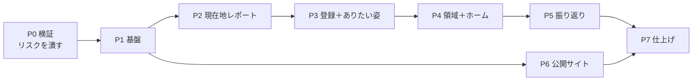

# Flourish Studio MVP バックログ

> Version 0.1
> 最終更新：2026-08-09
> Claude Code での開発を前提としたタスク分解。進め方とスキル設計は `dev-environment.md` を参照。

---

## 1. 読み方

| 記号 | 意味 |
|---|---|
| **CC** | Claude Code が実装する |
| **私** | 人が判断・作成する（AWS操作、外部サービス、コンテンツ、品質判断） |
| **CC＋私** | Claude Code が用意し、人が決める／登録する |

各タスクの `参照` は、**そのタスクで読むべきドキュメントの範囲**である。それ以外を先回りして読ませない。

`依存` が満たされていないタスクは着手できない。

### 見積もりの単位

| 記号 | 目安 |
|---|---|
| **S** | 1セッション（〜1時間） |
| **M** | 1〜2セッション |
| **L** | 3セッション以上。**分割を検討する** |

---

## 2. フェーズの全体像

**P2 の終了時点で、未登録ユーザーが現在地レポートを最後まで体験できる。** ここが最初のデモ可能地点であり、MVPで最も検証価値が高い部分でもある。

P6（公開サイト）は P1 以降いつでも着手できる。**私の作業（記事執筆）が律速になるため早めに始める。**

---

## 3. P0 検証（最優先・約1週間）

**技術構成14章のリスクを潰す。ここを飛ばして本実装に入らない。**

| ID | 担当 | 見積 | タスク | 参照 | 完了条件 |
|---|---|---|---|---|---|
| **P0-1** | **私** | S | AWSアカウント準備、Bedrockでモデルアクセスを有効化（`claude-sonnet-5` / `claude-haiku-4-5`） | `11_技術構成` 8章 | コンソールでモデルが有効。リージョンごとの提供状況を確認済み |
| **P0-2** | **私** | M | **AI推論をどこで行うか決める（案A/B/C）** | `11_技術構成` 8.4 | 決定を `11_技術構成` 8.4 に追記。プライバシーポリシーの論点に反映 |
| ~~**P0-3**~~ ✅ | CC | M | ストリーミング疎通プロトタイプ（CloudFront → API Gateway `STREAM` → Lambda ＋ Web Adapter → Bedrock） | `11_技術構成` 5.1〜5.4、14.1 | ブラウザで逐次表示される。**圧縮ON/OFF両方で確認** |
| **P0-4** | CC | S | `output_config.format` によるJSON拘束が Bedrock で通るか検証 | `10_AIプロンプト設計` 3.3、`11_技術構成` 8.3 | 通る／通らないの結論。通らなければ案Cのプロンプト雛形を作る |
| **P0-5** | CC | S | プロンプトキャッシュの実効を計測（4,096トークン前後） | `10_AIプロンプト設計` 3.5 | `cache_read_input_tokens` の実測値。共通＋個別ブロックが閾値に届くかの判定 |
| **P0-6** | CC | S | Bedrock の実料金でコスト試算を引き直す | `10_AIプロンプト設計` 7章、`11_技術構成` 12章 | 両ドキュメントの数値を更新 |
| **P0-7** | **私** | S | P0-4 の結果を受けて出力形式の方針を確定 | 同上 | `10_AIプロンプト設計` 未決#1 を解消 |

**成果物はプロトタイプであり、本実装には持ち込まない。** 得るのは結論だけ。

**P0-3完了メモ（2026-08-09）：** CloudFront → API Gateway（`STREAM`） → Lambda（Web Adapter） → Bedrock の構成で、圧縮ON/OFF両方でブラウザに逐次表示されることを確認した。検証中に2点判明：
- `11_技術構成` 5.2のCDKコード例に誤りがあった（`ResponseTransferMode` の適用先、統合URI）。5.2を修正済み
- このAWSアカウントでは `claude-sonnet-5` のモデルアクセス（利用目的申請）がまだ承認されておらず、疎通は `claude-haiku-4-5` で代替した。**P0-1は `claude-sonnet-5` について未完了。** 承認され次第、Sonnet 5自体でのストリーミングも確認する（P1-6以降で使う前に）

---

## 4. P1 基盤（約2週間）

| ID | 担当 | 見積 | タスク | 参照 | 完了条件 | 依存 |
|---|---|---|---|---|---|---|
| ~~**P1-1**~~ ✅ | CC | M | リポジトリ雛形。`api/` `web/` `infra/` `tools/` の構成、Makefile、ruff/mypy/eslint/vue-tsc、pre-commit | `11_技術構成` 5.7、13章 | `make lint` が通る | − |
| ~~**P1-2**~~ ✅ | CC | S | GitHub Actions（PR時にlint＋test、mainで dev デプロイ、タグで prod 承認付き） | `11_技術構成` 13.2 | PRでCIが緑 | P1-1 |
| ~~**P1-3**~~ ✅ | **私** | S | ドメイン取得、Route 53 ホストゾーン、ACM証明書（`us-east-1`） | `11_技術構成` 10.4 | 証明書が ISSUED | − |
| ~~**P1-4**~~ ✅ | CC | S | CDK `DataStack`：DynamoDB 2テーブル、TTL、PITR、削除保護 | `08_データモデル` 2章、`11_技術構成` 6.1、10.3 | `cdk deploy` 成功。テーブルが存在 | P1-1 |
| ~~**P1-5**~~ ✅ | **私＋CC** | M | CDK `AuthStack`：Cognito User Pool、パスワードポリシー、Google IdP | `11_技術構成` 7章 | **私**：Google Cloud で OAuth クライアント作成。**CC**：CDK記述 | P1-1 |
| ~~**P1-6**~~ ✅ | CC | M | CDK `AppStack`：Lambda 2種（コンテナ）、API Gateway（`STREAM`）、SQS＋DLQ、IAM | `11_技術構成` 5.2、5.3、5.5、8.5、10.1 | ヘルスチェックが200を返す | P1-4、P0-3 |
| ~~**P1-7**~~ ✅ | CC | M | CDK `EdgeStack`：S3 2種、CloudFront（4ビヘイビア）、WAF、CloudFront Function | `11_技術構成` 4.1〜4.5 | 独自ドメインでSPAが表示される | P1-3、P1-6 |
| ~~**P1-8**~~ ✅ | CC | M | FastAPI 雛形。Lambda Web Adapter コンテナ、設定、ヘルスチェック、ローカル起動 | `11_技術構成` 5.1、5.7、13.1 | `make dev` でローカル起動。本番と同じ起動方法 | P1-1 |
| ~~**P1-9**~~ ✅ | CC | M | **リポジトリ層。** DynamoDBアクセスの基盤、キー生成、トランザクション、条件付き書き込みのヘルパ | スキル `flourish-data`、`08_データモデル` 2章 | DynamoDB Local に対する統合テストが通る | P1-8 |
| ~~**P1-10**~~ ✅ | CC | S | エラー応答の共通形式、例外ハンドラ、`code` の定義 | スキル `flourish-api`、`09_API設計` 2.2〜2.3 | 全ステータスコードのテスト | P1-8 |
| ~~**P1-11**~~ ✅ | CC | M | Cookie とセッションの基盤。`fs_guest` / `fs_session`、ハッシュ化、期限延長の間引き | スキル `flourish-api`、`11_技術構成` 7.2、9.3 | ゲスト発行→登録→ログインの経路がテストで通る | P1-9、P1-5 |
| ~~**P1-12**~~ ✅ | CC | S | 冪等性とレート制限のミドルウェア | スキル `flourish-api` `flourish-data`、`09_API設計` 2.4〜2.5 | 同時リクエストで二重生成しないテスト | P1-9 |
| ~~**P1-13**~~ ✅ | CC | M | 非同期ジョブ基盤。ジョブ登録、SQS送信、ワーカー雛形、`GET /jobs/{id}` | スキル `flourish-api`、`09_API設計` 3.1、`11_技術構成` 5.5 | ダミージョブが `QUEUED`→`SUCCEEDED` を辿る | P1-9、P1-6 |
| ~~**P1-14**~~ ✅ | CC | M | Bedrock クライアントとプロンプト実行基盤。3層構造の組み立て、出力検証、1回再生成、EMFログ | スキル `flourish-ai`、`10_AIプロンプト設計` 2〜3章 | ダミープロンプトで生成・検証・記録が動く | P1-8、P0-7 |
| ~~**P1-15**~~ ✅ | CC | M | Vue 雛形。Vite、ルーター、Pinia、**デザイントークンのCSS変数**、ダークモード初期化 | スキル `flourish-ui`、`07_デザイン原則` 2〜5章 | トークンが定義され、テーマ切替が動く | P1-1 |
| ~~**P1-16**~~ ✅ | CC | M | 共通コンポーネント：ボタン4種、ヘッダー3型、プログレスバー、中断ダイアログ、**生成中画面** | スキル `flourish-ui`、`07_デザイン原則` 6〜7章、`06_ワイヤーフレーム` | Storybook 相当の一覧で全状態を確認できる | P1-15 |
| ~~**P1-17**~~ ✅ | CC | S | APIクライアント（fetch ラッパ、`code` → 文言のマッピング、ジョブのポーリング） | スキル `flourish-api` `flourish-tone` | ポーリングが `poll_after_ms` に従う | P1-15、P1-10 |
| ~~**P1-18**~~ ✅ | CC | S | **CDK配線の欠け。** `AppStack` の Lambda（API・ワーカー）に `DataStack` の DynamoDB テーブルへの IAM 権限と `DYNAMODB_TABLE_NAME` 環境変数を追加する | `11_技術構成` 10.1（スタック分割）、10.3（削除保護） | `cdk test` で API・ワーカー両方のロールに `flourish` テーブルへの読み書き権限（`grantReadWriteData` 相当）が付与されていることを確認できる。実機での疎通確認は次回 `deploy-dev` 実行時に行う | P1-4、P1-6 |

**P1-9（リポジトリ層）と P1-14（プロンプト実行基盤）が後続すべての土台になる。** ここを雑に作ると全フェーズに響く。

**P1-18が生まれた経緯：** P1-13（非同期ジョブ基盤）の実装中に気づいた。`DataStack`（DynamoDB）と `AppStack`（Lambda）はスタックが分かれており（10.1「変更頻度で分ける」）、`bin/infra.ts` には両者を結ぶ `table.grantReadWriteData(...)` も `DYNAMODB_TABLE_NAME` の受け渡しも無い。ローカルはDynamoDB Localへ直接繋ぐため気づきにくいが、**現状のままでは実際にAWSへデプロイしてもAPI・ワーカーはDynamoDBに一切アクセスできない。** P1-9・P1-13どちらの完了条件にも含まれておらず、放置すると次にAWS実機で確認するタイミング（`deploy-dev` の `cdk deploy` 化以降）までこの欠けに気づけない。

**P1-6完了メモ（2026-08-09）：** `AppStack` を実装し、`ap-northeast-1` へデプロイ済み。ヘルスチェック（`GET /health`）が200を返すことを実機で確認した。

- **P1-8前倒しの範囲：** AppStackのLambdaにはコンテナイメージが要るため、`api/` に `/health` のみを持つ最小限のFastAPIアプリと、ワーカーLambda用のプレースホルダーハンドラを先に作成した（本来はP1-8の担当範囲）。P1-8では、この最小構成の上に設定・ローカル起動（`make dev`）・本来のアプリ構造を積み増す
- API GatewayのストリーミングまわりはP0-3で確定した設定（`Integration.ResponseTransferMode`、専用URI、`InvokeWithResponseStream`権限）をそのまま反映した
- BedrockのIAM権限は `claude-sonnet-5` と `claude-haiku-4-5` の両方に、推論プロファイルARNと3リージョン分の基盤モデルARNを許可済み（P0-3参照）。`claude-sonnet-5`自体のモデルアクセスは引き続き承認待ち
- `deploy-dev` の `cdk deploy` への置き換えはP1-7（EdgeStack）完了後にまとめて行う

**P1-7完了メモ（2026-08-10）：** `EdgeStack` を実装した（コミット `056a418`、PR #9）。S3 2種（公開サイト用・SPA用、パブリックアクセスブロック）、CloudFront（4ビヘイビア：`/`・`/api/v1/*`・`/app/*`・`/articles/*`・`/assets/*`）、WAF（Managed Rules＋レート制限）、CloudFront Function（`/app/*` のSPAルーティング）、Route53エイリアスレコードを構築し、`bin/infra.ts` に組み込み済み。テストは `infra/test/edge-stack.test.ts`。

- **完了条件の読み替え：** 完了条件「独自ドメインでSPAが表示される」は、`spaBucket` にコンテンツを置くVue雛形（P1-15、未着手）が前提になる。P1-7の依存にP1-15は含まれておらず、この時点では**CloudFront経由で独自ドメインが名前解決・応答するインフラの疎通確認**に読み替える。実際にSPAが表示されることの確認はP1-15完了後に改めて行う
- `make deploy-dev` は本タスクの時点でも `cdk deploy` へ未置き換え（プレースホルダーのまま）。置き換えとAWSへの実デプロイ・疎通確認は別タスクとして残っている

**P1-8完了メモ（2026-08-10）：** `app/core/config.py` に `Settings`（`pydantic-settings`、環境変数 `ENVIRONMENT` から読み込む。`local`/`dev`/`prod`）を追加し、`main.py` から利用する形にした。`make dev` を `cd api && uvicorn app.main:app --reload --port 8080` に実装し、`/health` が200を返すことをローカル起動・Dockerビルド（`Dockerfile`）の両方で確認した。

- **`make dev` は現時点でAPI単体の起動のみ。** DynamoDB Local（P1-9）・フロントエンド（P1-15）はまだ実装されていないため、CLAUDE.mdが定義する最終形（DynamoDB Local＋API＋フロントを起動）には届いていない。両タスクの完了時にそれぞれ積み増す
- 設定項目は現時点で `environment` のみ。DB接続・Cognito・Bedrockなどの設定は、それぞれを実装するタスク（P1-9、P1-11、P1-14など）で追加する

**P1-9完了メモ（2026-08-10）：** `app/db/` にリポジトリ層の基盤を実装した。

- `keys.py`：`08_データモデル` 2.2の主キー一覧に対応するPK/SK生成関数（`user_pk`、`guest_pk`、`session_pk`、`job_pk`、`idem_pk`、`rate_pk`、`assessment_sk`、`purpose_current_sk`、`area_current_sk`、`reflection_sk`、`history_sk`）
- `repository.py`：`get_item`／`put_item`（条件付き）／`update_item`（条件付き）／`batch_get_items`／`query_by_sk_prefix`／`transact_write_items`（`ConditionCheck`含む）／`put_versioned`（現行版読み取り→履歴退避＋新版書き込みを1トランザクションで行う、スキルflourish-data「更新の型」のヘルパー化）
- `client.py`：boto3の`Table`リソースを`Settings`（`dynamodb_table_name`、`dynamodb_endpoint_url`、`aws_region`）から組み立てる
- `local_bootstrap.py`：DynamoDB Local専用。テーブルが存在しなければ作成する（本番のテーブル定義は`infra/lib/data-stack.ts`が真実の源）
- ルートに `docker-compose.yml`（`dynamodb-local`）を追加。`make dev`／`make test-api`は`dynamodb-local-up`に依存し、自動的にDynamoDB Localを起動してからAPI起動・テスト実行を行う
- `tests/test_repository.py`：冪等性パターン（条件付きput）、レート制限パターン（条件付きupdate）、バージョン管理（`put_versioned`が履歴退避と新版書き込みを行うこと）、`ConditionCheck`によるトランザクションロールバック、`batch_get_items`、`query_by_sk_prefix`をDynamoDB Localに対する統合テストとして実装。`make test`で通ることを確認済み
- **`ASSESSMENT`・`PURPOSE`・`AREA_PLAN`などエンティティ固有の制約（スキルflourish-data「制約はアプリが守る」の表）は未実装。** それぞれの機能タスク（P2-4、P3-8、P4-6など）で、このリポジトリ層を使って実装する

**P1-10完了メモ（2026-08-10）：** `app/core/errors.py` に `AppError` 基底と、09_API設計2.2の各ステータスコード（400/401/403/404/409/422/429/503）に対応するサブクラス（`BadRequestError`〜`ServiceUnavailableError`）を実装した。`app/core/error_handlers.py` の `register_error_handlers` で `main.py` に登録し、`AppError`／`RequestValidationError`（Pydanticのリクエストバリデーション、**400**として扱い422の業務ルール違反と区別）／`StarletteHTTPException` の3種を共通のエラー応答形式（`{"error": {"code", "message", "details"}}`）に変換する。`RateLimitedError` は `Retry-After` ヘッダを付与する。

- 具体的な `code`（`ANSWERS_INCOMPLETE`、`STATEMENT_TOO_LONG`など）は各機能タスクでこの例外クラス群を使って送出する。P1-10では基盤のみ
- `tests/test_error_handlers.py` で全ステータスコード（400/401/403/404/409/422/429/503）と、`RequestValidationError`・未定義ルートの変換を確認済み

**P1-11完了メモ（2026-08-10）：** Cookie とセッションの基盤を実装した。実際の `POST /guest-sessions`／`POST /auth/register`／`POST /auth/login`（Cognito連携を含む）はP2-2・P3-1・P3-2で実装する。P1-11ではその土台となるトークン・セッションの仕組みのみを用意した。

- `app/core/security.py`：Cookie名（`fs_guest`／`fs_session`）と属性の定数（`HttpOnly`／`Secure`／`SameSite=Lax`／`Max-Age=2592000`）、`generate_token`（256bitの不透明トークン）、`hash_token`（`SESSION#<hash>`用）、`set_auth_cookie`／`clear_auth_cookie`
- `app/domain/guest_session.py`：`GUEST_SESSION`（`08_データモデル`6.2）の発行・取得・登録時の紐付け記録（`mark_guest_converted`）。**PKにはトークンをそのまま使う**（`SESSION`と異なり6.2はハッシュ化を要求していない）
- `app/domain/session.py`：`SESSION`（`08_データモデル`6.3）の発行・取得・`touch_session`（**前回の延長から24時間未満なら書き込まない間引き**）。PKには`hash_token`したものを使う
- `app/api/deps.py`：`require_session`（要ログインの依存関係。未認証・期限切れは`401 UNAUTHENTICATED`でクライアントをS-01へ戻す）
- `tests/test_security.py`／`tests/test_guest_session.py`／`tests/test_session.py`：トークンの一意性・ハッシュの一方向性、有効期限切れの判定、延長の間引きが効くこと・24時間以上経てば延長されることを確認
- `tests/test_auth_flow.py`：完了条件「ゲスト発行→登録→ログインの経路がテストで通る」に対応。上記の基盤だけを使った最小限のテスト用ルート（`/test/guest-sessions`・`/test/register`・`/test/me`）で、ゲスト発行→（既存ゲストの再訪で増えない）→登録によるアカウントへの紐付け＋`fs_guest`破棄＋`fs_session`発行→`fs_session`のみでの保護リソースアクセス、および401系（Cookieなし／不正なトークン）を確認
- **DynamoDBの`expires_at`（TTL）は実際の削除がAWS側で遅延しうるため、`get_active_guest_session`／`get_active_session`はアプリ側でも期限切れを判定する**
- Cognito連携（`sub`の取得、パスワード要件、Google連携）、レート制限（P1-12）、実際のエンドポイント3本（`fs_guest`の再訪時再発行スキップを含む）は本タスクの範囲外

**P1-12完了メモ（2026-08-11）：** 冪等性とレート制限を、リポジトリ層の条件付き書き込みだけで実装した（読んでから書かない。`flourish-data`「冪等性・レート制限は条件付き書き込みで」）。まだ生成系のエンドポイント自体が存在しない（P1-13〜P2以降）ため、本タスクの範囲は再利用可能な関数とそのテストに留めた。

- `app/domain/idempotency.py`：`reserve_job_id(owner, idempotency_key, candidate_job_id)`。呼び出し側が候補の`job_id`を渡し、`IDEM#<owner>#<key>`への条件付き`PutItem`（`attribute_not_exists(PK)`）が成功すればその値を、失敗（＝既存）なら既存の`job_id`を返す。**戻り値が候補と一致した場合のみジョブを新規作成する**契約とすることで、先読みなしに同時リクエストを捌く（`08_データモデル`8.2）
- `app/domain/rate_limit.py`：`check_and_increment_user`（登録済み、`RATE#<owner>#<時間枠>`への`ADD`＋条件式、1時間30回）と`check_and_increment_guest`（ゲスト、`GUEST`アイテムの`report_generation_count`への`ADD`＋条件式、1セッション3回）。超過時は`RateLimitedError`（`429`、`code: RATE_LIMITED`）を送出し、`retry_after`は登録済みなら時間枠終了までの秒数、ゲストならゲストセッションの`expires_at`までの秒数とした（**仕様に明記がないため、時間ベースでリセットされる唯一の基準として採用した判断**。ゲストの上限はセッション終了以外でリセットされないため、この値は目安に過ぎない）
- `tests/test_idempotency.py`：同一キー再送で同じ`job_id`が返ること、キー・ownerが異なれば独立すること、`ThreadPoolExecutor`による同時リクエストで二重生成しないこと
- `tests/test_rate_limit.py`：上限までは許可し超過で`RateLimitedError`になること、owner間の独立性、同時リクエストでも上限を超えないこと（登録済み）、ゲストの3回制限とカウンタの実値
- **エンドポイントへの組み込み（`Idempotency-Key`ヘッダの取り出し、各生成系エンドポイントでの呼び出し）は、生成系エンドポイントを実装する各タスク（P1-13以降）で行う。** `app/api/deps.py`にはまだ追加していない

**P1-13完了メモ（2026-08-11）：** 非同期ジョブ基盤（ジョブ登録・SQS送信・ワーカー雛形・`GET /jobs/{id}`）を実装した。実際の生成処理（Bedrock呼び出し）は各生成系タスク（P1-14、P2以降）でワーカーに積み増す。

- `app/domain/job.py`：`JOB`アイテム（`08_データモデル`8.1）の`create_job`／`get_job`／`mark_running`／`mark_succeeded`／`mark_failed`。`create_job`は`job_id`を省略可能にし、`P1-12`の`idempotency.reserve_job_id`が予約したIDをそのまま渡せるようにした。**成果物を別アイテムに書く生成系ジョブは`mark_succeeded`を使わず、`repository.transact_write_items`でJOB更新と成果物保存を1トランザクションにまとめる**（`09_API設計`5.3「成功した時点ではじめて保存される」）
- `app/queue/client.py`／`app/queue/jobs.py`：SQSクライアントと`send_job_message(job_id, kind)`。キューURLは`Settings.job_queue_url`（Lambda環境変数`JOB_QUEUE_URL`）から読む
- `app/worker/handler.py`：SQSイベントの`Records`を`job_id`ごとに処理する雛形。**P1-13時点ではkindを問わずダミーの結果（`{"echo": kind}`）ですぐSUCCEEDEDにする。** kindごとの分岐（Bedrock呼び出し）は後続タスクで足す
- `app/api/deps.py`：`current_owner`（`GET /jobs/{id}`専用。`fs_session`／`fs_guest`のどちらでも識別できるようにし、`USER#<id>`／`GUEST#<id>`の形で返す。どちらも無効なら401）
- `app/api/v1/jobs.py`：`GET /jobs/{id}`。`owner`が一致しなければ`403 JOB_FORBIDDEN`、存在しなければ`404 JOB_NOT_FOUND`。`main.py`に`/api/v1`プレフィックスでマウント
- `infra/lib/app-stack.ts`：APIのLambdaに`JOB_QUEUE_URL`環境変数と`queue.grantSendMessages`を追加（従来はキュー自体はP1-6で作成済みだったが、APIのLambdaから送信する権限・URLの受け渡しが未配線だった）
- `tests/test_job.py`／`tests/test_queue_jobs.py`（`botocore.stub.Stubber`でSQSをスタブ）／`tests/test_worker_handler.py`／`tests/test_jobs_endpoint.py`：**完了条件「ダミージョブがQUEUED→SUCCEEDEDを辿る」**は`test_worker_handler.py::test_handler_processes_a_dummy_job_to_succeeded`で確認（`create_job`→ワーカーへ模擬SQSイベントを直接渡す→`SUCCEEDED`）
- **ローカル開発・テストでは実際のSQSを使わない。** DynamoDB Localのような公式のSQSローカルエミュレータが無く、`11_技術構成`13.1もSQSのローカル方式を定めていないため、送信側は`Stubber`で、受信側（ワーカー）はSQSイベント形式の辞書を直接`handler`に渡すことでテストした。**実際にAWS上でSQS→ワーカーLambdaの配線が動くことは、まだ実機確認していない**（`deploy-dev`が未実装のため。`11_技術構成`5.5のとおりに構成した）
- **DynamoDBテーブルへのIAM権限・環境変数（`DYNAMODB_TABLE_NAME`など）が、`AppStack`のLambda（API・ワーカーとも）にまだ配線されていないことに気づいた。** `DataStack`と`AppStack`はスタックが分かれており（`bin/infra.ts`）、`table.grantReadWriteData`も`DYNAMODB_TABLE_NAME`の受け渡しも存在しない。ローカルではDynamoDB Localへの疎通のみで動くため気づきにくいが、**現状のままでは実際にAWSへデプロイしてもAPI・ワーカーはDynamoDBに一切アクセスできない。** `P1-18`として切り出した

**P1-14完了メモ（2026-08-11）：** Bedrockクライアントとプロンプト実行基盤を`api/app/ai/`に実装した。個別のkindごとのプロンプト本文・出力スキーマは持たず、各機能タスク（P2-5、P2-8、P5-2など）がこの基盤の上に積む。

- `app/ai/client.py`：`AnthropicBedrockMantle`を`Settings.bedrock_region`（既定`us-east-1`、`11_技術構成`8.4）から生成。`max_retries=0`でSDK自身の自動再試行を切り、429/503/タイムアウトは即座に呼び出し側へ返す（破ってはいけない規則5「自動リトライしない」）
- `app/ai/common_block.py`：共通ブロック（`10_AIプロンプト設計`3.2）を全文そのまま定数化
- `app/ai/models.py`：`SONNET`／`HAIKU`のモデルID定数
- `app/ai/schema.py`：`to_wire_schema`。Bedrockの`output_config.format`が対応しない`minItems`/`maxItems`/`minLength`/`maxLength`を送信直前に取り除く。件数・文字数を含む完全な検証はサーバ側で行う（3.3）
- `app/ai/runner.py`：`PromptSpec`／`generate()`。system[0]共通・system[1]個別（`cache_control`つき）・messages入力の3層を組み立ててBedrockを呼ぶ。`stop_reason`を`content`より先に確認し、`refusal`/`max_tokens`/スキーマ違反/APIエラーを`3.8`の表どおりに分類する。**スキーマ違反・件数不足のときだけサーバ内で1回再生成する**（`PromptSpec.retry_on_invalid=False`でGOAL_HINTS向けに無効化できる）
- `app/ai/errors.py`：`AI_PROVIDER_ERROR`／`AI_OUTPUT_INVALID`／`AI_REFUSED`／`AI_MAX_TOKENS`と`retryable`。**`AI_OUTPUT_INVALID`のretryableは3.8に明記がないため`true`とした**（判断の詳細はコード内コメントを参照）
- `app/ai/emf.py`：`08_データモデル`7.1のフィールド（`kind`/`model`/`prompt_version`/`effort`/`status`/トークン各種/`attempt`/`retry_reason`/`error_code`/`safety_flag`/識別子）でEMF形式のJSONを標準出力へ1行書く。プロンプトの入出力本文は出さない
- `tests/test_ai_runner.py`／`test_ai_schema.py`／`test_ai_emf.py`：ダミーのプロンプト・スキーマで、Bedrock呼び出しをフェイクに差し替え、成功・スキーマ違反からの再生成成功・再生成も失敗・`retry_on_invalid=False`・`refusal`・`max_tokens`・APIエラー（再試行可／不可）・EMF記録の各経路を確認した。完了条件「ダミープロンプトで生成・検証・記録が動く」に対応
- **依存`P0-7`は未解決。** `P0-7`は`P0-4`（`output_config.format`がBedrockで実際に通るかの実機検証）の結果を受けて出力形式の方針（3.3の案A/案C）を確定する人間判断タスクだが、`P0-4`も含めて未着手のまま（backlog上に完了マークなし）。本タスクは**ドキュメント8.2のコード例・スキル`flourish-ai`の記載に従い、案A（`output_config.format`によるJSON Schema拘束）を前提に実装した。** サーバ側の検証（`jsonschema`によるスキーマ検証と`validate_output`コールバックによる件数・文字数チェック）は`output_config.format`の成否と無関係に独立して行うため、**P0-4の結果が「通らない」であっても`_call`から`format`を外すだけで案Cへ切り替えられ、設計は壊れない。** ただし実機でBedrockが`output_config.format`を実際に受け付けるかどうかは、このサンドボックス環境からは検証できていない。P0-4/P0-7が解消され次第、本メモを更新する

**P1-15完了メモ（2026-08-11）：** Vue雛形（Vite、vue-router、Pinia、デザイントークンのCSS変数、ダークモード初期化）を`web/`に実装した。画面（S-xx）は1つも実装しない。ルーターには仮のプレースホルダー1画面のみを置き、実際の画面は各機能タスク（P2-2以降）で差し替える。

- `web/src/styles/tokens.css`：`07_デザイン原則`2章のカラートークン（基本7＋派生6）を`:root`に定義。ダークは`[data-theme="dark"]`と`@media (prefers-color-scheme: dark) :root:not([data-theme="light"])`の両方に同じ値を持たせ、**自動（OS追従）／ライト固定／ダーク固定の3状態**を成立させた（3.1）。4章のタイプスケール・書体、5章のレイアウト寸法（幅・間隔・角丸・タップ領域）もCSS変数として定義した。**欧文書体Instrument Sansは変数のみ用意し、Webフォントファイル自体はまだ読み込んでいない。** 実際に領域名を表示する画面（P4系）が来るまで実物のフォント選定・配置を確認できないため、フォント調達はそのときに行う判断とした
- `web/src/stores/theme.ts`：`mode: "auto" | "light" | "dark"`を持つPiniaストア。`cycle()`で自動→ライト→ダーク→自動と循環し（3.2）、`<html>`への`data-theme`属性の付け外しと`localStorage`（キー`flourish-theme`）への保存を行う。**トグルのUI自体はP4-9の範囲。** 本タスクではP4-9が呼び出す土台のみを用意した
- `web/index.html`：起動時のちらつき防止（スキルflourish-ui「初回描画のちらつき防止」）のインラインスクリプトを`<head>`先頭に追加。`localStorage`にライト／ダークの保存があれば、Vue起動前に`data-theme`を即座に付与する。自動（未選択）時は何もせず、tokens.cssの`prefers-color-scheme`に委ねる
- **`localStorage`をアカウントと紐づけない暫定の保存先として採用した判断。** `07_デザイン原則`3.1は「選択はアカウントに紐づけて保存する」と定めるが、P1-15の時点では認証（P3-1〜P3-4）が存在しない。ローカル保存を先に用意し、P4-9（ログイン後にアカウントへ保存し、端末をまたいで一致させる）で置き換える／同期する前提とした
- `web/vite.config.ts`：`base: "/app/"`を設定。**理由：** `infra/lib/edge-stack.ts`のCloudFrontビヘイビアで`/assets/*`は公開サイト用バケット（`publicSiteBucket`）に、`/app/*`はSPA用バケット（`spaBucket`）に振り分けられている。base未設定のままだとViteのデフォルト出力（`/assets/...`）が誤って公開サイト側のオリジンに向いてしまうため、ビルド成果物を`/app/assets/...`に収めて整合させた。`npm run build`で`dist/index.html`が`/app/assets/*`を参照することを確認済み
- vue-router：`createWebHistory("/app/")`。ルートは仮のプレースホルダー1画面のみ
- テスト基盤：`vitest`＋`happy-dom`を追加し、`web/src/stores/theme.spec.ts`でストアの初期状態・`data-theme`の付け外し・`localStorage`保存・循環順序を確認。Makefileに`test-web`を追加し`make test`に組み込んだ
- **Node 22以降の組み込み`localStorage`（experimental webstorage）がhappy-domの実装をglobalスコープで覆い隠す既知の衝突を確認した。** `vite.config.ts`の`test.execArgv`に`--no-experimental-webstorage`を渡して回避した
- `make dev`をAPIとフロントの並行起動に変更した（CLAUDE.mdが定義する最終形「DynamoDB Local＋API＋フロントを起動」に対応。P1-8完了メモの積み残し）。`trap 'kill 0' EXIT`で片方が終了・Ctrl-Cされたときにもう片方も道連れに終了する
- `make lint`（eslint・vue-tsc）、`make test`（vitest含む）、`npm run build`をいずれも確認済み。**ブラウザでの目視確認は本環境に対話的ブラウザツールが無いため実施できていない。** `vite dev`でのHTML/JS/CSS配信、`vite build`での`/app/`配下への出力、ストアの単体テストで代替した

**P1-16完了メモ（2026-08-11）：** 共通コンポーネント7点を`web/src/components/`に実装した。個別画面（S-xx）はまだ1つも実装しない。

- `AppButton.vue`：主要／副次／テキスト／無効の4種を`variant`と`disabled`で切り替える1コンポーネント（7.1）。無効時の理由文言（例：「すべて選ぶと、次に進めます」）はこのコンポーネントの外、呼び出し側が直下に置く設計とした
- ヘッダー3型（6.2）：`AppHeaderHub.vue`（S-41専用、戻るなし。テーマ切替トグルの差し込み先として`right`スロットのみ用意——**トグルUI自体はP4-9の担当**）、`AppHeaderSingle.vue`（戻る＋画面名、プログレスバーなし）、`AppHeaderFlow.vue`（戻る／中断／プログレスバー付き）。**「フロー内」「フローの入口」「生成中」は左のアクションが`back`/`cancel`/`none`と切り替わるだけで見た目の骨格が同じため、`AppHeaderFlow`1コンポーネントに統合した**（3型はHub/Flow/Singleの粒度）
- `AppProgressBar.vue`：6.3のプログレスバー単体。`AppHeaderFlow`から内部で利用する
- `InterruptDialog.vue`：7.2の中断ダイアログ。文言は仕様どおり固定。「つづける」を主ボタンにし、開いたときのキーボードフォーカスも「つづける」に置いた（誤操作で入力を失う側を既定にしない）
- `GeneratingScreen.vue`：7.4の生成中画面本体（ヘッダーを除く）。`failed`propで同一コンポーネント内の中身をエラー表示に入れ替える。`errorMessage`は呼び出し側が具体的に渡す必須の運用とし、**コンポーネント側に定型のフォールバック文言は持たせていない**
- **`--scrim`トークンを`tokens.css`に追加した。** 中断ダイアログの背景幕（スクリム）に使う色がP1-15時点のトークン一覧になかったため、`06_ワイヤーフレーム/mockup.html`が定義する値（ライト`rgba(32,37,34,.45)`／ダーク`rgba(0,0,0,.6)`）をそのまま採用した
- `web/src/views/ComponentGalleryView.vue`：Storybook相当の一覧画面。ルーター`/_gallery`（ユーザー導線には出さない内部確認用）に配置し、ボタン4種・ヘッダー3型・プログレスバー・中断ダイアログ・生成中画面（待ち／失敗）の全状態を1画面で確認できる
- 各コンポーネントに`@vue/test-utils`を追加してユニットテストを実装（`*.spec.ts`、計32件）。`npm run lint`はTypeScriptの型のみを使う`defineEmits`の型引数（例：`MouseEvent`）を誤検知していたため、typescript-eslint公式の推奨に従い`no-undef`ルールを無効化した（TS側の型検査で代替される）
- `make lint-web`・`make test-web`で確認済み。**ブラウザでの目視確認も実施済み**（P1-15時点はツールが無く未実施だったが、本タスクでは`playwright`のCLIを使い`/app/_gallery`をライト／ダーク両テーマでスクリーンショット取得、中断ダイアログと生成中画面の失敗状態への切り替えも操作して確認した。コンソールエラーなし）

**P1-17完了メモ（2026-08-11）：** APIクライアントを`web/src/api/`に実装した。個別エンドポイントの呼び出し関数（`POST /assessments`など）はまだ1つも作らない。各機能タスク（P2-2以降）がこの基盤の上に積む。

- `client.ts`：`api.get`/`post`/`put`/`patch`/`delete`。`/api/v1`配下を`credentials: "include"`で呼ぶ（Cookieのみで認証、トークンはJSから触らない＝BFF方式）。`Idempotency-Key`ヘッダをオプションで付与できる。エラー応答（`09_API設計`2.3の`{error:{code,message,details}}`形）を`ApiError`（`status`/`code`/`message`/`details`/`retryAfterSeconds`）に変換して投げる。`fetch`自体の失敗は`code: "NETWORK_ERROR"`に正規化するが、`AbortError`はポーリングの打ち切りに使うためそのまま伝播させる。`401`（`UNAUTHENTICATED`）時に呼ばれる`onUnauthorized`フックを用意した（**S-01への実際の遷移はまだ配線していない。** S-01自体が未実装のため、P3系のルーティング実装時に`router.push`等を登録する形を想定）
- `errorMessages.ts`：`code` → ユーザー向け文言の変換（`messageForCode`）。サーバーは文言を持たない（スキル`flourish-api`）契約に対応する、クライアント側で唯一この変換を行う場所とした。現時点で判明している`code`（`UNAUTHENTICATED`／`JOB_NOT_FOUND`／`JOB_FORBIDDEN`／`RATE_LIMITED`／AI系4種／`ANSWERS_INCOMPLETE`／`STATEMENT_TOO_LONG`／`GOALS_REQUIRED`／`PURPOSE_REQUIRED`／`NO_GOALS`／`NETWORK_ERROR`）を網羅し、未知の`code`はフォールバック文言に落とす（`flourish-api`「`code`の追加はしても意味は変えない」と整合）。トーンはスキル`flourish-tone`（謝罪・感嘆符・禁止語なし、「書いていただいた内容はそのまま残っています」の明示）に従った
- `jobs.ts`：`waitForJob(jobId, initialPollAfterMs, signal)`。`GET /jobs/{id}`を**サーバーが返す`poll_after_ms`の指示どおりの間隔だけ**呼び続け、`SUCCEEDED`なら`result`を返し、`FAILED`なら`code`/`retryable`を持つ`JobFailedError`を投げる。クライアント側に固定のポーリング間隔は持たせていない。`AbortSignal`でポーリングの打ち切りに対応（画面遷移・中断ダイアログでの離脱を想定。中断ダイアログ自体からの実際の配線はまだ無い）
- **仕様と実装のズレを1件確認した。** `09_API設計`5.15・3.1は「`GET /jobs/{id}`が`poll_after_ms`を返し、クライアントはそれに従う（固定値を持たない）」と定めているが、P1-13で実装済みの`GET /jobs/{id}`（`api/app/api/v1/jobs.py`）は現状`poll_after_ms`を一切返していない。本タスクは仕様どおり、`QUEUED`/`RUNNING`中は`poll_after_ms`が必ず返る前提で`waitForJob`を実装した（値が無ければ例外を投げ、`jobs.spec.ts`でこの検知自体もテスト済み）。**このままではP2以降で実際にジョブ生成系エンドポイントを実装しても、ポーリングが1回目で例外になる。** `poll_after_ms`の具体的な値（`kind`ごとに変えるか、固定1500msかなど）は仕様に明記がなく判断が要るため、`GET /jobs/{id}`への追加は本タスクでは行わず、この場に記録するに留めた（ユーザー確認済み）。P2でジョブ生成系エンドポイントを実装するタスク（P2-5など）で、`GET /jobs/{id}`に`poll_after_ms`を足す作業も一緒に行う必要がある
- テスト：`client.spec.ts`（GET/POST／`Idempotency-Key`／204／エラー変換／`Retry-After`／401フック／ネットワーク断／AbortError伝播）、`errorMessages.spec.ts`（既知`code`・フォールバック・禁止語や感嘆符を含まないこと）、`jobs.spec.ts`（初回は`poll_after_ms`だけ待つこと、以後も固定値を使わずサーバー指示に従うこと、`FAILED`時の`JobFailedError`、`poll_after_ms`欠落時に例外化すること）。`make lint`・`make test`で確認済み

**P1-18完了メモ（2026-08-11）：** `AppStack`のLambda（API・ワーカーとも）に`DataStack`の`flourish`テーブルへのIAM権限と`DYNAMODB_TABLE_NAME`環境変数を配線した。

- `infra/lib/app-stack.ts`：`AppStackProps`に`table: dynamodb.ITable`を追加。API・ワーカー両Lambdaの生成時に`DYNAMODB_TABLE_NAME`環境変数（値はテーブル名。参照先はスタックをまたぐため実体は`Fn::ImportValue`）を設定し、`props.table.grantReadWriteData(...)`を両Lambdaに付与した
- `infra/bin/infra.ts`：`DataStack`のインスタンスを`dataStack`として受け取り、`dataStack.table`を`AppStack`に渡すよう配線した
- **`flourish_article`テーブルは対象外。** バックログの完了条件が「`flourish`テーブルへの読み書き権限」とだけ定めており、`api/`側にも`flourish_article`を読むコードがまだ存在しない（記事機能はP6系で未着手）ため、本タスクの範囲外と判断した。必要になった時点で別途配線する
- `infra/test/app-stack.test.ts`：`synth()`が`DataStack`相当のスタックでテーブルを作り`AppStack`に渡す形に変更。API・ワーカー両方が`DYNAMODB_TABLE_NAME`を環境変数に持つこと、両方のLambdaロールに`dynamodb:GetItem`・`dynamodb:PutItem`を含むポリシーが1つずつ（計2つ）付与されていることを確認するテストを追加した。完了条件「`cdk test`で両方のロールに読み書き権限が付与されていることを確認できる」に対応
- `cdk synth`相当のjestテストのみで確認。**実機での疎通確認（実際にAWSへデプロイしてAPI・ワーカーがDynamoDBに書き込めること）は、完了条件の記載どおり次回`deploy-dev`実行時に行う**

---

## 5. P2 現在地レポート（約2週間）

**このフェーズの終了時点で、未登録ユーザーが最後まで体験できる。**

| ID | 担当 | 見積 | タスク | 参照 | 完了条件 | 依存 |
|---|---|---|---|---|---|---|
| ~~**P2-1**~~ ✅ | CC | M | 質問マスタの定義。4領域×5項目、コミット度、選択肢、`question_set_version` | `05_質問・コンテンツ設計` 2章、`08_データモデル` 1.2、9章 | enum とバージョン定義。過去版を消さない構造 | P1-1 |
| ~~**P2-2**~~ ✅ | CC | S | `POST /guest-sessions` と S-11 | `04_画面設計` S-11、`09_API設計` 5.1 | Cookie が発行され、再読込で増えない | P1-11、P1-16 |
| ~~**P2-3**~~ ✅ | CC | L | **S-12 選択式24問（4画面）。** 目盛りUI、縦積み選択肢、プログレスバー | `05_質問・コンテンツ設計` 2章、`06_ワイヤーフレーム`、スキル `flourish-ui` | 4領域を通して回答でき、未回答では進めない。**タップ領域44px、コントラスト3:1** | P2-1、P1-16 |
| ~~**P2-4**~~ ✅ | CC | M | **事前計算ロジック。** 最高／最低項目、例外パターン、タイブレーク、コミット度スコアと段階 | `05_質問・コンテンツ設計` 3.3、4.1、スキル `flourish-ai` | **全パターンのユニットテスト**（同点、全高、全低、全同値） | P2-1 |
| ~~**P2-5**~~ ✅ | CC | M | P-01 プロンプト実装 ＋ `POST /ai/assessment-questions` | `10_AIプロンプト設計` 4.1 | 8件の問いが生成され、検証を通る | P1-14、P2-4 |
| ~~**P2-6**~~ ✅ | CC | S | S-13 生成中画面と失敗時の再試行 | `04_画面設計` S-13、`07_デザイン原則` 7.4 | 失敗時に同じ画面で中身が入れ替わる | P1-16、P2-5 |
| ~~**P2-7**~~ ✅ | CC | M | S-14 自由記述8問。任意入力、1,000文字上限 | `04_画面設計` S-14、`05_質問・コンテンツ設計` 3章 | 全問空欄でも進める | P2-6 |
| ~~**P2-8**~~ ✅ | CC | L | **P-02 プロンプト実装 ＋ `POST /assessments`。** あだ名・4領域の整理・言語化度 | `10_AIプロンプト設計` 4.2、スキル `flourish-ai` | 検証をすべて通る。**成功時のみ1アイテム保存** | P1-14、P2-4 |
| ~~**P2-9**~~ ✅ | CC | M | S-15 → S-16 結果画面。あだ名の演出、4領域の整理、締め | `04_画面設計` S-15/S-16、`05_質問・コンテンツ設計` 5章、`06_ワイヤーフレーム` | 上から下へ軽い→真面目の構成 | P2-8、P1-16 |
| ~~**P2-10**~~ ✅ | ~~私~~ CC | M | **成長段階アイコン（種・芽・苗・木）の描き起こし** | `07_デザイン原則` 7.6 | 4つ並べて成長の連続が読み取れるSVG | − |
| **P2-11** | CC | S | 成長段階の表示コンポーネント。4段階を並べ、該当のみ `--primary` | `07_デザイン原則` 7.7 | 数値を出さない。点灯アニメーション | P2-10、P1-16 |
| **P2-12** | CC | M | P-09 `SAFETY_CHECK` と `safety_flag` の表示 | `10_AIプロンプト設計` 4.9、3.7 | フラグ時に評価を出さず、固定文面を表示 | P2-8、P7-1 |
| **P2-13** | CC | S | 評価セット10種の実行環境（固定入力→9種の生成を通す） | `10_AIプロンプト設計` 6.1 | コマンド1つで10セットの出力が揃う | P2-8 |
| **P2-14** | **私** | L | **評価セットのレビュー。あだ名の許容ラインを決める** | `10_AIプロンプト設計` 6.1〜6.2、5章 | 定義書19章 未決#2 を解消。`effort` の最終値を決定 | P2-13 |

**P2-1完了メモ（2026-08-15）：** `05_質問・コンテンツ設計`2章の選択式24問（4領域×5項目＋コミット度4問）を、`api/app/domain/questions.py`にマスタとして実装した。

- `Area`（`CAREER`／`FINANCIAL`／`PHYSICAL`／`SOCIAL`）と`QuestionKind`（`SATISFACTION`／`COMMITMENT`）は、既存コード（`app/db/keys.py`、`app/ai/models.py`）の慣習に合わせてPythonの`Enum`ではなくモジュール直下の文字列定数として定義した
- `Choice`（`score`／`label`）、`AreaItem`（`code`／`area`／`label`）、`QuestionSet`をそれぞれ`frozen`な`dataclass`とし、`QUESTION_SETS: dict[str, QuestionSet]`にバージョン文字列をキーとして格納する構造にした。`08_データモデル`1.2が求める「過去バージョンの定義は消さない」は、**新しいバージョンは`QUESTION_SETS`に新しいキーを追加するだけで成立し、既存キーを書き換えない**という設計で満たした。初版は`"2026-08-v1"`とし、`CURRENT_QUESTION_SET_VERSION`で参照する
- 20項目のコード名（`CAREER_FULFILLMENT`等）は仕様書に明記がなく、2.3の項目名から一意になるよう命名した。`08_データモデル`3.1のサンプルにある`CAREER_FULFILLMENT`はそのまま踏襲した
- `api/tests/test_questions.py`：領域・質問種別のenum定義、バージョンの取得・未知バージョンでの`KeyError`、20項目が5件×4領域で重複なく揃うこと、選択肢が0〜4の5段階であること、`dataclasses.replace`で新バージョンを追加しても既存バージョンの参照が変わらないことを確認した。`make lint && make test`が通ることを完了条件とした
- 選択式画面（S-12）自体のAPI・UIはP2-2・P2-3の範囲であり、本タスクでは触っていない

**P2-2完了メモ（2026-08-15）：** `POST /guest-sessions`（`api/app/api/v1/guest_sessions.py`）とS-11画面（`web/src/views/S-11.vue`）を実装した。

- バックエンド：既存の`fs_guest`が有効なら新規発行せず`200`、未発行または期限切れなら`issue_guest_session`で発行し`201`＋`Set-Cookie`を返す。`09_API設計`5.1本文は「既に有効なfs_guestがある場合はそのまま200を返す」としか書いておらず、通常の発行時のステータスコードは明記がなかったため、スキルflourish-apiのステータスコード表（作成=201）と、5.1の「そのまま200」という表現（＝通常は200以外という含意）から201を採用した判断
- `api/tests/test_guest_sessions_endpoint.py`：初回発行(`201`)、有効なCookieでの再読込時に新規発行しない(`200`・トークン不変)、期限切れCookieでの再発行(`201`・トークンが変わる)を確認。完了条件「Cookieが発行され、再読込で増えない」に対応
- フロントエンド：`web/src/api/guestSessions.ts`（`POST /guest-sessions`の呼び出し）、`web/src/views/S-11.vue`（`04_画面設計`・`06_ワイヤーフレーム`のmockup.html `s11()`に沿った文言・構成）。**ゲストセッションの発行は「はじめる」ボタンではなく画面到達時（`onMounted`）に行う**（`04_画面設計`のS-11「処理」欄の記載どおり）。発行が終わるまで「はじめる」は無効化し、失敗時は自動リトライせず「もう一度試す」ボタンで手動再試行する構成にした（生成中画面と同じ「自動では再試行しない」方針を、AI以外のこの操作にも適用した判断）
- ルーティング：`web/src/router/index.ts`に`/s-11`を追加（ファイル名`S-11.vue`は画面IDで命名する規約どおり）。**「はじめる」の遷移先S-12（P2-3）はまだ存在しない。** ボタンは`router.push("/s-12")`を呼ぶが、一致するルートが無いためP2-3実装まではページが変わらない（コード内にコメントを残した）。S-12用の仮画面は本タスクの範囲外として追加しなかった
- **ローカル開発環境の欠けを1件発見・修正した。** `make dev`はAPI(8080)とVite(5173)を別ポートで並行起動するが、`vite.config.ts`に`/api/v1`へのプロキシが無く、フロントから`fetch("/api/v1/...")`を呼ぶとVite側で404になっていた（本番はCloudFrontが同一オリジンで振り分けるため気づいていなかった。P1-15完了時点ではAPIを呼ぶ画面が存在せず表面化しなかった）。`server.proxy`で`/api/v1`を`http://localhost:8080`へ転送するよう追加した
- `web/src/views/S-11.spec.ts`・`web/src/api/guestSessions.spec.ts`で、mount時の発行、発行完了までボタンが無効なこと、成功時の遷移、失敗時のエラー表示、手動再試行を確認。`make lint && make test`に加え、`make dev`起動下でplaywrightを使い実ブラウザで動作確認した（Cookie発行・再読込で増えないこと・ライト/ダーク両テーマの表示・「はじめる」クリックでの遷移試行）

**P2-3完了メモ（2026-08-15）：** S-12（選択式24問、4領域共通の1画面をルートパラメータで4回通す構成）を`web/src/views/S-12.vue`に実装した。

- `web/src/domain/questions.ts`：`api/app/domain/questions.py`のTS版複製。S-12・S-14の入力はサーバーに問い合わせないクライアント保持のみ（`09_API設計`3章）のため、質問マスタ自体もフロント側に持つ必要がある。項目コード・文言・選択肢は原本と1:1で揃えた。画面表示用に`AREA_META`（`en`/`jp`見出しと導入文用の`introLabel`、ルート用の`slug`）を追加した。`introLabel`（「仕事や働き方」等）と充足感の導入文の文面は、`05_質問・コンテンツ設計`2.2の設問文に加えて、この画面のレイアウト・文言を担う`06_ワイヤーフレーム/mockup.html`の`s12()`関数の実装をそのまま踏襲した（新規に文言を考案していない）
- `web/src/components/ScaleSelector.vue`／`StackedChoiceSelector.vue`：目盛り（5段階・横並び・両端のみラベル）と縦積み選択肢（5段階・全文表示）。ネイティブ`<input type="radio">`をラベルで覆う実装とし、キーボード操作・スクリーンリーダーの意味付けをブラウザ標準に委ねた。操作部品の枠は`--control-border`（`--border`ではない。3:1コントラストを満たすトークン、flourish-ui「`--border`と`--control-border`を混同しない」）を使用し、タップ領域は`--tap-target-min`（44px）を満たす。完了条件「タップ領域44px、コントラスト3:1」に対応
- `web/src/stores/assessmentAnswers.ts`：Piniaストア。領域ごとの6件をまとめて`recordArea`で記録し、`09_API設計`5.2の`scale_answers`形式（`{area, question_kind, item_code?, score}`）でそのまま保持する。S-13（`POST /ai/assessment-questions`、P2-6で実装）が消費する想定
- `web/src/views/S-12.vue`：ヘッダーは`AppHeaderFlow`の`left-action="cancel"`（`06_ワイヤーフレーム/wireframe-spec.md`「S-12は× 中断＋プログレスのみで、‹ 戻るは無い」）。全6問回答するまで「次へ」を無効化し、直下に「すべて選ぶと、次に進めます」（wireframe-spec.mdの状態表から引用）を表示。Socialの「次へ」は未実装のS-13（P2-6）へ遷移する（S-11がP2-3未実装時にとった手法と同じく、実装され次第有効になるコメント付き）
- **ルート設計上の判断：** 4領域は`/s-12/:area`という1つのルートで、コンポーネントを使い回さず領域ごとに作り直す設計にした。Vue Routerは同一コンポーネントに解決されるルート間のパラメータ変更ではデフォルトでインスタンスを再利用するため、何もしなければCareerの回答状態がFinancial表示に残ってしまう危険がある。`App.vue`の`<router-view>`に`:key="route.fullPath"`を付け、パスが変わるたびに強制的に作り直す方式にした（S-12にはそもそも「‹ 戻る」がなく前進のみのフローのため、他画面のUX上の副作用はない）。この判断はP4-2（S-51、同じく4領域×1画面の構成）にもそのまま使える
- `web/src/domain/questions.spec.ts`／`assessmentAnswers.spec.ts`／`ScaleSelector.spec.ts`／`StackedChoiceSelector.spec.ts`／`S-12.spec.ts`：質問マスタの整合性、ストアの記録・上書き・リセット、両選択コンポーネントの表示・選択状態・イベント発火、画面レベルでの未回答時無効化・全問回答での有効化・店舗への記録・次領域/S-13への遷移・中断ダイアログ（やめる→リセット＋トップへ、つづける→継続）・不正な`:area`でのS-11への差し戻しを確認。`make lint-web && make test-web`が通ることを確認済み
- `make dev`起動下でplaywrightを使い、Career領域の未回答→全問回答→「次へ」で実際にFinancialへ遷移し回答状態がリセットされること、中断ダイアログの表示、ライト/ダーク両テーマでの見た目をブラウザで確認した（コンソールエラーなし）
- バックエンド側の変更はなし。`09_API設計`3章の「S-12の入力はクライアントが保持する」方針どおり、本タスクはAPIエンドポイントを持たない

**P2-4完了メモ（2026-08-15）：** 選択式24問から、自由記述(S-14)の対象項目とコミット度の段階を確定する事前計算ロジックを`api/app/domain/assessment_precompute.py`に実装した。

- `pick_free_text_targets`：領域ごとに`question_set`の項目順(2.3)を基準に、最高／最低スコアの項目を選ぶ。同スコアは並び順が先のものを優先（`next()`で先頭一致を採用）。**「5項目すべて同スコア」（3.3）だけは一般のタイブレーク規則より優先し、先頭を`satisfied`・末尾を`concern`に固定**した（全部同スコアかつ全部3以上のケースでも、タイブレークではなくこの固定規則を使うことをテストで明示的に確認した）。`all_high`（3以上のみ）／`all_low`（1以下のみ）は対象項目の選定には影響させず、P2-5のAIプロンプトが問い文のテンプレートを切り替えるための判定材料としてだけ返す
- `compute_commitment`：Q6の4領域合計（0〜16）と、4.1の閾値表に対応する段階（`GrowthStage`）を返す。段階の4値（種/芽/苗/木）は`app/domain/growth_stage.py`に切り出した。**言語化度（AI判定、P2-8）も同じ4段階を使う**ため、`questions.py`ではなく独立モジュールにした
- `app/domain/assessment_precompute.py`の`ScaleAnswer`は、`09_API設計`5.2のリクエスト形式（`area`/`question_kind`/`item_code`/`score`）に対応する最小限のドメイン型。P2-5が実際のリクエストスキーマ（Pydantic）からこの型を組み立てて渡す想定で、本タスクではAPIエンドポイントは作らない
- `api/tests/test_assessment_precompute.py`：完了条件どおり、通常時（タイブレークなし）、同点（一部のみ）、全部高い、全部低い、全部同スコア（全部同スコア×全部高いの組み合わせを含む）の5パターンと、コミット度の合計・4段階すべての境界値（0/3/4/7/8/11/12/16）を確認した。`make lint && make test`が通ることを確認済み

**P2-5完了メモ（2026-08-15）：** P-01（`ASSESSMENT_QUESTIONS`）プロンプトと`POST /ai/assessment-questions`を実装した。

- **仕様の矛盾を1件、着手前にユーザーへ確認した。** `ASSESSMENT_QUESTIONS`の`effort`/`max_tokens`が、参照ドキュメント`10_AIプロンプト設計`4.1（`medium`/8,000）とスキル`flourish-ai`の対応表（`low`/6,000）とで食い違っていた。ユーザーの指示によりドキュメント優先（`medium`/8,000）を採用した。スキル側の表は未修正のまま残っているため、次にこのスキルを読む際は注意が要る
- `api/app/ai/prompts/assessment_questions.py`：個別ブロック・出力スキーマ（4.1から一字一句書き写した）、`QuestionTarget`（P2-4の`FreeTextTarget`にスコアを添えた、SQS転送用の平型dataclass）、`build_targets`（P2-4の`pick_free_text_targets`を呼び、対象項目にスコアを添える）、`build_messages`（`<targets>`ブロックの組み立て）、`validate_output`（4.1「サーバ側の検証」の4項目）、`generate_assessment_questions`（`app.ai.runner.generate`の呼び出し）を実装した
- `app/domain/questions.py`：`AREA_LABELS`（プロンプト入力の「Career（仕事・働き方）」表記）を追加。`web/src/domain/questions.ts`の`AREA_META`のen/jpと値を揃えた
- `app/domain/assessment_precompute.py`：`validate_scale_answers`を追加した。**P2-4完了時点では存在しなかった関数。** `09_API設計`5.2の「件数」「重複」の2検証は、期待される24通りの`(area, question_kind, item_code)`の集合と受け取った集合の一致判定1つにまとめられ、両方をカバーできる。重複時の`code`は仕様に明記がなく、**件数不足と同じ`ANSWERS_INCOMPLETE`を再利用する判断とした**（重複があれば必然的に別の組が欠けるため、意味的にも「揃っていない」で一貫する）。`POST /assessments`（P2-8）も同じ関数を使う想定
- `app/queue/jobs.py`：`send_job_message`に任意の`payload`引数を追加した。**JOBアイテムは生成の入力を保存しない**（5.2「保存しない」）ため、AIの生成に入力が要るkindはSQSメッセージ自体に入力を乗せてワーカーへ渡す設計とした。`payload`省略時は従来どおりのメッセージ本文（既存テストに影響なし）
- `app/worker/handler.py`：kindによる分岐を追加した。`ASSESSMENT_QUESTIONS`は実際にBedrock呼び出し・検証まで行い、それ以外は引き続きP1-13のダミー処理（即`SUCCEEDED`）のまま
- `app/api/v1/ai_assessment_questions.py`：`POST /ai/assessment-questions`。`Idempotency-Key`ヘッダの読み取りと`idempotency.reserve_job_id`（P1-12）、登録済みユーザーのみのレート制限（`rate_limit.check_and_increment_user`）を組み込んだ。**ゲストのレート制限（1セッション3回）は掛けていない。** `09_API設計`2.4・7.3の「レポート生成は」という限定表現と、`08_データモデル`6.2の`report_generation_count`というフィールド名から、ゲストの回数制限は`POST /assessments`（P2-8、レポート生成本体）専用と読み、本エンドポイントには適用しない判断とした
- **`GET /jobs/{id}`に`poll_after_ms`を追加した。** P1-17完了メモで「P2でジョブ生成系エンドポイントを実装するタスク（P2-5など）で一緒に行う」と名指しされていた積み残し。`QUEUED`/`RUNNING`中は固定値1,500msを返す（`09_API設計`3.1のシーケンス図にある唯一の具体値をそのまま採用した判断。仕様はkindごとの間隔を明記していない）。`web/src/api/jobs.ts`の該当する注記コメントも削除した
- `api/tests/test_assessment_questions_prompt.py`：`build_targets`・`build_messages`（`<targets>`ブロックの整形、例外パターンの言い換え）・`validate_output`（合格、件数不足、`target_item_code`不一致）を確認
- `api/tests/test_ai_assessment_questions_endpoint.py`：`scale_answers`が23件のときの`422 ANSWERS_INCOMPLETE`、正常系での`202`・ジョブ作成・SQS送信ペイロード、`Idempotency-Key`再送で新規ジョブを作らないことを確認（実際のBedrock・SQSは呼ばず`send_job_message`をフェイクに差し替え）
- `api/tests/test_worker_handler.py`：**完了条件「8件の問いが生成され、検証を通る」**を、Bedrock呼び出しをフェイクに差し替えた統合テストで確認（`test_handler_generates_assessment_questions_to_succeeded`）。あわせてスキーマ違反が再生成（1回）でも直らない場合に`FAILED`・`AI_OUTPUT_INVALID`になることも確認した。既存の`test_handler_processes_multiple_records`は`ASSESSMENT_QUESTIONS`が実処理に切り替わったため、ダミー処理を確認する対象を未実装のkind（`AREA_PROPOSALS`）に差し替えた
- `api/tests/test_jobs_endpoint.py`：`QUEUED`応答に`poll_after_ms`が含まれることを反映
- テストは完了条件と主要な分岐（検証失敗・冪等性・レート制限の対象外化）に絞り、網羅的な組み合わせテストは追加していない（指示によりテストを最小限にした）
- `make lint && make test`が通ることを確認済み。実際のBedrock・AWS実機での疎通確認は行っていない（本タスクの範囲外）

**P2-6完了メモ（2026-08-15）：** S-13（自由記述の問い生成中）を`web/src/views/S-13.vue`に実装した。画面到達時に`POST /ai/assessment-questions`を呼び、成功したら結果をストアへ保存してS-14へ、失敗したら`GeneratingScreen`（P1-16）の中身をエラー表示に入れ替える（別画面へ遷移しない・自動リトライしない）。

- `web/src/api/assessmentQuestions.ts`：`generateAssessmentQuestions`。`POST /ai/assessment-questions`でジョブを作り、`waitForJob`（P1-17）で完了を待って`questions`配列を返す
- `web/src/stores/assessmentQuestions.ts`：S-14（P2-7、未実装）が消費する想定で、生成した8問をクライアント保持のみのPiniaストアに置いた（`scaleAnswers`と同じ「保存しない」方針）
- `web/src/views/S-13.vue`：ヘッダーは`AppHeaderFlow`の`left-action="none"`・stepなし・`percent=67`固定（`06_ワイヤーフレーム/wireframe-spec.md`「生成中画面はステップ番号を出さない。バーは直前のステップの位置で止める」。この値はP2-3で実装済みのS-12の4/6ステップと揃えた）。文言は`GeneratingScreen`（P1-16）にそのまま乗せ、進行メッセージ・エラー文・ボタン文言は`06_ワイヤーフレーム/mockup.html` `s13()`の文言をそのまま踏襲した（新規に文言を考案していない。スキル`flourish-tone`のトーン規則にも適合することを確認済み）
- **画面到達時に`scaleAnswers`が24件揃っていなければS-11へ差し戻す。** S-12を経ずに`/s-13`を直接開いた場合の防御で、S-12の「未知の`:area`パラメータはS-11へ」（P2-3）と同じ考え方
- **「回答に戻る」の遷移先をSocial（`/s-12/social`）とした判断。** `04_画面設計`・`07_デザイン原則`とも「S-12へ」としか定めておらず、4領域のうちどこへ戻すかは明記がない。直前に完了した領域に戻すのが最も自然だと判断した
- コンポーネントアンマウント時（画面遷移等）は`AbortController`で生成中のリクエスト・ポーリングを打ち切り、`AbortError`は失敗表示にしない
- `web/src/router/index.ts`に`/s-13`を追加。S-12・S-11にあった「P2-6未実装」コメントを削除した
- `web/src/api/assessmentQuestions.spec.ts`／`web/src/stores/assessmentQuestions.spec.ts`／`web/src/views/S-13.spec.ts`：24件未満でのS-11差し戻し、成功時のストア保存とS-14遷移、失敗時に画面遷移せずエラー表示へ切り替わること、「もう一度生成する」でのみ再試行すること、「回答に戻る」でS-12(Social)へ遷移することを確認
- `make lint && make test`が通ることを確認済み。加えて`make dev`起動下でplaywrightを使い、`/s-13`への直接アクセスがS-11へ差し戻されること、S-11→S-12×4→S-13の経路を実際にブラウザで通した。**このサンドボックス環境にはAWS認証情報がなくBedrock呼び出しが失敗するため、実際に生成が失敗する経路がそのまま踏め、完了条件「失敗時に同じ画面で中身が入れ替わる」をライト／ダーク両テーマで目視確認できた**（コンソールエラーは想定どおりの500のみ）。生成が成功する経路（S-14への遷移）は実機のBedrock疎通ができないため、テストのみでの確認に留まる

**P2-7完了メモ（2026-08-15）：** S-14（自由記述8問）を`web/src/views/S-14.vue`に実装した。S-13が生成した8問を領域ごと（Career→Financial→Physical→Social）に「満たされている項目→気になっている項目」の順で表示し、すべて任意入力・全問空欄でも「レポートを作る」で進める。

- `web/src/views/S-14.vue`：`assessmentQuestions`ストア（P2-6）の8問を読み、`textarea`×8を1画面にスクロール表示する。各`textarea`に`maxlength="1000"`（`10_AIプロンプト設計`3.7の推奨値。バックログのタスク記述に明記済みの数値をそのまま採用した）と、下に文字数カウンタ（`0 / 1000`）を添えた
- `web/src/stores/freeTextAnswers.ts`：新規。`09_API設計`5.3の`POST /assessments`の`free_text_answers`形式（`area`/`slot`/`target_item_code`/`generated_question`/`body`）とそのまま一致する形でクライアント保持する。`generated_question`にはS-13が生成した問い文をそのまま入れ、回答だけでは意味が復元できない（5.3の検証欄）ことに対応した
- 画面到達時、`assessmentQuestions`ストアが8件でなければ（S-13を経ずに直接開かれた場合など）S-11へ差し戻す。S-12・S-13と同じガードの型
- ヘッダーは`AppHeaderFlow`の`left-action="back"`・`step="5 / 6"`・`percent=83`（`06_ワイヤーフレーム/wireframe-spec.md`のS-14の行の値をそのまま使用）。「‹ 戻る」はダイアログを出さずS-12（Social）へ直接遷移する（`04_画面設計`「S-13を経由せずS-12へ直接戻す」。どの領域に戻すかは明記がなく、S-13の「回答に戻る」と同じ判断でSocialとした）
- 冒頭の案内文・`textarea`のプレースホルダーは`06_ワイヤーフレーム/mockup.html`の`s14()`関数の文言をそのまま踏襲した（新規に文言を考案していない）
- 領域見出し（en/jp）は`web/src/domain/questions.ts`の`AREA_META`をS-12と同じ形で再利用した。アイコン（mockup.htmlの`ICON[en]`）はP2-10（成長段階アイコン）・P7-3（4領域アイコン選定）が未着手のため、S-12と同じくアイコンなしで実装した
- `web/src/router/index.ts`に`/s-14`を追加
- `web/src/stores/freeTextAnswers.spec.ts`／`web/src/views/S-14.spec.ts`：8問未満でのS-11差し戻し、領域ごとの問いの順序、`maxlength`が1000であること、全問空欄のまま「レポートを作る」で進めること（完了条件）、入力内容が`generated_question`と一緒にストアへ保存されること、「戻る」でS-12(Social)へ直接遷移することを確認
- `make lint && make test`が通ることを確認済み。加えて`make dev`起動下でplaywrightを使い、`POST /ai/assessment-questions`と`GET /jobs/{id}`をモックしてS-13の生成成功を再現し、S-11→S-12×4→S-13→S-14の経路を実際にブラウザで通した。全問空欄のまま「レポートを作る」でS-15（未実装）への遷移が呼ばれること、ライト／ダーク両テーマの表示、`/s-14`への直接アクセスがS-11へ差し戻されることを目視確認した（コンソールエラーなし）。**Bedrockの実機呼び出し自体は本タスクの範囲外（P2-6で確認済み）のため、モックでの代替とした**

**P2-8完了メモ（2026-08-15）：** P-02（`ASSESSMENT_REPORT`）プロンプトと`POST /assessments`を実装した。MVPで最も重い生成であり、成功した時点ではじめてASSESSMENTアイテムを保存する。

- **仕様の食い違いを2件、着手前にユーザーへ確認した。**
  1. `effort`/`max_tokens`が`10_AIプロンプト設計`4.2（`high`/16,000）とスキル`flourish-ai`の対応表（`medium`/12,000）とで食い違っていた。P2-5と同種の食い違いで、そのときと同じくドキュメント優先（`high`/16,000）を採用した
  2. `articulation_reason`（言語化度の判定理由）は4.2脚注で「`ASSESSMENT_RESULT`に保存せず、`AI_GENERATION`側に記録する」とされるが、`08_データモデル`7.1のEMF出力項目一覧にこのフィールドが無く、P1-14実装済みの`app/ai/emf.py`もkind横断の固定引数しか持たなかった。ユーザー指示により、`emf.emit()`に汎用の`extra: dict[str, Any] | None`引数を追加し、`app/ai/runner.py`の`generate()`/`_log()`にも`extra_log_fields`（成功出力からkind固有フィールドを作るコールバック）を通す形で共通基盤を拡張した（既存呼び出し側は省略時に挙動不変）
- **仕様に明記のない判断を1件、着手前にユーザーへ確認した。** `<context>`の「領域間のスコア差」（4領域の充足感合計、各0〜20点、の最大−最小）を「大きい」等の語にどう区分するかが未定義だった。3段階（大きい: 差8以上／普通: 3〜7／小さい: 差2以下）で閾値を設ける方針を採用した
- `app/ai/prompts/assessment_report.py`：個別ブロック・出力スキーマ（4.2から一字一句書き写した）、`<answers>`（5項目の充足感＋自由記述2問を領域ごとに）・`<context>`（最高／最低領域、スコア差の語、自由記述の記入状況をコードが算出）の組み立て、`validate_output`（4領域の網羅・非空文字列・`articulation_stage`の妥当性）、`generate_assessment_report`を実装した。`<context>`の最高／最低領域が同点のときのタイブレークは、P2-4`pick_free_text_targets`と同じ「先頭（`AREAS`の並び順）優先」を踏襲した（Pythonの`max`/`min`が同点時に先勝ちする性質を利用）
- `app/domain/assessment_precompute.py`：`FreeTextAnswer`と`validate_free_text_answers`を追加した。`09_API設計`5.3の「自由記述の件数」（ちょうど8件、`body`はnull許容）「問い文」（`generated_question`必須）を検証する。件数不足・組不整合の`code`は仕様に明記がなく、`validate_scale_answers`と同じ`ANSWERS_INCOMPLETE`を再利用する判断とした（P2-5の重複時の判断を踏襲）
- `app/domain/assessment.py`：新規。ASSESSMENTアイテム（`08_データモデル`3.1）の組み立て（`build_assessment_item`）と、`started_at`/`completed_at`/`generated_at`用のISO8601（`...Z`）フォーマッタ（`now_iso`）。ゲスト所有時のみ`guest_session_id`と`expires_at`（このアイテム独自の30日TTL。ゲストセッション本体の残りTTLとは連動させない判断とした。JOB・IDEM・RATEなど他のTTL付きアイテムと同じく各アイテムが独立してTTLを持つ設計を踏襲）を設定する
- `app/domain/job.py`：`mark_succeeded_with_item`を追加した。JOB更新（`SUCCEEDED`・`result`）とASSESSMENTアイテムのPutを1トランザクションにまとめ、片方だけが書かれる状態を作らない（`09_API設計`5.3「成功した時点ではじめて保存される」）
- `app/api/v1/assessments.py`：`POST /assessments`。`validate_scale_answers`・`validate_free_text_answers`、冪等性（`idempotency.reserve_job_id`）、レート制限を実装した。**ゲストのレート制限（`check_and_increment_guest`、1セッション3回）をこのエンドポイントに掛けた。** P2-5（`POST /ai/assessment-questions`）は「レポート生成」という限定表現からゲスト制限の対象外としたが、本エンドポイントはその「レポート生成」本体であるため対象とした
- `app/worker/handler.py`：`ASSESSMENT_REPORT`の実処理を追加した。生成成功時は`compute_commitment`（コードが算出、AIは扱わない）と`build_assessment_item`でアイテムを組み立て、`mark_succeeded_with_item`で保存する
- 既存の`test_handler_processes_a_dummy_job_to_succeeded`・`test_handler_processes_multiple_records`は`ASSESSMENT_REPORT`をダミーkindとして使っていたため、P2-5がASSESSMENT_QUESTIONSに対して行ったのと同じ要領で、まだ未実装の`PURPOSE_PROPOSALS`に差し替えた
- `api/tests/test_assessment_report_prompt.py`／`test_assessment_precompute.py`（追加分）／`test_assessments_endpoint.py`／`test_worker_handler.py`（追加分）／`test_ai_emf.py`・`test_ai_runner.py`（`extra`/`extra_log_fields`の追加分）／`test_job.py`（追加分）：**完了条件「検証をすべて通る。成功時のみ1アイテム保存」**は`test_worker_handler.py::test_handler_generates_assessment_report_to_succeeded`（生成成功→アイテム保存、`articulation_reason`はアイテムに残らないことを確認）と`test_handler_does_not_save_an_item_when_ai_output_is_invalid`（2回目のスキーマ違反でも直らない→アイテムは何も残らない）で確認した
- `make lint && make test`が通ることを確認済み。実際のBedrock・AWS実機での疎通確認は行っていない（本タスクの範囲外）

**P2-9完了メモ（2026-08-15）：** S-15（現在地レポート生成中）とS-16（結果画面）を実装した。あわせて、S-16が結果を読むのに必要な`GET /assessments/{id}`（`09_API設計`5.4、未実装だった）も実装した。

- **仕様上の欠けを1件、着手前に確認せず実装で埋めた（判断の記録）。** `09_API設計`エンドポイント一覧に`GET /assessments/{id}`は明記されていたが未実装だった。S-16はこれでレポート本文を取得する構成になっており、本タスクの完了条件を満たすために必須だったため、5.4の記述どおりに実装した。認可は`08_データモデル`2.3「所有者はCookieから分かる」のとおり、ASSESSMENTアイテムのPKが`owner`（`USER#<id>` / `GUEST#<id>`）そのものであることを利用し、`current_owner`のキーで引けなければ（存在しない／他人の所有のいずれでも）`403 ASSESSMENT_FORBIDDEN`とした。5.4は「それ以外は403」とのみ定め404には触れておらず、PKが所有者スコープである以上「存在しない」と「他人の所有」は区別できない（`GET /jobs/{id}`の「存在有無は漏らさない」と同じ考え方）
- **仕様に明記のない判断を1件。** 成長段階（種・芽・苗・木）の表示は`06_ワイヤーフレーム`3章で「線画アイコンを4つ並べる」とあるが、アイコンの描き起こし（P2-10、担当**私**）と表示コンポーネント（P2-11、依存P2-10）はどちらも別タスクで未着手。既存画面（S-12/S-14）がすべてアイコン未導入でテキストラベルのみを使っている前例に合わせ、S-16でもアイコンなしでテキストラベル（種/芽/苗/木）＋点灯色のみの表示とした。P2-11着手時に表示コンポーネントとして切り出す想定
- `api/app/api/v1/assessments.py`：`GET /assessments/{assessment_id}`を追加した。`repository.get_item(owner, assessment_sk(id))`で引き、無ければ403、あれば`result`（あだ名・4領域・言語化度/コミット度の段階）をそのまま返す
- `api/tests/test_assessments_endpoint.py`：所有者本人（ゲスト・登録済み双方）が200で結果を取得できること、他人の所有・存在しないIDの両方で403になることを追加した
- `web/src/api/assessments.ts`：`generateAssessmentReport`。`POST /assessments`→ジョブ完了待ち→`GET /assessments/{id}`までを1関数にまとめた。S-16は「AI生成が成功した場合のみ到達する画面」で状態バリエーションを持たない（06_ワイヤーフレーム3章）ため、結果取得の失敗もS-15側（この関数の中）で使い切り、S-16には成功した結果だけを渡す設計とした
- `web/src/views/S-15.vue`：生成中画面。S-13と同じ構成（`GeneratingScreen`、失敗時は同画面の中身が入れ替わる、自動リトライしない）
- `web/src/views/S-16.vue`：結果画面。あだ名（登場アニメーション）→免責→4領域（Career→Financial→Physical→Socialの順に並べ替え。AI出力の順序に依存しない）→言語化度・コミット度（4段階を並べ、該当のみ点灯。数値は出さない）→締め→「ありたい姿を作る」。`prefers-reduced-motion: reduce`ではアニメーションを付けない
- `web/src/domain/growthStage.ts`：成長段階の4値と日本語ラベルを追加（`api/app/domain/growth_stage.py`と対応）
- `web/src/stores/assessmentResult.ts`：S-15が取得した結果をS-16へ渡すストア（S-14→S-15の`freeTextAnswers`と同じ、URLではなくクライアント状態で渡す設計を踏襲）
- `web/src/router/index.ts`：`/s-15`・`/s-16`を追加
- 完了条件「上から下へ軽い→真面目の構成」は`web/src/views/S-16.spec.ts`（あだ名→4領域→言語化度・コミット度→締めの順に描画されること、4領域の並び順、該当段階のみ点灯・数値非表示）で確認した
- `make lint && make test`が通ることを確認済み。加えて、AWS Bedrock/SQSがローカルにないため`POST /ai/assessment-questions`・`POST /assessments`・`GET /jobs/{id}`をネットワークレベルでフェイクに差し替えたPlaywrightスクリプトで、S-11→S-12×4→S-13→S-14→S-15→S-16の実画面遷移とS-16のライト/ダーク両方の描画、およびS-15の失敗表示を確認した（コンソールエラーなし）

**P2-10完了メモ（2026-08-15）：** 成長段階（種・芽・苗・木）の線画アイコンを描き起こした。

- **担当の変更。** バックログ上は担当**私**（人によるイラスト作成）だが、ユーザーの指示によりCCが担当した
- **仕様に明記のない判断。** `07_デザイン原則`7.6は「線画・線幅1.6px・24pxグリッド・線端と接合部を丸める・`currentColor`・4つ並べたときに成長の連続が読み取れること」を要件とするが、具体的な形状（種／芽／苗／木それぞれのモチーフ）までは指定していない。4つを同じ接地線の上に立たせ、種（幹を持たない閉じた形）→芽（短い幹＋小さい葉1対）→苗（高い幹＋大きい葉1対＋伸びる先端）→木（最も高い幹＋丸い樹冠）と、**高さと複雑さが単調に増える**構成にすることで、モチーフを知らなくても「4つ並べたときに成長の連続として読み取れる」という完了条件そのものを満たす設計とした。プロトタイプをPlaywrightでレンダリングし、大サイズ・実サイズ（28px）・ライト/ダーク両方で視認性を確認したうえで確定した
- `web/src/domain/growthStage.ts`：`GROWTH_STAGE_ICONS`（`GrowthStage`ごとの`viewBox`と`paths`）を追加した。表示側は`<path :d="...">`を並べ、`fill="none" stroke="currentColor" stroke-width="1.6" stroke-linecap="round" stroke-linejoin="round"`を付けて使う想定（`07_デザイン原則`7.6「インラインSVG」）
- `web/src/domain/growthStage.spec.ts`：新規。4段階すべてにラベル・`viewBox`・`paths`が揃うこと、4段階とも同じ接地線（`M7 20.25H17`）から始まることを確認した
- `web/src/views/ComponentGalleryView.vue`：P1-16のStorybook相当画面に「成長段階アイコン」セクションを追加し、4つを並べた状態と実表示サイズ（28px）・点灯色（`--primary`）を確認できるようにした。**表示コンポーネント自体（該当段階のみ点灯、点灯アニメーション）はP2-11の範囲のため作っていない**。ここでは生のSVGを並べているだけで、再利用可能なコンポーネントとしては切り出していない
- 完了条件「4つ並べて成長の連続が読み取れるSVG」は、上記ギャラリー画面をPlaywrightで実描画してライト/ダーク両方をスクリーンショット確認した（コンソールエラーなし）
- `make lint && make test`が通ることを確認済み

---

## 6. P3 登録とありたい姿（約2週間）

| ID | 担当 | 見積 | タスク | 参照 | 完了条件 | 依存 |
|---|---|---|---|---|---|---|
| **P3-1** | CC | M | `POST /auth/register` ＋ S-21。**ゲストデータの紐付け**、流出パスワード照合 | `09_API設計` 5.5、`11_技術構成` 7.2、7.4、`08_データモデル` 3.4 | 登録でレポートがアカウントへ移る。ゲスト側はTTLに委ねる | P1-11、P2-8 |
| **P3-2** | CC | S | `POST /auth/login` ＋ S-02 | `04_画面設計` S-02 | ログインでホームへ | P3-1 |
| **P3-3** | CC | M | Google 連携（`/auth/google` → callback → セッション発行） | `11_技術構成` 7.5 | **トークンをブラウザに渡していないこと**を確認 | P3-1、P1-5 |
| **P3-4** | CC | S | `POST /auth/logout`、`GET /me`、`PATCH /me` | `09_API設計` 4章 | ログアウトで `fs_guest` を再発行しない | P3-1 |
| **P3-5** | CC | M | S-31 選択式3問（価値観・充足の瞬間・理想の毎日） | `05_質問・コンテンツ設計` 6章 | 3問が仕様どおり | P1-16 |
| **P3-6** | CC | L | **P-03 対話（SSE）＋ S-32。** 3往復、往復数はコードが数える | `10_AIプロンプト設計` 4.3、`09_API設計` 5.6、スキル `flourish-api` | 逐次表示される。`remaining` が0で「候補を作る」が出る | P1-14、P0-3 |
| **P3-7** | CC | M | P-04 3案生成 ＋ S-33 → S-34 | `10_AIプロンプト設計` 4.4、`05_質問・コンテンツ設計` 8章 | **必ず3件、direction 重複なし。3件未満は FAILED** | P3-6 |
| **P3-8** | CC | M | S-35 編集・確定 ＋ `POST /purposes`。60文字上限 | `09_API設計` 5.8、`08_データモデル` 4.1、4.4 | 確定時にはじめて保存。対話全文も一緒に | P3-7、P1-9 |
| **P3-9** | CC | M | S-36 閲覧 / S-37 編集 ＋ `GET`/`PUT /purposes/current` | `09_API設計` 5.8.1 | **PUTは新バージョンを作る。既存の AREA_PLAN を再作成しない** | P3-8 |

---

## 7. P4 領域とホーム（約2週間）

| ID | 担当 | 見積 | タスク | 参照 | 完了条件 | 依存 |
|---|---|---|---|---|---|---|
| **P4-1** | CC | S | S-50 最初の領域を選ぶ。「あとで」でスキップ | `05_質問・コンテンツ設計` 9.1 | 推奨や優先度を出さない | P3-8 |
| **P4-2** | CC | L | **S-51 領域の選択式3問 × 4領域分。** Q2・Q3 は領域ごとに10選択肢 | `05_質問・コンテンツ設計` 9.2（全文） | 4領域すべての選択肢が仕様どおり | P2-1 |
| **P4-3** | CC | M | P-05 対話（SSE）＋ S-52。2往復。**ありたい姿を常時表示** | `10_AIプロンプト設計` 4.5 | 2往復目で必ずありたい姿に触れる | P3-6、P4-2 |
| **P4-4** | CC | M | P-06 3案生成 ＋ S-53 → S-54。深める／変える／広げる | `10_AIプロンプト設計` 4.6、`05_質問・コンテンツ設計` 9.4 | **順序固定。回答で並べ替えない** | P4-3 |
| **P4-5** | CC | S | S-55 理想状態の編集 | `05_質問・コンテンツ設計` 9.5 | 上部にありたい姿を表示し続ける | P4-4 |
| **P4-6** | CC | M | S-56 年間目標1〜3個 ＋ P-07 AIヒント（同期・10秒） ＋ `POST /area-plans` | `10_AIプロンプト設計` 4.7、`09_API設計` 5.10、5.11 | ヒント失敗でも進行が止まらない。**目標0件は422** | P4-5、P1-9 |
| **P4-7** | CC | M | S-57 閲覧 / S-58 編集 ＋ `GET`/`PUT /area-plans/{area}` | `09_API設計` 5.12、`08_データモデル` 4.5 | **`goal_key` の引き継ぎ**をテストで確認 | P4-6 |
| **P4-8** | CC | M | **S-41 ホーム ＋ `GET /home`。** BatchGet 1回、未作成は破線 | `09_API設計` 5.9、`04_画面設計` S-41、`07_デザイン原則` 原則2 | 「未完成」「空欄」と表示しない。立ち上がりの演出 | P4-7 |
| **P4-9** | CC | S | テーマ切替トグル（自動→ライト→ダーク→自動） | `07_デザイン原則` 3.2 | ホーム以外に置かない。アカウントに保存 | P4-8、P3-4 |

---

## 8. P5 Weekly Reflection（約1週間）

| ID | 担当 | 見積 | タスク | 参照 | 完了条件 | 依存 |
|---|---|---|---|---|---|---|
| **P5-1** | CC | M | `GET /reflections/context` ＋ S-61。3段階評価、自由記述1つ | `05_質問・コンテンツ設計` 10.1〜10.2、`09_API設計` 5.13 | 目標0件でも空配列を返す（409にしない） | P4-7 |
| **P5-2** | CC | M | P-08 ＋ `POST /reflections` ＋ S-62 → S-63 | `10_AIプロンプト設計` 4.8、`09_API設計` 5.14 | **全体に1つ返す。次の一歩は1つだけ** | P5-1、P1-14 |
| **P5-3** | CC | S | ホームのWR導線（目標0個で無効、理由を添える） | `03_ユーザーフロー` Step 8 | 無効ボタンを消さない | P4-8、P5-1 |

---

## 9. P6 公開サイト（P1以降いつでも）

| ID | 担当 | 見積 | タスク | 参照 | 完了条件 | 依存 |
|---|---|---|---|---|---|---|
| **P6-1** | **私** | L | **記事コンテンツの執筆**（5カテゴリ、各2〜3本を目安） | `01_全体コンセプト` 12章 | 記事本文。カテゴリは4領域＋Flourishとは | − |
| **P6-2** | CC | S | 記事の投入スクリプト（`flourish_article` へ） | `08_データモデル` 6.4 | 冪等に投入できる | P1-4 |
| **P6-3** | CC | M | **静的サイトジェネレータ。** DynamoDB → HTML → S3 → invalidation | `11_技術構成` 4.4 | `make publish-site` で反映 | P6-2 |
| **P6-4** | CC | M | S-01 トップページ（7セクション） | `04_画面設計` S-01、`06_ワイヤーフレーム`、`01_全体コンセプト` 17章 | 最大幅960px。SPAへの導線 | P6-3、P1-15 |
| **P6-5** | CC | M | K-01 記事一覧 / K-02 記事詳細。末尾に共通CTA | `04_画面設計` K-01/K-02 | ログイン不要で全文が読める | P6-3 |
| **P6-6** | CC | S | メタタグ、OGP、sitemap.xml、robots.txt | − | 検索エンジンにインデックスされる状態 | P6-4、P6-5 |

**P6-1 が律速になる。** 記事は Claude Code に書かせず、人が書く（`flourish-tone` の適用が最も難しい領域であり、サービスの声そのものになるため）。

---

## 10. P7 仕上げ（約1週間）

| ID | 担当 | 見積 | タスク | 参照 | 完了条件 | 依存 |
|---|---|---|---|---|---|---|
| **P7-1** | **私** | L | **プライバシーポリシー、利用規約、相談窓口の文面**（専門の確認を含む） | `08_データモデル` 11.1、`10_AIプロンプト設計` 3.7、`11_技術構成` 8.4 | 退会後のデータ保持、AI処理を行う国、相談窓口が明記されている | P0-2 |
| **P7-2** | CC | S | ポリシー・規約ページの実装 | P7-1 の成果物 | 公開サイトとアプリ内の両方から到達できる | P7-1、P6-3 |
| **P7-3** | **私** | M | **4領域アイコンの選定**、ロゴとサービス名のロックアップ | `07_デザイン原則` 7.6、12章 | 線画SVG。定義書19章 未決#4 を解消 | − |
| **P7-4** | CC | M | アクセシビリティ検証（コントラスト実測、キーボード操作、文字拡大、`prefers-reduced-motion`） | `07_デザイン原則` 9〜10章 | WCAG 2.1 AA 相当を満たす。**実測値を記録** | P4-9 |
| **P7-5** | CC | M | 監視とアラーム（DLQ、エラー率、レイテンシ、スロットリング、**AI日次コスト**） | `11_技術構成` 11章 | アラームが発火することをテスト | P1-6 |
| **P7-6** | CC | M | ダッシュボード（EMFログから `kind` ごとの失敗率・トークン・`safety_flag`） | `11_技術構成` 11.2、`10_AIプロンプト設計` 6.3 | 6つの指標が見える | P7-5 |
| **P7-7** | CC | M | **S3エクスポート＋Athena の経路を一度通す** | `11_技術構成` 6.5、`08_データモデル` 12.3 | サンプルクエリが実行できる。**手順を文書化** | P1-4 |
| **P7-8** | CC | M | 通しの結合テスト（S-01 → S-16 → 登録 → ありたい姿 → 領域 → ホーム → 振り返り） | `03_ユーザーフロー` 1章 | 全経路が通る。**離脱・再試行・失敗の分岐も** | P5-3、P6-5 |
| **P7-9** | **私** | S | 本番デプロイの承認と実行 | `11_技術構成` 13.2 | prod で通しの動作確認 | P7-8、P7-2 |

---

## 11. 私の作業だけを抜き出したもの

**これらは Claude Code の進行をブロックする。前倒しで着手する。**

| ID | 内容 | ブロックするもの | 前倒し可否 |
|---|---|---|---|
| **P0-1** | AWSアカウント、Bedrockモデル有効化 | **P0以降すべて** | **最優先** |
| **P0-2** | **AI推論のリージョン判断** | P0-3以降、P7-1 | **最優先** |
| ~~P1-3~~ ✅ | ドメイン、証明書 | P1-7 | 早めに |
| ~~P1-5~~ ✅ | Google OAuth クライアント | P3-3 | 早めに |
| ~~P2-10~~ ✅ | 成長段階アイコンの描き起こし（ユーザー指示によりCCが担当） | P2-11 | **P2着手と同時に** |
| **P2-14** | **評価セットのレビュー、あだ名の許容ライン** | 品質確定 | P2-13の直後 |
| **P6-1** | **記事の執筆** | P6-3以降 | **今すぐ着手可** |
| **P7-1** | **プライバシーポリシー・規約・相談窓口** | P7-2、リリース | **専門確認に時間がかかる。今すぐ** |
| P7-3 | アイコン選定、ロゴ | 仕上げ | いつでも |
| P7-9 | 本番デプロイ承認 | リリース | 最後 |

**P0-2、P6-1、P7-1 は今日から着手できる。** 特に P7-1 は専門家のレビューを挟むため、リードタイムが読めない。

---

## 12. 進め方の約束

| # | 約束 |
|---|---|
| 1 | **1タスク＝1セッション。** セッションの冒頭でタスクIDを宣言する |
| 2 | **参照に書かれていないドキュメントを先回りして読まない** |
| 3 | 実装後は `make lint && make test` を通す |
| 4 | **仕様に書かれていないことを勝手に決めない。** 判断が要るときは止めて聞く |
| 5 | **仕様の矛盾を見つけたら、実装を進める前に報告する** |
| 6 | 完了条件を満たしたら、このバックログにチェックを入れる |

---

## 13. 見積もりの合計

| フェーズ | CC | 私 | 期間の目安 |
|---|---|---|---|
| P0 検証 | 4タスク | 3タスク | 1週間 |
| P1 基盤 | 15タスク | 2タスク | 2週間 |
| P2 現在地レポート | 11タスク | 2タスク | 2週間 |
| P3 登録＋ありたい姿 | 9タスク | − | 2週間 |
| P4 領域＋ホーム | 9タスク | − | 2週間 |
| P5 振り返り | 3タスク | − | 1週間 |
| P6 公開サイト | 5タスク | 1タスク | 1週間（記事執筆と並行） |
| P7 仕上げ | 6タスク | 3タスク | 1週間 |
| **合計** | **62タスク** | **11タスク** | **約12週間** |

**この見積もりは実装の手戻りを含まない。** P0の結果次第で P1-6・P1-14 が変わる可能性がある。

---

## 14. 未決との対応

| 定義書19章の未決 | 解消するタスク |
|---|---|
| #1 プライバシーポリシー、退会データ | **P7-1** |
| #2 あだ名の許容ライン | **P2-14** |
| #3 AIプロンプト設計 | 済（`10_AIプロンプト設計`） |
| #4 ロゴとロックアップ | **P7-3** |
| #5 パスワードリセットをMVPに含めるか | **未着手。P3着手前に判断が要る** |

**#5 が未決のまま残っている。** P3-1 の設計前に決める。含める場合、画面が1〜2枚とタスクが2つ増える。
